# Semantier Runtime 企业级 AI Agent 三天工作坊课件

> **面向企业落地的 Agent 工程训练**  
> 基于当前 `semantier-runtime` 代码库、[docs/canonical/architecture.md](docs/canonical/architecture.md) 和现有测试设计。课程目标不是演示一个聊天机器人，而是训练团队把 Agent 接入企业身份、治理、验证、审计和运营闭环。

---

## 目录

- [前置说明](#前置说明)
- [Day 1：从 Agent 想象到 Semantier Runtime 现实](#day-1从-agent-想象到-semantier-runtime-现实)
- [Day 2：构建可治理的 Agent 工作流](#day-2构建可治理的-agent-工作流)
- [Day 3：生产运营、审计与 30 天落地计划](#day-3生产运营审计与-30-天落地计划)
- [IT Pro Hands-on Lab Playbooks](#it-pro-hands-on-lab-playbooks)
- [附录 A：核心文件索引](#附录-a核心文件索引)
- [附录 B：实验命令速查](#附录-b实验命令速查)
- [附录 C：讲师检查清单](#附录-c讲师检查清单)

---

## 前置说明

### 课程定位

本课件把“企业级 AI Agent”拆成四个可训练能力：

1. **看懂边界**：区分 Hermes-Agent 的会话/渠道/技能运行时和 Semantier Core 的治理/验证/审计边界。
2. **跑通闭环**：用真实命令启动 runtime、检查 inventory、执行 phi/type 评估、运行核心测试。
3. **掌握治理链路**：理解 REA admission、projection、trial balance validation、CQ、audit package 的关系。
4. **形成落地计划**：把第一个企业场景拆成身份、权限、证据、工具、验证、审计和运营指标。

### 实验环境要求

- Linux/macOS 或 WSL2
- Python 3.12+
- `uv`
- VSCode 或同类 IDE
- 至少一种 AI 编程助手：Codex、Claude Code 或 GitHub Copilot
- 可选：OpenAI / Azure OpenAI / 通义千问 API key，用于真实 LLM 调用

### 项目启动

```bash
uv venv
source .venv/bin/activate
uv pip install -e .

# 启动 Semantier 统一运行时，默认端口 8899
semantier run --replace
```

当前运行时契约见 [how-to-run.md](docs/repo/how-to-run.md)：

- `semantier run --replace` 是本地 Semantier runtime 的主入口。
- 端口 `8899` 同时暴露 Semantier-native routes、Hermes-compatible routes 和 system inventory routes。
- `.semantier-home/` 是 repo-local 共享运行时根目录。
- 直接 phi/type 评估使用 `python -m semantier.cli`，不是安装后的 `semantier` wrapper 命令。

### 查看 codebase-memory-mcp 知识图谱

本仓库已经用 codebase-memory-mcp 建立代码知识图谱，图谱 artifact 位于 [`.codebase-memory/graph.db.zst`](../../.codebase-memory/graph.db.zst)，元数据位于 [`.codebase-memory/artifact.json`](../../.codebase-memory/artifact.json)。当前索引项目名是 `home-chris-repo-semantier-runtime`，包含 `102783` 个 nodes 和 `438278` 条 edges。

学生可以用两种方式查看知识库：

#### Step 1

确认 MCP CLI 可用：`codebase-memory-mcp --help`。

#### Step 2

查看已索引项目：`codebase-memory-mcp cli list_projects '{}'`。

#### Step 3

查看当前仓库索引状态：`codebase-memory-mcp cli index_status '{"project":"home-chris-repo-semantier-runtime"}'`。

#### Step 4

用图谱找入口函数，例如 runtime CLI：`codebase-memory-mcp cli search_graph '{"project":"home-chris-repo-semantier-runtime","name_pattern":".*run_runtime_cli.*"}'`。

#### Step 5

需要可视化时启动 HTTP graph UI：`codebase-memory-mcp --ui=true --port=9749`，然后在浏览器打开 `http://127.0.0.1:9749`。

课堂使用原则：代码 discovery 优先用 `search_graph`、`trace_path`、`get_code_snippet`、`query_graph` 和 `get_architecture`；搜索文档、命令、配置和错误字符串时再用 `rg`。

### 训练方法

每个实验遵循同一个节奏：

1. **Observe**：先读文档、命令输出或测试断言。
2. **Predict**：让学员说出预期行为和失败模式。
3. **Run**：执行命令或测试。
4. **Explain**：把结果映射回架构约束。
5. **Change**：只在可控实验中修改输入，不改架构边界。

## IT Pro Hands-on Lab Playbooks

本节把 L0-L15 扩展成 IT 专业人员可跟做的 build lab。每个 lab 都包含目标、代码解释、详细步骤、验证方式、常见故障和 Mermaid 图。课堂讲授时，先完成对应课时正文，再进入这里的同编号 lab。

**Artifact access rule**

- 每个 lab 的命令保留为可复制的 shell 命令，例如 `sed -n '1,220p' docs/canonical/architecture.md`。
- 每个 lab 提到的关键 code/doc/test artifact 都在 [附录 A：核心文件索引](#附录-a核心文件索引) 中提供 Markdown 链接。
- 如果 lab 依赖某个 contract 或 policy，不只写文件名；必须给出链接，或在 lab 正文中引用关键 contract body。
- 如果学生使用 IDE，建议从附录链接跳转；如果使用终端，按 lab 的 Step 1/Step 2 命令打开同一 artifact。

### L0：读架构约束并建立风险清单

**目标**

- 建立企业 Agent 的治理风险模型。
- 从 canonical architecture 中提取不可违反的 runtime law。
- 输出第一版风险清单，为后续 POC contract 做准备。

**代码解释**

- [docs/canonical/architecture.md](docs/canonical/architecture.md) 是 repository runtime contract，优先级高于普通说明文档。
- [README.md](docs/repo/README.md) 给出 verification-first 的项目定位。
- 本 lab 不写代码，训练 IT 团队先读 contract 再设计系统，避免把 prompt 当作安全边界。下面直接引用本 lab 要用的 contract body，学生不需要猜“contract”指什么。

**Contract excerpt**

> `docs/canonical/architecture.md` declares: `Status: Canonical runtime architecture reference.` It also states: `Authority: This document is the canonical runtime contract for this repository.`

关键边界摘录：

```text
If code decides semantic authority, governed activation, replay semantics,
or audit lineage, it belongs in Semantier core.

If code intercepts Hermes behavior, blocks unsafe skill writes, forwards work
into Semantier, or carries a Semantier-built context block into Hermes execution,
it may live in Hermes integration glue.
```

关键 runtime laws 摘录：

```text
Law 1: user identity, organization association, membership, and active
authority context must be resolved only from governed authority sources.

They must never be inferred by an LLM, recovered from unmanaged prompt
memory, loaded from unmanaged workspace files, or accepted from user
self-claim alone.

Law 2: all Semantier runtime timestamps that are persisted, exchanged across
component boundaries, used for ordering, replay, audit, governance, economic
events, or gateway session continuity must be timezone-aware UTC ISO-8601
timestamps.

Law 4: Semantier-controlled machine schema identifiers must be ASCII-stable.
```

Prompt-boundary 摘录：

```text
Policy enforcement is a runtime boundary, not a prompt suggestion.
The enforcement layer must be implemented in code paths that govern Hermes
file mutation tools and workspace session environment binding.
```

**README excerpt**

```text
Semantier is a verification-first execution system.

This repository contains the reference runtime and tools that implement the
core idea from the paper: correctness is enforced per decision through
verifiable justifications rather than through system structure or model
internalization.

Validation is performed against semantic contracts; execution proceeds only if
justifications satisfy contracts and required approvals are present.
```

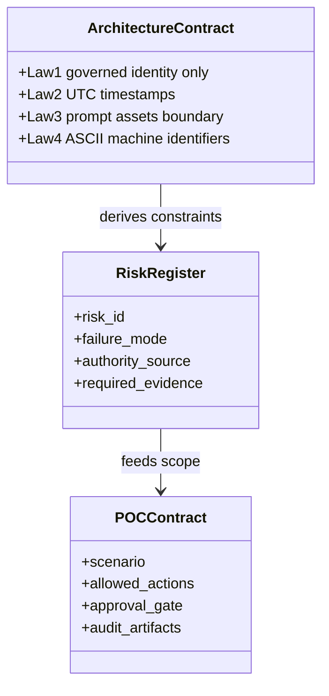
```mermaid
classDiagram
    class ArchitectureContract {
      +Law1 governed identity only
      +Law2 UTC timestamps
      +Law3 prompt assets boundary
      +Law4 ASCII machine identifiers
    }
    class RiskRegister {
      +risk_id
      +failure_mode
      +authority_source
      +required_evidence
    }
    class POCContract {
      +scenario
      +allowed_actions
      +approval_gate
      +audit_artifacts
    }
    ArchitectureContract --> RiskRegister : derives constraints
    RiskRegister --> POCContract : feeds scope
```

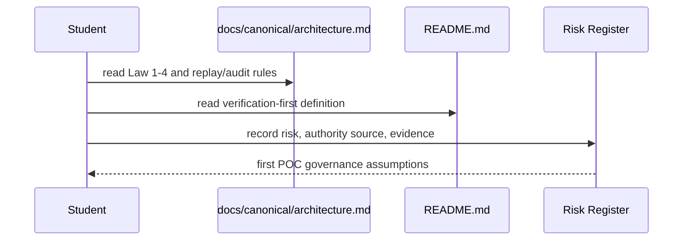
```mermaid
sequenceDiagram
    participant Student
    participant Docs as docs/canonical/architecture.md
    participant Readme as README.md
    participant Register as Risk Register
    Student->>Docs: read Law 1-4 and replay/audit rules
    Student->>Readme: read verification-first definition
    Student->>Register: record risk, authority source, evidence
    Register-->>Student: first POC governance assumptions
```

**详细步骤**

#### Step 1

打开终端并进入仓库根目录：`cd /home/chris/repo/semantier-runtime`。
#### Step 2

确认当前分支和工作区状态：`git status --short --branch`。
#### Step 3

阅读本 lab 上方的 **Contract excerpt**。可选本地核对命令：`sed -n '1,220p' docs/canonical/architecture.md`。
#### Step 4

阅读本 lab 上方的 **README excerpt**。可选本地核对命令：`sed -n '1,140p' README.md`。
#### Step 5

在笔记中建立四列表格：`Risk`、`Why prompt is insufficient`、`Governed source`、`Evidence artifact`。
#### Step 6

至少填写 3 行：身份冒用、越权数据查询、无法复现的财务结论。
#### Step 7

把每行映射到 Law 1-4 或 replay/audit 规则。
#### Step 8

小组复盘：哪些风险必须在 POC 第一天就设计，哪些可以作为后续 hardening。

**验证**

- 每个风险都必须有明确 authority source。
- 不允许把“让模型遵守规则”写成唯一控制措施。

**常见故障**

- 如果只写业务风险而没有技术控制，补充具体文件或 runtime surface。
- 如果 authority source 是“用户输入”，重新检查 Law 1。

---

### L1：定位运行时入口和默认插件

**目标**

- 看懂 `semantier` CLI 如何路由到 runtime 或 Hermes CLI。
- 找出默认平台插件、可选插件和 inventory API。
- 为后续插件和工具排障建立代码地图。

**代码解释**

- `run_hermes_cli()` 是安装后 `semantier` 命令的主入口。
- `run_runtime_cli()` 处理 `semantier run --replace`，创建 `.semantier-home/`，写 runtime owner，再启动 `semantier.agents.gateway:app`。
- `_RUNTIME_PLUGIN_NAMES` 是默认安装插件；`_OPTIONAL_RUNTIME_PLUGIN_NAMES` 是可选能力包。
- [src/agents/runtime_inventory.py](https://github.com/chris-han/semantier-runtime/blob/main/src/agents/runtime_inventory.py) 负责把 skills/plugins/toolsets 暴露给 `/system/*`。

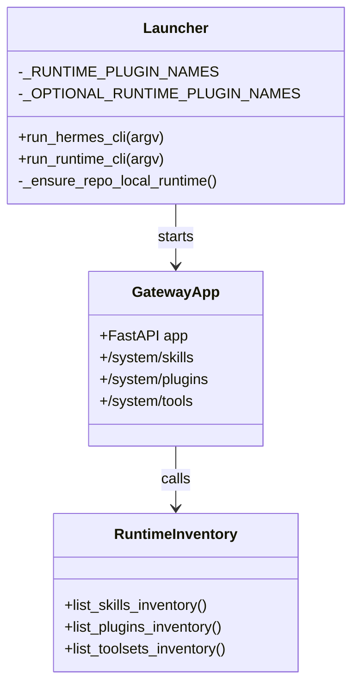
```mermaid
classDiagram
    class Launcher {
      +run_hermes_cli(argv)
      +run_runtime_cli(argv)
      -_ensure_repo_local_runtime()
      -_RUNTIME_PLUGIN_NAMES
      -_OPTIONAL_RUNTIME_PLUGIN_NAMES
    }
    class RuntimeInventory {
      +list_skills_inventory()
      +list_plugins_inventory()
      +list_toolsets_inventory()
    }
    class GatewayApp {
      +FastAPI app
      +/system/skills
      +/system/plugins
      +/system/tools
    }
    Launcher --> GatewayApp : starts
    GatewayApp --> RuntimeInventory : calls
```

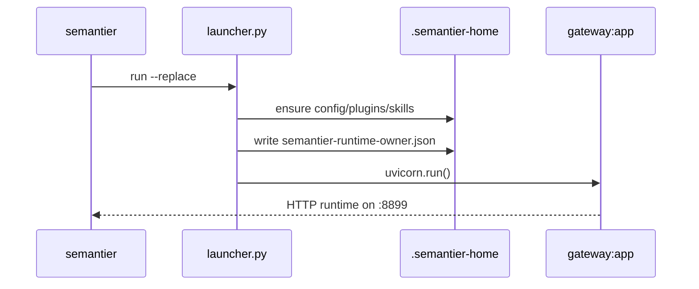
```mermaid
sequenceDiagram
    participant CLI as semantier
    participant Launcher as launcher.py
    participant Runtime as .semantier-home
    participant App as gateway:app
    CLI->>Launcher: run --replace
    Launcher->>Runtime: ensure config/plugins/skills
    Launcher->>Runtime: write semantier-runtime-owner.json
    Launcher->>App: uvicorn.run()
    App-->>CLI: HTTP runtime on :8899
```

**详细步骤**

#### Step 1

搜索 [src/agents/launcher.py](https://github.com/chris-han/semantier-runtime/blob/main/src/agents/launcher.py) 的 launcher 入口：`rg -n "def run_runtime_cli|def run_hermes_cli" src/agents/launcher.py`。
#### Step 2

搜索 [src/agents/launcher.py](https://github.com/chris-han/semantier-runtime/blob/main/src/agents/launcher.py) 的默认插件：`rg -n "_RUNTIME_PLUGIN_NAMES|_OPTIONAL_RUNTIME_PLUGIN_NAMES" src/agents/launcher.py`。
#### Step 3

打开 [src/agents/launcher.py](https://github.com/chris-han/semantier-runtime/blob/main/src/agents/launcher.py) 匹配行附近代码：`sed -n '1,80p' src/agents/launcher.py`。
#### Step 4

打开 [src/agents/launcher.py](https://github.com/chris-han/semantier-runtime/blob/main/src/agents/launcher.py) 的 CLI 路由代码：`sed -n '1080,1180p' src/agents/launcher.py`。
#### Step 5

搜索 [src/agents/runtime_inventory.py](https://github.com/chris-han/semantier-runtime/blob/main/src/agents/runtime_inventory.py) 的 inventory 函数：`rg -n "def list_.*inventory" src/agents/runtime_inventory.py`。
#### Step 6

画出本地图：CLI -> launcher -> gateway app -> inventory。
#### Step 7

标注哪些插件必须启动失败即报错，哪些可以 absent 但仍能运行。

**验证**

- 能解释 `semantier run --replace` 与 `semantier skills list` 的路径差异。
- 能指出 `business_analytics`、`semantier_routing_guard` 等默认插件来源。

**常见故障**

- 如果 `rg` 没有输出，确认在仓库根目录。
- 如果代码行号与课件不同，以当前文件内容为准，课件只给定位策略。

---

### L2：建立场景治理评分表

**目标**

- 把业务场景转成 IT 可执行治理需求。
- 判断场景是否适合作为第一个 POC。
- 输出可进入第 3 天 POC contract 的评分表。

**代码解释**

- [docs/derived/gateway-unified-multitenant-design.md](docs/derived/gateway-unified-multitenant-design.md) 定义身份、workspace、route policy 和 session 边界。
- [docs/derived/knowledge_tier_implementation_spec.md](docs/derived/knowledge_tier_implementation_spec.md) 说明知识分层和治理晋级，不同知识源不能直接等价为 authority。
- 评分表不是文档作业，而是后续 route、tool、storage、audit 设计的输入。

**Gateway design excerpt**

```text
This document defines the unified multitenant gateway architecture for the
Semantier runtime, covering identity, workspace isolation, session management,
and ingress routing.

What this document covers:
- User identity, authentication, and principal binding
- Workspace provisioning, scoping, and filesystem isolation
- Unified session view and API contracts across all channels
- Route-level access rules and ingress security
- Platform vs tenant resource separation
- Multi-tenant isolation guarantees

Write path exclusivity: Hermes-agent -> wrapper -> Python store -> eos.db is
the only write path.

No live dependencies in replay/audit: replay, explainability, audit packaging,
and external verification must be deterministic and artifact-pinned.
```

**Knowledge tier excerpt**

```text
This specification defines how each semantic tier T1-T6 is produced, reviewed,
promoted, activated, and retired in Semantier-EOS.

Core intent:
- Enforce tier-aware governance rigor (not one uniform approval process).
- Reuse Hermes agentic curation workflows where appropriate.
- Keep runtime authority deterministic, replayable, and hash-pinned.

Canonical tiers:
- T1: ontology primitives
- T2: law and regulation
- T3: standards and professional doctrine
- T4: organizational policy
- T5: management preference
- T6: agent or user suggestion

Law 1: user identity, organization association, membership, and active
authority context are not T6-discoverable facts.
```

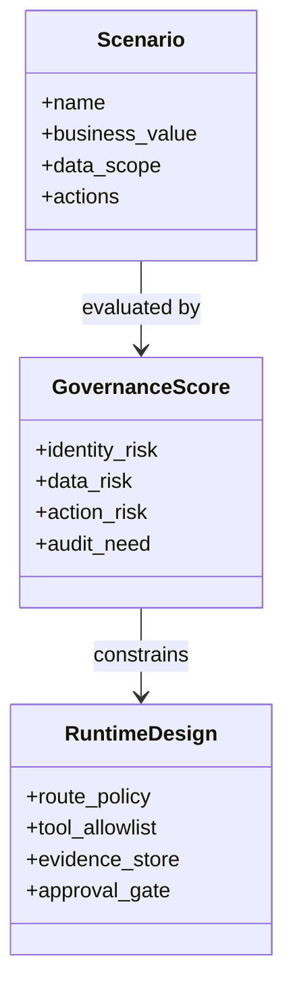
```mermaid
classDiagram
    class Scenario {
      +name
      +business_value
      +data_scope
      +actions
    }
    class GovernanceScore {
      +identity_risk
      +data_risk
      +action_risk
      +audit_need
    }
    class RuntimeDesign {
      +route_policy
      +tool_allowlist
      +evidence_store
      +approval_gate
    }
    Scenario --> GovernanceScore : evaluated by
    GovernanceScore --> RuntimeDesign : constrains
```

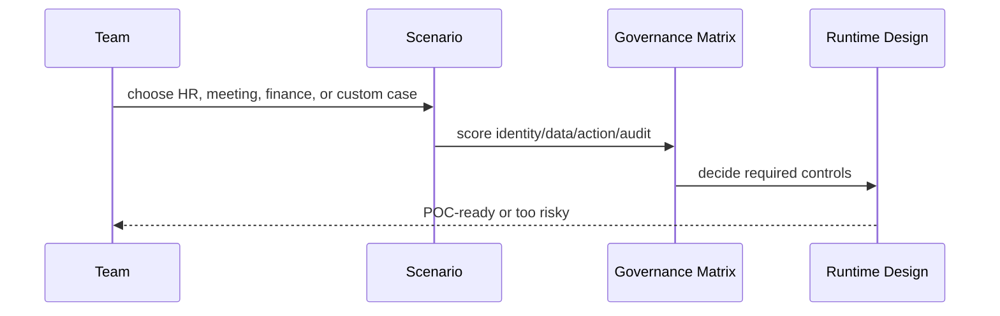
```mermaid
sequenceDiagram
    participant Team
    participant Scenario
    participant Matrix as Governance Matrix
    participant Design as Runtime Design
    Team->>Scenario: choose HR, meeting, finance, or custom case
    Scenario->>Matrix: score identity/data/action/audit
    Matrix->>Design: decide required controls
    Design-->>Team: POC-ready or too risky
```

**详细步骤**

#### Step 1

阅读本 lab 上方的 **Gateway design excerpt**。可选本地核对命令：`sed -n '1,220p' docs/derived/gateway-unified-multitenant-design.md`。
#### Step 2

阅读本 lab 上方的 **Knowledge tier excerpt**。可选本地核对命令：`sed -n '1,180p' docs/derived/knowledge_tier_implementation_spec.md`。
#### Step 3

选择一个候选场景，例如“财务 BP 查询供应商付款异常”。
#### Step 4

填写 `identity`：谁能发起，身份从哪里来，是否需要组织 membership。
#### Step 5

填写 `data`：涉及哪些表、文件、PII 或财务数据。
#### Step 6

填写 `action`：只读、草稿、通知、写入、审批提交分别打分。
#### Step 7

填写 `audit`：是否需要 replay pin、content hash、导出包。
#### Step 8

给出 POC 决策：立即可做、需降 scope、或不适合作为第一阶段。

**验证**

- 每个高风险项都有对应 runtime control。
- POC 决策不能只基于业务价值，必须包含治理复杂度。

**常见故障**

- 如果团队争论“风险高但价值大”，先缩小 action scope 到只读或草稿。
- 如果无法找到身份来源，不进入 POC。

---

### L3：启动 runtime 并检查能力清单

**目标**

- 让 IT 学员完成本地 runtime 启动。
- 验证 `:8899` 上的 health、gateway channel 和 inventory routes。
- 学会把 HTTP 输出映射回 runtime component。

**代码解释**

- [src/agents/launcher.py](https://github.com/chris-han/semantier-runtime/blob/main/src/agents/launcher.py) 中的 `run_runtime_cli()` 调用 `_ensure_repo_local_runtime()` 初始化本地 runtime。
- [src/agents/gateway.py](https://github.com/chris-han/semantier-runtime/blob/main/src/agents/gateway.py) 聚合 Semantier 和 embedded Hermes routes。
- [src/agents/webapi_gateway.py](https://github.com/chris-han/semantier-runtime/blob/main/src/agents/webapi_gateway.py) 暴露 `/gateway/channels` 和 `/system/*`。
- [src/agents/runtime_inventory.py](https://github.com/chris-han/semantier-runtime/blob/main/src/agents/runtime_inventory.py) 枚举 skills/plugins/toolsets。

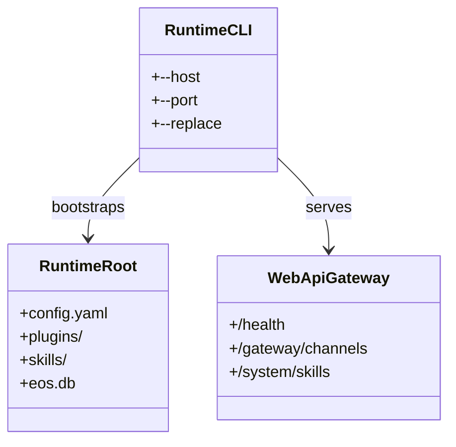
```mermaid
classDiagram
    class RuntimeCLI {
      +--host
      +--port
      +--replace
    }
    class RuntimeRoot {
      +config.yaml
      +plugins/
      +skills/
      +eos.db
    }
    class WebApiGateway {
      +/health
      +/gateway/channels
      +/system/skills
    }
    RuntimeCLI --> RuntimeRoot : bootstraps
    RuntimeCLI --> WebApiGateway : serves
```

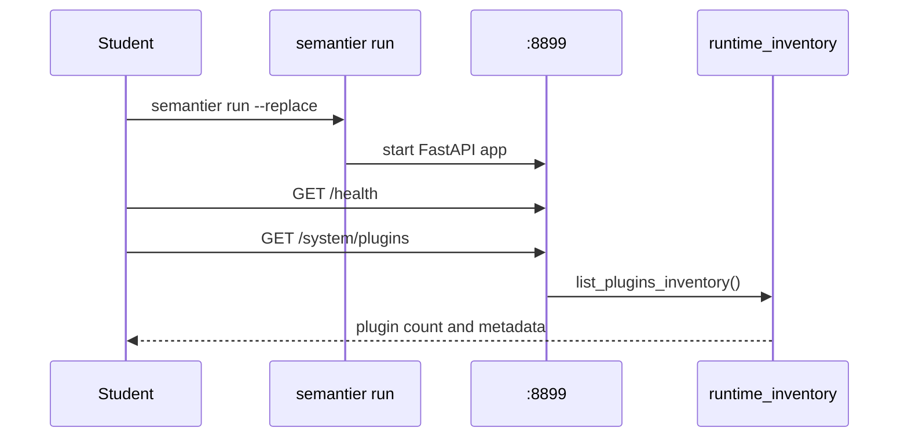
```mermaid
sequenceDiagram
    participant Student
    participant CLI as semantier run
    participant Gateway as :8899
    participant Inventory as runtime_inventory
    Student->>CLI: semantier run --replace
    CLI->>Gateway: start FastAPI app
    Student->>Gateway: GET /health
    Student->>Gateway: GET /system/plugins
    Gateway->>Inventory: list_plugins_inventory()
    Inventory-->>Student: plugin count and metadata
```

**详细步骤**

#### Step 1

激活环境：`source .venv/bin/activate`。
#### Step 2

启动 runtime：`semantier run --replace`。
#### Step 3

保持该终端运行，不要关闭。
#### Step 4

另开终端并进入同一仓库。
#### Step 5

验证 health：`curl -s http://localhost:8899/health | jq .`。
#### Step 6

验证 channel：`curl -s http://localhost:8899/gateway/channels | jq .`。
#### Step 7

验证 skills：`curl -s http://localhost:8899/system/skills | jq '.total'`。
#### Step 8

验证 plugins：`curl -s http://localhost:8899/system/plugins | jq '.plugins[].id'`。
#### Step 9

验证 tools：`curl -s http://localhost:8899/system/tools | jq '.total'`。
#### Step 10

记录每个 endpoint 属于 Semantier-native 还是 Hermes-compatible。

**验证**

- `/health` 返回 HTTP 200。
- `/system/plugins` 能看到默认平台插件。
- `.semantier-home/semantier-runtime-owner.json` 在 runtime 启动时存在。

**常见故障**

- 端口占用：重新运行 `semantier run --replace`。
- `jq` 不存在：先用不带 `jq` 的 `curl -s` 查看原始 JSON。
- inventory 为空：确认从仓库根目录启动，且 `.semantier-home/` 可写。

---

### L4：生成并检查 demo 数据

**目标**

- 构建本地 EOS demo 数据。
- 用 SQL 和测试确认核心会计 artifact 已写入。
- 理解 authoritative store 和 governed analytics 的数据来源。

**代码解释**

- [README.md](docs/repo/README.md) 和 [bootstrap/](docs/repo/bootstrap/README.md) 描述 `semantier bootstrap --replace` 调用的 repo bootstrap orchestration。
- `.semantier-home/eos.db` 是 Semantier-owned SQLite authoritative store。
- [tests/test_bootstrap_seed_v85.py](https://github.com/chris-han/semantier-runtime/blob/main/tests/test_bootstrap_seed_v85.py) 用表计数和 lakehouse/analytics mirror 断言 bootstrap 结果。

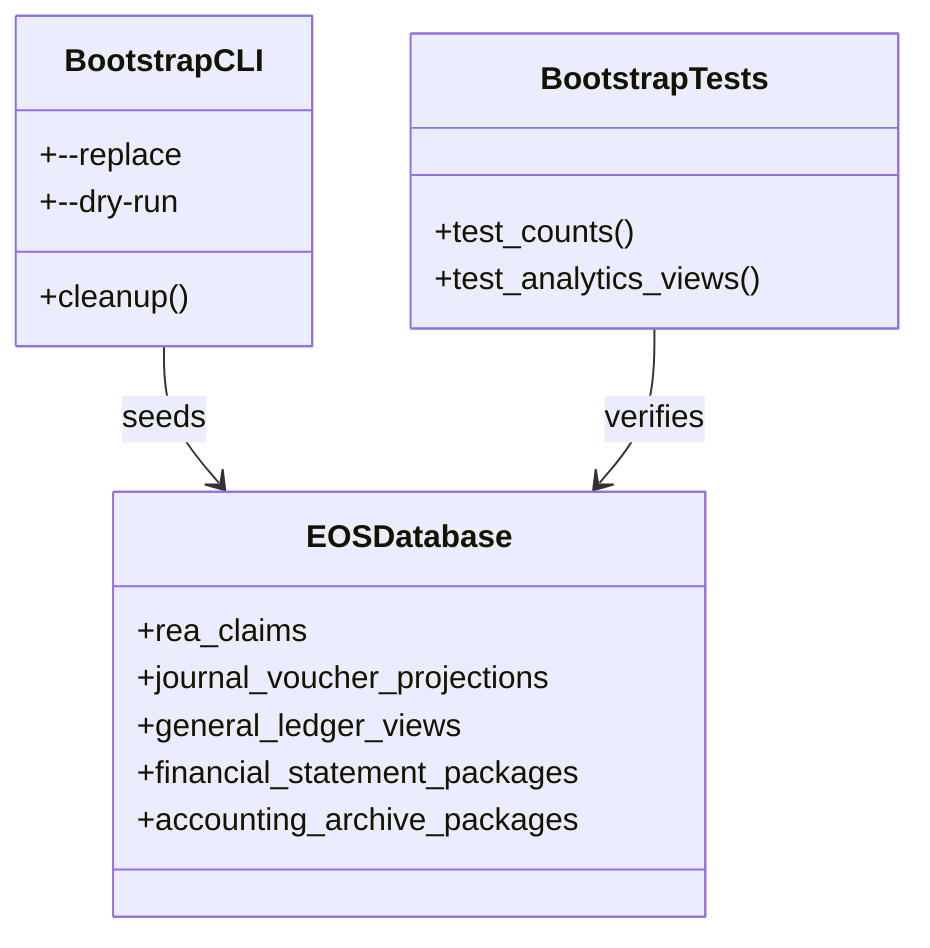
```mermaid
classDiagram
    class BootstrapCLI {
      +--replace
      +--dry-run
      +cleanup()
    }
    class EOSDatabase {
      +rea_claims
      +journal_voucher_projections
      +general_ledger_views
      +financial_statement_packages
      +accounting_archive_packages
    }
    class BootstrapTests {
      +test_counts()
      +test_analytics_views()
    }
    BootstrapCLI --> EOSDatabase : seeds
    BootstrapTests --> EOSDatabase : verifies
```

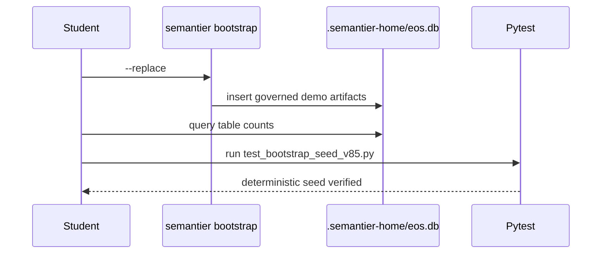
```mermaid
sequenceDiagram
    participant Student
    participant Bootstrap as semantier bootstrap
    participant DB as .semantier-home/eos.db
    participant Pytest
    Student->>Bootstrap: --replace
    Bootstrap->>DB: insert governed demo artifacts
    Student->>DB: query table counts
    Student->>Pytest: run test_bootstrap_seed_v85.py
    Pytest-->>Student: deterministic seed verified
```

**详细步骤**

#### Step 1

确认虚拟环境：`source .venv/bin/activate`。
#### Step 2

运行 bootstrap：`semantier bootstrap --replace`。
#### Step 3

确认数据库存在：`ls -lh .semantier-home/eos.db`。
#### Step 4

运行课件中的 Python SQLite 查询，记录六张核心表计数。
#### Step 5

运行 [tests/test_bootstrap_seed_v85.py](https://github.com/chris-han/semantier-runtime/blob/main/tests/test_bootstrap_seed_v85.py) 验证测试：`.venv/bin/pytest tests/test_bootstrap_seed_v85.py -v`。
#### Step 6

在 [tests/test_bootstrap_seed_v85.py](https://github.com/chris-han/semantier-runtime/blob/main/tests/test_bootstrap_seed_v85.py) 找到测试期望：`sed -n '1,140p' tests/test_bootstrap_seed_v85.py`。
#### Step 7

把每个表映射到会计链路：REA、JVP、ledger、statement、tax、archive。
#### Step 8

做 cleanup dry-run：`semantier bootstrap cleanup --dry-run`，观察将删除哪些 artifact。

**验证**

- `eos.db` 文件存在且表计数非零。
- [tests/test_bootstrap_seed_v85.py](https://github.com/chris-han/semantier-runtime/blob/main/tests/test_bootstrap_seed_v85.py) 通过。
- 能解释 cleanup 为什么需要 dry-run。

**常见故障**

- 如果 bootstrap 失败，查看 `.semantier-home/` 权限和当前 Python 环境。
- 如果测试找不到依赖，用 `.venv/bin/pytest` 而不是系统 `pytest`。

---

### L5：验证路由策略矩阵

**目标**

- 让 IT 学员掌握 gateway route policy 的测试方法。
- 验证代码矩阵与设计文档同步。
- 体验 public/authenticated/admin/operator route 的差异。

**代码解释**

- [src/agents/route_policy.py](https://github.com/chris-han/semantier-runtime/blob/main/src/agents/route_policy.py) 中的 `ROUTE_POLICY_MAP` 决定 route 是否 public、authenticated 或 blocked。
- [src/agents/route_policy.py](https://github.com/chris-han/semantier-runtime/blob/main/src/agents/route_policy.py) 中的 `ROUTE_AUTHZ_CLASS_MAP` 进一步定义 self-only、tenant-member、tenant-admin、system/operator。
- [tests/test_route_policy_matrix.py](https://github.com/chris-han/semantier-runtime/blob/main/tests/test_route_policy_matrix.py) 解析设计文档 8.1.1 并与代码比较。
- [tests/test_p1_multitenant_controls.py](https://github.com/chris-han/semantier-runtime/blob/main/tests/test_p1_multitenant_controls.py) 验证授权 class 和 rate limit 行为。

**Route policy matrix excerpt**

```text
CI parses this table and compares it against src/agents/route_policy.py.
Each row must map to a (method, path) -> policy entry in ROUTE_POLICY_MAP.
Wildcard method is written as *.

Method  Path                                      Policy
*       /health                                  public
*       /health/detailed                         public
GET     /gateway/channels                        public
GET     /auth/context                            public
DELETE  /auth/feishu/link                        authenticated
POST    /upload                                  authenticated
GET     /sessions                                authenticated
POST    /sessions                                authenticated
GET     /api/sessions/{session_id}/messages      authenticated
POST    /api/sessions/{session_id}/chat          authenticated
GET     /system/meeting-coordinator/monitors     authenticated
POST    /company-dataset-imports/upload          authenticated
GET     /company-data-context/setup-status       authenticated
```

**Route authorization class excerpt**

```text
Routes that are already authenticated may carry a finer authorization class
enforced by the centralized _require_route_authorization() gate.

Authorization classes:
- self-only: any authenticated user acting on their own identity/context.
- tenant-member: any active member of the active organization.
- tenant-admin: only users whose member_role is owner or admin.
- system/operator: only user IDs listed in SEMANTIER_OPERATOR_USER_IDS.

Method  Path                                      Authorization class
POST    /auth/profile/complete                   self-only
POST    /organizations/join                      self-only
GET     /organizations/me                        self-only
GET     /organizations/knowledge-access          tenant-member
POST    /company-dataset-imports/upload          tenant-member
```

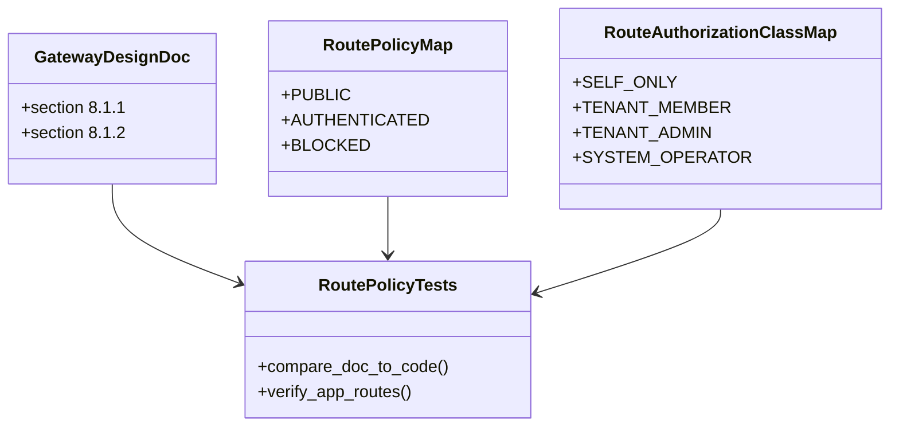
```mermaid
classDiagram
    class RoutePolicyMap {
      +PUBLIC
      +AUTHENTICATED
      +BLOCKED
    }
    class RouteAuthorizationClassMap {
      +SELF_ONLY
      +TENANT_MEMBER
      +TENANT_ADMIN
      +SYSTEM_OPERATOR
    }
    class GatewayDesignDoc {
      +section 8.1.1
      +section 8.1.2
    }
    class RoutePolicyTests {
      +compare_doc_to_code()
      +verify_app_routes()
    }
    GatewayDesignDoc --> RoutePolicyTests
    RoutePolicyMap --> RoutePolicyTests
    RouteAuthorizationClassMap --> RoutePolicyTests
```

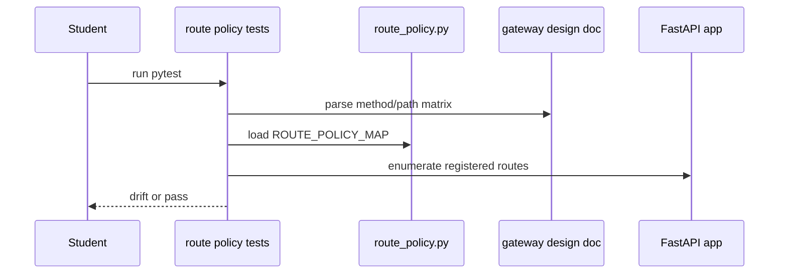
```mermaid
sequenceDiagram
    participant Student
    participant Tests as route policy tests
    participant Code as route_policy.py
    participant Docs as gateway design doc
    participant App as FastAPI app
    Student->>Tests: run pytest
    Tests->>Docs: parse method/path matrix
    Tests->>Code: load ROUTE_POLICY_MAP
    Tests->>App: enumerate registered routes
    Tests-->>Student: drift or pass
```

**详细步骤**

#### Step 1

打开 [src/agents/route_policy.py](https://github.com/chris-han/semantier-runtime/blob/main/src/agents/route_policy.py)：`sed -n '1,260p' src/agents/route_policy.py`。
#### Step 2

阅读本 lab 上方的 **Route policy matrix excerpt** 和 **Route authorization class excerpt**。可选本地核对命令：`rg -n "8.1.1|8.1.2" docs/derived/gateway-unified-multitenant-design.md`。
#### Step 3

运行 [tests/test_route_policy_matrix.py](https://github.com/chris-han/semantier-runtime/blob/main/tests/test_route_policy_matrix.py) 矩阵测试：`.venv/bin/pytest tests/test_route_policy_matrix.py -v`。
#### Step 4

运行 [tests/test_p1_multitenant_controls.py](https://github.com/chris-han/semantier-runtime/blob/main/tests/test_p1_multitenant_controls.py) 多租户控制测试：`.venv/bin/pytest tests/test_p1_multitenant_controls.py -v`。
#### Step 5

启动 runtime 后，验证公开 route：`curl -s -o /dev/null -w "%{http_code}\n" http://localhost:8899/health`。
#### Step 6

验证受保护 route：`curl -s -o /dev/null -w "%{http_code}\n" http://localhost:8899/sessions`。
#### Step 7

解释为什么 tenant-facing route 变更必须同时改代码、测试、文档。

**验证**

- 两个 pytest 文件通过。
- `/health` 和 `/sessions` 的 HTTP code 符合预期。
- 学员能说出 `SYSTEM_OPERATOR` 为什么不是普通 tenant admin。

**常见故障**

- 如果 `argon2` 缺失，说明用了系统 pytest；改用 `.venv/bin/pytest`。
- 如果 app route drift，先检查是否新增 route 没更新 policy map。

---

### L6：运行 phi/type 和 semantic completion 测试

**目标**

- 跑通最小 phi/type 评估。
- 观察 `SemanticCompletionService` 如何从 draft 构建 justification 并提交。
- 理解 fact committed 与 projection pending 的差异。

**代码解释**

- [src/semantic_completion.py](https://github.com/chris-han/semantier-runtime/blob/main/src/semantic_completion.py) 之外的 `python -m semantier.cli` 是直接 phi/type evaluator。
- [src/semantic_completion.py](https://github.com/chris-han/semantier-runtime/blob/main/src/semantic_completion.py) 中的 `SemanticCompletionService.build_justification()` 从 `SemanticDraft` 生成结构化 justification。
- `commit_draft()` 负责幂等提交和投影触发。
- 没有 active COA 时，REA fact 可以提交，projection 返回 `PENDING`。

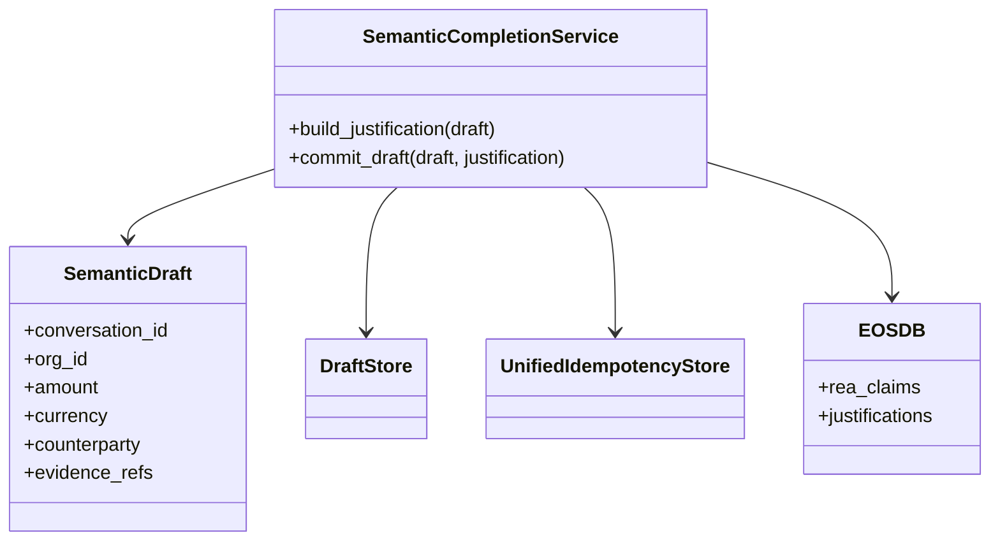
```mermaid
classDiagram
    class SemanticDraft {
      +conversation_id
      +org_id
      +amount
      +currency
      +counterparty
      +evidence_refs
    }
    class SemanticCompletionService {
      +build_justification(draft)
      +commit_draft(draft, justification)
    }
    class DraftStore
    class UnifiedIdempotencyStore
    class EOSDB {
      +rea_claims
      +justifications
    }
    SemanticCompletionService --> SemanticDraft
    SemanticCompletionService --> DraftStore
    SemanticCompletionService --> UnifiedIdempotencyStore
    SemanticCompletionService --> EOSDB
```

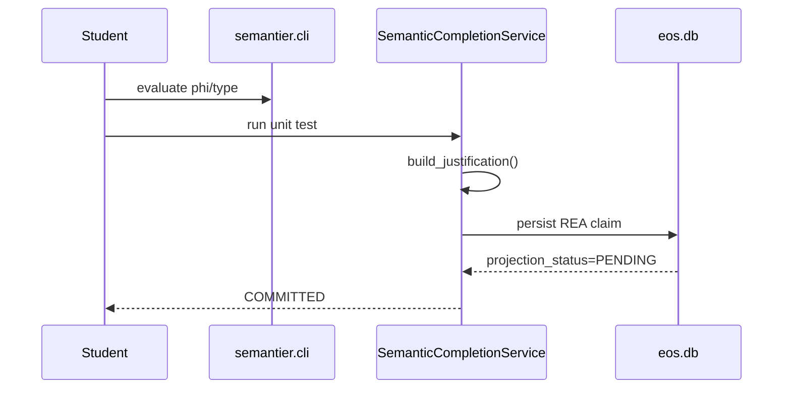
```mermaid
sequenceDiagram
    participant Student
    participant CLI as semantier.cli
    participant Service as SemanticCompletionService
    participant DB as eos.db
    Student->>CLI: evaluate phi/type
    Student->>Service: run unit test
    Service->>Service: build_justification()
    Service->>DB: persist REA claim
    DB-->>Service: projection_status=PENDING
    Service-->>Student: COMMITTED
```

**详细步骤**

#### Step 1

打开样例 [examples/internal_transfer.phi.json](https://github.com/chris-han/semantier-runtime/blob/main/examples/internal_transfer.phi.json)：`cat examples/internal_transfer.phi.json`。
#### Step 2

打开 type contract [examples/types/internal_transfer.yaml](https://github.com/chris-han/semantier-runtime/blob/main/examples/types/internal_transfer.yaml)：`cat examples/types/internal_transfer.yaml`。
#### Step 3

运行 evaluator，输入来自 [examples/internal_transfer.phi.json](https://github.com/chris-han/semantier-runtime/blob/main/examples/internal_transfer.phi.json) 和 [examples/types/internal_transfer.yaml](https://github.com/chris-han/semantier-runtime/blob/main/examples/types/internal_transfer.yaml)：`python -m semantier.cli examples/internal_transfer.phi.json examples/types/internal_transfer.yaml`。
#### Step 4

打开 [tests/test_commit_projection_integration.py](https://github.com/chris-han/semantier-runtime/blob/main/tests/test_commit_projection_integration.py)：`sed -n '1,90p' tests/test_commit_projection_integration.py`。
#### Step 5

运行 [tests/test_commit_projection_integration.py](https://github.com/chris-han/semantier-runtime/blob/main/tests/test_commit_projection_integration.py) 的 fact-only 测试：`.venv/bin/pytest tests/test_commit_projection_integration.py::test_commit_draft_fact_only_no_coa -v`。
#### Step 6

找到 `assert result["projection_status"] == "PENDING"`。
#### Step 7

解释为什么没有 COA bundle 不应阻止 REA fact admission。

**验证**

- evaluator 命令返回成功。
- focused pytest 通过。
- 学员能解释 `COMMITTED + PENDING` 的业务意义。

**常见故障**

- 如果 `python -m semantier.cli` 找不到模块，确认 `uv pip install -e .` 已运行。
- 如果测试失败，先确认环境变量 `SEMANTIER_EOS_DB_PATH` 没指向旧数据库。

---

### L7：比较三种 projection 结果

**目标**

- 让学员构建 projection 状态模型。
- 对比 active COA、多视图 projection 和 mapping gap。
- 理解 projection exception 的治理意义。

**代码解释**

- [src/storage/governance_store.py](https://github.com/chris-han/semantier-runtime/blob/main/src/storage/governance_store.py) 中的 `GovernanceStore` 负责 COA/projection candidate 的 propose、replay result、approval、activate。
- `Pi_v` 可以在 draft payload 内提供多 view projection bundle。
- [src/eos/projection_exception_store.py](https://github.com/chris-han/semantier-runtime/blob/main/src/eos/projection_exception_store.py) 保存 projection gap，不删除已提交 REA。

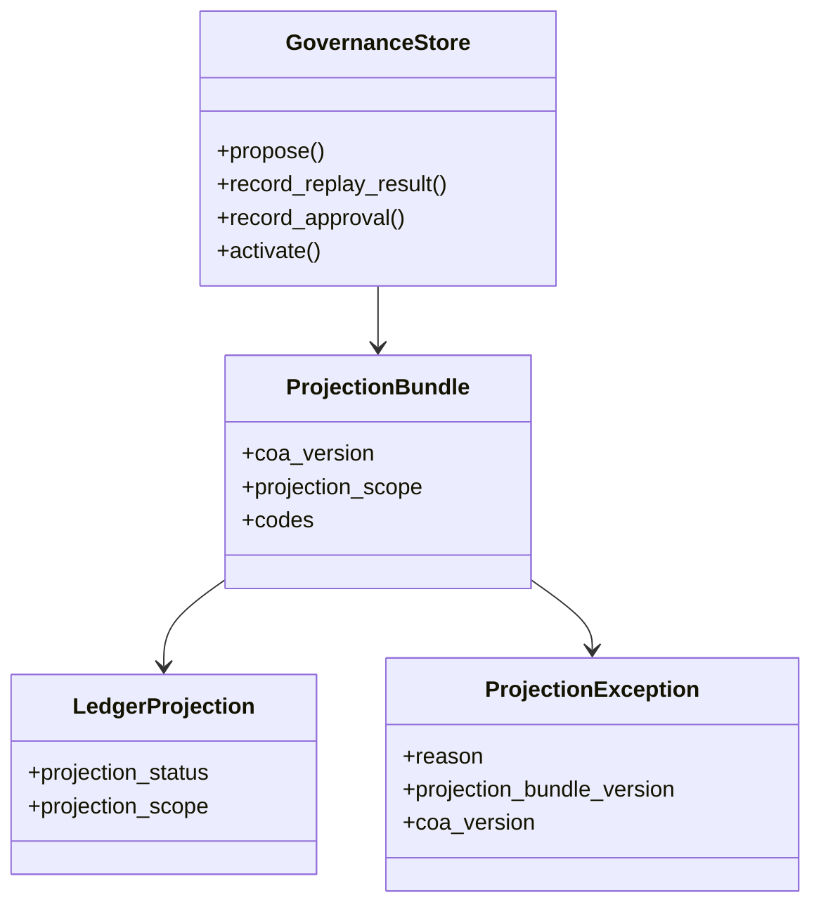
```mermaid
classDiagram
    class GovernanceStore {
      +propose()
      +record_replay_result()
      +record_approval()
      +activate()
    }
    class ProjectionBundle {
      +coa_version
      +projection_scope
      +codes
    }
    class LedgerProjection {
      +projection_status
      +projection_scope
    }
    class ProjectionException {
      +reason
      +projection_bundle_version
      +coa_version
    }
    GovernanceStore --> ProjectionBundle
    ProjectionBundle --> LedgerProjection
    ProjectionBundle --> ProjectionException
```

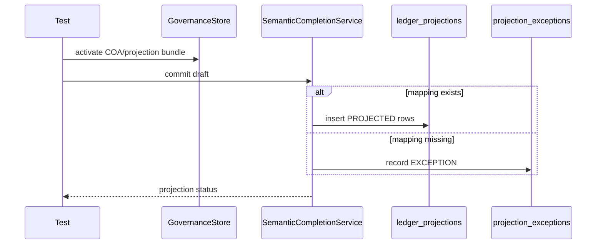
```mermaid
sequenceDiagram
    participant Test
    participant Gov as GovernanceStore
    participant Service as SemanticCompletionService
    participant Ledger as ledger_projections
    participant Exception as projection_exceptions
    Test->>Gov: activate COA/projection bundle
    Test->>Service: commit draft
    alt mapping exists
      Service->>Ledger: insert PROJECTED rows
    else mapping missing
      Service->>Exception: record EXCEPTION
    end
    Service-->>Test: projection status
```

**详细步骤**

#### Step 1

打开 [tests/test_commit_projection_integration.py](https://github.com/chris-han/semantier-runtime/blob/main/tests/test_commit_projection_integration.py) 的 projection integration 测试：`sed -n '75,380p' tests/test_commit_projection_integration.py`。
#### Step 2

找到 active COA 测试，标注 propose -> replay -> approve -> activate。
#### Step 3

运行 [tests/test_commit_projection_integration.py](https://github.com/chris-han/semantier-runtime/blob/main/tests/test_commit_projection_integration.py) 的 active COA 测试：`.venv/bin/pytest tests/test_commit_projection_integration.py::test_commit_draft_with_active_coa_projection -v`。
#### Step 4

找到 multi-view 测试，标注 accounting/tax 两个 projection scope。
#### Step 5

运行 [tests/test_commit_projection_integration.py](https://github.com/chris-han/semantier-runtime/blob/main/tests/test_commit_projection_integration.py) 的 multi-view 测试：`.venv/bin/pytest tests/test_commit_projection_integration.py::test_commit_draft_uses_multi_view_projection_bundle_from_pi_v -v`。
#### Step 6

找到 exception 测试，标注 missing mapping。
#### Step 7

运行 [tests/test_commit_projection_integration.py](https://github.com/chris-han/semantier-runtime/blob/main/tests/test_commit_projection_integration.py) 的 exception 测试：`.venv/bin/pytest tests/test_commit_projection_integration.py::test_commit_projection_exception_does_not_rollback_fact -v`。
#### Step 8

写出三行总结：`PROJECTED`、`PENDING`、`EXCEPTION`。

**验证**

- 三个测试均通过。
- 能解释 projection exception 为什么是治理任务，不是事实回滚。

**常见故障**

- 如果测试互相污染，单独运行每个测试或清理 `SEMANTIER_EOS_DB_PATH`。
- 如果 SQL 断言失败，确认使用 `.venv/bin/pytest`。

---

### L8：运行会议协调状态机测试

**目标**

- 掌握 Feishu meeting coordinator 的状态机。
- 理解 monitor cron 与 delivery retry 的分离。
- 看懂 plugin tool、gateway orchestration 和 SQLite store 的职责。

**代码解释**

- [semantier-skills/plugins/feishu_meeting_coordinator/tools.py](https://github.com/chris-han/semantier-runtime/blob/main/semantier-skills/plugins/feishu_meeting_coordinator/tools.py) 是 Hermes plugin tool surface。
- [src/agents/meeting_coordinator_gateway.py](https://github.com/chris-han/semantier-runtime/blob/main/src/agents/meeting_coordinator_gateway.py) 编排 monitor、tick、delivery retry。
- [src/agents/meeting_coordinator_store.py](https://github.com/chris-han/semantier-runtime/blob/main/src/agents/meeting_coordinator_store.py) 持久化 monitor、attendee、delivery task。
- [src/agents/webapi_gateway.py](https://github.com/chris-han/semantier-runtime/blob/main/src/agents/webapi_gateway.py) 的 adapter 把 HTTP request context 注入 gateway logic。

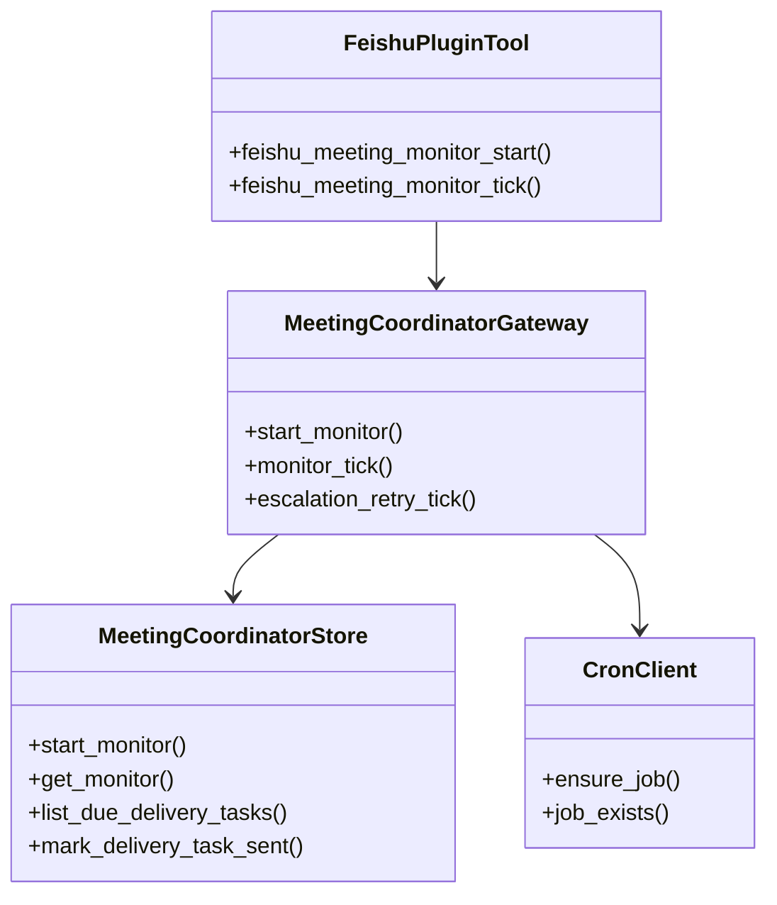
```mermaid
classDiagram
    class FeishuPluginTool {
      +feishu_meeting_monitor_start()
      +feishu_meeting_monitor_tick()
    }
    class MeetingCoordinatorGateway {
      +start_monitor()
      +monitor_tick()
      +escalation_retry_tick()
    }
    class MeetingCoordinatorStore {
      +start_monitor()
      +get_monitor()
      +list_due_delivery_tasks()
      +mark_delivery_task_sent()
    }
    class CronClient {
      +ensure_job()
      +job_exists()
    }
    FeishuPluginTool --> MeetingCoordinatorGateway
    MeetingCoordinatorGateway --> MeetingCoordinatorStore
    MeetingCoordinatorGateway --> CronClient
```

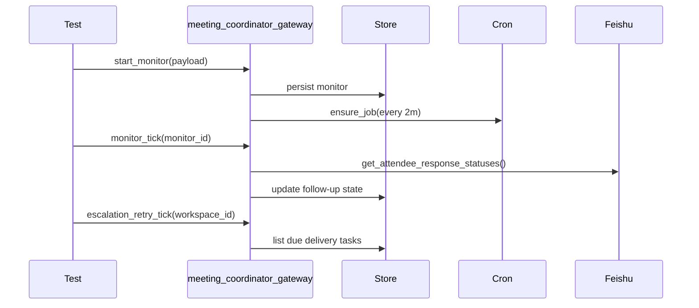
```mermaid
sequenceDiagram
    participant Test
    participant Gateway as meeting_coordinator_gateway
    participant Store
    participant Cron
    participant Feishu
    Test->>Gateway: start_monitor(payload)
    Gateway->>Store: persist monitor
    Gateway->>Cron: ensure_job(every 2m)
    Test->>Gateway: monitor_tick(monitor_id)
    Gateway->>Feishu: get_attendee_response_statuses()
    Gateway->>Store: update follow-up state
    Test->>Gateway: escalation_retry_tick(workspace_id)
    Gateway->>Store: list due delivery tasks
```

**详细步骤**

#### Step 1

打开 [src/agents/meeting_coordinator_gateway.py](https://github.com/chris-han/semantier-runtime/blob/main/src/agents/meeting_coordinator_gateway.py) gateway logic：`sed -n '1,230p' src/agents/meeting_coordinator_gateway.py`。
#### Step 2

打开 [src/agents/meeting_coordinator_store.py](https://github.com/chris-han/semantier-runtime/blob/main/src/agents/meeting_coordinator_store.py) store logic：`sed -n '1,220p' src/agents/meeting_coordinator_store.py`。
#### Step 3

打开 [semantier-skills/plugins/feishu_meeting_coordinator/tools.py](https://github.com/chris-han/semantier-runtime/blob/main/semantier-skills/plugins/feishu_meeting_coordinator/tools.py) plugin tool：`sed -n '1,220p' semantier-skills/plugins/feishu_meeting_coordinator/tools.py`。
#### Step 4

运行 [tests/test_meeting_coordinator_gateway.py](https://github.com/chris-han/semantier-runtime/blob/main/tests/test_meeting_coordinator_gateway.py) gateway 测试：`.venv/bin/pytest tests/test_meeting_coordinator_gateway.py -v`。
#### Step 5

运行 [tests/test_meeting_coordinator_webapi.py](https://github.com/chris-han/semantier-runtime/blob/main/tests/test_meeting_coordinator_webapi.py) Web API 测试：`.venv/bin/pytest tests/test_meeting_coordinator_webapi.py -v`。
#### Step 6

找到 `test_start_monitor_creates_profile_cron`，解释为什么 profile 是 `meeting-coordinator`。
#### Step 7

找到 escalation retry 测试，解释为什么 delivery failure 不应阻塞 monitor tick。

**验证**

- 两个测试文件通过。
- 能画出 monitor state 和 delivery task state 的区别。

**常见故障**

- 如果测试缺 Feishu 凭证，说明跑错了 live path；这些测试应使用 fake client。
- 如果 cron 断言失败，检查 profile name 和 skill name。

---

### L9：检查 bootstrap 后的 runtime 边界

**目标**

- 掌握 platform runtime root 与 workspace root。
- 理解 SOUL、GOVERNANCE、profiles、plugins、skills 的安装位置。
- 确认 Hermes memory 不作为 Semantier authority。

**代码解释**

- [src/runtime_paths.py](https://github.com/chris-han/semantier-runtime/blob/main/src/runtime_paths.py) 的 `platform_runtime_root()` 解析 `.semantier-home/`。
- [src/runtime_paths.py](https://github.com/chris-han/semantier-runtime/blob/main/src/runtime_paths.py) 的 `bind_workspace_env()` 临时绑定 workspace-level `HERMES_HOME`。
- [src/agents/launcher.py](https://github.com/chris-han/semantier-runtime/blob/main/src/agents/launcher.py) 注入 SOUL/GOVERNANCE 并安装 repo-owned plugins/skills。
- [src/agents/runtime_memory_boundary.py](https://github.com/chris-han/semantier-runtime/blob/main/src/agents/runtime_memory_boundary.py) 清理或限制 user memory profile。

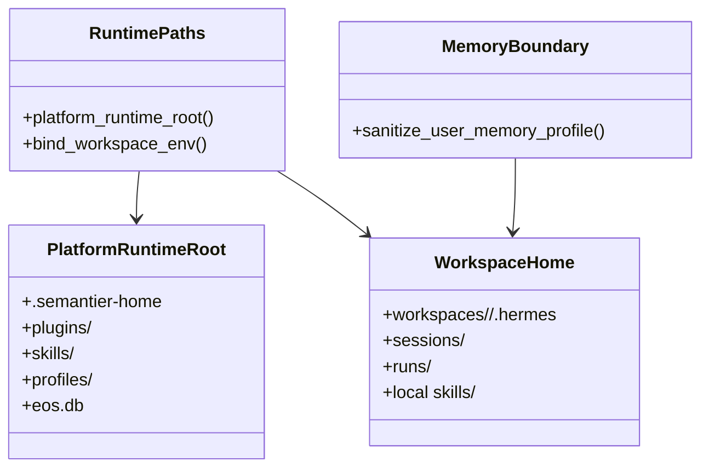
```mermaid
classDiagram
    class PlatformRuntimeRoot {
      +.semantier-home
      +plugins/
      +skills/
      +profiles/
      +eos.db
    }
    class WorkspaceHome {
      +workspaces/<id>/.hermes
      +sessions/
      +runs/
      +local skills/
    }
    class RuntimePaths {
      +platform_runtime_root()
      +bind_workspace_env()
    }
    class MemoryBoundary {
      +sanitize_user_memory_profile()
    }
    RuntimePaths --> PlatformRuntimeRoot
    RuntimePaths --> WorkspaceHome
    MemoryBoundary --> WorkspaceHome
```

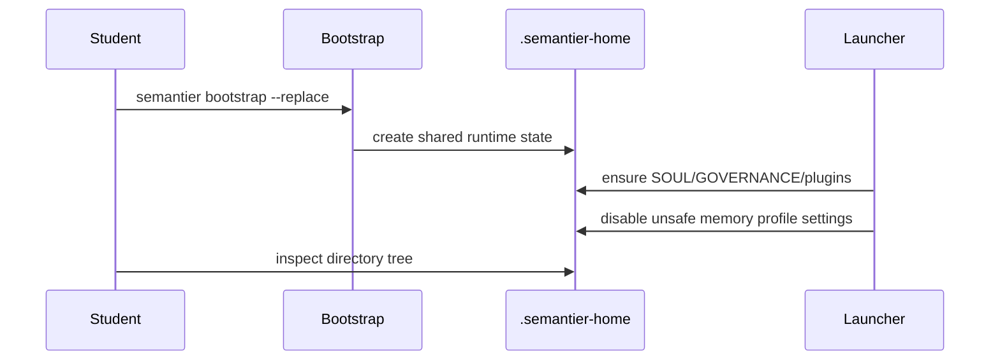
```mermaid
sequenceDiagram
    participant Student
    participant Bootstrap
    participant Runtime as .semantier-home
    participant Launcher
    Student->>Bootstrap: semantier bootstrap --replace
    Bootstrap->>Runtime: create shared runtime state
    Launcher->>Runtime: ensure SOUL/GOVERNANCE/plugins
    Launcher->>Runtime: disable unsafe memory profile settings
    Student->>Runtime: inspect directory tree
```

**详细步骤**

#### Step 1

运行 bootstrap：`semantier bootstrap --replace`。
#### Step 2

查看目录：`find .semantier-home -maxdepth 2 -type d | sort | sed -n '1,100p'`。
#### Step 3

查看本地生成的 `.semantier-home/SOUL.md`。该 artifact 由 [src/agents/launcher.py](https://github.com/chris-han/semantier-runtime/blob/main/src/agents/launcher.py) bootstrap runtime 时写入，不是 repo source 文件：`head -40 .semantier-home/SOUL.md`。
#### Step 4

查看本地生成的 `.semantier-home/SEMANTIER_GOVERNANCE.md`。该 artifact 同样由 [src/agents/launcher.py](https://github.com/chris-han/semantier-runtime/blob/main/src/agents/launcher.py) 写入，用于把治理说明放入 runtime home：`head -40 .semantier-home/SEMANTIER_GOVERNANCE.md`。
#### Step 5

搜索 [src/agents/](https://github.com/chris-han/semantier-runtime/tree/main/src/agents) 和 [src/](https://github.com/chris-han/semantier-runtime/tree/main/src) 中的 memory 边界：`rg -n "memory_enabled|user_profile_enabled|sanitize_user_memory_profile" src/agents src -S`。
#### Step 6

打开 [src/runtime_paths.py](https://github.com/chris-han/semantier-runtime/blob/main/src/runtime_paths.py)：`sed -n '1,280p' src/runtime_paths.py`。
#### Step 7

在图上标出 platform shared asset 与 workspace-local mutable asset。

**验证**

- `.semantier-home/` 下存在 shared runtime files。
- 能解释 workspace session 为什么不能直接改 shared skill。

**常见故障**

- 如果文件不存在，先启动或 bootstrap runtime。
- 如果误把 `.semantier-home` 当成要提交的源码，检查 `.gitignore` 和 runtime bootstrap boundary。

---

### L10：设计简历筛选治理协议

**目标**

- 从 IT 角度把 HR resume screening 拆成 extractor、evaluator、reviewer。
- 验证当前 auto_resume_screening 插件包结构。
- 设计可审计字段和人工复核点。

**代码解释**

- [tests/test_auto_resume_screening_package.py](https://github.com/chris-han/semantier-runtime/blob/main/tests/test_auto_resume_screening_package.py) 覆盖 optional `auto_resume_screening` plugin，用于演示文档解析和候选排序。
- [tests/test_auto_resume_screening_package.py](https://github.com/chris-han/semantier-runtime/blob/main/tests/test_auto_resume_screening_package.py) 覆盖 ASCII tool identifiers、DOCX/PDF extraction、deterministic ranking、workspace artifact 写入。
- HR 决策不能只输出分数，必须保留 source evidence 和人工复核机制。

```mermaid
classDiagram
    class ResumeEvidence {
      +source_file_hash
      +text_span
      +candidate_name
    }
    class CandidateFeature {
      +skill_terms
      +years_experience
      +role_match
    }
    class EvaluationDecision {
      +score
      +reason_codes
      +requires_human_review
    }
    class WorkspaceArtifact {
      +runs_dir
      +content_hash
    }
    ResumeEvidence --> CandidateFeature
    CandidateFeature --> EvaluationDecision
    EvaluationDecision --> WorkspaceArtifact
```

```mermaid
sequenceDiagram
    participant Student
    participant Plugin as auto_resume_screening
    participant Parser as DOCX/PDF parser
    participant Ranker
    participant Artifact as workspace artifact
    Student->>Plugin: run package tests
    Plugin->>Parser: extract text
    Parser-->>Plugin: normalized text
    Plugin->>Ranker: deterministic feature ranking
    Ranker->>Artifact: write screening output
    Artifact-->>Student: auditable result
```

**详细步骤**

#### Step 1

搜索 [src/](https://github.com/chris-han/semantier-runtime/tree/main/src)、[semantier-skills/](https://github.com/chris-han/semantier-runtime/tree/main/semantier-skills) 和 [tests/](https://github.com/chris-han/semantier-runtime/tree/main/tests) 中的插件引用：`rg -n "auto_resume_screening|AUTO_RESUME" src semantier-skills tests -S`。
#### Step 2

打开 [tests/test_auto_resume_screening_package.py](https://github.com/chris-han/semantier-runtime/blob/main/tests/test_auto_resume_screening_package.py) 测试列表：`rg -n "def test_" tests/test_auto_resume_screening_package.py`。
#### Step 3

运行 [tests/test_auto_resume_screening_package.py](https://github.com/chris-han/semantier-runtime/blob/main/tests/test_auto_resume_screening_package.py) package test：`.venv/bin/pytest tests/test_auto_resume_screening_package.py -v`。
#### Step 4

找到 ASCII tool identifier 测试，解释 Law 4 与 tool-facing identifiers 的关系。
#### Step 5

找到 deterministic ranking 测试，解释为什么 ranking 必须可复现。
#### Step 6

设计三个对象：`ResumeEvidence`、`CandidateFeature`、`EvaluationDecision`。
#### Step 7

为每个字段标注来源：文件解析、JD、人工规则、模型推断。
#### Step 8

指定 human review trigger：低置信度、敏感属性、淘汰、薪资建议。

**验证**

- 插件包测试通过。
- 输出协议包含 evidence span 和 review flag。
- 不把模型分数称为客观事实。

**常见故障**

- 如果 PDF parser 依赖缺失，确认测试是否 mock 对应 parser。
- 如果输出字段使用中文 key，改成 ASCII key + localized display label。

---

### L11：运行 full-cycle accounting E2E

**目标**

- 构建从 source document 到 archive 的完整 mental model。
- 用测试验证 full-cycle accounting contract。
- 理解 source evidence 与 accounting truth 的区别。

**代码解释**

- [src/eos/full_cycle_store.py](https://github.com/chris-han/semantier-runtime/blob/main/src/eos/full_cycle_store.py) 插入 source document review、JVP、ledger view、financial statement、tax filing、archive。
- [src/eos/monthly_workflow_store.py](https://github.com/chris-han/semantier-runtime/blob/main/src/eos/monthly_workflow_store.py) 管理 period close state。
- `archive_hash` 用 canonical JSON content hash 支持离线验证。

```mermaid
classDiagram
    class SourceDocumentReview {
      +evidence_status
      +file_hash
      +extraction_result_json
    }
    class JournalVoucherProjection {
      +projection_bundle_version
      +coa_version
      +lines_json
    }
    class LedgerView
    class FinancialStatementPackage
    class TaxFilingPackage
    class AccountingArchivePackage {
      +archive_hash
      +content_hash
    }
    SourceDocumentReview --> JournalVoucherProjection
    JournalVoucherProjection --> LedgerView
    LedgerView --> FinancialStatementPackage
    FinancialStatementPackage --> TaxFilingPackage
    TaxFilingPackage --> AccountingArchivePackage
```

```mermaid
sequenceDiagram
    participant Test
    participant Store as full_cycle_store
    participant Workflow as monthly_workflow_store
    participant Hash as artifact_hashing
    Test->>Workflow: create open period
    Test->>Store: insert SourceDocumentReview_t
    Test->>Store: insert JournalVoucherProjection_t
    Test->>Store: materialize ledger views
    Test->>Workflow: close/report/file/archive transitions
    Test->>Hash: compute archive_hash
    Hash-->>Test: reproducible verification
```

**详细步骤**

#### Step 1

打开 [tests/test_full_cycle_accounting.py](https://github.com/chris-han/semantier-runtime/blob/main/tests/test_full_cycle_accounting.py)：`sed -n '1,180p' tests/test_full_cycle_accounting.py`。
#### Step 2

运行 [tests/test_full_cycle_accounting.py](https://github.com/chris-han/semantier-runtime/blob/main/tests/test_full_cycle_accounting.py) 主 E2E：`.venv/bin/pytest tests/test_full_cycle_accounting.py::test_full_cycle_accounting_monthly_close_workflow -v`。
#### Step 3

打开 [src/eos/full_cycle_store.py](https://github.com/chris-han/semantier-runtime/blob/main/src/eos/full_cycle_store.py)：`sed -n '1,220p' src/eos/full_cycle_store.py`。
#### Step 4

找到 `insert_source_document_review()`，解释 `evidence_status` 不等于 REA fact admission。
#### Step 5

在 [tests/test_full_cycle_accounting.py](https://github.com/chris-han/semantier-runtime/blob/main/tests/test_full_cycle_accounting.py) 找到 archive test：`sed -n '480,520p' tests/test_full_cycle_accounting.py`。
#### Step 6

运行 [tests/test_full_cycle_accounting.py](https://github.com/chris-han/semantier-runtime/blob/main/tests/test_full_cycle_accounting.py) archive hash test：`.venv/bin/pytest tests/test_full_cycle_accounting.py::test_accounting_archive_package_requires_archive_hash -v`。
#### Step 7

画出 source evidence -> archive 的 artifact 链。

**验证**

- 两个 focused tests 通过。
- 学员能说明每个 full-cycle artifact 的前置条件。

**常见故障**

- 如果 workflow transition 失败，检查是否有 unresolved blocker。
- 如果 archive hash 缺失，说明外部验证路径不完整。

---

### L12：验证 trust gate 和 replay pin

**目标**

- 掌握 TrialBalanceView_t 的 trust state。
- 验证 replay 使用显式 pins。
- 理解 validation failure 不回滚 REA fact。

**代码解释**

- [src/eos/trial_balance_view.py](https://github.com/chris-han/semantier-runtime/blob/main/src/eos/trial_balance_view.py) 构建 derived projection view，初始不是 trusted。
- [src/eos/trial_balance_validator.py](https://github.com/chris-han/semantier-runtime/blob/main/src/eos/trial_balance_validator.py) 运行 validation 并输出 resulting trust state。
- [tests/test_verification_contract_v76.py](https://github.com/chris-han/semantier-runtime/blob/main/tests/test_verification_contract_v76.py) 覆盖 trust gate、pin 和 replay rule。
- [tests/test_internal_audit_verification.py](https://github.com/chris-han/semantier-runtime/blob/main/tests/test_internal_audit_verification.py) 覆盖 internal audit package verification。

```mermaid
classDiagram
    class TrialBalanceView {
      +trust_state
      +pins
      +content_hash
    }
    class TrialBalanceValidator {
      +run_trial_balance_validation()
    }
    class ProjectionTrustState {
      +PROJECTION_CANDIDATE
      +PROJECTION_VALIDATED
      +PROJECTION_TRUSTED
      +PROJECTION_BLOCKED
    }
    class ReplayBinding {
      +coa_version
      +projection_bundle_version
      +validation_contract_version
    }
    TrialBalanceView --> TrialBalanceValidator
    TrialBalanceValidator --> ProjectionTrustState
    TrialBalanceValidator --> ReplayBinding
```

```mermaid
sequenceDiagram
    participant Test
    participant View as build_trial_balance_view
    participant Validator as run_trial_balance_validation
    participant Store as validation result store
    Test->>View: build with explicit pins
    View-->>Test: PROJECTION_CANDIDATE
    Test->>Validator: validate with pins
    Validator->>Store: persist result and pins
    Store-->>Test: replay uses pinned artifacts only
```

**详细步骤**

#### Step 1

打开 [tests/test_verification_contract_v76.py](https://github.com/chris-han/semantier-runtime/blob/main/tests/test_verification_contract_v76.py) trust tests：`sed -n '155,290p' tests/test_verification_contract_v76.py`。
#### Step 2

运行 [tests/test_verification_contract_v76.py](https://github.com/chris-han/semantier-runtime/blob/main/tests/test_verification_contract_v76.py) non-truth-source test：`.venv/bin/pytest tests/test_verification_contract_v76.py::test_trial_balance_view_not_source_of_financial_truth -v`。
#### Step 3

运行 [tests/test_verification_contract_v76.py](https://github.com/chris-han/semantier-runtime/blob/main/tests/test_verification_contract_v76.py) REA independence test：`.venv/bin/pytest tests/test_verification_contract_v76.py::test_rea_persisted_when_trial_balance_validation_fails -v`。
#### Step 4

打开 [tests/test_verification_contract_v76.py](https://github.com/chris-han/semantier-runtime/blob/main/tests/test_verification_contract_v76.py) replay pin tests：`sed -n '811,855p' tests/test_verification_contract_v76.py`。
#### Step 5

运行 [tests/test_verification_contract_v76.py](https://github.com/chris-han/semantier-runtime/blob/main/tests/test_verification_contract_v76.py) replay pin test：`.venv/bin/pytest tests/test_verification_contract_v76.py::test_trial_balance_replay_uses_pinned_artifacts_only -v`。
#### Step 6

运行 [tests/test_internal_audit_verification.py](https://github.com/chris-han/semantier-runtime/blob/main/tests/test_internal_audit_verification.py) audit verification tests：`.venv/bin/pytest tests/test_internal_audit_verification.py -v`。
#### Step 7

列出 close/export 允许和禁止的 trust states。

**验证**

- focused tests 通过。
- 能解释 replay 为什么不能调用 live LLM、live retrieval、OCR 或 parser。

**常见故障**

- 如果 validation contract pins 缺失，测试应失败，这是预期安全设计。
- 如果学员认为 view 就是真相源，回到 architecture 的 derived projection rule。

---

### L13：验证 governed analytics 授权语义

**目标**

- 验证 governed query 只能读取组织授权范围内的数据。
- 验证 raw EOS catalog access 被拒绝。
- 理解 routing guard 和 Law 1 数据授权的关系。

**代码解释**

- [src/plugins/business_analytics](https://github.com/chris-han/semantier-runtime/blob/main/src/plugins/business_analytics) 暴露 `governed_query`。
- [tests/test_smb_analytics_tool.py](https://github.com/chris-han/semantier-runtime/blob/main/tests/test_smb_analytics_tool.py) 验证 active org、active dataset version、raw catalog rejection。
- [tests/test_hermes_routing_guard_plugin.py](https://github.com/chris-han/semantier-runtime/blob/main/tests/test_hermes_routing_guard_plugin.py) 验证 Hermes routing guard 对 Law 1 的阻断提示。

**Governed analytics excerpt**

```text
For user-facing analytics, use governed_query. It resolves the active workspace
organization from governed authorization records and exposes only
organization-scoped views.

Authoritative runtime source: .semantier-home/eos.db
Access path in governed_query: org-scoped DuckDB views over governed EOS data

Analytics views exposed by the tool:
- org_rea_claims
- org_journal_voucher_projections
- org_general_ledger_views
- org_financial_statement_packages
- org_tax_filing_packages
- org_accounting_archive_packages

Raw DBHub SQL, terminal SQL, general code, file/search tools, raw eos.* tables,
and unscoped lakehouse files are not user-facing governed data access paths.
```

```mermaid
classDiagram
    class GovernedQueryTool {
      +query(sql, auth_context)
      +scope_to_org()
      +reject_raw_catalog()
    }
    class AuthContext {
      +organization_id
      +active_dataset_version_id
      +membership_role
    }
    class LakehouseView {
      +org_rea_claims
      +org_general_ledger_views
    }
    class RoutingGuard {
      +Law1 data authorization check
    }
    GovernedQueryTool --> AuthContext
    GovernedQueryTool --> LakehouseView
    RoutingGuard --> GovernedQueryTool
```

```mermaid
sequenceDiagram
    participant Student
    participant Test as analytics tests
    participant Tool as governed_query
    participant Auth as governed auth context
    participant Views as org-scoped views
    Student->>Test: run focused tests
    Test->>Tool: query with active org context
    Tool->>Auth: resolve organization and dataset version
    Tool->>Views: execute scoped SQL
    alt raw EOS table requested
      Tool-->>Test: reject
    else scoped view requested
      Tool-->>Test: allow
    end
```

**详细步骤**

#### Step 1

打开 [tests/test_smb_analytics_tool.py](https://github.com/chris-han/semantier-runtime/blob/main/tests/test_smb_analytics_tool.py) test names：`rg -n "test_governed_query" tests/test_smb_analytics_tool.py`。
#### Step 2

运行 [tests/test_smb_analytics_tool.py](https://github.com/chris-han/semantier-runtime/blob/main/tests/test_smb_analytics_tool.py) active org test：`.venv/bin/pytest tests/test_smb_analytics_tool.py::TestHandlerBehavior::test_governed_query_scopes_to_active_apparel_org -v`。
#### Step 3

运行 [tests/test_smb_analytics_tool.py](https://github.com/chris-han/semantier-runtime/blob/main/tests/test_smb_analytics_tool.py) real org dataset test：`.venv/bin/pytest tests/test_smb_analytics_tool.py::TestHandlerBehavior::test_governed_query_allows_real_org_active_dataset_version -v`。
#### Step 4

运行 [tests/test_smb_analytics_tool.py](https://github.com/chris-han/semantier-runtime/blob/main/tests/test_smb_analytics_tool.py) raw catalog rejection：`.venv/bin/pytest tests/test_smb_analytics_tool.py::TestHandlerBehavior::test_governed_query_rejects_raw_eos_catalog_access -v`。
#### Step 5

运行 [tests/test_hermes_routing_guard_plugin.py](https://github.com/chris-han/semantier-runtime/blob/main/tests/test_hermes_routing_guard_plugin.py) routing guard tests：`.venv/bin/pytest tests/test_hermes_routing_guard_plugin.py -v`。
#### Step 6

阅读本 lab 上方的 **Governed analytics excerpt**，确认用户面对的数据访问路径。
#### Step 7

写出“允许查询”和“禁止查询”各 3 个例子。

**验证**

- 四组 tests 通过。
- 学员能解释为什么 raw SQL 不等于 governed query。

**常见故障**

- 如果 lakehouse fixture 失败，先运行完整 [tests/test_smb_analytics_tool.py](https://github.com/chris-han/semantier-runtime/blob/main/tests/test_smb_analytics_tool.py) 查看 fixture setup。
- 如果查询被拒绝，检查是否使用 org-scoped view 名称。

---

### L14：运行高信号回归测试组合

**目标**

- 建立 IT 团队的 regression gate。
- 区分环境失败、契约失败和数据 fixture 失败。
- 为生产排障建立最小高信号测试包。

**代码解释**

- [tests/test_agents_launcher.py](https://github.com/chris-han/semantier-runtime/blob/main/tests/test_agents_launcher.py) 覆盖 runtime bootstrap 和插件安装。
- [tests/test_route_policy_matrix.py](https://github.com/chris-han/semantier-runtime/blob/main/tests/test_route_policy_matrix.py) 覆盖 route policy drift。
- [tests/test_commit_projection_integration.py](https://github.com/chris-han/semantier-runtime/blob/main/tests/test_commit_projection_integration.py) 覆盖 semantic completion -> projection。
- [tests/test_verification_contract_v76.py](https://github.com/chris-han/semantier-runtime/blob/main/tests/test_verification_contract_v76.py) 和 [tests/test_full_cycle_accounting.py](https://github.com/chris-han/semantier-runtime/blob/main/tests/test_full_cycle_accounting.py) 覆盖核心财务治理链。
- meeting coordinator tests 覆盖 channel plugin state machine。

```mermaid
classDiagram
    class RegressionSuite {
      +launcher_tests
      +route_policy_tests
      +projection_tests
      +verification_tests
      +full_cycle_tests
      +meeting_tests
    }
    class FailureTriage {
      +environment
      +contract_drift
      +fixture_data
    }
    class ReleaseGate {
      +must_pass
      +known_risk
      +rollback_plan
    }
    RegressionSuite --> FailureTriage
    FailureTriage --> ReleaseGate
```

```mermaid
sequenceDiagram
    participant Student
    participant Pytest
    participant Suite as Regression Suite
    participant Triage
    Student->>Pytest: run high-signal tests
    Pytest->>Suite: execute selected files
    alt failure
      Suite->>Triage: classify failure
      Triage-->>Student: environment / contract / fixture
    else pass
      Suite-->>Student: release confidence increased
    end
```

**详细步骤**

#### Step 1

Copy the multi-line pytest command from Day 3 L14.
#### Step 2

Run it with `.venv/bin/pytest`, not system `pytest`.
#### Step 3

If it passes, record runtime, Python, branch, and commit hash.
#### Step 4

If it fails before tests run, classify as environment.
#### Step 5

If route policy matrix fails, classify as contract drift.
#### Step 6

If projection/full-cycle assertions fail, inspect recent schema or seed changes.
#### Step 7

If meeting coordinator fails, inspect fake cron/client assumptions before touching live credentials.
#### Step 8

Write a one-page triage note with first failing test, root category, suspected file, and next command.

**验证**

- Team can run the same command on two machines and compare failures.
- Failures are categorized before fixes are proposed.

**常见故障**

- `ModuleNotFoundError`: wrong interpreter.
- Long runtime: split command by test file.
- Flaky external call: these tests should not need live external services; investigate accidental live dependency.

---

### L15：设计 POC 验收合同

**目标**

- 把 workshop 输出转化成可执行 POC contract。
- 让 IT、业务、审计、安全各方对验收证据达成一致。
- 明确哪些 tests/artifacts 是上线前必须具备的。

**代码解释**

- 本 lab 写一个 training artifact，不改 runtime。
- POC contract 是后续 feature spec、route policy、tool implementation、audit package 的输入。
- 所有字段使用 ASCII section headings，中文说明写在正文中，避免 machine identifier 污染。

```mermaid
classDiagram
    class POCContract {
      +Scenario
      +GovernedIdentitySource
      +DataScope
      +AllowedActions
      +RequiredHumanApproval
      +EvidenceAndAuditArtifacts
      +ReplayPins
      +TestsRequiredBeforePilot
    }
    class Stakeholder {
      +IT
      +BusinessOwner
      +Security
      +Audit
    }
    class PilotGate {
      +go
      +no_go
      +risk_acceptance
    }
    Stakeholder --> POCContract : reviews
    POCContract --> PilotGate : decides
```

```mermaid
sequenceDiagram
    participant Team
    participant Template as POC contract template
    participant Review as Stakeholder review
    participant Gate as Pilot gate
    Team->>Template: fill scenario, identity, data, action, evidence
    Template->>Review: circulate for IT/security/audit
    Review->>Template: request stronger controls
    Template->>Gate: submit final contract
    Gate-->>Team: pilot go/no-go
```

**详细步骤**

#### Step 1

Create output folder: `mkdir -p training_materials/ai-agents-workshop-courseware/lab_outputs`.
#### Step 2

Create the template from L15, or copy it from this courseware.
#### Step 3

Fill `Scenario` with one sentence and one out-of-scope sentence.
#### Step 4

Fill `Governed Identity Source` with the exact source of user, org, membership, active authority context.
#### Step 5

Fill `Data Scope` with allowed tables/views/files and explicitly forbidden raw sources.
#### Step 6

Fill `Allowed Actions` with read/draft/write/notify/submit split.
#### Step 7

Fill `Required Human Approval` with role and timing.
#### Step 8

Fill `Evidence and Audit Artifacts` with file hashes, content hashes, replay bindings, logs, or exported packages.
#### Step 9

Fill `Replay Pins` with every versioned artifact required for deterministic replay.
#### Step 10

Fill `Tests Required Before Pilot` with focused pytest files and any manual checks.
#### Step 11

Review the contract against L0 risk register and L2 governance score.
#### Step 12

Decide pilot go/no-go and record unresolved risks.

**验证**

- No required control says only “prompt will enforce it”.
- Every allowed write action has approval and audit evidence.
- Every replay/audit claim has pinned artifact names.

**常见故障**

- If scope is too large, reduce actions to read-only or draft-only.
- If audit artifacts are unclear, do not start pilot.

---


---

## Day 1：从 Agent 想象到 Semantier Runtime 现实

### 上午：企业 Agent 的边界、价值与风险

#### 09:00 - 09:40｜企业 AI Agent 不是“会调用工具的聊天框”

**学习目标**

- 理解企业 Agent 与普通聊天机器人的区别。
- 建立 Semantier 的核心判断：正确性要由可验证 justification 和治理边界保证，而不是由 prompt 口头约束保证。
- 识别第一批适合落地的业务场景。

**核心概念**

- **Verification-first execution**：候选动作必须携带可验证 justification，验证通过后才进入执行边界。
- **Authority boundary**：身份、组织、授权、审批、审计不能从 LLM 推理或用户自称中获得。
- **Candidate vs authority**：检索、记忆、模型输出都是候选输入，不是权威来源。

**代码与文档映射**

- [README.md](docs/repo/README.md)：Semantier 的 verification-first 定义。
- [docs/canonical/architecture.md](docs/canonical/architecture.md)：运行时契约，尤其是 Law 1、Law 2、Law 3、Law 4。
- [paper/semantier_v13/figures/execution.png](docs/paper/semantier_v13/figures/execution.png)：justification-gated execution pipeline。

```mermaid
flowchart LR
    User[用户请求] --> Agent[Agent 推理]
    Agent --> Candidate[候选动作]
    Candidate --> Justification[结构化 justification]
    Justification --> Contract[语义合约验证]
    Contract --> Approval[审批/授权]
    Approval --> Commit[幂等提交]
    Commit --> Audit[审计与 replay 证据]
```

**动手实验 L0：读架构约束并建立风险清单** — *Semantier wrapper*

完整 IT Pro build 步骤、代码解释、class diagram 和 sequence diagram 见本页前置说明中的 `L0` playbook。

```bash
sed -n '1,220p' docs/canonical/architecture.md
sed -n '1,140p' README.md
```

产出物：

- 列出 3 个“不能交给 prompt 单独保证”的企业风险。
- 为每个风险标注需要的权威来源：身份、组织、审批、证据、审计、版本 pin。

**讨论题**

1. 为什么“用户说自己是财务经理”不能作为授权依据？
2. 在你的组织里，第一个 Agent 场景最可能卡在哪个权威来源？

---

#### 09:40 - 10:40｜Semantier Core 与 Hermes-Agent 的责任边界

**学习目标**

- 区分 Semantier Core 与 Hermes-Agent 的职责。
- 理解为什么治理和语义权威不能放进 plugin glue。
- 能从代码中定位 launcher、gateway、inventory、route policy。

**核心概念**

- **Semantier Core**：治理、KGL 生命周期、semantic completion、validation、projection、replay、audit evidence。
- **Hermes-Agent**：会话循环、渠道 UX、技能执行、插件/hook runtime、memory substrate。
- **Integration glue**：routing guard、handoff tool、transport shell，不拥有语义权威。

**代码映射**

| 主题 | 文件 |
|---|---|
| 运行时启动和插件安装 | [src/agents/launcher.py](https://github.com/chris-han/semantier-runtime/blob/main/src/agents/launcher.py) |
| FastAPI app 聚合 | [src/agents/gateway.py](https://github.com/chris-han/semantier-runtime/blob/main/src/agents/gateway.py) |
| Web API、auth、sessions、system routes | [src/agents/webapi_gateway.py](https://github.com/chris-han/semantier-runtime/blob/main/src/agents/webapi_gateway.py) |
| 技能/插件/工具清单 | [src/agents/runtime_inventory.py](https://github.com/chris-han/semantier-runtime/blob/main/src/agents/runtime_inventory.py) |
| 路由策略与上游转发白名单 | [src/agents/route_policy.py](https://github.com/chris-han/semantier-runtime/blob/main/src/agents/route_policy.py) |
| workspace 环境绑定 | [src/runtime_paths.py](https://github.com/chris-han/semantier-runtime/blob/main/src/runtime_paths.py) |

```mermaid
flowchart LR
    subgraph Hermes["Hermes-Agent boundary"]
        Conversation[Conversation loop]
        Channels[Weixin / Feishu / API channels]
        Skills[Procedural skills]
        Plugins[Plugin runtime]
    end
    subgraph Core["Semantier Core boundary"]
        Identity[Governed identity]
        Completion[SemanticCompletionService]
        Governance[GovernanceStore / KGLStore]
        Projection[Validation / Projection]
        Replay[Replay / Audit evidence]
        EOS[(eos.db)]
    end
    Channels --> Conversation
    Conversation --> Skills
    Plugins --> Completion
    Completion --> Governance
    Governance --> Projection
    Projection --> Replay
    Replay --> EOS
```

**动手实验 L1：定位运行时入口和默认插件** — *Semantier wrapper*

完整 IT Pro build 步骤、代码解释、class diagram 和 sequence diagram 见本页前置说明中的 `L1` playbook。

```bash
rg -n "_RUNTIME_PLUGIN_NAMES|_OPTIONAL_RUNTIME_PLUGIN_NAMES|def run_runtime_cli|def run_hermes_cli" src/agents/launcher.py
rg -n "def list_skills_inventory|def list_plugins_inventory|def list_toolsets_inventory" src/agents/runtime_inventory.py
rg -n "ROUTE_POLICY_MAP|FORWARDED_UPSTREAM_ALLOWLIST|ROUTE_AUTHZ_CLASS_MAP" src/agents/route_policy.py
```

产出物：

- 画出 `semantier run --replace` 从 CLI 到 FastAPI app 的路径。
- 标出哪些插件是默认平台插件，哪些是可选插件。

**讨论题**

1. 为什么 `business_analytics` 适合做默认平台插件，而 `feishu_meeting_coordinator` 更适合做可选插件？
2. 如果两个 adapter 都需要同一个授权判断，判断逻辑应该放在哪？

---

#### 10:40 - 12:00｜业务场景选择：从 HR/行政/财务到治理链路

**学习目标**

- 学会用治理复杂度评估 Agent 场景。
- 把 HR 简历筛选、行政会议协调、财务闭账分别映射到不同 runtime 能力。
- 明确本工作坊后续实验的主线：财务治理链路 + 企业渠道协作。

**场景对照**

| 场景 | 主要价值 | 主要风险 | Runtime 训练重点 |
|---|---|---|---|
| HR 简历筛选 | 提效、结构化评估 | 偏见、解释不足、PII | extractor/evaluator 边界、证据引用、人工复核 |
| 行政会议协调 | 减少沟通成本 | 错误通知、身份错绑 | Feishu plugin、cron、workspace state |
| 财务闭账/查询 | 降低错误、提升审计准备度 | 错账、越权查询、不可复现 | REA、projection、trial balance、CQ、audit package |

**动手实验 L2：建立场景治理评分表** — *Semantier wrapper*

完整 IT Pro build 步骤、代码解释、class diagram 和 sequence diagram 见本页前置说明中的 `L2` playbook。

```bash
sed -n '1,220p' docs/derived/gateway-unified-multitenant-design.md
sed -n '1,180p' docs/derived/knowledge_tier_implementation_spec.md
```

评分维度：

| 维度 | 低风险 | 高风险 |
|---|---|---|
| 身份 | 只读公开信息 | 组织成员、角色、审批链 |
| 数据 | 无敏感数据 | PII、财务、合同、税务 |
| 动作 | 草稿/建议 | 写入、提交、通知、支付 |
| 审计 | 可人工复查 | 必须 artifact-pinned replay |

**讨论题**

1. 为什么财务查询不能直接暴露 raw SQL 给 Agent？
2. 哪类场景最适合作为第一个 30 天 POC？

---

### 下午：环境、运行时和系统清单

#### 13:00 - 14:20｜安装、启动与健康检查

**学习目标**

- 正确安装本地开发环境。
- 启动 unified runtime 并理解 `.semantier-home/` 的职责。
- 区分 Semantier-native route 与 Hermes-compatible route。

**代码映射**

- [how-to-run.md](docs/repo/how-to-run.md)：当前运行命令契约。
- [src/agents/launcher.py](https://github.com/chris-han/semantier-runtime/blob/main/src/agents/launcher.py)：`run_runtime_cli` 负责 runtime owner 文件、`--replace`、bootstrap 和 `uvicorn.run`。
- [src/agents/webapi_gateway.py](https://github.com/chris-han/semantier-runtime/blob/main/src/agents/webapi_gateway.py)：`/system/*`、`/auth/*`、`/sessions`、`/v1/*` 等路由。

**动手实验 L3：启动 runtime 并检查能力清单** — *Semantier wrapper*

完整 IT Pro build 步骤、代码解释、class diagram 和 sequence diagram 见本页前置说明中的 `L3` playbook。

```bash
source .venv/bin/activate
semantier run --replace

# 另开终端
curl -s http://localhost:8899/health | jq .
curl -s http://localhost:8899/gateway/channels | jq .
curl -s http://localhost:8899/system/skills | jq '.total'
curl -s http://localhost:8899/system/plugins | jq '.total'
curl -s http://localhost:8899/system/tools | jq '.total'
```

预期观察：

- `/health` 是 Hermes-compatible health surface。
- `/gateway/channels` 展示 Semantier gateway 聚合信息。
- `/system/skills`、`/system/plugins`、`/system/tools` 是 runtime inventory surface。

**讨论题**

1. 为什么 inventory 应该通过 runtime surface 查看，而不是用 `python -c "import ..."` 探测？
2. `--replace` 在开发环境中解决什么问题？生产环境应该如何替代它？

---

#### 14:20 - 15:40｜Bootstrap、EOS 数据库与 governed analytics

**学习目标**

- 理解 bootstrap 是演示/测试数据的确定性入口。
- 认识 `.semantier-home/eos.db` 中的核心表族。
- 学会用测试和 SQL 验证 bootstrap 结果。

**核心概念**

- **EOS authoritative store**：Semantier-owned runtime continuity 和 authority 数据不能静默回退到 unmanaged filesystem。
- **Governed query**：用户面向的数据访问路径必须经过组织授权和 governed view。
- **Deterministic demo dataset**：bootstrap 生成 v8、v8.1、v8.5 统一数据集。

**动手实验 L4：生成并检查 demo 数据** — *Semantier wrapper*

完整 IT Pro build 步骤、代码解释、class diagram 和 sequence diagram 见本页前置说明中的 `L4` playbook。

```bash
semantier bootstrap --replace

python - <<'PY'
import os, sqlite3
db = os.environ.get("SEMANTIER_EOS_DB_PATH", ".semantier-home/eos.db")
tables = [
    "rea_claims",
    "journal_voucher_projections",
    "general_ledger_views",
    "financial_statement_packages",
    "tax_filing_packages",
    "accounting_archive_packages",
]
conn = sqlite3.connect(db)
for table in tables:
    n = conn.execute(f"SELECT COUNT(*) FROM {table}").fetchone()[0]
    print(f"{table}: {n}")
PY

pytest tests/test_bootstrap_seed_v85.py -v
```

产出物：

- 一张表说明每类记录在完整会计链路中的作用。
- 记录 [tests/test_bootstrap_seed_v85.py](https://github.com/chris-han/semantier-runtime/blob/main/tests/test_bootstrap_seed_v85.py) 期望的核心表计数。

**讨论题**

1. 为什么 bootstrap 和 cleanup 都必须是显式命令，而不是运行时自动偷偷修复？
2. governed analytics 为什么应读组织 scoped view，而不是 raw `eos.*` 表？

---

#### 15:40 - 17:00｜路由策略、身份与多租户隔离

**学习目标**

- 理解 route policy matrix 是 gateway 安全边界的一部分。
- 掌握 `self-only`、`tenant-member`、`tenant-admin`、`system/operator` 的差异。
- 通过测试验证代码和设计文档同步。

**代码映射**

- [src/agents/route_policy.py](https://github.com/chris-han/semantier-runtime/blob/main/src/agents/route_policy.py)：`ROUTE_POLICY_MAP`、`ROUTE_AUTHZ_CLASS_MAP`、`FORWARDED_UPSTREAM_ALLOWLIST`。
- [docs/derived/gateway-unified-multitenant-design.md](docs/derived/gateway-unified-multitenant-design.md)：8.1.1 method/path matrix，8.1.2 authorization class matrix。
- [tests/test_route_policy_matrix.py](https://github.com/chris-han/semantier-runtime/blob/main/tests/test_route_policy_matrix.py)：确保文档矩阵和代码矩阵一致。
- [tests/test_p1_multitenant_controls.py](https://github.com/chris-han/semantier-runtime/blob/main/tests/test_p1_multitenant_controls.py)：验证授权分类。

**动手实验 L5：验证路由策略矩阵** — *Semantier wrapper*

完整 IT Pro build 步骤、代码解释、class diagram 和 sequence diagram 见本页前置说明中的 `L5` playbook。

```bash
pytest tests/test_route_policy_matrix.py tests/test_p1_multitenant_controls.py -v

# 未认证访问示例
curl -s -o /dev/null -w "%{http_code}\n" http://localhost:8899/sessions
curl -s -o /dev/null -w "%{http_code}\n" http://localhost:8899/health
```

预期观察：

- `/sessions` 未认证应拒绝。
- `/health` 可公开访问。
- 文档和 `ROUTE_POLICY_MAP` 不一致时，测试会失败。

**讨论题**

1. 为什么 tenant-facing route 变更必须同时改代码、policy map 和设计文档？
2. `SYSTEM_OPERATOR` 为什么比普通 tenant admin 更敏感？

---

## Day 2：构建可治理的 Agent 工作流

### 上午：Semantic Completion、REA 与 Projection

#### 09:00 - 10:20｜从自然语言到结构化 justification

**学习目标**

- 理解 phi/type 评估入口和 SemanticCompletionService 的职责。
- 区分“补全字段”和“批准事实”。
- 看到 prompt boundary：prompt prose 在 [src/prompts/](https://github.com/chris-han/semantier-runtime/tree/main/src/prompts)，runtime code 只负责选择、变量和格式化。

**代码映射**

| 主题 | 文件 |
|---|---|
| phi/type 评估 | [src/cli.py](https://github.com/chris-han/semantier-runtime/blob/main/src/cli.py), [examples/internal_transfer.phi.json](https://github.com/chris-han/semantier-runtime/blob/main/examples/internal_transfer.phi.json), [examples/types/internal_transfer.yaml](https://github.com/chris-han/semantier-runtime/blob/main/examples/types/internal_transfer.yaml) |
| semantic completion service | [src/semantic_completion.py](https://github.com/chris-han/semantier-runtime/blob/main/src/semantic_completion.py) |
| prompt assets | [src/prompts/semantic_completion/](https://github.com/chris-han/semantier-runtime/tree/main/src/prompts/semantic_completion) |
| draft/idempotency store | [src/storage/](https://github.com/chris-han/semantier-runtime/tree/main/src/storage) |
| commit-projection integration tests | [tests/test_commit_projection_integration.py](https://github.com/chris-han/semantier-runtime/blob/main/tests/test_commit_projection_integration.py) |

**动手实验 L6：运行 phi/type 和 semantic completion 测试** — *Semantier wrapper*

完整 IT Pro build 步骤、代码解释、class diagram 和 sequence diagram 见本页前置说明中的 `L6` playbook。

```bash
python -m semantier.cli examples/internal_transfer.phi.json examples/types/internal_transfer.yaml
pytest tests/test_commit_projection_integration.py::test_commit_draft_fact_only_no_coa -v
```

观察点：

- 没有 active COA bundle 时，事实可提交，projection 返回 `PENDING`。
- 这体现了架构约束：REA persistence gate 独立于 projection trust gate。

**讨论题**

1. 为什么“字段补全成功”不等于“业务事实已被批准”？
2. 如果要增加新的 prompt rule，为什么应修改 [src/prompts/](https://github.com/chris-han/semantier-runtime/tree/main/src/prompts) 而不是把规则写进 Python 字符串？

---

#### 10:20 - 12:00｜Projection 成功、异常与多视图投影

**学习目标**

- 理解 active COA/projection bundle 对投影的影响。
- 掌握 projection exception 不回滚 REA fact 的原则。
- 认识多视图投影：accounting view 与 tax view 可以由同一 REA fact 产生不同 projection scope。

**代码映射**

- [tests/test_commit_projection_integration.py](https://github.com/chris-han/semantier-runtime/blob/main/tests/test_commit_projection_integration.py)：
  - `test_commit_draft_with_active_coa_projection`
  - `test_commit_draft_uses_multi_view_projection_bundle_from_pi_v`
  - `test_commit_projection_exception_does_not_rollback_fact`
- [src/eos/projection_exception_store.py](https://github.com/chris-han/semantier-runtime/blob/main/src/eos/projection_exception_store.py)
- [src/storage/governance_store.py](https://github.com/chris-han/semantier-runtime/blob/main/src/storage/governance_store.py)

```mermaid
flowchart LR
    Draft[SemanticDraft] --> Justification[build_justification]
    Justification --> Commit[commit_draft]
    Commit --> REA[REA fact persisted]
    Commit --> Projection{Projection bundle available?}
    Projection -->|yes| Ledger[ledger_projections]
    Projection -->|no| Pending[PENDING]
    Projection -->|mapping gap| Exception[projection_exception]
    Exception --> Governance[governance task]
```

**动手实验 L7：比较三种 projection 结果** — *Semantier wrapper*

完整 IT Pro build 步骤、代码解释、class diagram 和 sequence diagram 见本页前置说明中的 `L7` playbook。

```bash
pytest tests/test_commit_projection_integration.py::test_commit_draft_with_active_coa_projection -v
pytest tests/test_commit_projection_integration.py::test_commit_draft_uses_multi_view_projection_bundle_from_pi_v -v
pytest tests/test_commit_projection_integration.py::test_commit_projection_exception_does_not_rollback_fact -v
```

产出物：

- 写出 `PENDING`、`PROJECTED`、`EXCEPTION` 三种状态的业务含义。
- 解释为什么 projection failure 不应删除已提交的 REA fact。

**讨论题**

1. 企业财务系统中，为什么一个经济事件可能需要多个 projection view？
2. projection exception 应该触发怎样的治理流程？

---

### 下午：企业渠道、插件与状态机

#### 13:00 - 14:20｜Feishu 会议协调插件作为 Channel Integration 案例

**学习目标**

- 理解插件、技能、工具和 gateway 的组合方式。
- 看懂 Feishu meeting coordinator 的 monitor/cron/state 流程。
- 学会判断哪些逻辑属于插件 glue，哪些应留在 Semantier Core。

**代码映射**

| 主题 | 文件 |
|---|---|
| 插件包 | [semantier-skills/plugins/feishu_meeting_coordinator/](https://github.com/chris-han/semantier-runtime/tree/main/semantier-skills/plugins/feishu_meeting_coordinator) |
| 插件 tools | [semantier-skills/plugins/feishu_meeting_coordinator/tools.py](https://github.com/chris-han/semantier-runtime/blob/main/semantier-skills/plugins/feishu_meeting_coordinator/tools.py) |
| monitor/retry 编排 | [src/agents/meeting_coordinator_gateway.py](https://github.com/chris-han/semantier-runtime/blob/main/src/agents/meeting_coordinator_gateway.py) |
| SQLite state | [src/agents/meeting_coordinator_store.py](https://github.com/chris-han/semantier-runtime/blob/main/src/agents/meeting_coordinator_store.py) |
| Web API adapter | [src/agents/webapi_gateway.py](https://github.com/chris-han/semantier-runtime/blob/main/src/agents/webapi_gateway.py) |
| 设计文档 | [docs/derived/feishu-meeting-coordinator-plugin-design.md](docs/derived/feishu-meeting-coordinator-plugin-design.md) |

```mermaid
sequenceDiagram
    participant User as 用户
    participant Skill as SKILL.md
    participant Tool as Plugin Tool
    participant Store as MeetingCoordinatorStore
    participant Cron as Hermes Cron
    participant Feishu as Feishu API

    User->>Skill: 创建会议并提醒参会人
    Skill->>Tool: feishu_meeting_create_or_update
    Tool->>Feishu: 创建/更新日历事件
    Tool->>Store: start_monitor
    Tool->>Cron: ensure_job(every 2m)
    Cron->>Tool: monitor_tick
    Tool->>Feishu: 查询 RSVP
    Tool->>Store: 更新 follow-up / escalation 状态
```

**动手实验 L8：运行会议协调状态机测试** — *Semantier wrapper*

完整 IT Pro build 步骤、代码解释、class diagram 和 sequence diagram 见本页前置说明中的 `L8` playbook。

```bash
pytest tests/test_meeting_coordinator_gateway.py tests/test_meeting_coordinator_webapi.py -v
```

观察点：

- `start_monitor` 创建 `meeting-coordinator` profile 的 cron job。
- `monitor_tick` 查询 RSVP 状态。
- `escalation_retry_tick` 独立处理 creator escalation delivery。

**讨论题**

1. 为什么 RSVP monitor 和 delivery retry 要分成两个 cron 路径？
2. `creator_delivery_binding` 为什么必须在创建会议时捕获？

---

#### 14:20 - 15:40｜Workspace、Profile 与 Memory Boundary

**学习目标**

- 理解 workspace 是租户隔离边界。
- 理解 shared skill 与 workspace-local skill 的差异。
- 掌握 Semantier 对 Hermes memory 的限制：retrieval 是候选输入，不是 authority。

**代码映射**

- [src/runtime_paths.py](https://github.com/chris-han/semantier-runtime/blob/main/src/runtime_paths.py)：`platform_runtime_root`、`bind_workspace_env`。
- [src/agents/launcher.py](https://github.com/chris-han/semantier-runtime/blob/main/src/agents/launcher.py)：runtime profile、default plugins、memory sanitization。
- [src/agents/runtime_memory_boundary.py](https://github.com/chris-han/semantier-runtime/blob/main/src/agents/runtime_memory_boundary.py)：memory profile sanitization。
- [docs/canonical/architecture.md](docs/canonical/architecture.md)：shared skill rule、wrapper prompt limitation、memory retrieval authority rule。

**动手实验 L9：检查 bootstrap 后的 runtime 边界** — *Semantier wrapper*

完整 IT Pro build 步骤、代码解释、class diagram 和 sequence diagram 见本页前置说明中的 `L9` playbook。

```bash
semantier bootstrap --replace

find .semantier-home -maxdepth 2 -type d | sort | sed -n '1,80p'
test -f .semantier-home/SOUL.md && head -20 .semantier-home/SOUL.md
test -f .semantier-home/SEMANTIER_GOVERNANCE.md && head -20 .semantier-home/SEMANTIER_GOVERNANCE.md

rg -n "memory_enabled|user_profile_enabled|sanitize_user_memory_profile" src/agents src -S
```

产出物：

- 标出 platform runtime root、workspace root、profile root。
- 说明哪类文件可由 workspace session 改写，哪类必须通过 git/review 晋级。

**讨论题**

1. 为什么 shared runtime skill 更新必须走 repo review，而不能由 workspace session 直接改？
2. 如果 memory 里出现“用户是管理员”的内容，系统应如何处理？

---

#### 15:40 - 17:00｜自动简历筛选：从 Demo 到可审计流程

**学习目标**

- 把 HR 简历筛选从“LLM 打分”升级成可治理 pipeline。
- 设计 extractor/evaluator 的输入输出、证据引用和人工复核点。
- 理解当前仓库已有 `auto_resume_screening` 插件包测试，适合做演示场景但不应绕过治理。

**代码映射**

- [src/agents/launcher.py](https://github.com/chris-han/semantier-runtime/blob/main/src/agents/launcher.py)：`_AUTO_RESUME_SCREENING_PLUGIN_NAME` 是 optional runtime plugin。
- [tests/test_auto_resume_screening_package.py](https://github.com/chris-han/semantier-runtime/blob/main/tests/test_auto_resume_screening_package.py)：插件包结构测试。
- [docs/canonical/architecture.md](docs/canonical/architecture.md)：检索候选输入、authority、audit proof 的边界。

**动手实验 L10：设计简历筛选治理协议** — *Semantier wrapper*

完整 IT Pro build 步骤、代码解释、class diagram 和 sequence diagram 见本页前置说明中的 `L10` playbook。

```bash
rg -n "auto_resume_screening|AUTO_RESUME" src semantier-skills tests -S
pytest tests/test_auto_resume_screening_package.py -v
```

产出物：

- 定义 `ResumeEvidence`、`CandidateFeature`、`EvaluationDecision` 三类结构化对象。
- 为每个字段标注来源：简历原文、JD、人工规则、模型推断。
- 列出必须人工复核的决策：淘汰、排序、薪资建议、敏感属性处理。

**讨论题**

1. 简历筛选中哪些输出必须带原文 evidence span？
2. 如何避免把模型偏见包装成“客观分数”？

---

## Day 3：生产运营、审计与 30 天落地计划

### 上午：Full-Cycle Accounting 与 Trust Gates

#### 09:00 - 10:30｜完整会计闭环：Source Evidence 到 Archive

**学习目标**

- 理解 v8.1 full-cycle accounting runtime contracts。
- 掌握 source document review、journal voucher projection、ledger materialization、period close、financial statement、tax filing、archive 的顺序。
- 通过测试看到“无 live LLM/OCR/parser/retrieval”的 deterministic audit path。

**代码映射**

- [src/eos/full_cycle_store.py](https://github.com/chris-han/semantier-runtime/blob/main/src/eos/full_cycle_store.py)
- [src/eos/monthly_workflow_store.py](https://github.com/chris-han/semantier-runtime/blob/main/src/eos/monthly_workflow_store.py)
- [src/eos/real_company_lifecycle_materialization.py](https://github.com/chris-han/semantier-runtime/blob/main/src/eos/real_company_lifecycle_materialization.py)
- [tests/test_full_cycle_accounting.py](https://github.com/chris-han/semantier-runtime/blob/main/tests/test_full_cycle_accounting.py)
- [tests/test_full_cycle_weixin.py](https://github.com/chris-han/semantier-runtime/blob/main/tests/test_full_cycle_weixin.py)

```mermaid
flowchart LR
    SDR[SourceDocumentReview_t] --> REA[REA fact]
    REA --> JVP[JournalVoucherProjection_t]
    JVP --> Ledger[Ledger views]
    Ledger --> TB[TrialBalanceView_t]
    TB --> Close[Period close]
    Close --> FSP[FinancialStatementPackage_t]
    FSP --> Tax[TaxFilingPackage_t]
    Tax --> Archive[AccountingArchivePackage_t]
```

**动手实验 L11：运行 full-cycle accounting E2E** — *Semantier wrapper*

完整 IT Pro build 步骤、代码解释、class diagram 和 sequence diagram 见本页前置说明中的 `L11` playbook。

```bash
pytest tests/test_full_cycle_accounting.py::test_full_cycle_accounting_monthly_close_workflow -v
pytest tests/test_full_cycle_accounting.py::test_accounting_archive_package_requires_archive_hash -v
```

观察点：

- `SourceDocumentReview_t.evidence_status` 不等于 REA fact admission。
- `AccountingArchivePackage_t` 必须包含 `archive_hash`，支持离线校验。
- workflow blocker 未解决时，period close 不能继续。

**讨论题**

1. 为什么 source document 是 evidence，不是 accounting truth？
2. `archive_hash` 为什么是外部审计可验证性的关键？

---

#### 10:30 - 12:00｜Trial Balance、CQ 与 Replay Pins

**学习目标**

- 理解 TrialBalanceView_t 是 derived projection，不是财务真相源。
- 掌握 projection trust state 对 close/export 的 gating。
- 理解 replay 必须使用显式 pin，而不是“当前最新规则”。

**代码映射**

- [src/eos/trial_balance_view.py](https://github.com/chris-han/semantier-runtime/blob/main/src/eos/trial_balance_view.py)
- [src/eos/trial_balance_validator.py](https://github.com/chris-han/semantier-runtime/blob/main/src/eos/trial_balance_validator.py)
- [src/eos/cq_engine.py](https://github.com/chris-han/semantier-runtime/blob/main/src/eos/cq_engine.py)
- [tests/test_verification_contract_v76.py](https://github.com/chris-han/semantier-runtime/blob/main/tests/test_verification_contract_v76.py)
- [tests/test_verification_contract_v8.py](https://github.com/chris-han/semantier-runtime/blob/main/tests/test_verification_contract_v8.py)
- [tests/test_internal_audit_verification.py](https://github.com/chris-han/semantier-runtime/blob/main/tests/test_internal_audit_verification.py)

**动手实验 L12：验证 trust gate 和 replay pin** — *Semantier wrapper*

完整 IT Pro build 步骤、代码解释、class diagram 和 sequence diagram 见本页前置说明中的 `L12` playbook。

```bash
pytest tests/test_verification_contract_v76.py::test_trial_balance_view_not_source_of_financial_truth -v
pytest tests/test_verification_contract_v76.py::test_rea_persisted_when_trial_balance_validation_fails -v
pytest tests/test_verification_contract_v76.py::test_trial_balance_replay_uses_pinned_artifacts_only -v
pytest tests/test_internal_audit_verification.py -v
```

产出物：

- 写出 `PROJECTION_CANDIDATE`、`PROJECTION_TRUSTED`、`PROJECTION_BLOCKED` 对 close/export 的影响。
- 解释为什么 replay 不能调用 live LLM、live retrieval、OCR 或 parser。

**讨论题**

1. REA persistence gate 和 projection trust gate 为什么必须独立？
2. 如果 trial balance validation 失败，系统应该阻止什么？不应该回滚什么？

---

### 下午：安全、运营与上线计划

#### 13:00 - 14:20｜安全与隐私：从 Prompt Injection 到 Governed Authorization

**学习目标**

- 理解 prompt injection 防护不能只靠 prompt。
- 掌握 governed authorization 对 analytics 和企业数据查询的约束。
- 认识 PII、财务数据、渠道身份的不同保护点。

**代码映射**

- [src/plugins/business_analytics](https://github.com/chris-han/semantier-runtime/tree/main/src/plugins/business_analytics)：governed query plugin。
- [tests/test_smb_analytics_tool.py](https://github.com/chris-han/semantier-runtime/blob/main/tests/test_smb_analytics_tool.py)：组织 scoped analytics 和 authorization 断言。
- [tests/test_soyon_real_e2e.py](https://github.com/chris-han/semantier-runtime/blob/main/tests/test_soyon_real_e2e.py)：真实公司数据路径的 authorization 断言。
- [tests/test_hermes_routing_guard_plugin.py](https://github.com/chris-han/semantier-runtime/blob/main/tests/test_hermes_routing_guard_plugin.py)：routing guard 对 Law 1 的约束。

**动手实验 L13：验证 governed analytics 授权语义** — *Semantier wrapper*

完整 IT Pro build 步骤、代码解释、class diagram 和 sequence diagram 见本页前置说明中的 `L13` playbook。

```bash
pytest tests/test_smb_analytics_tool.py::TestHandlerBehavior::test_governed_query_scopes_to_active_apparel_org -v
pytest tests/test_smb_analytics_tool.py::TestHandlerBehavior::test_governed_query_allows_real_org_active_dataset_version -v
pytest tests/test_smb_analytics_tool.py::TestHandlerBehavior::test_governed_query_rejects_raw_eos_catalog_access -v
pytest tests/test_hermes_routing_guard_plugin.py -v
```

**讨论题**

1. 为什么 raw DBHub SQL、terminal SQL、unscoped lakehouse file 不能作为用户面对的数据访问路径？
2. 当用户请求“帮我查所有公司收入”时，Agent 应该先解析什么上下文？

---

#### 14:20 - 15:40｜Debug、Observability 与 Deterministic Verification

**学习目标**

- 建立生产问题排查顺序。
- 学会从测试、runtime owner、sessions、cron、eos.db 中取证。
- 理解 deterministic behavior 对审计和复盘的价值。

**排查路径**

| 问题 | 首查位置 |
|---|---|
| runtime 无法启动 | `.semantier-home/semantier-runtime-owner.json`、端口 8899 |
| route 401/403 | [src/agents/route_policy.py](https://github.com/chris-han/semantier-runtime/blob/main/src/agents/route_policy.py)、`/auth/context`、组织 membership |
| plugin 未出现 | `/system/plugins`、`.semantier-home/plugins/`、launcher 默认插件 |
| meeting monitor 卡住 | `/system/meeting-coordinator/monitors`、cron jobs、SQLite state |
| projection 异常 | `projection_exceptions`、active COA/projection bundle |
| audit 无法复现 | replay binding、artifact pins、content hash |

**动手实验 L14：运行高信号回归测试组合** — *Semantier wrapper*

完整 IT Pro build 步骤、代码解释、class diagram 和 sequence diagram 见本页前置说明中的 `L14` playbook。

```bash
pytest \
  tests/test_agents_launcher.py \
  tests/test_route_policy_matrix.py \
  tests/test_commit_projection_integration.py \
  tests/test_verification_contract_v76.py \
  tests/test_full_cycle_accounting.py \
  tests/test_meeting_coordinator_gateway.py \
  tests/test_meeting_coordinator_webapi.py \
  -v
```

产出物：

- 把失败测试分成三类：环境问题、契约破坏、测试数据不一致。
- 对每类写出第一步排查命令。

**讨论题**

1. 为什么 audit path 不能依赖 live retrieval 或最新规则？
2. 测试失败时，什么时候应修改测试，什么时候应修代码？

---

#### 15:40 - 17:00｜Workshop 总结与 30 天实施计划

**学习目标**

- 把三天训练转化为可执行落地计划。
- 明确第一个 POC 的范围、治理门槛和验收证据。
- 建立后续迭代机制：场景 backlog、风险 register、测试 gate、上线 checklist。

**30 天落地建议**

| 周 | 目标 | 关键交付 | 验收证据 |
|---|---|---|---|
| 第 1 周 | 环境和边界 | runtime 可启动，inventory 可检查，团队理解 Law 1-4 | `semantier run --replace`、L3/L5 通过 |
| 第 2 周 | 第一个 governed workflow | 选定 POC，定义 identity/data/action/audit contract | 场景治理评分表、结构化对象草案 |
| 第 3 周 | 实现和测试 | 接入插件或工具，补齐验证和状态机测试 | 相关 pytest 通过，失败模式可复现 |
| 第 4 周 | 试点和运营 | 小范围用户试点，监控、回滚、审计包 | replay pins、audit artifacts、运营指标 |

**动手实验 L15：设计 POC 验收合同** — *Semantier wrapper*

完整 IT Pro build 步骤、代码解释、class diagram 和 sequence diagram 见本页前置说明中的 `L15` playbook。

```bash
mkdir -p training_materials/ai-agents-workshop-courseware/lab_outputs
cat > training_materials/ai-agents-workshop-courseware/lab_outputs/poc_contract_template.md <<'EOF'
# POC Contract

## Scenario

## Governed Identity Source

## Data Scope

## Allowed Actions

## Required Human Approval

## Evidence and Audit Artifacts

## Replay Pins

## Tests Required Before Pilot
EOF
```

> 讲师提示：这个实验会写入工作区文件，适合课堂练习；正式仓库提交前应决定是否保留 `lab_outputs/`。

**讨论题**

1. 你的第一个 POC 为什么值得做？为什么现在不做其他场景？
2. 哪个验收证据能证明它不是“看起来能跑”，而是“可被治理和审计”？

---


## 附录 A：核心文件索引

| 文件 | 职责 | 工作坊对应 |
|---|---|---|
| [docs/canonical/architecture.md](docs/canonical/architecture.md) | Canonical runtime contract | Day 1 全部、Day 3 |
| [docs/derived/gateway-unified-multitenant-design.md](docs/derived/gateway-unified-multitenant-design.md) | gateway identity/workspace/route policy design and method/path matrix | Day 1 |
| [docs/derived/knowledge_tier_implementation_spec.md](docs/derived/knowledge_tier_implementation_spec.md) | knowledge-tier governance and promotion rules | Day 1、Day 3 |
| [docs/derived/feishu-meeting-coordinator-plugin-design.md](docs/derived/feishu-meeting-coordinator-plugin-design.md) | Feishu meeting coordinator design | Day 2 |
| [how-to-run.md](docs/repo/how-to-run.md) | 当前本地运行契约 | Day 1 下午 |
| [README.md](docs/repo/README.md) | 项目理念、bootstrap、governed analytics | Day 1、Day 3 |
| [bootstrap/](docs/repo/bootstrap/README.md) | deterministic bootstrap and cleanup implementation | Day 1 |
| [paper/semantier_v13/figures/execution.png](docs/paper/semantier_v13/figures/execution.png) | justification-gated execution pipeline figure | Day 1 |
| [src/agents/launcher.py](https://github.com/chris-han/semantier-runtime/blob/main/src/agents/launcher.py) | runtime bootstrap、默认插件、profile、CLI routing | Day 1、Day 2 |
| [src/agents/gateway.py](https://github.com/chris-han/semantier-runtime/blob/main/src/agents/gateway.py) | FastAPI app 聚合 | Day 1 |
| [src/agents/webapi_gateway.py](https://github.com/chris-han/semantier-runtime/blob/main/src/agents/webapi_gateway.py) | Web API、auth、sessions、system routes、meeting coordinator routes | Day 1、Day 2 |
| [src/agents/route_policy.py](https://github.com/chris-han/semantier-runtime/blob/main/src/agents/route_policy.py) | route policy、authz class、upstream allowlist | Day 1、Day 3 |
| [src/agents/runtime_inventory.py](https://github.com/chris-han/semantier-runtime/blob/main/src/agents/runtime_inventory.py) | skills/plugins/toolsets inventory | Day 1 |
| [src/agents/meeting_coordinator_gateway.py](https://github.com/chris-han/semantier-runtime/blob/main/src/agents/meeting_coordinator_gateway.py) | meeting monitor/retry 编排 | Day 2 |
| [src/agents/meeting_coordinator_store.py](https://github.com/chris-han/semantier-runtime/blob/main/src/agents/meeting_coordinator_store.py) | meeting coordinator SQLite state | Day 2 |
| [src/agents/runtime_memory_boundary.py](https://github.com/chris-han/semantier-runtime/blob/main/src/agents/runtime_memory_boundary.py) | memory profile boundary and sanitization | Day 2 |
| [src/runtime_paths.py](https://github.com/chris-han/semantier-runtime/blob/main/src/runtime_paths.py) | runtime root、workspace env binding | Day 2 |
| [src/cli.py](https://github.com/chris-han/semantier-runtime/blob/main/src/cli.py) | direct phi/type evaluator used by `python -m semantier.cli` | Day 2 |
| [src/semantic_completion.py](https://github.com/chris-han/semantier-runtime/blob/main/src/semantic_completion.py) | draft completion、justification、commit | Day 2 |
| [src/prompts/semantic_completion/](https://github.com/chris-han/semantier-runtime/blob/main/src/prompts/semantic_completion/) | semantic completion prompt assets | Day 2 |
| [src/storage/governance_store.py](https://github.com/chris-han/semantier-runtime/blob/main/src/storage/governance_store.py) | governed COA/projection candidate lifecycle | Day 2 |
| [src/eos/projection_exception_store.py](https://github.com/chris-han/semantier-runtime/blob/main/src/eos/projection_exception_store.py) | projection exception persistence | Day 2 |
| [src/eos/full_cycle_store.py](https://github.com/chris-han/semantier-runtime/blob/main/src/eos/full_cycle_store.py) | v8.1 full-cycle accounting records | Day 3 |
| [src/eos/monthly_workflow_store.py](https://github.com/chris-han/semantier-runtime/blob/main/src/eos/monthly_workflow_store.py) | period close workflow state | Day 3 |
| [src/eos/real_company_lifecycle_materialization.py](https://github.com/chris-han/semantier-runtime/blob/main/src/eos/real_company_lifecycle_materialization.py) | real-company lifecycle materialization | Day 3 |
| [src/eos/trial_balance_view.py](https://github.com/chris-han/semantier-runtime/blob/main/src/eos/trial_balance_view.py) | TrialBalanceView_t derived projection | Day 3 |
| [src/eos/trial_balance_validator.py](https://github.com/chris-han/semantier-runtime/blob/main/src/eos/trial_balance_validator.py) | trial balance validation and trust state | Day 3 |
| [src/eos/cq_engine.py](https://github.com/chris-han/semantier-runtime/blob/main/src/eos/cq_engine.py) | compliance quality scoring | Day 3 |
| [src/plugins/business_analytics](https://github.com/chris-han/semantier-runtime/blob/main/src/plugins/business_analytics) | governed query plugin | Day 3 |
| [semantier-skills/plugins/feishu_meeting_coordinator/](https://github.com/chris-han/semantier-runtime/blob/main/semantier-skills/plugins/feishu_meeting_coordinator/) | Feishu meeting coordinator plugin | Day 2 |
| [semantier-skills/plugins/feishu_meeting_coordinator/tools.py](https://github.com/chris-han/semantier-runtime/blob/main/semantier-skills/plugins/feishu_meeting_coordinator/tools.py) | Feishu meeting coordinator tool surface | Day 2 |
| [examples/internal_transfer.phi.json](https://github.com/chris-han/semantier-runtime/blob/main/examples/internal_transfer.phi.json) | phi/type evaluator sample input | Day 2 |
| [examples/types/internal_transfer.yaml](https://github.com/chris-han/semantier-runtime/blob/main/examples/types/internal_transfer.yaml) | phi/type evaluator sample type contract | Day 2 |
| [tests/test_agents_launcher.py](https://github.com/chris-han/semantier-runtime/blob/main/tests/test_agents_launcher.py) | launcher runtime bootstrap tests | Day 1、Day 3 |
| [tests/test_bootstrap_seed_v85.py](https://github.com/chris-han/semantier-runtime/blob/main/tests/test_bootstrap_seed_v85.py) | bootstrap seed and mirror assertions | Day 1 |
| [tests/test_commit_projection_integration.py](https://github.com/chris-han/semantier-runtime/blob/main/tests/test_commit_projection_integration.py) | semantic completion → REA → projection tests | Day 2 |
| [tests/test_verification_contract_v76.py](https://github.com/chris-han/semantier-runtime/blob/main/tests/test_verification_contract_v76.py) | trial balance and replay pin tests | Day 3 |
| [tests/test_verification_contract_v8.py](https://github.com/chris-han/semantier-runtime/blob/main/tests/test_verification_contract_v8.py) | v8 verification contract tests | Day 3 |
| [tests/test_internal_audit_verification.py](https://github.com/chris-han/semantier-runtime/blob/main/tests/test_internal_audit_verification.py) | internal audit package verification | Day 3 |
| [tests/test_full_cycle_accounting.py](https://github.com/chris-han/semantier-runtime/blob/main/tests/test_full_cycle_accounting.py) | full-cycle accounting E2E tests | Day 3 |
| [tests/test_full_cycle_weixin.py](https://github.com/chris-han/semantier-runtime/blob/main/tests/test_full_cycle_weixin.py) | Weixin/full-cycle related flow tests | Day 3 |
| [tests/test_route_policy_matrix.py](https://github.com/chris-han/semantier-runtime/blob/main/tests/test_route_policy_matrix.py) | route policy doc/code synchronization | Day 1 |
| [tests/test_p1_multitenant_controls.py](https://github.com/chris-han/semantier-runtime/blob/main/tests/test_p1_multitenant_controls.py) | multitenant auth class controls | Day 1 |
| [tests/test_meeting_coordinator_gateway.py](https://github.com/chris-han/semantier-runtime/blob/main/tests/test_meeting_coordinator_gateway.py) | meeting monitor state machine | Day 2 |
| [tests/test_meeting_coordinator_webapi.py](https://github.com/chris-han/semantier-runtime/blob/main/tests/test_meeting_coordinator_webapi.py) | meeting coordinator Web API adapter | Day 2 |
| [tests/test_auto_resume_screening_package.py](https://github.com/chris-han/semantier-runtime/blob/main/tests/test_auto_resume_screening_package.py) | auto resume screening plugin package tests | Day 3 |
| [tests/test_smb_analytics_tool.py](https://github.com/chris-han/semantier-runtime/blob/main/tests/test_smb_analytics_tool.py) | governed analytics authorization tests | Day 3 |
| [tests/test_soyon_real_e2e.py](https://github.com/chris-han/semantier-runtime/blob/main/tests/test_soyon_real_e2e.py) | real company authorization/data-path tests | Day 3 |
| [tests/test_hermes_routing_guard_plugin.py](https://github.com/chris-han/semantier-runtime/blob/main/tests/test_hermes_routing_guard_plugin.py) | Hermes routing guard Law 1 tests | Day 3 |

---

## 附录 B：实验命令速查

```bash
# setup
uv venv
source .venv/bin/activate
uv pip install -e .

# runtime
semantier run --replace
curl -s http://localhost:8899/health | jq .
curl -s http://localhost:8899/system/plugins | jq '.total'

# bootstrap
semantier bootstrap --replace
semantier bootstrap cleanup --dry-run

# direct phi/type evaluation
python -m semantier.cli examples/internal_transfer.phi.json examples/types/internal_transfer.yaml

# focused tests
pytest tests/test_route_policy_matrix.py -v
pytest tests/test_commit_projection_integration.py -v
pytest tests/test_verification_contract_v76.py -v
pytest tests/test_full_cycle_accounting.py -v
pytest tests/test_meeting_coordinator_gateway.py tests/test_meeting_coordinator_webapi.py -v
```

---

## 附录 C：讲师检查清单

- 课程开始前确认 `uv pip install -e .` 成功。
- 课程开始前运行 `semantier bootstrap --replace`，确认 `.semantier-home/eos.db` 可生成。
- Day 1 不急于写代码，先让学员能解释 Law 1-4。
- Day 2 强调 REA persistence gate 与 projection trust gate 的独立性。
- Day 3 强调 replay/audit path 不允许 live LLM、live retrieval、OCR 或 parser。
- 每个实验都要求学员写下“预期失败模式”，再运行命令。
- 结束时每个小组必须提交一个 POC contract，而不是只提交 demo 截图。

---

> **课件结束。** 本版本以当前 Semantier Runtime 为准：统一 runtime 入口、governed analytics、full-cycle accounting contracts、trial balance verification、route policy matrix 和 Feishu meeting coordinator 都映射到当前代码与测试。
