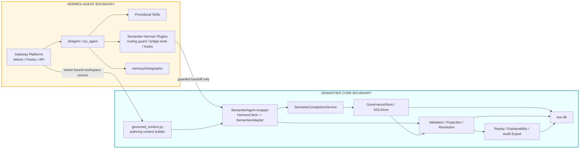
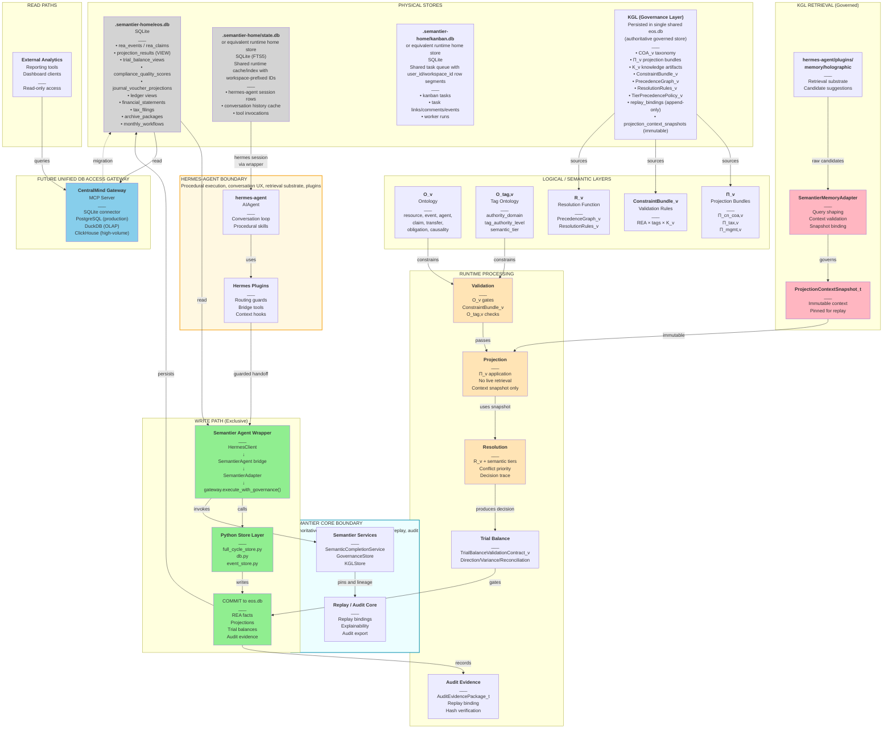
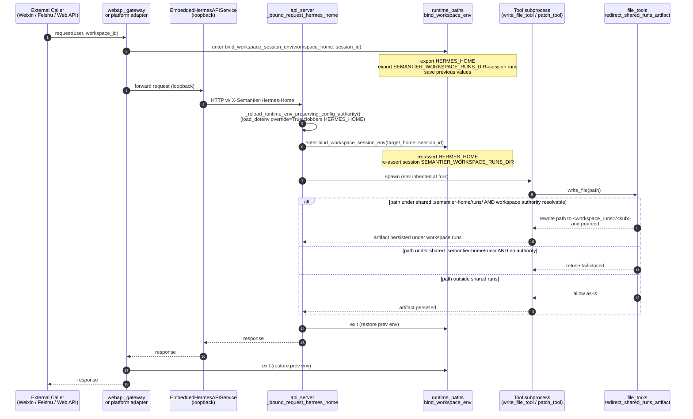
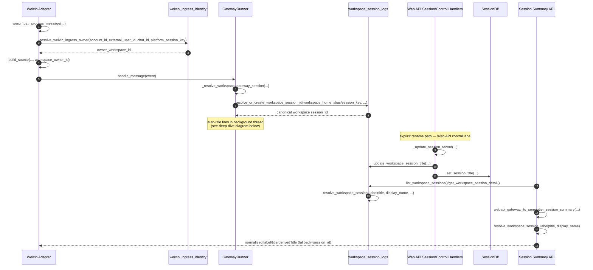
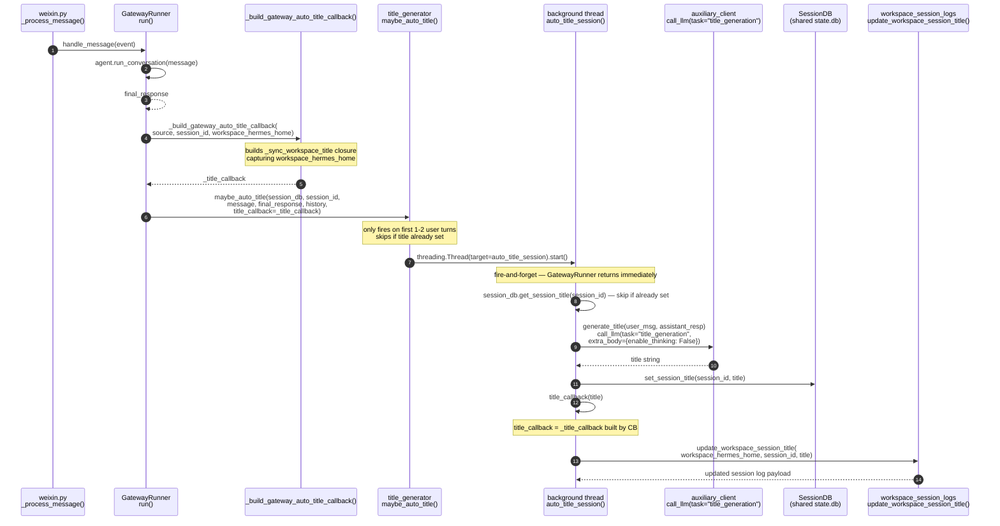
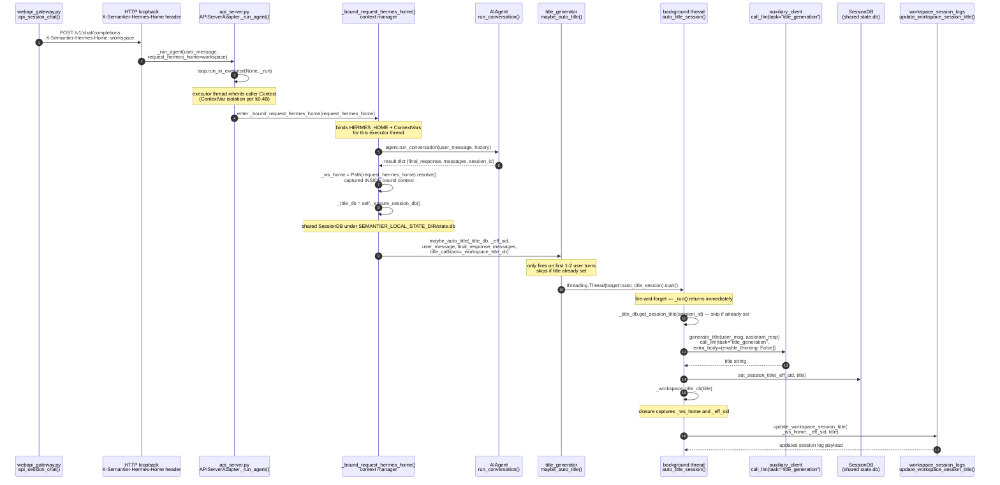
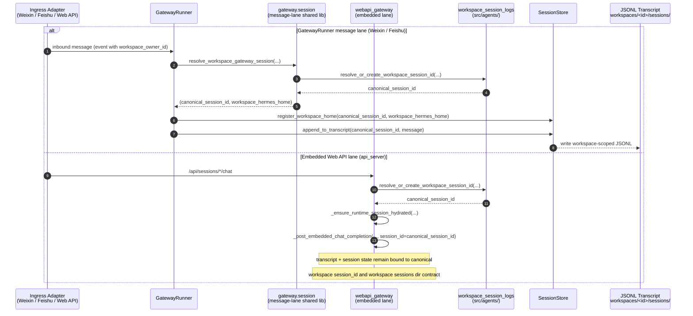
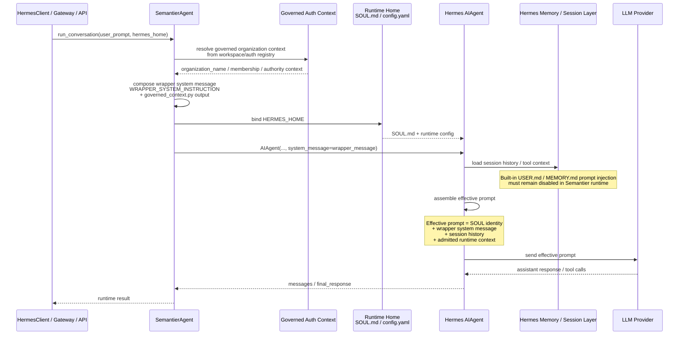
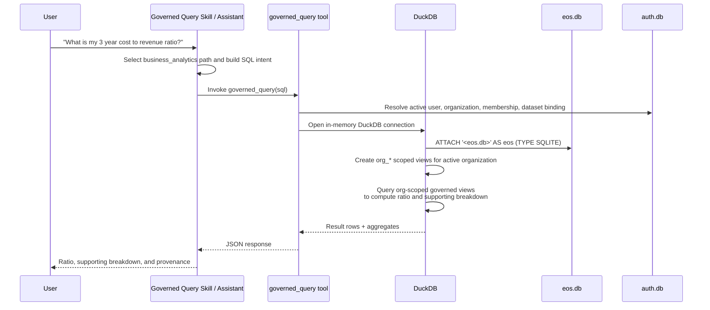

# Semantier-EOS Runtime Architecture v8.1 — Trial Balance Validation, Compliance Quality (CQ v2), Actuarial Readiness, Insurance Risk Contracts, and Full-Cycle Accounting

**Status:** Canonical runtime architecture reference.
**Authority:** This document is the canonical runtime contract for this repository.
**Scope:** Repository runtime boundaries, semantic governance, replay, trust, gateway/runtime integration, and executable contract surfaces.
**Upstream sources:**
- [Document Authority And Versioning](document-authority-and-versioning.md)
- [Practical Guidance](../white-paper/semantier_eos_v2_1.md)
- [12345 Methodology](../white-paper/semantier-agentic-system-methodology-12345.md)

**Version interpretation:** `v2.1` is the doctrinal white-paper law. `v8.x` is the repository runtime-contract lineage that realizes and extends that doctrine for this codebase. Where this document adds implementation structure, it is intended as a repository-specific realization and must not weaken doctrinal invariants.

This merged v8.1 document preserves all v7.5, v7.6, and v8 material for deterministic projection, schema-bound explainability, schema-bound audit evidence, portable external verification, verification contracts, COA onboarding, projection exceptions, structured governance decisions, governed semantic evolution, trial balance validation, CQ v2 compliance quality scoring, actuarial calibration readiness, insurance eligibility/quotation contracts, and reinsurance portfolio manifests, while extending the runtime with full-cycle accounting runtime contracts including source document review, journal voucher projection, ledger materialization, reconciliation, period close, financial statement generation, tax filing, and accounting archive packaging.

**Part of the three-document realization chain:**

1. [Formal Theory](../paper/semantier_eos_v1/main.tex) — LaTeX paper with definitions, theorems, proofs
2. [Practical Guidance](../white-paper/semantier_eos_v2_1.md) — Whitepaper with implementation guidance and semantic-tier doctrine
3. [12345 Methodology](../white-paper/semantier-agentic-system-methodology-12345.md) — Methodology defining Semantier as a semantic-tier system with ontology, structure-time, loops, capabilities, and tiers
4. [Data Processing Pipeline Reflection](../operational/design-reflection-for-data-processing-pipeline.md) — Implementation note for simulator -> EOS -> lakehouse processing, runtime query behavior, and migration backlog
5. **This document** — Runtime architecture for KGL-backed knowledge ingestion, controlled memory retrieval, deterministic bundle compilation, auditable semantic replay, explainability surface, schema-bound audit evidence, portable external verification, governed COA / projection evolution, and trial balance validation as a governed runtime contract layer.
6. [Gateway Unified Multitenant Design](../derived/gateway-unified-multitenant-design.md) — Canonical gateway identity/workspace isolation reference, including the integrated ingress contract on `:8899`.

---

## 0. Target Separation of Responsibilities

The end-state is **not** to copy Semantier core into Hermes plugin folders.

The intended architecture is:

```text
Semantier core (src/) remains the canonical implementation of:
  - governance and KGL lifecycle
  - semantic completion and T6/T5 routing
  - validation, projection, and resolution
  - replay bindings, explainability, and audit evidence

Hermes-agent remains the canonical implementation of:
  - conversation loop
  - gateway/channel UX
  - procedural skill execution and self-improvement substrate
  - plugin and hook runtime
  - retrieval substrate plugins

Semantier-owned Hermes integration points provide only:
  - routing guards
  - bridge tools / handoff commands
  - Semantier-built governed context forwarding
  - transport or workflow glue
```

Boundary rule:

```text
If code decides semantic authority, governed activation, replay semantics,
or audit lineage, it belongs in Semantier core.

If code intercepts Hermes behavior, blocks unsafe skill writes, forwards work
into Semantier, or carries a Semantier-built context block into Hermes execution,
it may live in Hermes integration glue.
```

Adapter rule:

```text
Adapters are transport shells only.

They may normalize protocol payloads, manage connection/session lifecycle,
stream deltas, and hand authenticated workspace context into the shared runtime.

They must not hardcode business capability exposure, platform tool composition,
governed context policy, or semantic authority behavior. Effective runtime
toolsets, governed context injection, and authorization-aware capability
selection must be resolved by shared Semantier runtime code and reused across
all adapters.

If two adapters need the same capability decision, that decision belongs in
shared runtime code, not duplicated adapter branches.
```

Capability resolution rule:

```text
Runtime capability discovery and direct Python imports are separate contracts.

If a capability is part of the required Python runtime dependency graph,
Semantier system code must import or register it during startup and fail
deterministically if it is unavailable.

If a capability is exposed as a runtime tool, skill, or plugin, callers must
discover it through Semantier runtime inventory and invoke it through that
registered runtime surface.

System code and agents must not use ad hoc import probing or shell-based
interpreter checks to decide whether a required capability exists at runtime.
```

Shared skill rule:

```text
Repo-owned Semantier skills are source-controlled under src/skills/ and are
installed into the shared runtime skills directory under .semantier-home/skills/.

Authenticated workspace homes must not keep managed copies of those shared
skills after promotion. Workspace homes may reference the shared skill set
through skills.external_dirs, but the shared runtime skill directory is not a
direct write target for workspace-scoped automatic skill improvement.

When Hermes automatic skill improvement targets a shared skill from a workspace
session, the mutation path is copy-on-write:
  1. resolve the shared skill through skills.external_dirs
  2. fork that skill into the workspace-local HERMES_HOME/skills/ tree
  3. apply edit/patch/write_file/remove_file only to the local override
  4. leave the shared runtime skill unchanged

Shared runtime skill updates remain git-backed and are promoted manually into
src/skills/ through review, not by direct workspace-session mutation.
```

Identity and authority rule:

```text
Law 1: user identity, organization association, membership, and active
authority context must be resolved only from governed authority sources.

They must never be inferred by an LLM, recovered from unmanaged prompt
memory, loaded from unmanaged workspace files, or accepted from user
self-claim alone.
```

Timestamp normalization rule:

```text
Law 2: all Semantier runtime timestamps that are persisted, exchanged across
component boundaries, used for ordering, replay, audit, governance, economic
events, or gateway session continuity must be timezone-aware UTC ISO-8601
timestamps.

Naive datetimes, local-time ISO strings, and timezone-free persisted timestamps
are not allowed for new runtime writes. Legacy naive timestamps may be read only
through explicit migration/normalization code that assigns a documented source
timezone and converts the value to UTC before comparison, replay, export, or
further persistence.

REA economic events, projection records, governance events, audit artifacts,
gateway session metadata, and cross-gateway transcript metadata must therefore
preserve global ordering without relying on process-local timezone assumptions.
```

Machine schema identifier rule:

```text
Law 4: Semantier-controlled machine schema identifiers must be ASCII-stable.

Runtime-owned database table names, view names, column names, JSON-schema
property names, parquet/lakehouse field names, API contract field names, and
tool-facing query identifiers must not use Chinese or other non-ASCII display
text as canonical identifiers.

Localized labels, statutory names, accounting/tax presentation text, and
Chinese COA descriptions are allowed and expected, but they belong in explicit
metadata, display-label fields, taxonomy artifacts, or export/presentation
payloads. They must not be the canonical machine key that code, SQL, replay,
audit, governance, or external verification depends on.

Legacy non-ASCII identifiers may be read only through explicit compatibility
aliases or migration code. New runtime writes and new governed query surfaces
must prefer ASCII identifiers such as amount_10k, debit_10k, credit_10k, and
net_10k, with localized labels carried separately.
```

Wrapper prompt limitation and enforcement choice:

```text
SemantierAgent may provide a wrapper-level system prompt override for the main
Hermes conversation turn.

Hermes GatewayRunner may append the same Semantier-built governed context block
to the channel context prompt after inbound transport identity has resolved to an
owner workspace.

That wrapper-level prompt does NOT overwrite Hermes internal background review
prompts such as memory-review, skill-review, or combined-review prompts defined
inside upstream run_agent.py.

Therefore Semantier must not rely on wrapper prompt text alone to enforce the
split between procedural skill learning and governed semantic authority.

Chosen architecture:
  - wrapper system prompt = soft steering for global Semantier policy
  - skill content = domain-specific behavior
  - Hermes plugin hooks = hard guardrail for blocking semantic-bearing skill writes
```

## 0.1 Component Boundary Diagram



Component responsibilities:

```text
Hermes boundary:
  - may originate T6 suggestions
  - may originate procedural skill candidates
  - may retrieve candidate context through holographic memory
  - must not independently activate semantic authority

Semantier core boundary:
  - classifies T6/T5 route selection
  - governs T5/T4/T3/T2 activation
  - persists replay-pinned evidence
  - remains the source of truth for runtime semantic meaning
```

## 1. Executive Summary

Semantier-EOS v7.4 established:

```text
REA facts define reality.
Books are derived projections.
Explanation is exposed governance trace.
Audit evidence is recorded proof, not narrative.
External verification must not trust live runtime.
Verification contracts make the semantic chain executable.
```

v7.4 added:

```text
ExternalAuditExport_t
ExternalVerificationManifest_t
AuditorVerificationResult_t
VerificationContract_t
```

v7.5 adds the missing evolution loop:

```text
COA onboarding
ProjectionException_t
ProjectionExceptionGovernance_t
COAChangeProposal_t
ProjectionRuleProposal_t
GovernedReprojection_t
```

v7.6 adds the trial balance validation layer:

```text
TrialBalanceView_t
TrialBalanceValidationContract_v
DirectionValidation_t
VarianceValidation_t
ReconciliationValidation_t
PeriodCloseValidation_t
TrialBalanceValidationResult_t
TrialBalanceJustification_t
TrialBalanceGovernanceDecision_t
TrialBalanceReplayBinding_t
UserFeedbackSignal_t
ProjectionTrustState_t
SemanticTierAuthorityContract_t
OrderMaintenanceResult_t
```

v8 adds the compliance quality and insurance layer:

```text
ComplianceQualityContract_v
ComplianceQualityFeatureVector_t
ComplianceQualityScore_t
ComplianceQualityOutcome_t
ComplianceQualityCalibrationModel_v
ComplianceQualityRiskQuote_t
InsuranceEligibilityResult_t
InsuranceRiskContract_v
ReinsurancePortfolioManifest_t
```

v8 boundary condition:

```text
CQ does not gate REA fact persistence.
CQ gates projection trust, close readiness, export readiness, insurance eligibility, liability tiering, and actuarial calibration.
REA persistence gate ≠ projection trust gate ≠ insurance eligibility gate.
```

v8.1 adds the full-cycle accounting runtime contracts:

```text
SourceDocumentReview_t
JournalVoucherProjection_t
CashJournalView_t
BankJournalView_t
SubsidiaryLedgerView_t
GeneralLedgerView_t
FinancialStatementPackage_t
TaxFilingPackage_t
AccountingArchivePackage_t
MonthlyAccountingWorkflow_t
```

v8.1 boundary condition:

```text
Full-cycle accounting contracts organize the governed sequence from source evidence to archive.
They do not replace REA facts, projection bundles, or trial balance validation.
Each stage is gated on preceding validations, governance approvals, and version-pinned artifacts.
Source documents are evidence, not accounting truth.
Period close is a governed state transition, not a manual step.
Archive packages must support offline verification without live runtime dependency.
```

v7.6 boundary condition:

```text
Validation does not block persistence of a valid REA fact.
Validation gates projection materialization, trust, close, export, and user-facing financial claims.
```

Core v7.6 doctrine:

```text
REA Event
  → Persist admitted economic fact
  → Projection Bundle Π_v
  → Ledger Projection Candidate
  → Trial Balance View Candidate
  → Trial Balance ValidationContract_v
  → Materialized Trusted View / Governance Feedback / Audit Evidence
```

Therefore:

```text
A valid REA fact may enter the fact store even if projection or trial balance validation fails.
A projected financial result may be trusted only if it is justified, validated, approved where required,
and replayable under explicit semantic pins.
```

These allow an internal auditor, external auditor, regulator, or independent verifier to validate an exported evidence package without relying on live Semantier-EOS services, live memory retrieval, live LLM calls, OCR, document parsing, or mutable current KGL state, while also allowing a valid REA event to remain committed even when the current projection taxonomy cannot classify it.

Core v7.5 doctrine:

```text
Trust is not transferred to the auditor by narration.
Trust is transferred by portable, deterministic, hash-verifiable evidence.
REA admission failure ≠ projection failure.
```

Core v7.6 doctrine:

```text
REA persistence gate ≠ projection trust gate.
Facts are stored.
Meaning is projected.
Correctness is validated.
The system does not merely verify accounting output.
It creates and maintains financial order by enforcing tiered semantic priority over derived representations of reality.
```

Therefore:

```text
REA event: COMMITTED
Projection: PROJECTION_EXCEPTION
Ledger view: NOT MATERIALIZED
Governance task: REQUIRED
```

The system must not:

```text
reject a valid REA fact because projection failed;
write account_code into the REA fact;
let an LLM invent an account_code;
activate a new COA account without governance approval;
rewrite historical facts or historical projection bindings.
```

The retrieval substrate remains the provider located at:

```text
hermes-agent/plugins/memory/holographic
```

The provider retrieves candidates only. It never serves as runtime authority, historical explanation authority, or audit proof authority.

Semantier-EOS uses:

```text
SemantierMemoryAdapter
```

to govern, filter, validate, snapshot, and bind retrieved material before it may become projection context.

The system must:

```text
preserve the REA fact;
create ProjectionException_t;
route the exception through ProjectionExceptionGovernance_t;
create versioned COA_v+1 and/or Π_v+1 only after approval;
allow governed reprojection as a new projection result;
preserve replay of the original exception under the original Π_v.
```

---

## 0.1 v7.5 Extension Rule

v7.5 is a strict extension of v7.4.

All v7.4 definitions remain valid unless explicitly refined here.

The v7.5 refinements are:

```text
Every AuditEvidencePackage_t MAY be exported as ExternalAuditExport_t.
Every ExternalAuditExport_t MUST include an ExternalVerificationManifest_t.
Every ExternalVerificationManifest_t MUST contain enough schema IDs, hashes, signatures, version pins, and artifact refs for offline verification.
External verification MUST NOT call Semantier-EOS runtime services, LLMs, OCR, document parsers, or hermes-agent/plugins/memory/holographic.
External verification MAY recompute hashes, validate schemas, verify signatures, verify Merkle proofs, and replay using pinned artifacts included or referenced in the export.
Every end-to-end semantic chain SHOULD be expressible as VerificationContract_t.
Valid REA admission MUST remain independent from projection success.
Projection failure MUST create a first-class ProjectionException_t rather than reject the REA fact.
Projection exception governance MUST be structured, versioned, auditable, and replayable.
COA_v+1 and Π_v+1 MUST be activated only after governance approval.
Governed reprojection MUST create a new projection result and MUST NOT overwrite historical replay.
```

## 0.1.1 v7.6 Extension Rule

v7.6 is a strict extension of v7.5.

All v7.5 definitions remain valid unless explicitly refined here.

v7.6 adds:

```text
TrialBalanceView_t
TrialBalanceValidationContract_v
DirectionValidation_t
VarianceValidation_t
ReconciliationValidation_t
PeriodCloseValidation_t
TrialBalanceValidationResult_t
TrialBalanceJustification_t
TrialBalanceGovernanceDecision_t
TrialBalanceReplayBinding_t
UserFeedbackSignal_t
ProjectionTrustState_t
SemanticTierAuthorityContract_t
OrderMaintenanceResult_t
```

v7.6 does not replace:

```text
REAEvent_t
COA_v
ProjectionBundle_v
ProjectionResult_t
ProjectionException_t
ProjectionExceptionGovernance_t
ReplayBinding_t
ExplainabilitySurface_t
AuditEvidencePackage_t
ExternalAuditExport_t
ExternalVerificationManifest_t
VerificationContract_t
```

---

## 0.1.2 v8.1 Extension Rule

v8.1 is a strict extension of v8.

All v8 definitions remain valid unless explicitly refined here.

v8.1 adds:

```text
SourceDocumentReview_t
JournalVoucherProjection_t
CashJournalView_t
BankJournalView_t
SubsidiaryLedgerView_t
GeneralLedgerView_t
FinancialStatementPackage_t
TaxFilingPackage_t
AccountingArchivePackage_t
MonthlyAccountingWorkflow_t
```

v8.1 does not replace:

```text
REAEvent_t
ProjectionBundle_v
ProjectionResult_t
ProjectionException_t
TrialBalanceView_t
TrialBalanceValidationContract_v
TrialBalanceValidationResult_t
TrialBalanceReplayBinding_t
ProjectionTrustState_t
ComplianceQualityScore_t
InsuranceEligibilityResult_t
AuditEvidencePackage_t
ExternalAuditExport_t
ExternalVerificationManifest_t
VerificationContract_t
```

v8.1 invariant:

```text
JournalVoucherProjection_t is a governed representation of a REA-sourced projection, not a replacement for REAEvent_t.
Ledger views (CashJournalView_t, BankJournalView_t, SubsidiaryLedgerView_t, GeneralLedgerView_t) are derived from JournalVoucherProjection_t, not from REA facts directly.
FinancialStatementPackage_t requires a closed period and trusted TrialBalanceView_t as prerequisite.
TaxFilingPackage_t is an independent projection under a pinned TaxRuleBundle_v, not a re-export of FinancialStatementPackage_t.
AccountingArchivePackage_t binds all period artifacts and must support offline verification without live runtime.
MonthlyAccountingWorkflow_t.close_state = closed requires all critical validation blockers resolved or governed-waived.
```

---

## 0.2 Alignment with the 12345 Methodology

The 12345 methodology defines Semantier as:

```text
Semantier = Semantic Tier System
```

and as:

```text
一个由语义层级驱动的可计算秩序系统
```

v7.5 implements the methodology as follows.

### 1 — Ontology as Single Source of Semantic Truth

`O_v` defines stable primitives and invariants:

```text
resource
event
agent
claim
transfer
obligation
settlement
causality
temporal identity
```

COA is not ontology. COA is a projection taxonomy.

```text
COA_v belongs to a Projection Domain as a target taxonomy for Π_v.
COA_v must not redefine O_v primitives.
```

### 2 — Structure × Time

v7.5 explicitly models semantic structure evolving through time:

```text
Structure:
    O_v
    COA_v
    K_v
    Π_v
    ConstraintBundle_v
    ProjectionExceptionGovernance_t

Time:
    REA event admitted
    projection exception created
    governance proposal submitted
    approval recorded
    COA_v+1 / Π_v+1 activated
    governed reprojection created
    historical replay preserved
```

### 3 — Three Loops

```text
Deduction Loop:
    O_v + K_v + Π_v attempts projection.
    If valid but unprojectable, emit ProjectionException_t.

Induction Loop:
    Repeated or novel ProjectionException_t instances reveal missing projection rules,
    missing COA nodes, ambiguous classification, or insufficient evidence patterns.

Governance Loop:
    ProjectionExceptionGovernance_t records justification → validation → approval,
    then publishes COA_v+1 and/or Π_v+1.
```

### 4 — Four Capabilities

```text
Constraint Capability:
    COA constraints, tax/accounting constraints, policy constraints, no-LLM-runtime constraints.

Objective Capability:
    Preserve valid facts while producing useful accounting/tax/management projections.

Decision Capability:
    MAP_TO_EXISTING_COA_NODE, ADD_CUSTOM_ACCOUNT, ADD_PROJECTION_RULE,
    SPLIT_PROJECTION, REQUEST_MORE_EVIDENCE, ESCALATE_TO_ADVISOR,
    MARK_NOT_PROJECTABLE.

Explanation Capability:
    Explain why a projection failed, why a governance action was selected,
    why COA_v+1 / Π_v+1 was activated, and how historical replay remains stable.
```

### 5 — Five Engineering Tiers

```text
Signal Tier:
    invoice, payment, uploaded COA, REA event, exception signal.

Semantic Tier:
    O_v, COA_v, K_v, projection mappings, rule hierarchy.

Policy Tier:
    validation, constraints, approval policy, governance decision policy.

Orchestration Tier:
    exception workflow, approval workflow, activation workflow, reprojection workflow.

Application Tier:
    admin UI, exception queue, approval screen, explainability UI, audit/export API.
```

---

## 0.3 Semantier World Hierarchy

```text
Level 0 — Reality / Evidence
    invoices, contracts, payments, receipts, bank records, documents

Level 1 — Ontology O_v
    primitives and invariants:
    resource, event, agent, claim, transfer, obligation, settlement,
    conservation, causality, temporal identity

Level 2 — Tag Ontology O_tag,v
    admissible semantic vocabulary:
    tag keys, tag value domains, authority_domain,
    tag_authority_level, semantic_tier compatibility

Level 3 — Knowledge Governance Layer K_v
    governed knowledge within O_v and O_tag,v:
    law, regulation, accounting standards, COA sources,
    tax field guides, professional guidance, internal policy,
    approved precedents, approved exceptions

Level 4 — ConstraintBundle_v
    executable validity rules over:
    REA facts × tag instances × K_v × Π_v

Level 5 — PrecedenceGraph_v + ResolutionRules_v
    semantic priority rules:
    which valid meaning wins when valid meanings conflict

Level 5.5 — TierPrecedencePolicy_v
    executable precedence rules for multi-tier conflicts:
    T4/T3/T2 > T5(org) > T5(user) > T6
    pinned at execution time in replay bindings
    overridable only through formal governance approval

Level 6 — Resolution Function R_v
    deterministic conflict resolution:
    winning claims, suppressed claims, escalation reasons,
    resolution trace, precedence policy version used

Level 7 — Projection Bundle Π_v
    governed representation function:
    REA facts + approved meaning + frozen context -> ledger/tax/mgmt/audit view

Level 8 — ProjectionContextSnapshot_t
    immutable runtime context snapshot selected from KGL / adapter-mediated retrieval;
    input evidence for projection, not authority by itself

Level 9 — ReplayBinding_t
    complete binding of all versions, context refs, hashes, traces, and effects

Level 10 — ExplainabilitySurface_t
    user/auditor-facing view derived from recorded governance trace and replay proof

Level 11 — ExplainabilitySurface JSON Schema
    machine-enforced contract governing the observable proof surface

Level 12 — AuditEvidencePackage_t
    auditor-facing evidence bundle derived from recorded artifacts and verification results

Level 13 — AuditEvidencePackage JSON Schema
    machine-enforced contract governing audit evidence packages

Level 14 — ExternalAuditExport_t
    portable export artifact for independent verification

Level 15 — ExternalVerificationManifest_t
    manifest containing schema IDs, artifact hashes, version pins, Merkle proofs, and signatures

Level 16 — AuditorVerificationResult_t
    independent verification result produced without trusting the live runtime

Level 17 — VerificationContract_t
    machine-readable DSL contract for end-to-end semantic-chain verification
```

Short form:

```text
O_v primitives
  > O_tag,v vocabulary
  > K_v governed knowledge
  > ConstraintBundle_v validity
  > PrecedenceGraph_v / ResolutionRules_v priority
  > TierPrecedencePolicy_v multi-tier conflict resolution (pinned in replay)
  > R_v conflict resolution
  > Π_v projection
  > ProjectionContextSnapshot_t retrieval context
  > ProjectionResult_t derived ledger representation candidate
  > TrialBalanceView_t derived account-balance view candidate
  > TrialBalanceValidationContract_v executable balance-review contract
  > TrialBalanceValidationResult_t validation artifact
  > UserFeedbackSignal_t actionable feedback artifact
  > TrialBalanceJustification_t explanation artifact
  > TrialBalanceGovernanceDecision_t approval / waiver / escalation artifact
  > ProjectionTrustState_t trust-state transition
  > SemanticTierAuthorityContract_t Semantier-wide authority doctrine
  > OrderMaintenanceResult_t semantic order creation / maintenance artifact
  > ReplayBinding_t replay proof
  > ExplainabilitySurface_t observable proof surface
  > ExplainabilitySurface schema contract
  > AuditEvidencePackage_t auditor verification bundle
  > AuditEvidencePackage schema contract
  > ExternalAuditExport_t portable evidence
  > ExternalVerificationManifest_t portable proof manifest
  > AuditorVerificationResult_t independent verification
  > VerificationContract_t executable semantic-chain specification
```

v7.5 hierarchy refinements:

```text
COA_v is introduced as a first-class projection taxonomy layer.
ProjectionException_t is introduced as a first-class runtime object when valid facts are not projectable.
ProjectionExceptionGovernance_t, COAChangeProposal_t, ProjectionRuleProposal_t, and GovernedReprojection_t extend the semantic chain beyond initial projection into governed evolution.
These additions refine v7.4 without removing ReplayBinding_t, ExplainabilitySurface_t, AuditEvidencePackage_t, ExternalAuditExport_t, ExternalVerificationManifest_t, AuditorVerificationResult_t, or VerificationContract_t.
```

v7.6 hierarchy refinements:

```text
ProjectionResult_t and TrialBalanceView_t are inserted as explicit derived-view candidates between projection context and replay.
TrialBalanceValidationContract_v, TrialBalanceValidationResult_t, UserFeedbackSignal_t, TrialBalanceJustification_t, TrialBalanceGovernanceDecision_t, ProjectionTrustState_t, SemanticTierAuthorityContract_t, and OrderMaintenanceResult_t are inserted between trial balance candidate generation and replay.
These additions refine v7.5 without removing any previously defined type.
```

v8 hierarchy refinements:

```text
ComplianceQualityContract_v, ComplianceQualityFeatureVector_t, ComplianceQualityScore_t, ComplianceQualityOutcome_t, ComplianceQualityCalibrationModel_v, ComplianceQualityRiskQuote_t, InsuranceEligibilityResult_t, InsuranceRiskContract_v, and ReinsurancePortfolioManifest_t are inserted as post-trust-state layers between PROJECTION_TRUSTED and ExternalAuditExport_t.
CQ gates close readiness, export readiness, insurance eligibility, and reinsurance portfolio inclusion.
These additions refine v7.6 without removing any previously defined type.
```

v8.1 hierarchy refinements:

```text
SourceDocumentReview_t is inserted at Level 0 (Reality / Evidence) as the governed entry point for source document ingestion before REA fact formation.
JournalVoucherProjection_t is inserted between REAEvent_t and ledger views as the governed journal-entry representation.
CashJournalView_t, BankJournalView_t, SubsidiaryLedgerView_t, and GeneralLedgerView_t are derived ledger views under JournalVoucherProjection_t.
FinancialStatementPackage_t, TaxFilingPackage_t, and AccountingArchivePackage_t are inserted as governed period-close artifacts above the ExternalAuditExport_t layer.
MonthlyAccountingWorkflow_t governs the full-period state machine across all v8.1 artifacts.
These additions refine v8 without removing any previously defined type.
```

Hard constraints:

```text
K_v cannot redefine ontology primitives.
K_v cannot bypass O_tag,v.
Π_v must respect O_v invariants.
Projection context cannot bypass R_v.
ExplainabilitySurface_t cannot invent reasons absent from recorded traces.
ExplainabilitySurface_t must validate against its schema.
AuditEvidencePackage_t cannot fabricate missing evidence.
AuditEvidencePackage_t must mark verification failure as AUDIT_EXCEPTION.
AuditEvidencePackage_t must validate against its schema.
ExternalAuditExport_t cannot add new reasoning.
ExternalAuditExport_t cannot call live retrieval.
ExternalVerificationManifest_t must bind all exported artifacts by hash.
AuditorVerificationResult_t must fail closed on hash, schema, signature, Merkle, or replay mismatch.
VerificationContract_t must express required checks as machine-readable assertions.
COA_v cannot redefine ontology primitives.
Projection failure must not reject a valid REA fact.
ProjectionException_t must not write account_code into REA facts.
ProjectionExceptionGovernance_t must not mutate REA facts.
COA_v+1 / Π_v+1 require governance approval before ACTIVE.
GovernedReprojection_t creates a new projection result; it never overwrites facts or old projections.
Old exceptions replay under original Π_v.
New projections replay under the Π_v active at their admission time.
Chinese COA is a projection taxonomy, not ontology.
Field-guide knowledge is T3 unless elevated by law/regulation or explicitly governed policy.
TrialBalanceView_t cannot be the source of financial truth.
TrialBalanceValidationResult_t cannot mutate REA facts.
TrialBalanceValidationResult_t cannot mutate ProjectionResult_t.
TrialBalanceJustification_t cannot invent evidence absent from recorded artifacts.
TrialBalanceGovernanceDecision_t must be append-only.
UserFeedbackSignal_t must be derived from validation artifacts, not free-form hallucination.
SemanticTierAuthorityContract_t expresses the Semantier-wide authority doctrine; it is not a Gate 2 accounting subcheck.
OrderMaintenanceResult_t must record whether semantic order was created, preserved, repaired, or escalated.
A waived validation failure remains visible and replayable.
A trial balance cannot be trusted unless its lineage, validation contract, exceptions, explanations, governance decision, authority priority, and replay binding are pinned.
TierPrecedencePolicy_v must be pinned in every ReplayBinding_t to ensure historical replay resolves multi-tier conflicts deterministically.
SourceDocumentReview_t must record authenticity, legality, completeness, and arithmetic checks; passing review does not constitute REA fact admission.
JournalVoucherProjection_t must not store account_code in the source REAEvent_t.
Ledger views (CashJournalView_t, BankJournalView_t, SubsidiaryLedgerView_t, GeneralLedgerView_t) are replayable representations; they are not sources of financial truth.
FinancialStatementPackage_t may only be generated from a closed period with resolved critical validation blockers.
TaxFilingPackage_t must use a pinned TaxRuleBundle_v; it must not be derived directly from FinancialStatementPackage_t without an independent tax projection.
AccountingArchivePackage_t must support offline verification; it must not depend on live LLM, live OCR, live KGL, or mutable current rules.
MonthlyAccountingWorkflow_t.close_state must not transition to closed if unresolved projection exceptions, material reconciliation mismatches, unapproved overrides, or unresolved drift signals exist.
Organization-scoped derived materializations (lakehouse/parquet, projections, replay exports) are reproducible from pinned EOS artifacts; canonical authority remains in eos.db.
Org-scoped derived caches must be invalidated and rebuilt when upstream platform or organization bundles supersede; cache staleness defaults to rebuild, not fallback.
org_id=\\\"global\\\" legacy artifact lookup aliasing is a migration shim only and must not be treated as a permanent semantic tier.
If a derived org cache is missing or stale, runtime must initiate deterministic rebuild from pinned EOS artifacts; fall-back to stale cache is forbidden.
Stale or missing org materializations do not affect historical replay; replay always uses pinned EOS snapshots and binding evidence.
```

---

## 0.4 Component Diagram — Physical and Logical Storage Mapping

### 0.4A Runtime Storage Contract

The canonical runtime contract for authenticated workspaces is:

- Shared platform bootstrap assets remain launcher-managed and read-only from tenant perspective.
- Authenticated Hermes operational state is workspace-owned and lives under `workspaces/<workspace_id>/`.
- Authenticated workspace session logs and runtime session artifacts live under `workspaces/<workspace_id>/sessions/<session_id>/`.
- `workspaces/<workspace_id>/sessions/sessions.json` is the canonical session index / transport-key map.
- `workspaces/<workspace_id>/sessions/<session_id>/logs/<file_key>.jsonl` is the canonical transcript/event append log.
- `workspaces/<workspace_id>/sessions/<session_id>/logs/session_<file_key>.trajectory.jsonl` is the canonical per-session trajectory log.
- Workspace runtime subdirectories are direct children of `workspaces/<workspace_id>/`: `sessions/`, `memories/`, `skills/`, `profiles/`, `cron/`, `logs/`, `home/`, and `swarm/runs/`.
- Per-session user uploads live under `workspaces/<workspace_id>/sessions/<session_id>/uploads/`.
- Per-session run artifacts live under `workspaces/<workspace_id>/sessions/<session_id>/runs/`; flat `workspaces/<workspace_id>/runs/` is legacy residue and must not be used for new writes.
- Per-session code/tool artifacts live under `workspaces/<workspace_id>/sessions/<session_id>/artifacts/`.
- Hermes `SessionDB` rows and message cache currently live in the shared runtime `state.db` under `.semantier-home/` (or `SEMANTIER_LOCAL_STATE_DIR` / `HERMES_HOME`), with workspace ownership enforced by canonical session-id prefixing and wrapper auth scoping rather than by per-workspace database files.
- Hermes Kanban task coordination rows currently live in the shared runtime `kanban.db` under `.semantier-home/` (or `SEMANTIER_LOCAL_STATE_DIR`), with Semantier-owned rows segmented by governed `user_id` and `workspace_id` columns. Authenticated Semantier gateway requests must not create or use workspace-local `kanban.db`; workspace-local Kanban DB files are legacy residue or standalone Hermes state outside the Semantier multitenant contract.
- Holographic memory for authenticated Semantier runtime requests lives under `.semantier-home/memory/users/<user_id>/workspaces/<workspace_id>/memory_store.db`, with `user_id` and `workspace_id` resolved from governed identity context. Authenticated Semantier gateway requests must not create or use workspace-local `memory_store.db`; workspace-local holographic DB files are legacy residue or standalone Hermes state outside the Semantier multitenant contract.
- Workspace-bound gateway JSONL transcripts (sessions resolved to a workspace) are written to `workspaces/<workspace_id>/sessions/` via `workspace_session_logs`.
- `eos.db` may remain platform-shared unless a later plan explicitly migrates governed storage too.
- Session APIs must handle DB-only workspace sessions deterministically: if a workspace session row exists in shared `state.db` before canonical workspace log hydration, `/api/sessions/{session_id}/messages` and session deletion must still resolve it within the authenticated workspace and must not leak or probe across workspace prefixes.

### 0.4B Workspace Write Policy Enforcement Layer

The canonical write-policy enforcement contract for authenticated workspace
sessions is:

- Policy enforcement is a runtime boundary, not a prompt suggestion.
- The enforcement layer must be implemented in code paths that govern Hermes
  file mutation tools and workspace session environment binding.
- Repo-owned source trees are never valid write targets for authenticated
  workspace sessions. This includes `src/`, `tests/`, and `hermes-workspace/`.
- Workspace-local Hermes state under `workspaces/<workspace_id>/`
  is not a user-session scratch space and must not be a general write target
  for authenticated workspace turns.
- Authenticated workspace sessions may write only governed active-session output
  directories: `workspaces/<workspace_id>/sessions/<session_id>/runs/` and
  `workspaces/<workspace_id>/sessions/<session_id>/uploads/`.
- `workspaces/<workspace_id>/sessions/<session_id>/runs/` is the canonical mutable root for
  generated run artifacts, replayable work products, and session-produced
  execution outputs.
- `workspaces/<workspace_id>/sessions/<session_id>/uploads/` is the canonical mutable root for
  user-provided inbound files staged for governed processing within that session.
- If enforcement configuration is missing, stale, or ambiguous, runtime must
  fail closed for writes outside the explicitly allowed workspace output roots.
- This contract must be enforced by automated tests in CI so future changes
  cannot silently widen authenticated workspace write scope.



Runtime storage split:

```text
Shared platform runtime (.semantier-home/ or equivalent launcher-managed root):
  - plugins/
  - shared skills overlays
  - template config / SOUL / bootstrap files
  - eos.db (AUTHORITATIVE GOVERNED STORE — SINGULAR)

Organization-scoped derived materializations (organizations/<org_id>/):
  - lakehouse/parquet/              (reproducible from eos.db + manifest)
  - lakehouse/manifests/            (pinned bundle references, non-authoritative)
  - projections/ (cache)            (derived from eos.db projections, rebuild on supersession)
  - replay/ (export)                (derived from eos.db replay_bindings, reproducible)

Workspace-owned runtime (workspaces/<workspace_id>/):
  - sessions/
  - memories/
  - skills/
  - profiles/
  - cron/
  - logs/
  - home/
  - swarm/runs/
  - sessions/<session_id>/logs/
  - sessions/<session_id>/artifacts/
  - sessions/<session_id>/runs/
  - sessions/<session_id>/uploads/
  - user/t5_user/                   (user-scoped preferences only)
  - user/t6/                        (user suggestions only)
```

### 0.4B Cross-Gateway Workspace Env Binding Contract

Every gateway (Weixin, Feishu, web API, embedded loopback) and every tool
subprocess spawned from a workspace-bound request must see a single, consistent
pair of environment variables for the duration of that request:

| Env Var | Meaning | Required For |
|---|---|---|
| `HERMES_HOME` | Active workspace/runtime home for file-backed tools, skills, memories, config overlays, session artifacts, and workspace write policy. Authenticated requests bind this to `workspaces/<workspace_id>`; shared `.semantier-home` is the launcher/bootstrap fallback. Hermes `SessionDB` uses `SEMANTIER_LOCAL_STATE_DIR/state.db` when that variable is set. | Runtime code except shared SessionDB selection |
| `SEMANTIER_LOCAL_STATE_DIR` | Launcher-managed shared runtime root. Shared SQLite coordination stores such as `state.db` and `kanban.db` resolve here even when `HERMES_HOME` is request-bound to `workspaces/<workspace_id>`. | Shared runtime DB selection |
| `SEMANTIER_WORKSPACE_ID` | Governed workspace segment key exported while `bind_workspace_env()` is active; used by Kanban rows and worker subprocesses to keep shared `kanban.db` rows scoped without creating workspace-local DBs. | Gateway/tool execution context |
| `SEMANTIER_USER_ID` | Governed user segment key when available from authenticated wrapper context; Kanban may resolve it from `auth.db` using `SEMANTIER_WORKSPACE_ID` for platform messages. | Gateway/tool execution context |
| `SEMANTIER_WORKSPACE_RUNS_DIR` | Canonical writable runs root for the active bound session — `workspaces/<workspace_id>/sessions/<session_id>/runs` | Any tool, skill, or subprocess that produces governed artifacts (e.g. reimbursement markdown under `$SEMANTIER_WORKSPACE_RUNS_DIR/reimbursement/`) |

These variables are derived deterministically from `runtime_paths` and are
exported by exactly one helper, which every gateway adapter must use:

```text
runtime_paths.bind_workspace_env(target_home: Path | str) -> contextmanager
  • exports HERMES_HOME = target_home (resolved absolute path)
  • sets _workspace_hermes_home_ctx ContextVar to the same value
  • if target_home is a workspace home (not the shared .semantier-home root):
      exports SEMANTIER_WORKSPACE_ID = workspace_id
      leaves SEMANTIER_WORKSPACE_RUNS_DIR unset until a session id is bound
runtime_paths.bind_workspace_session_env(target_home: Path | str, session_id: str) -> contextmanager
  • wraps bind_workspace_env(target_home)
  • derives runs_root = workspaces/<workspace_id>/sessions/<session_id>/runs
  • creates runs_root and workspaces/<workspace_id>/sessions/<session_id>/uploads
  • exports SEMANTIER_WORKSPACE_RUNS_DIR = runs_root
  • sets _workspace_runs_dir_ctx ContextVar to the same value
  • on exit, restores os.environ vars and ContextVar tokens
    to their previous values (pop if previously unset)
  • empty/None target_home is a no-op (preserves caller env)
```

Callers (single source of truth — never reimplement inline):

```text
src/agents/semantier_agent.py::_hermes_home_bound
src/agents/webapi_gateway.py::_temporary_hermes_home
src/agents/hermes_embedded_gateway.py::_temporary_hermes_home          (per-request)
src/agents/hermes_embedded_gateway.py::_hydrate_saved_weixin_gateway_env  (server startup)
hermes-agent/gateway/platforms/api_server.py::_bound_request_hermes_home
hermes-agent/gateway/run.py::_run_agent (run_sync closure)            (chat platform handler)
hermes-agent/gateway/run.py::_run_background_task (run_sync closure)  (background agent tasks)
```

The embedded weixin gateway has two binding sites because it runs as a
long-lived process: the startup hydrator pins the process-wide env to the
workspace owning the saved weixin account, and the per-request context
manager re-asserts the binding around each tool invocation. Startup binding
must not export `SEMANTIER_WORKSPACE_RUNS_DIR`; that variable is available only
after an active session id is bound.

The api_server caller must enter `bind_workspace_env` **after**
`_reload_runtime_env_preserving_config_authority()` runs, because the reload
calls `load_dotenv(..., override=True)` against the workspace's `.env` which
will silently overwrite a previously-bound `HERMES_HOME` if the shared `.env`
points at the launcher root. Re-asserting the binding post-reload closes that
window.

Tool-layer safety net — independent of any gateway:

```text
hermes-agent/tools/file_tools.py::redirect_shared_runs_artifact
  invoked from write_file_tool and patch_tool (both `replace` and V4A
  `*** Update/Add/Delete File:` directive forms).
  Redirect-first / refuse-fallback semantic:
    1. Detect leak when the target path lives under <SEMANTIER_LOCAL_STATE_DIR>/runs/
       OR contains the literal segment .semantier-home/runs/ (substring fallback
       fires even when SEMANTIER_LOCAL_STATE_DIR is unset).
    2. Resolve workspace authority via _resolve_workspace_runs_root:
       a. SEMANTIER_WORKSPACE_RUNS_DIR env (set by bind_workspace_session_env).
       b. No sessionless fallback may derive a flat <workspaces_root>/<id>/runs
          path from HERMES_HOME.
    3. If authority resolvable: rewrite path to <workspace_runs>/<sub>, log
       the redirect at INFO, and proceed with the write (creates parent dir).
    4. If no authority: refuse fail-closed with explicit error.

hermes-agent/tools/file_tools.py::redirect_shared_runs_in_text
  invoked from terminal_tool (shell payload) and code_execution_tool (python source).
  Same detect + resolve sequence, but the rewrite is substring-level on the
  payload text (replaces `.semantier-home/runs/` with `<workspace_runs>/`).
  Refuses only when no workspace authority is resolvable. The legacy
  refusal-only helper check_shared_runs_leak_in_text is retained for callers
  that don't want to rewrite payloads.

hermes-agent/tools/file_tools.py::_check_shared_runs_leak
  Thin backward-compat wrapper around redirect_shared_runs_artifact that
  always returns an error string. New write code paths should call
  redirect_shared_runs_artifact directly.
```

Cross-process / cross-layer propagation functions:

```text
Layer 1 — Skill gate (invocation guard):
  hermes-agent/src/skills/productivity/expense-reimbursement/SKILL.md
    required_environment_variables: [SEMANTIER_WORKSPACE_RUNS_DIR]
    Blocks skill invocation at the skill-loader boundary when the var is unset.
    Applied to both the source copy and the runtime copy in .semantier-home/skills/.

Layer 2 — Child agent system prompt (delegate_task):
  hermes-agent/tools/delegate_tool.py::_build_child_system_prompt
    Reads current_workspace_runs_dir() (ContextVar-first, os.environ fallback)
    and injects a "GOVERNED ARTIFACT RUNS DIRECTORY" block into the child
    agent's ephemeral system prompt when a value is resolved, making the path
    LLM-visible.  Child agents execute in the same process via
    ThreadPoolExecutor and inherit os.environ, but the explicit prompt
    directive prevents model path guessing.

Layer 3 — Kanban worker subprocess env:
  hermes-agent/hermes_cli/kanban_db.py::Task.env_overrides  (DB field + schema)
    Per-task JSON dict (str→str) stored at creation time, forwarded to the
    worker subprocess by _default_spawn. Enables task-creator-intent env to
    survive through async worker dispatch.

  hermes-agent/hermes_cli/kanban_db.py::create_task
    Auto-captures SEMANTIER_WORKSPACE_RUNS_DIR via current_workspace_runs_dir()
    (ContextVar-first, os.environ fallback) at task-creation time and stores it
    in Task.env_overrides via dict.setdefault (caller-supplied overrides take
    precedence).

  hermes-agent/hermes_cli/kanban_db.py::_default_spawn
    Three-strategy resolution applied in priority order before os.execvpe:
      a. Task.env_overrides (highest — task creator captured value).
      b. current_workspace_runs_dir() (ContextVar-first, os.environ fallback)
         from the dispatcher's own binding (embedded dispatcher case, lowest
         priority).

Layer 4 — Cron scheduler env derivation:
  hermes-agent/cron/scheduler.py::run_job
    Derives SEMANTIER_WORKSPACE_RUNS_DIR only when a cron job carries an active
    session context; it must not derive a flat workspace runs root from
    workspaces/<id>/.
    Saves and restores the previous value in a try/finally block so adjacent
    cron jobs in the same process are not contaminated.

Cron storage authority:
  Semantier SQLite table semantier_cron_jobs is the authoritative cron job
  store. Hermes cron APIs may keep legacy function names such as load_jobs()
  and save_jobs(), but those functions must read and write SQLite. A
  per-HERMES_HOME cron/jobs.json file is legacy import input only and must not
  be treated as the live source of truth. Cron context_from continuity reads
  Semantier SQLite output records only; missing referenced SQLite output is a
  runtime error rather than an implicit filesystem fallback.

Cron scheduling contract:
  Every Semantier/Hermes cron job design must make both scheduling cadence and
  repeat policy explicit at creation and update time.

  Cadence is carried by the schedule contract:
    - one-shot delay or timestamp schedules parse to kind="once"
    - "every <duration>" schedules parse to kind="interval"
    - cron expressions parse to kind="cron"

  Repeat policy is carried by the repeat contract:
    - repeat=1 means run once
    - repeat=N where N > 1 means run exactly N times
    - repeat=0 means run forever until an explicit stop condition, manual
      pause/delete, or workflow-specific terminal cleanup removes or disables
      the job

  Persisted job payloads store repeat as:
    repeat: { times: number | null, completed: number }

  where times=null is the persisted form of "forever" and completed is the
  deterministic run counter used by the scheduler. UI, API, plugin, and tool
  surfaces may expose friendly choices such as once, many times, or forever,
  but they must normalize to this same repeat contract before persistence.

  Conditional monitor jobs, such as RSVP or delivery monitors, are recurring
  jobs with repeat=0 and an explicit domain stop condition in their tick path.
  They must not rely on implicit scheduler defaults to express "forever until
  condition met"; the tick path is responsible for deterministic terminal
  cleanup, while the cron record remains the cadence/repeat authority while
  active.
```

Per-request binding flow across the multi-process boundary:



Architecture invariants for this contract:

```text
1. The env contract is owned by runtime_paths.bind_workspace_env.
   No gateway adapter, tool, or skill may compute or export these vars inline.

2. Every gateway boundary that crosses into a workspace-bound execution must
   wrap the inner call in bind_workspace_env(target_home).

3. The api_server caller binds AFTER any runtime env reload, never before.

4. file_tools.redirect_shared_runs_artifact is the last line of defense; it
   must redirect shared-root writes into the resolved workspace runs folder
   when authority is resolvable, and refuse fail-closed otherwise, so any
   future regression at the gateway layer either lands artifacts in the
   correct workspace or surfaces an explicit error instead of silently
   leaking to the platform-shared root.

5. Skills and prompts must reference $SEMANTIER_WORKSPACE_RUNS_DIR as the
   canonical writable root — never $HERMES_HOME/.. arithmetic. The
   tests/test_skill_artifact_paths_lint.py guard locks this rule in.
```

### 0.4D Sandbox Scope Contract

Sandbox identity is a governed execution concern owned by Semantier core, not
by Hermes transport glue or terminal backends.

Canonical contract:

```text
src/agents/sandbox_scope.py
  • SandboxScope(workspace_id, lane, scope_id, adapter_key, network_enabled)
  • current_sandbox_scope() / current_sandbox_key()
  • bind_sandbox_scope(scope)
```

Semantics:

```text
1. Semantier core is the only authority that may derive or mint a canonical
   sandbox key. Hermes must not infer tenant/workspace identity from task ids,
   prompt state, unmanaged files, or user self-claim.

2. The in-process authority is ContextVar-first. bind_sandbox_scope(scope)
   sets both the ContextVar and SEMANTIER_SANDBOX_KEY for subprocess
   inheritance, then restores both on exit.

3. Interactive session scope is keyed by workspace_id + canonical session id.
   Background tasks reuse the bound parent session scope.

4. Cron/job scope is keyed by workspace_id + job_id + run timestamp, but only
   when workspace authority is already resolvable from the established runtime
   path. If authority is not resolvable, cron must not invent a workspace id.

5. Hermes transport/runtime layers may consume a bound sandbox scope as an
   execution hint only. They must preserve explicit scope when present and may
   fall back to legacy shared-sandbox behavior only when no Semantier scope is
   bound.

6. Lifecycle rotation for scoped sandboxes is deterministic and local-runtime
   controlled: command-count and post-network rotation decisions are metadata on
   the active scoped sandbox, never a source of tenant authority.
```

### 0.4C Cross-Gateway Session Title Update Contract

Session title behavior must be channel-agnostic. Weixin, Feishu, Web API, and
embedded loopback flows must converge on a single runtime contract for writing,
normalizing, and reading session labels.

Canonical title/label resolver:

```text
src/agents/workspace_session_logs.py::resolve_workspace_session_label
```

Resolver semantics:

```text
- Accept ordered candidate fields (title, display_name, etc.)
- Return first non-empty normalized value
- Return None when all candidates are empty
- Never infer authority data from LLM output or unmanaged files
```

Ingress adapter pattern note:

```text
All channels are modeled as ingress adapters.

- Weixin / Feishu adapters: ingress -> GatewayRunner message lane
- Web API adapter: ingress ->
  (a) embedded Web API chat lane (api_server execution path), and
  (b) Web API session/control lane for session CRUD/rename/list

So the normalized shape is "Ingress Adapter + runtime lane", with Web API
being a dual-lane adapter rather than a different architecture family.
```

Shared function ownership note:

```text
resolve_workspace_session_label is implemented in src/agents/workspace_session_logs.py.
GatewayRunner and Web API are call sites that consume this shared function; they do not own it.
```

Weixin gateway session lifecycle flow (identity, session creation, rename, read):



Auto-title generation: Weixin gateway deep dive (actual code path):



Auto-title generation: Web UI / api_server deep dive (actual code path):



Key differences between the two paths:

```text
Weixin / GatewayRunner path:
  - workspace_hermes_home is resolved via workspace_hermes_home_for_source(source)
    from source.workspace_owner_id before run_conversation() is called.
  - Uses the shared platform state.db (self._session_db) for SessionDB.
  - _build_gateway_auto_title_callback() constructs the workspace sync closure.
  - title_callback is passed into maybe_auto_title as a named argument.

Web UI / api_server path:
  - workspace_hermes_home comes from the X-Semantier-Hermes-Home request header,
    forwarded by webapi_gateway._post_embedded_chat_completion().
  - _ws_home is captured inside _bound_request_hermes_home() so the background
    thread sees the workspace-resolved path, not a racy os.environ read.
  - Uses the shared platform state.db for SessionDB, even while HERMES_HOME is
    request-bound to the workspace for tools, session artifacts, memories, and
    write-policy enforcement.
  - _workspace_title_cb closure is constructed inline in _run_agent._run().

Both paths converge on the same terminal writes:
  - session_db.set_session_title(session_id, title)
  - workspace_session_logs.update_workspace_session_title(workspace_home, session_id, title)
```

Determinism and parity requirements:

```text
1. Title normalization order is owned by resolve_workspace_session_label and
  must not be reimplemented differently per gateway.

2. All title writes must update both:
  - SessionDB title (runtime conversation surfaces)
  - Workspace session log title (workspace-scoped session APIs)

3. Session summary APIs must derive label/title from normalized metadata and
  only fall back to session_id when no normalized label exists.

4. Any new gateway adapter must reuse this contract without introducing
  adapter-local title precedence rules.
```

Concurrency isolation — ContextVar-based per-request workspace binding:

```text
All three previously-documented concurrency gaps (GAP-1/2/3) are closed.
The fix introduced two ContextVars in src/runtime_paths.py:

  _workspace_hermes_home_ctx:   ContextVar[Optional[str]]  ("_semantier_hermes_home")
  _workspace_runs_dir_ctx:      ContextVar[Optional[str]]  ("_semantier_workspace_runs_dir")

bind_workspace_env now sets both os.environ (for subprocess inheritance) AND
the ContextVars (for in-process isolation) on entry, and resets both tokens on
exit.  asyncio.run_in_executor copies the caller's Context to the executor
thread automatically, so executor threads see per-request bindings without
process-global races.

Public ContextVar accessors (src/runtime_paths.py):

  current_workspace_hermes_home() -> Optional[str]
    Returns ContextVar value if set, else os.environ["HERMES_HOME"] (for
    subprocess / long-lived-process contexts where no ContextVar is active).

  current_workspace_runs_dir() -> Optional[str]
    Returns ContextVar value if set, else os.environ["SEMANTIER_WORKSPACE_RUNS_DIR"].

Updated consumers — all now read ContextVar-first:

  GAP-1 (CLOSED):
    hermes-agent/gateway/run.py::_run_agent / _run_background_task
      Both run_sync closures wrap run_conversation() with bind_workspace_env,
      so each asyncio task carries its own per-request ContextVar binding.
    hermes-agent/tools/file_tools.py::_resolve_workspace_runs_root
      Uses current_workspace_hermes_home() then current_workspace_runs_dir().
    hermes-agent/tools/code_execution_tool.py (execute_code)
      Child subprocess env built from current_workspace_hermes_home() /
      current_workspace_runs_dir() instead of ambient os.environ.
    hermes-agent/tools/environments/local.py::_inject_context_hermes_home
      Bridges the ContextVar into subprocess env dicts for terminal / bg procs.
    hermes-agent/tools/environments/local.py::_sanitize_subprocess_env
    hermes-agent/tools/environments/local.py::_make_run_env
      Both derive subprocess HOME from the HERMES_HOME already injected by
      _inject_context_hermes_home (ContextVar-first), falling back to
      os.environ["HERMES_HOME"] only in non-gateway / single-tenant contexts.
      Absent HERMES_HOME → HOME injection is skipped (no error).
    hermes-agent/cron/scheduler.py::run_job
      HOME derived from run_env["HERMES_HOME"] (set from context-aware getter),
      not from get_subprocess_home().
    hermes-agent/agent/copilot_acp_client.py::_resolve_home_dir
      Priority: (1) current_workspace_hermes_home() → {home}/home/,
      (2) os.environ["HERMES_HOME"] → {home}/home/ (non-gateway fallback,
      safe because _resolve_home_dir is called once per subprocess launch),
      (3) OS-level HOME / expanduser / pwd / /tmp.
      get_subprocess_home() is no longer called from this function.

  GAP-2 (CLOSED):
    hermes-agent/hermes_cli/kanban_db.py::create_task
      Snapshots current_workspace_runs_dir() (ContextVar-first, os.environ
      fallback) at task-creation time instead of raw os.getenv().
    hermes-agent/hermes_cli/kanban_db.py::_default_spawn
      Strategy 3 fallback reads current_workspace_runs_dir() (ContextVar-first,
      os.environ fallback) from the dispatcher's binding.

  GAP-3 (CLOSED):
    hermes-agent/tools/delegate_tool.py::_build_child_system_prompt
      Reads current_workspace_runs_dir() (ContextVar-first, os.environ fallback)
      when injecting the "GOVERNED ARTIFACT RUNS DIRECTORY" prompt block.

Subprocess HOME isolation policy:
  Subprocess environments receive a per-profile HOME ({HERMES_HOME}/home/)
  when that directory exists.  The Python process's own HOME and Path.home()
  are never modified.  get_subprocess_home() (hermes_constants.py) is retained
  for existing callers outside the gateway path but is no longer consulted
  by any subprocess launcher in hermes-agent/.
```

### Organization-Scoped Materialization Authority and Staleness Contract

Phase-1 governance authority remains in the single shared `eos.db`:

```text
Canonical Authority:
  - All REA facts, projections, trial balance validations, and replay bindings are
    persisted append-only in eos.db.
  - replay_bindings and projection_context_snapshots are immutable authoritative
    EOS evidence surfaces.
  - TierPrecedencePolicy_v is pinned in eos.db and recorded in each replay binding
    to ensure historical replay resolves conflicts deterministically.

Derived Org-Scoped Materializations (Non-Authoritative):
  - organizations/<org_id>/lakehouse/parquet/: materialized from pinned org facts
    in eos.db, reproducible on demand using parquet manifest.
  - organizations/<org_id>/lakehouse/manifests/: pinned bundle references and
    effective-from timestamps; not semantic authority, used for validation only.
  - organizations/<org_id>/projections/ (cache): derived outputs from eos.db
    projections; invalidated and rebuilt when upstream platform or org bundles
    supersede; cache staleness defaults to rebuild, not fall-back.
  - organizations/<org_id>/replay/ (export): deterministic materializations
    from pinned eos.db replay_bindings; reproducible offline without live runtime.

Org_id=global Legacy Mapping (Migration Shim Only, Phase-1 Temporary):
  - Existing org_id=\"global\" artifacts in eos.db are treated as platform-tier
    bundles during org scoping refactor.
  - Lookup aliasing (global → platform) is supported during migration compatibility
    window only.
  - After hash-parity verification and migration complete, legacy global paths
    are deprecated and not a permanent semantic tier.
  - All new activations use explicit platform or organization scope.

Invalidation and Rebuild Rules for Org Materializations:
  1. **Platform bundle supersession**: If T1/T2/T3 platform bundles are superseded,
     all affected org caches (projections, parquet) are marked stale.
  2. **Organization bundle supersession**: If T4/T5(org) org bundles are superseded,
     that org's caches are marked stale.
  3. **Rebuild ownership**: Bootstrap process or governance activation flow rebuilds
     stale materializations deterministically from pinned eos.db artifacts.
  4. **Staleness handling (no fallback)**: If a derived org cache is missing or
     stale, runtime initiates rebuild from eos.db using pinned manifest; it does
     not fall back to a stale cache or error silently.
  5. **Replay determinism**: Stale or missing derived caches do not affect replay
     of historical bindings; replay always uses pinned eos.db snapshots.

T5 Conflict-Resolution Artifact Record:
  - TierPrecedencePolicy_v is the explicit pinned artifact recording the precedence
    policy used at execution time.
  - Every ReplayBinding_t includes TierPrecedencePolicy_v version and hash.
  - When T5(org) and T5(user) conflict, the recorded policy version determines
    resolution order deterministically.
  - Changes to TierPrecedencePolicy_v require formal governance approval and are
    versioned and hash-pinned.
```

### Legend

| Color | Component Type |
|-------|----------------|
| 🟢 Green | Write path (exclusive to Python store layer + wrapper) |
| 🔵 Blue | Read path (MCP database tool layer) |
| 🔴 Pink | Retrieval governance (holographic + adapter) |
| ⚪ Gray | Physical storage (split between launcher-managed platform runtime and workspace-owned runtime) |
| 🟡 Orange | Runtime processing (validation, projection, resolution) |

### Key Invariants Visible in Diagram

```text
1. Write Path Exclusivity:
   hermes-agent → wrapper → Python store → eos.db (only path)
   No direct SQL writes from agents or MCP tools

2. Read Path Separation:
   hermes-agent read:    via wrapper (same path as write)
   External analytics:   via governed_query today; via CentralMind Gateway MCP when the future unified DB access gateway is enabled
   Retrieval:           via holographic + adapter (for context snapshot only)

3. Responsibility Split:
   Semantier core owns semantic authority, governance, validation, projection,
   replay, explainability, and audit export.
   Hermes-agent owns conversation UX, procedural skill execution, retrieval
   substrate plugins, and hook/plugin integration surfaces.
   Hermes plugins may bridge into Semantier, but they may not become an
   independent semantic authority surface.

4. No Live Dependencies in Projection:
   hermes agent → never calls holographic live
   Projection → uses immutable ProjectionContextSnapshot_t only
   Replay → never touches live retrieval or KGL

4. Storage Isolation:
   eos.db (platform-shared governed store; user-facing reads go through scoped governed analytics surfaces)
   Hermes operational state (shared .semantier-home/state.db SessionDB cache plus workspace-owned session artifacts, not accessible to MCP)
   Authenticated workspace session logs live under
   workspaces/<workspace_id>/sessions/
  Canonical workspace session artifacts are:
    sessions.json
    <file_key>.jsonl
    session_<file_key>.trajectory.jsonl
  Workspace-bound gateway JSONL transcripts go to the same workspace sessions
  directory via workspace_session_logs.

5. Storage Root Control:
   SEMANTIER_LOCAL_STATE_DIR controls the launcher-managed shared runtime root
   Wrapper resolves HERMES_HOME per request to workspaces/<workspace_id>/
   for file/tool/session-artifact scoping, while SessionDB rows/message cache
   stay in SEMANTIER_LOCAL_STATE_DIR/state.db
   Shared bootstrap assets remain launcher-managed; authenticated operational
   state is workspace-owned

6. Migration Path:
   Current: governed_query ← DuckDB scoped views ← eos.db / derived lakehouse artifacts
   Future: CentralMind Gateway ← SQLite/PostgreSQL/DuckDB/ClickHouse read connectors
   Application code: no change
   Python store layer: no change
   eos.db may remain platform-shared unless a later plan migrates governed storage
```

---

### 0.4D Cross-Gateway Session Lifecycle Contract

Session ID resolution, JSONL transcript routing, and session registration must
be channel-agnostic.  Weixin, Feishu, Web API, and any future gateway must
use the same shared functions and must not inline workspace session logic
in adapter code.

#### Canonical shared functions

GatewayRunner message-lane functions (owned by `gateway/session.py`):

| Function | Purpose |
|---|---|
| `workspace_hermes_home_for_source(source)` | Derive workspace runtime home from `source.workspace_owner_id`; returns `None` for unbound sources |
| `resolve_workspace_gateway_session(source, *, session_id, session_key, source_gateway, create_if_missing=True)` | Resolve canonical workspace-scoped session ID and workspace home for gateway message-lane adapters |
| `SessionStore.register_workspace_home(session_id, workspace_hermes_home)` | Register workspace home so `SessionStore.get_transcript_path()` routes JSONL writes to `workspaces/<id>/sessions/` |

Embedded Web API lane functions (owned by `src/agents/webapi_gateway.py` and `src/agents/workspace_session_logs.py`):

| Function | Purpose |
|---|---|
| `_resolve_or_create_workspace_runtime_session_id(ctx, session_key, create_if_missing, title=None)` | Web API lane resolver that delegates to `resolve_or_create_workspace_session_id(...)` and returns canonical workspace session IDs |
| `resolve_or_create_workspace_session_id(...)` | Canonical alias + preferred-ID resolver and creator; enforces canonical `<workspace_id>:session_<12hex>` IDs and binds aliases |
| `_ensure_runtime_session_hydrated(ctx, session_key)` | Hydrates shared runtime `SessionDB` from workspace session logs using the canonical session ID returned by shared resolver |
| `_get_workspace_session_messages_primary(ctx, session_id)` | Reads shared runtime `SessionDB` messages first and returns an empty list for an existing DB-backed session even when no canonical workspace log has been hydrated yet |
| `_delete_session_record(ctx, session_key)` | Removes canonical workspace log artifacts when present and also deletes the shared runtime `SessionDB` row for the resolved workspace session |

#### Session lifecycle flow — all gateways



#### Ingress adapter responsibilities

```text
Weixin adapter (gateway/platforms/weixin.py):
  - Resolves workspace_owner_id via weixin_ingress_identity before building source
  - Passes source with workspace_owner_id set to GatewayRunner
  - Must NOT call resolve_or_create_workspace_session_id inline

Feishu gateway (gateway/run.py message lane):
  - Same as Weixin: workspace_owner_id resolved before source is built

Feishu Comment adapter (gateway/platforms/feishu_comment.py):
  - Standalone agent flow (not GatewayRunner)
  - Must call resolve_workspace_gateway_session(create_if_missing=False)
    because the comment flow does not own session creation
  - Must NOT inline workspace_hermes_home_path + resolve_or_create_workspace_session_id

Web API (gateway/platforms/api_server.py):
  - Chat turns: embedded api_server lane via src/agents/webapi_gateway.py
  - Must resolve canonical session IDs through
    resolve_or_create_workspace_session_id (via
    _resolve_or_create_workspace_runtime_session_id)
  - Must hydrate runtime SessionDB through _ensure_runtime_session_hydrated
    before embedded chat execution
  - Session CRUD/rename: Web API session/control lane (§0.4C title contract)
  - Must bind workspace env AFTER runtime env reload (§0.4B invariant 3)

Any future gateway:
  - Message-lane adapters must call resolve_workspace_gateway_session from
    gateway.session and call register_workspace_home after resolution
  - Embedded/control-lane adapters must call
    resolve_or_create_workspace_session_id through shared helpers
  - Must NOT reimplement workspace path derivation or canonical ID rules inline
```

#### Architecture invariants for this contract

```text
1. GatewayRunner message-lane adapters must use
  gateway.session.resolve_workspace_gateway_session; embedded Web API lane
  adapters must use resolve_or_create_workspace_session_id through shared
  helper functions. No adapter may inline workspace_hermes_home_path +
  resolve_or_create_workspace_session_id logic.

2. gateway.session.workspace_hermes_home_for_source is the single shared
   function for deriving workspace home from a source object. The private
   _workspace_hermes_home_for_source in run.py delegates to it and must
   not be expanded with independent logic.

3. In GatewayRunner lane, SessionStore.register_workspace_home must be called
  after every successful resolve_workspace_gateway_session call that returns a
  non-None workspace_hermes_home so append_to_transcript writes workspace-
  scoped JSONL.

4. In embedded Web API lane, runtime session IDs passed into
  _post_embedded_chat_completion must be canonical IDs returned by
  resolve_or_create_workspace_session_id. Web API session/control handlers
  must not persist newly-created non-canonical workspace session IDs.

5. JSONL transcripts for workspace-bound sessions are always written to
   workspaces/<workspace_id>/sessions/ via workspace_session_logs.
  No shared filesystem session directory is a supported runtime session
  authority (§0.4A).

6. The create_if_missing parameter must be False for read-only or document-
   scoped flows (e.g. Feishu Comment) that must not create sessions as a
   side effect of processing a document event.

7. All session ID formats for workspace-bound sessions follow the
   workspace_session_logs canonical form: <workspace_id>:session_<12hex>.
  Adapters may accept user-facing aliases, but they must bind aliases to
  canonical IDs and persist canonical IDs as the primary session_id.

8. Shared runtime `state.db` is an execution cache/index, not a second tenant
   authority store. Isolation for DB-backed workspace sessions is enforced by
   wrapper auth plus canonical workspace-prefixed session IDs, not by probing
   arbitrary shared rows.

9. DB-only workspace sessions are valid transient runtime state. Session APIs
  such as `/api/sessions/{session_id}/messages` and session deletion
   must resolve them within the authenticated workspace even before canonical
   workspace session-log hydration occurs.

10. Regression coverage for invariant 9 is pinned by
    `tests/test_hermes_api_compat.py::test_api_session_messages_reads_db_only_session`
    and
    `tests/test_hermes_api_compat.py::test_api_sessions_delete_removes_db_only_session`.
```

---

## 0.5 Governance Injection into Agent Execution

### 0.5.1 Immutable Governance vs. Customizable Communication Style

Semantier-EOS maintains a strict separation between **immutable governance constraints** and **customizable communication style preferences**.

#### DEFAULT_SEMANTIER_GOVERNANCE_MD

Immutable governance principles that apply to all Semantier operations, any gateway, any time.

```text
DEFAULT_SEMANTIER_GOVERNANCE_MD := {
    Justified Decision        (every action traceable to evidence and authority)
    Semantic Authority        (explicit layered meaning hierarchy)
    Evidence Continuity       (hash chains ensure integrity)
    Deterministic Replay      (all decisions reproducible under versioned context)
    Management Consensus      (unified fact source eliminates mouth-sourced disagreement)
    Compliance as Entropy Control  (governance scales without sacrificing speed)
    Bounded AI                (AI generates facts/justifications; governance validates/bounds)
}
```

Hard property:

```text
DEFAULT_SEMANTIER_GOVERNANCE_MD cannot be modified by users or agents.
It is seeded into every Semantier runtime instance.
It is always active in every agent execution context.
```

#### DEFAULT_SEMANTIER_SOUL_MD

Customizable communication style preferences defining how the agent interacts **within** immutable governance constraints.

```text
DEFAULT_SEMANTIER_SOUL_MD := {
    Agent identity       (SemantierAgent)
    Communication style  (direct, principled, evidence-focused)
    Tone guidance        (structured reasoning, admitted uncertainty)
    Interaction defaults (explicit rule references, compact explanations)
}
```

Soft property:

```text
DEFAULT_SEMANTIER_SOUL_MD is customizable by users/instances.
It is seeded into every Semantier runtime instance.
Users may edit .semantier-home/SOUL.md to match their preferred communication style.
Governance principles always apply regardless of SOUL.md customization.
```

### 0.5.2 Governed Prompt Composition

When SemantierAgent invokes upstream hermes-agent via `run_conversation()`, the
system prompt is composed from the static governance instruction plus the shared
governed context builder:

```text
WRAPPER_SYSTEM_MESSAGE :=
  WRAPPER_SYSTEM_INSTRUCTION
  + agents.governed_context.build_governed_runtime_context_prompt(...)
```

This ensures governance principles and active organization context are prepended
to every agent turn in the EOS execution path when a governed user/workspace is
known.

```text
Execution path:
    HermesClient.run(signal)
      → SemantierAgent.run_conversation(prompt)
      → AIAgent(..., system_message=WRAPPER_SYSTEM_INSTRUCTION)
      → upstream hermes-agent injects governance at position #1 in system prompt
```

Effective prompt assembly flow:



Prompt-source rule:

```text
System prompt sources:
  - SOUL.md identity loaded from the bound runtime home
  - WRAPPER_SYSTEM_INSTRUCTION composed by SemantierAgent
  - governed workspace/organization context built by agents.governed_context

Session prompt sources:
  - current user prompt
  - session-local conversation history
  - tool results
  - admitted runtime context snapshots

Forbidden identity/authority sources:
  - USER.md / MEMORY.md
  - unmanaged workspace files
  - LLM inference
  - user self-claim alone
```

Hard guarantee:

```text
WRAPPER_SYSTEM_INSTRUCTION always includes DEFAULT_SEMANTIER_GOVERNANCE_MD.
WRAPPER_SYSTEM_INSTRUCTION is active in all HermesClient → SemantierAgent paths.
Governed active organization context is resolved only from Semantier auth,
organization membership, and gateway-correlation state.
Governance is never optional or overrideable in programmatic execution.
```

### 0.5.3 Multi-Path Governance Coverage

Semantier-EOS guarantees governance coverage across all execution paths:

| Path | Governance injection point | Coverage |
|------|---------------------------|----------|
| EOS/HermesClient | WRAPPER_SYSTEM_INSTRUCTION + shared governed context builder | Always included before model |
| CLI/Interactive (skip_context_files=False) | SOUL.md + .semantier-home/SEMANTIER_GOVERNANCE.md | Auto-injected by hermes-agent |
| Web API | `webapi_gateway._merge_system_message()` + shared governed context builder | Authenticated request context is the authority source |
| Gateways (weixin/feishu/api) | `GatewayRunner` common context prompt + shared governed context builder | Owner-bound `SessionSource.workspace_owner_id` is resolved before session mutation |
| Batch/Delegation (skip_context_files=True) | WRAPPER_SYSTEM_INSTRUCTION | Governance override for delegation |

Invariant:

```text
No execution path can proceed without governance principles visible to the agent.
No organization-aware execution path may infer user organization from LLM memory,
session history, unmanaged files, or user self-claim.
```

### 0.5.4 Hermes Integration: SOUL.md vs. AGENTS.md

Semantier-EOS respects hermes-agent's design for persistent identity and project-scoped behavior:

| File | Scope | Content | Mutable | Purpose |
|------|-------|---------|--------|---------|
| SOUL.md | Instance (HERMES_HOME) | Communication style preferences | ✅ Yes | Customizable agent voice/tone within governance constraints |
| AGENTS.md | Project/workspace | Coding conventions, tool preferences, repo-specific workflows | ✅ Yes | Workspace-specific behavior and development guidance |
| SEMANTIER_GOVERNANCE.md | Instance | Immutable governance principles | ❌ No | Non-negotiable semantic/execution constraints |

Design principle:

```text
SOUL.md = how the agent communicates
AGENTS.md = what the agent does in this project
SEMANTIER_GOVERNANCE.md = law the agent must never violate
```

---

## 1. Runtime Doctrine

### 1.1 Reality Defines Books

Traditional accounting systems assume:

```text
Books define reality.
```

Semantier-EOS reverses this:

```text
REA facts define reality.
Books are derived projections.
```

Therefore:

```text
REA facts are committed.
Tags describe possible meanings.
Tag ontology governs vocabulary.
Authority domain defines semantic jurisdiction.
Tag authority level defines claim strength.
Semantic tier defines conflict priority.
KGL certifies authority within ontology constraints.
Constraints test consistency.
Resolution rules determine priority.
Projection bundles produce ledgers.
Replay reconstructs the exact admitted meaning.
Explainability exposes the recorded governance trace.
Schema validation enforces the structure of the exposed trace.
Audit packages verify explanation, replay, hash integrity, schema validity, and exception state.
External audit exports make verification portable outside the live runtime.
Verification contracts make the full semantic chain executable as a testable specification.
Projection failure can produce a governed exception without invalidating the admitted REA fact.
Governance may evolve COA_v / Π_v through structured approval and governed reprojection.
Trial balance validation governs projection trust, not REA persistence.
ProjectionTrustState_t separates the fact layer from the trusted financial representation layer.
OrderMaintenanceResult_t records whether tiered semantic authority was preserved.
```

### 1.2 Account Codes Are Projection Outputs

Account codes are never captured in the fact layer.

```text
account_code = Π_v(rea_event, projection_context_snapshot)
```

Where:

- `rea_event` is the admitted economic fact.
- `projection_context_snapshot` is the immutable selected context used during projection.
- `Π_v` is the active projection bundle version.

For MVP, the first concrete projection target is Chinese COA.

```text
Π_cn_coa,v : E_O -> T_cn_coa
```

Tax, management, IFRS, and other ledgers are parallel projections over the same REA fact substrate.

If no valid account code can be produced under the current `Π_v` and target taxonomy, the correct result is `ProjectionException_t`, not mutation of the REA fact.

---

## 2. Validation Notation

This document uses `validation_service.validate()` as implementation shorthand.

The semantic contract is one of:

```text
Base gate:
    validate(J_t, O_v, C_v)

Tiered gate:
    validate(
        J_t,
        O_v,
        C_v,
        O_tag,v,
        K_v,
        Π_v,
        ConstraintBundle_v,
        PrecedenceGraph_v,
        ResolutionRules_v
    )
```

The base gate is REA-structural. The tiered gate is KGL-bound and includes governed knowledge context, governed tag ontology, projection bundles, constraint bundles, semantic-tier precedence, and resolution rules.

Core invariants:

```text
O_v defines primitives and invariants.
K_v defines governed knowledge within O_v constraints.
K_v cannot redefine ontology primitives.
Π_v must be derived from K_v and type-checked against O_v.
K_v must justify Π_v.
Tag instances must conform to O_tag,v.
Constraints bind REA × tags × K_v × Π_v.
Semantic priority is resolved by R_v under PrecedenceGraph_v and ResolutionRules_v.
Replay must use immutable context snapshots, not live retrieval.
Explainability must use recorded trace, not generated explanation.
ExplainabilitySurface_t must validate against the embedded schema.
AuditEvidencePackage_t must use recorded artifacts and verification results only.
AuditEvidencePackage_t must validate against the embedded schema.
ExternalAuditExport_t must contain only recorded artifacts, schemas, hashes, signatures, and manifests.
AuditorVerificationResult_t must be derived from offline verification, not runtime trust.
VerificationContract_t must be runnable against recorded artifacts and exported manifests.
```

### 2.1 Zero-Dependency Embedded Policy Runtime

To support offline replay and export verification without requiring OPA binaries or sidecars, runtime implementations MAY execute a constrained, deterministic Rego subset through an embedded evaluator.

Required runtime contract:

```text
Policy source remains .rego artifact (ConstraintBundle_v candidate).
Embedded runtime loads policy text, extracts allow expression, and evaluates deterministically.
Policy artifact hash (sha256) is pinned in replay/evidence bindings.
Same policy hash + same input must produce same output.
No network calls, no live retrieval, no mutable global state during evaluation.
```

Scope rule:

```text
Embedded evaluator is a runtime execution strategy.
It does not replace policy governance, bundle versioning, or manifest pinning.
```

Gateway enablement rule:

```text
The embedded policy runtime surface MUST be enabled consistently across all 3 supported gateways:
cli
weixin
feishu
```

Gateway parity is required so semantic validation behavior does not vary by channel.

---

## 3. Core Runtime Separation

```text
facts                         → REA event / claim store
primitive world model         → ontology O_v
candidate meaning             → tag instances
allowed meaning               → tag ontology O_tag,v
semantic jurisdiction         → authority_domain
claim strength                → tag_authority_level
conflict priority             → semantic_tier
institutional authority       → KGL / K_v, constrained by O_v
retrieval substrate           → hermes-agent/plugins/memory/holographic
retrieval governance          → SemantierMemoryAdapter
frozen context                → ProjectionContextSnapshot_t
semantic validity             → ConstraintBundle_v
priority authority            → PrecedenceGraph_v + ResolutionRules_v
conflict resolution           → R_v
representation                → projection bundles Π_v
execution                     → validation + R_v + commit
replay                        → ReplayBinding_t + immutable context snapshot
explanation                   → ExplainabilitySurface_t derived from trace
explanation schema            → embedded ExplainabilitySurface JSON Schema
audit evidence                → AuditEvidencePackage_t derived from recorded artifacts
audit evidence schema         → embedded AuditEvidencePackage JSON Schema
external export               → ExternalAuditExport_t
external verification         → ExternalVerificationManifest_t + AuditorVerificationResult_t
verification DSL              → VerificationContract_t
trial balance view            → TrialBalanceView_t (derived, not source of truth)
trial balance validation      → TrialBalanceValidationContract_v + TrialBalanceValidationResult_t
direction validation          → DirectionValidation_t
variance validation           → VarianceValidation_t
reconciliation validation     → ReconciliationValidation_t
period close validation       → PeriodCloseValidation_t
user feedback                 → UserFeedbackSignal_t
justification                 → TrialBalanceJustification_t
trial balance governance      → TrialBalanceGovernanceDecision_t
projection trust state        → ProjectionTrustState_t
order creation / maintenance  → SemanticTierAuthorityContract_t + OrderMaintenanceResult_t
compliance quality contract   → ComplianceQualityContract_v
cq feature vector             → ComplianceQualityFeatureVector_t
cq score                      → ComplianceQualityScore_t
cq outcome                    → ComplianceQualityOutcome_t
cq calibration model          → ComplianceQualityCalibrationModel_v
cq risk quote                 → ComplianceQualityRiskQuote_t
insurance eligibility         → InsuranceEligibilityResult_t
insurance risk contract       → InsuranceRiskContract_v
reinsurance portfolio         → ReinsurancePortfolioManifest_t
source document review        → SourceDocumentReview_t
journal voucher projection    → JournalVoucherProjection_t
cash journal view             → CashJournalView_t
bank journal view             → BankJournalView_t
subsidiary ledger view        → SubsidiaryLedgerView_t
general ledger view           → GeneralLedgerView_t
financial statement package   → FinancialStatementPackage_t
tax filing package            → TaxFilingPackage_t
accounting archive package    → AccountingArchivePackage_t
monthly accounting workflow   → MonthlyAccountingWorkflow_t
hermes-agent EOS access       → Semantier agent wrapper (HermesClient → SemantierAgent → gateway.py → Python store layer)
external analytic / reporting → governed_query today; CentralMind Gateway MCP in the future unified DB access design
```

---

## 4. E2E Semantic Chain User Story and Test Case

This section binds the full Semantier-EOS chain into one executable scenario:

```text
Ontology primitives
  > KGL knowledge
  > deterministic projection
  > replay
  > explainability
  > audit evidence
  > external verification
```

The purpose is to ensure the architecture is not only modularly correct, but closed end-to-end.

### 4.1 User Story — Full Semantic Chain Verification

#### 中文
作为外部审计员，我希望抽样检查一笔已经由 Agent 处理的云服务付款，并独立验证它从原始经济事实到最终账簿投影、解释界面、审计证据包和外部验证结果的完整链路，从而确认系统没有依赖事后生成的 LLM 解释、实时检索、人工补写或当前状态重算。

#### English
As an external auditor, I want to sample a cloud-service payment already processed by the agent and independently verify the full chain from the original economic fact to ledger projection, explainability surface, audit evidence package, and external verification result, so that I can confirm the system did not depend on post-hoc LLM explanation, live retrieval, manual backfilling, or recomputation from current state.

### 4.2 Scenario Input

A company pays Tencent Cloud CNY 1,000 for engineering infrastructure.

Evidence:

```text
invoice_pdf_ref      = doc_invoice_2026_0001
payment_record_ref   = bank_payment_2026_0001
vendor_name_raw      = 腾讯云
business_purpose     = engineering_infrastructure
amount               = 1000 CNY
occurred_at          = 2026-05-04T10:00:00Z
```

No account code is present in the input evidence or REA fact.

### 4.3 Step 1 — Ontology primitives

The system admits the event only if it conforms to `O_v` primitives:

```yaml
rea_event:
  event_id: evt_cloud_0001
  event_type: purchase
  resource:
    primitive_type: service
    amount: 1000
    currency: CNY
  agents:
    provider: vendor/tencent_cloud
    receiver: org/self
  transfer:
    from: org/self
    to: vendor/tencent_cloud
  evidence_refs:
    - doc_invoice_2026_0001
    - bank_payment_2026_0001
```

Required ontology checks:

```text
service is a valid resource primitive.
purchase is a valid economic event primitive.
provider and receiver are valid agent roles.
transfer preserves causality and temporal identity.
No COA node is admitted as ontology.
```

Failure mode:

```text
If the event violates O_v, reject before KGL lookup, projection, explanation, or audit evidence.
```

### 4.4 Step 2 — KGL knowledge

KGL supplies governed knowledge within ontology constraints:

```text
K_v = kgl_cn_accounting_tax_2026_05
```

Relevant governed artifacts:

```text
Chinese COA taxonomy source
cloud service expense field-guide reference
approved internal projection precedent
T3 accounting interpretation
T4 internal policy for engineering infrastructure expense treatment
```

Hard rules:

```text
K_v may classify the event for projection.
K_v may justify Π_cn_coa,v.
K_v may not redefine service, purchase, transfer, or agent primitives.
K_v may not write account_code into the REA fact.
```

### 4.5 Step 3 — Adapter-mediated context snapshot

The system may call:

```text
hermes-agent/plugins/memory/holographic
```

only through:

```text
SemantierMemoryAdapter
```

The adapter creates:

```yaml
ProjectionContextSnapshot_t:
  projection_context_ref: ctx_cloud_0001
  projection_context_hash: sha256:aaaaaaaaaaaaaaaaaaaaaaaaaaaaaaaaaaaaaaaaaaaaaaaaaaaaaaaaaaaaaaaa
  provider_ref: hermes-agent/plugins/memory/holographic
  adapter_version: semantier_memory_adapter.v1
  selected_context:
    vendor_alias: vendor/tencent_cloud
    service_type: cloud_service
    field_guide_refs:
      - fg_cloud_service_expense_2026
    approved_precedent_refs:
      - precedent_cloud_service_mgmt_expense_v1
  excluded_context_refs:
    - source_ref: blog_unapproved_cloud_tax_post
      reason_code: not_in_active_K_v
      reason: source not governed under active K_v
```

Hard rules:

```text
Projection may consume only ProjectionContextSnapshot_t.
Projection may not consume live retrieval results.
Replay and explanation may not call hermes-agent/plugins/memory/holographic.
```

### 4.6 Step 4 — Deterministic projection

The active projection bundle applies:

```text
Π_cn_coa,v1(rea_event, ctx_cloud_0001) -> ledger_projection_cloud_0001
```

Projection output:

```yaml
ledger_projection:
  projection_id: proj_cloud_0001
  ledger_view: accounting
  projection_bundle: Π_cn_coa_v1
  lines:
    - side: debit
      coa_code: "6602"
      coa_name: "管理费用"
      amount: 1000
      currency: CNY
    - side: credit
      coa_code: "1002"
      coa_name: "银行存款"
      amount: 1000
      currency: CNY
```

Required checks:

```text
Π_v is ACTIVE.
Π_v is derived from K_v.
Π_v is type-checked against O_v.
No LLM, OCR, document parser, or live retrieval participates in runtime projection.
REA fact remains unchanged and contains no coa_code.
```

### 4.7 Step 5 — Replay binding

The committed projection stores:

```yaml
ReplayBinding_t:
  event_id: evt_cloud_0001
  O_v: ontology_v1
  C_v: contract_v1
  O_tag_v: tag_ontology_v1
  K_v: kgl_cn_accounting_tax_2026_05
  Π_v: Π_cn_coa_v1
  ConstraintBundle_v: constraints_cn_accounting_v1
  PrecedenceGraph_v: precedence_cn_accounting_v1
  ResolutionRules_v: resolution_rules_cn_accounting_v1
  projection_context_ref: ctx_cloud_0001
  projection_context_hash: sha256:aaaaaaaaaaaaaaaaaaaaaaaaaaaaaaaaaaaaaaaaaaaaaaaaaaaaaaaaaaaaaaaa
  resolution_trace_hash: sha256:bbbbbbbbbbbbbbbbbbbbbbbbbbbbbbbbbbbbbbbbbbbbbbbbbbbbbbbbbbbbbbbb
  effect_hash: sha256:cccccccccccccccccccccccccccccccccccccccccccccccccccccccccccccccc
  event_hash: sha256:dddddddddddddddddddddddddddddddddddddddddddddddddddddddddddddddd
```

Replay succeeds only if:

```text
Hash(load(ctx_cloud_0001)) == projection_context_hash
Hash(replayed_resolution_trace) == resolution_trace_hash
Hash(replayed_effects) == effect_hash
Hash(replayed_event) == event_hash
```

### 4.8 Step 6 — Explainability surface

The system exposes:

```yaml
ExplainabilitySurface_t:
  schema_version: explainability_surface.v1
  event_id: evt_cloud_0001
  projection_id: proj_cloud_0001
  selected_context:
    vendor_alias: vendor/tencent_cloud
    service_type: cloud_service
    field_guide_refs:
      - fg_cloud_service_expense_2026
  excluded_context_refs:
    - source_ref: blog_unapproved_cloud_tax_post
      reason_code: not_in_active_K_v
      reason: source not governed under active K_v
  winning_claims:
    - claim_id: claim_cloud_service_expense_t3
      authority_domain: accounting
      semantic_tier: T3
      source_ref: fg_cloud_service_expense_2026
  suppressed_claims:
    - claim_id: agent_suggested_rd_expense
      authority_domain: agent_suggestion
      semantic_tier: T6
      source_ref: agent_output_0001
      suppression_reason: T6 suggestion cannot override active accounting guidance
  semantic_tier_trace:
    evaluated_tiers: [T3, T4, T6]
    winning_tier: T3
    priority_rule_refs:
      - precedence_cn_accounting_v1.rule.external_guidance_over_agent_suggestion
  projection_context_hash_verified: true
  replay_verified: true
```

Hard rules:

```text
Explanation is derived from recorded traces only.
Explanation does not call LLM.
Explanation does not call live retrieval.
If a reason is missing, return reason_missing / trace_unavailable.
```

### 4.9 Step 7 — Audit evidence package

The auditor requests an audit package.

The system generates:

```yaml
AuditEvidencePackage_t:
  schema_version: audit_evidence_package.v1
  audit_package_id: audit_pkg_cloud_0001
  audit_scope:
    org_id: org_001
    period_start: 2026-05-01
    period_end: 2026-05-31
    sample_method: risk_based_sample
    selected_transaction_count: 1
    auditor_role: external_audit
  transaction_ref:
    event_id: evt_cloud_0001
    projection_id: proj_cloud_0001
    ledger_view: accounting
  evidence_refs:
    rea_event_refs:
      - ref_id: evt_cloud_0001
        ref_type: rea_event
        ref_hash: sha256:eeeeeeeeeeeeeeeeeeeeeeeeeeeeeeeeeeeeeeeeeeeeeeeeeeeeeeeeeeeeeeee
    source_document_refs:
      - ref_id: doc_invoice_2026_0001
        ref_type: invoice_pdf
        ref_hash: sha256:ffffffffffffffffffffffffffffffffffffffffffffffffffffffffffffffff
    payment_refs:
      - ref_id: bank_payment_2026_0001
        ref_type: bank_payment
        ref_hash: sha256:1111111111111111111111111111111111111111111111111111111111111111
  semantic_artifacts:
    projection_context_snapshot_ref: ctx_cloud_0001
    resolution_result_ref: resolution_cloud_0001
    replay_binding_ref: replay_cloud_0001
    explainability_surface_ref: explain_cloud_0001
  verification_results:
    projection_context_hash_verified: true
    resolution_trace_hash_verified: true
    event_hash_verified: true
    replay_verified: true
    explainability_schema_valid: true
    audit_package_schema_valid: true
    no_live_retrieval_used: true
    no_live_llm_used: true
    no_live_ocr_used: true
    no_live_document_parser_used: true
  exception_state: OK
  exception_reasons: []
```

If any verification fails:

```text
exception_state = AUDIT_EXCEPTION
```

The system must not generate a natural-language substitute.

### 4.10 Step 8 — External verification

The audit package is exported:

```yaml
ExternalAuditExport_t:
  export_id: export_cloud_0001
  audit_package_ref: audit_pkg_cloud_0001
  audit_package_hash: sha256:2222222222222222222222222222222222222222222222222222222222222222
  included_artifacts:
    - audit_pkg_cloud_0001
    - explain_cloud_0001
    - ctx_cloud_0001
    - replay_cloud_0001
    - resolution_cloud_0001
    - ontology_v1
    - kgl_cn_accounting_tax_2026_05
    - Π_cn_coa_v1
  external_verification_manifest: manifest_cloud_0001
  export_signature: sig_export_cloud_0001
```

The manifest binds all artifacts:

```yaml
ExternalVerificationManifest_t:
  manifest_id: manifest_cloud_0001
  audit_package_hash: sha256:2222222222222222222222222222222222222222222222222222222222222222
  artifact_hashes:
    audit_pkg_cloud_0001: sha256:2222222222222222222222222222222222222222222222222222222222222222
    explain_cloud_0001: sha256:3333333333333333333333333333333333333333333333333333333333333333
    ctx_cloud_0001: sha256:aaaaaaaaaaaaaaaaaaaaaaaaaaaaaaaaaaaaaaaaaaaaaaaaaaaaaaaaaaaaaaaa
    replay_cloud_0001: sha256:4444444444444444444444444444444444444444444444444444444444444444
  schema_hashes:
    explainability_surface.schema.json: sha256:5555555555555555555555555555555555555555555555555555555555555555
    audit_evidence_package.schema.json: sha256:6666666666666666666666666666666666666666666666666666666666666666
  verification_steps:
    - validate_audit_package_schema
    - validate_explainability_schema
    - verify_artifact_hashes
    - verify_projection_context_hash
    - verify_replay_binding
    - verify_export_signature
    - verify_no_live_dependencies
```

The external verifier produces:

```yaml
AuditorVerificationResult_t:
  verification_id: verify_cloud_0001
  export_id: export_cloud_0001
  audit_package_id: audit_pkg_cloud_0001
  verifier: external_auditor
  verification_mode: schema_and_hash
  schema_validation: PASS
  hash_validation: PASS
  signature_validation: PASS
  merkle_validation: NOT_PROVIDED
  replay_validation: NOT_REQUESTED
  dependency_validation: PASS
  final_result: VERIFIED
  failure_reasons: []
```

Hard rules:

```text
External verifier does not call Semantier-EOS runtime.
External verifier does not call LLM.
External verifier does not call OCR or document parser.
External verifier does not call hermes-agent/plugins/memory/holographic.
```

### 4.11 Complete E2E Acceptance Criteria

```text
GIVEN a cloud-service payment with invoice and payment evidence
WHEN the event enters Semantier-EOS
THEN O_v validates the event primitives
AND the REA fact contains no coa_code
AND K_v supplies governed accounting knowledge without redefining O_v
AND SemantierMemoryAdapter produces ProjectionContextSnapshot_t
AND projection consumes only ProjectionContextSnapshot_t, not live retrieval
AND Π_cn_coa,v deterministically produces ledger projection
AND ReplayBinding_t stores all pinned semantic versions and hashes
AND replay verifies projection_context_hash, resolution_trace_hash, effect_hash, and event_hash
AND ExplainabilitySurface_t is derived from recorded trace only
AND ExplainabilitySurface_t validates against schema
AND AuditEvidencePackage_t packages source evidence, semantic artifacts, verification results, and exception state
AND AuditEvidencePackage_t validates against schema
AND ExternalAuditExport_t contains the audit package, artifacts, hashes, schemas, manifest, and signature
AND ExternalVerificationManifest_t binds all exported artifacts by hash
AND AuditorVerificationResult_t is produced without live runtime, LLM, OCR, parser, or holographic memory dependency
AND final_result = VERIFIED
```

Negative criteria:

```text
IF O_v validation fails
THEN stop before KGL and projection.

IF K_v attempts to redefine an ontology primitive
THEN reject K_v artifact.

IF SemantierMemoryAdapter detects ungoverned context
THEN exclude it and record reason.

IF projection_context_hash mismatches during replay
THEN replay fails closed.

IF ExplainabilitySurface_t schema validation fails
THEN mark INVALID_EXPLANATION_SURFACE.

IF AuditEvidencePackage_t schema validation fails
THEN mark AUDIT_EXCEPTION.

IF external artifact hash, schema hash, signature, Merkle proof, or replay check fails
THEN AuditorVerificationResult_t.final_result = INVALID_EXPORT or AUDIT_EXCEPTION.

IF any component attempts live LLM, OCR, parser, or hermes-agent/plugins/memory/holographic during replay, explanation, audit packaging, or external verification
THEN fail the test.
```

### 4.12 Complete E2E Test Case

```text
test_full_semantic_chain_cloud_service_external_audit_verification()
    GIVEN invoice_pdf_ref = doc_invoice_2026_0001
    AND payment_record_ref = bank_payment_2026_0001
    AND vendor_name_raw = 腾讯云
    AND amount = 1000 CNY
    AND business_purpose = engineering_infrastructure

    WHEN the REA event is admitted
    THEN O_v validates primitives: service, purchase, agent, transfer
    AND rea_event contains no coa_code

    WHEN KGL knowledge is loaded
    THEN K_v = kgl_cn_accounting_tax_2026_05
    AND K_v contains governed COA taxonomy and field-guide artifacts
    AND K_v does not redefine O_v primitives

    WHEN projection context is built
    THEN SemantierMemoryAdapter may call hermes-agent/plugins/memory/holographic internally
    AND selected_context is materialized as ProjectionContextSnapshot_t
    AND unapproved context is listed in excluded_context_refs
    AND projection_context_hash is computed

    WHEN deterministic projection runs
    THEN projection engine uses Π_cn_coa_v1
    AND projection engine does not call LLM, OCR, document parser, or live retrieval
    AND ledger_projection contains debit 6602 and credit 1002
    AND REA fact remains unchanged

    WHEN replay binding is created
    THEN ReplayBinding_t contains O_v, C_v, O_tag_v, K_v, Π_v,
         ConstraintBundle_v, PrecedenceGraph_v, ResolutionRules_v,
         projection_context_ref, projection_context_hash,
         resolution_trace_hash, effect_hash, event_hash

    WHEN replay runs
    THEN Hash(load(projection_context_ref)) == projection_context_hash
    AND Hash(replayed_resolution_trace) == resolution_trace_hash
    AND Hash(replayed_effects) == effect_hash
    AND Hash(replayed_event) == event_hash
    AND replay does not call hermes-agent/plugins/memory/holographic

    WHEN ExplainabilitySurface_t is generated
    THEN it uses ProjectionContextSnapshot_t, ResolutionResult_t, ReplayBinding_t, projection result, and pinned metadata
    AND it shows selected_context and excluded_context_refs
    AND it shows winning_claims and suppressed_claims
    AND it shows semantic_tier_trace
    AND it validates against explainability_surface.schema.json
    AND it does not call LLM or live retrieval

    WHEN AuditEvidencePackage_t is generated
    THEN it includes REA event refs, source document refs, semantic artifacts, verification results, and exception state
    AND exception_state = OK
    AND it validates against audit_evidence_package.schema.json
    AND it does not fabricate missing evidence

    WHEN ExternalAuditExport_t is generated
    THEN it includes AuditEvidencePackage_t, ExplainabilitySurface_t, ProjectionContextSnapshot_t,
         ReplayBinding_t, artifact hashes, schema hashes, manifest, and signature
    AND it adds no new reasoning

    WHEN an offline verifier validates the export
    THEN it does not call Semantier-EOS runtime
    AND it does not call LLM, OCR, document parser, or hermes-agent/plugins/memory/holographic
    AND schema_validation = PASS
    AND hash_validation = PASS
    AND signature_validation = PASS
    AND dependency_validation = PASS
    AND AuditorVerificationResult_t.final_result = VERIFIED
```

### 4.13 Verification DSL — `VerificationContract_t`

The E2E semantic chain MUST be representable as a machine-readable verification contract. The contract is not a replacement for replay or audit evidence. It is an executable specification that tells the runtime, offline verifier, or auditor tooling which artifacts, schemas, invariants, dependency bans, and expected results must hold.

```yaml
VerificationContract_t:
  schema_version: semantier.verification_contract.v1
  contract_id: vc_cloud_service_external_audit_v1
  scenario: cloud_service_payment_external_audit
  description: >
    Verify the complete Semantier-EOS semantic chain from ontology primitives
    to external auditor verification for a Tencent Cloud payment.

  subject:
    org_id: org_001
    event_id: evt_cloud_0001
    projection_id: proj_cloud_0001
    audit_package_id: audit_pkg_cloud_0001
    export_id: export_cloud_0001

  chain:
    - step: ontology_primitives
      object: O_v
      required_checks:
        - service_is_valid_resource_primitive
        - purchase_is_valid_economic_event_primitive
        - provider_receiver_are_valid_agent_roles
        - transfer_preserves_causality
        - transfer_preserves_temporal_identity
        - coa_node_not_admitted_as_ontology
      fail_policy: REJECT_BEFORE_KGL

    - step: kgl_knowledge
      object: K_v
      required_versions:
        K_v: kgl_cn_accounting_tax_2026_05
      required_checks:
        - kgl_contains_governed_coa_taxonomy
        - kgl_contains_cloud_service_field_guide
        - kgl_contains_approved_projection_precedent
        - kgl_does_not_redefine_ontology_primitives
        - kgl_does_not_write_coa_to_rea_fact
      fail_policy: REJECT_KGL_ARTIFACT

    - step: projection_context
      object: ProjectionContextSnapshot_t
      required_artifacts:
        - ctx_cloud_0001
      required_checks:
        - context_built_by_semantier_memory_adapter
        - provider_ref_equals_hermes_holographic
        - selected_context_present
        - excluded_context_refs_present
        - projection_context_hash_present
        - ungoverned_context_excluded_with_reason
      banned_dependencies_at_verification_time:
        - live_retrieval
        - llm
        - ocr
        - document_parser
      fail_policy: REJECT_PROJECTION_CONTEXT

    - step: deterministic_projection
      object: ProjectionResult_t
      required_versions:
        Pi_v: Π_cn_coa_v1
      required_checks:
        - projection_bundle_active
        - projection_bundle_derived_from_K_v
        - projection_bundle_type_checked_against_O_v
        - projection_consumes_snapshot_not_live_retrieval
        - rea_fact_contains_no_coa_code
        - ledger_projection_contains_debit_6602
        - ledger_projection_contains_credit_1002
      banned_dependencies_at_runtime:
        - llm
        - ocr
        - document_parser
        - live_retrieval
      fail_policy: REJECT_PROJECTION_ATTEMPT

    - step: replay
      object: ReplayBinding_t
      required_artifacts:
        - replay_cloud_0001
      required_versions:
        O_v: ontology_v1
        C_v: contract_v1
        O_tag_v: tag_ontology_v1
        K_v: kgl_cn_accounting_tax_2026_05
        Pi_v: Π_cn_coa_v1
        ConstraintBundle_v: constraints_cn_accounting_v1
        PrecedenceGraph_v: precedence_cn_accounting_v1
        ResolutionRules_v: resolution_rules_cn_accounting_v1
      required_checks:
        - projection_context_hash_matches
        - resolution_trace_hash_matches
        - effect_hash_matches
        - event_hash_matches
        - replay_uses_pinned_versions
        - replay_uses_snapshot_not_live_retrieval
      banned_dependencies_at_replay:
        - llm
        - ocr
        - document_parser
        - live_retrieval
        - hermes-agent/plugins/memory/holographic
      fail_policy: REPLAY_FAIL_CLOSED

    - step: explainability
      object: ExplainabilitySurface_t
      required_artifacts:
        - explain_cloud_0001
      required_schema: explainability_surface.schema.json
      required_checks:
        - selected_context_visible
        - excluded_context_refs_visible
        - winning_claims_visible
        - suppressed_claims_visible
        - semantic_tier_trace_visible
        - projection_context_hash_verified_true
        - replay_verified_true
        - schema_valid
        - explanation_derived_from_recorded_trace_only
      banned_dependencies_at_generation:
        - llm
        - ocr
        - document_parser
        - live_retrieval
        - hermes-agent/plugins/memory/holographic
      fail_policy: INVALID_EXPLANATION_SURFACE

    - step: audit_evidence
      object: AuditEvidencePackage_t
      required_artifacts:
        - audit_pkg_cloud_0001
      required_schema: audit_evidence_package.schema.json
      required_checks:
        - rea_event_refs_present
        - source_document_refs_present
        - semantic_artifacts_present
        - verification_results_present
        - exception_state_ok
        - audit_package_schema_valid
        - no_missing_evidence_fabricated
      banned_dependencies_at_generation:
        - llm
        - ocr
        - document_parser
        - live_retrieval
        - hermes-agent/plugins/memory/holographic
      fail_policy: AUDIT_EXCEPTION

    - step: external_export
      object: ExternalAuditExport_t
      required_artifacts:
        - export_cloud_0001
        - manifest_cloud_0001
      required_checks:
        - audit_package_included
        - explainability_surface_included
        - projection_context_snapshot_included
        - replay_binding_included
        - artifact_hashes_present
        - schema_hashes_present
        - export_signature_present
        - no_new_reasoning_added
      fail_policy: INVALID_EXPORT

    - step: external_verification
      object: AuditorVerificationResult_t
      required_artifacts:
        - verify_cloud_0001
      required_checks:
        - schema_validation_pass
        - hash_validation_pass
        - signature_validation_pass
        - dependency_validation_pass
        - final_result_verified
      banned_dependencies_at_verification:
        - semantier_runtime
        - llm
        - ocr
        - document_parser
        - live_retrieval
        - hermes-agent/plugins/memory/holographic
      fail_policy: INVALID_EXPORT_OR_AUDIT_EXCEPTION

  global_invariants:
    - no_coa_code_in_rea_fact
    - no_live_retrieval_after_projection_context_snapshot
    - no_llm_after_candidate_generation
    - no_post_hoc_explanation
    - no_fabricated_audit_evidence
    - all_runtime_rules_compiled_approved_hashed_versioned_active
    - all_historical_verification_uses_pinned_versions
    - all_external_verification_uses_exported_artifacts_only

  expected_result:
    AuditorVerificationResult_t.final_result: VERIFIED
    AuditEvidencePackage_t.exception_state: OK
    ExplainabilitySurface_t.replay_verified: true
```

### 4.14 Verification DSL Execution Semantics

A verifier executing `VerificationContract_t` MUST evaluate the contract in chain order. Each step consumes only the artifacts declared in `required_artifacts`, the versions declared in `required_versions`, and the schemas declared in `required_schema`.

The verifier MUST fail closed if:

```text
A required artifact is missing.
A required version does not match the replay binding.
A required schema is unavailable or hash-mismatched.
A required check fails.
A banned dependency is invoked.
A step attempts to use live runtime state when only recorded/exported artifacts are allowed.
```

Failure mapping:

```text
ontology_primitives failure      -> REJECT_BEFORE_KGL
kgl_knowledge failure            -> REJECT_KGL_ARTIFACT
projection_context failure       -> REJECT_PROJECTION_CONTEXT
deterministic_projection failure -> REJECT_PROJECTION_ATTEMPT_OR_EMIT_PROJECTION_EXCEPTION
replay failure                   -> REPLAY_FAIL_CLOSED
explainability failure           -> INVALID_EXPLANATION_SURFACE
audit_evidence failure           -> AUDIT_EXCEPTION
external_export failure          -> INVALID_EXPORT
external_verification failure    -> INVALID_EXPORT_OR_AUDIT_EXCEPTION
```

The contract is valid only if the final observed state matches `expected_result`.

---

## 5. Semantic Claim Model

Every governed semantic tag or claim distinguishes three orthogonal fields:

```text
authority_domain      → where the meaning belongs
tag_authority_level   → how strong the claim is
semantic_tier         → how conflicts are resolved
```

These fields must not be collapsed.

Example:

```yaml
tag_key: vat.deductible
tag_value: true
authority_domain: tax
tag_authority_level: regulatory
semantic_tier: T2
```

### 5.1 Canonical Semantic Tiers

| Tier | Meaning | Example |
|---|---|---|
| T0 | factual / evidential reality | invoice exists, payment occurred |
| T1 | ontology | resource, event, agent, expense |
| T2 | law / regulation | VAT rule, statutory restriction |
| T3 | standards / professional doctrine | accounting standard, official/firm field guide |
| T4 | organizational policy | approval rule, internal control |
| T5 | management preference | department allocation, dashboard view |
| T6 | agent / user suggestion | LLM-proposed classification |

Dual-axis note (authority vs lifecycle):

```text
Semantic tier (T0..T6) is an authority/jurisdiction axis, not a data-volatility axis.
Operational lifecycle/admission state should be modeled separately (for example C0_CAPTURED, C1_VALIDATED, C2_APPROVED/C2_PROJECTION_EXCEPTION, C3_MATERIALIZED),
so a claim can be T0 in authority meaning while still pre-commit in lifecycle state.
```

Implementation guidance for this dual-axis model is defined in
`docs/derived/knowledge_tier_implementation_spec.md` (Section 2.0.1 / 2.0.2), including
artifact mapping examples and projected-ledger classification.

Priority rule:

```text
T2 law/regulation
  > T3 field-guide interpretation
  > T4 internal policy
  > T5 management preference
  > T6 agent/user suggestion
```

T1 is reserved for ontology primitives only.

```text
No COA node, tax category, management bucket, field-guide interpretation, or internal policy may be assigned T1.
```

### 5.2 Semantic Consistency Matrix

The tuple `(authority_domain, tag_authority_level, semantic_tier)` must be validated against `O_tag,v`.

Default matrix:

| authority_domain | Allowed tag_authority_level | Default semantic_tier | Notes |
|---|---|---|---|
| factual_evidence | descriptive | T0 | Evidence-backed claims |
| ontology | descriptive / operational | T1 | System primitives only |
| tax | regulatory / accounting | T2 / T3 | Tax law and guidance |
| accounting | accounting / regulatory | T3 / T2 | Standards and legally mandated rules |
| compliance | regulatory / operational | T2 / T4 | External compliance and internal implementation |
| internal_control | operational | T4 | Approval and segregation controls |
| management | management / operational | T5 / T4 | Management reporting preferences |
| risk | operational / regulatory | T4 / T2 | Internal and regulated risk requirements |
| operations | operational / descriptive | T4 / T5 | Workflow labels and operational meaning |
| agent_suggestion | descriptive | T6 | LLM/user proposal only |

Hard invalid combinations:

```text
authority_domain = tax              AND semantic_tier = T6  → invalid unless represented as agent_suggestion proposing a tax claim
authority_domain = accounting       AND semantic_tier = T6  → invalid unless represented as agent_suggestion proposing an accounting claim
authority_domain = management       AND semantic_tier = T2  → invalid unless backed by external law/regulation
authority_domain = internal_control AND semantic_tier = T2  → invalid unless the control implements a legal/regulatory requirement
source_type = agent                 AND semantic_tier IN (T0, T2, T3, T4) → requires rule confirmation or human review
semantic_tier = T1                  AND claim is COA/tax/management/field-guide/internal-policy → invalid
```

---

## 6. Resolution Algebra

Semantic priority resolution is deterministic.

```text
R_v : Set(Claim_t) × Set(ConstraintResult_t) × PrecedenceGraph_v × ResolutionRules_v × Scope
      → ResolutionResult_t
```

```text
ResolutionResult_t := {
    final_decision: ALLOW | REJECT | ESCALATE | SPLIT_PROJECTION,
    execution_decision: ALLOW | REJECT | ESCALATE,
    projection_decision: NONE | SINGLE_PROJECTION | SPLIT_PROJECTION,
    winning_claims: ClaimRef[],
    suppressed_claims: ClaimRef[],
    escalation_reasons: string[],
    resolution_trace: object,
    pins: {O_v, C_v, O_tag,v, K_v, Π_v, ConstraintBundle_v, PrecedenceGraph_v, ResolutionRules_v}
}
```

Core ordering rules:

```text
T0 evidence > T6 suggestion
T2 law/regulation > T3 field-guide interpretation
T2/T3 external authority > T4 internal policy when conflict is legal/regulatory
T4 internal control > T5 management preference when conflict is execution-related
T5 management preference may enrich projection but may not override T2/T3/T4
O_v invariants cannot be overridden by K_v, R_v, or Π_v
```

---

## 7. Knowledge Governance Layer (KGL)

KGL is the governed authority layer that stores and versions admissible knowledge inside ontology constraints.

Detailed implementation contract for tier-by-tier governance workflows is specified in [knowledge_tier_implementation_spec.md](../derived/knowledge_tier_implementation_spec.md).

It contains:

```text
official COA taxonomy sources
accounting standards
tax law and tax regulations
professional / firm field guides
internal policy
approved projection precedents
approved exception patterns
constraint bundles
projection bundles
precedence graphs
resolution rules
```

KGL answers:

```text
Which knowledge is authoritative for this domain, at this time, under this version?
```

KGL does not answer:

```text
What are the primitive kinds of the world?
```

That is the responsibility of `O_v`.

```text
K_v := {
    knowledge_version_id,
    active_artifacts,
    source_hashes,
    extracted_claims,
    extracted_constraints,
    extracted_projection_rules,
    approval_records,
    effective_interval,
    content_hash
}
```

```text
KnowledgeArtifact_t := {
    artifact_id: string,
    source_type: official_regulation | official_taxonomy | field_guide | firm_guidance | internal_policy,
    authority_domain: accounting | tax | management | compliance | internal_control,
    tag_authority_level: regulatory | accounting | management | operational | descriptive,
    semantic_tier: T2 | T3 | T4 | T5 | T6,
    source_ref: SourceRef,
    source_hash: Hash,
    extracted_claims: Claim_t[],
    extracted_constraints: ConstraintResult_t[],
    extracted_projection_rules: ProjectionRule_t[],
    ingestion_status: PROPOSED | VALIDATED | APPROVED | ACTIVE | REJECTED | DEPRECATED,
    created_at: timestamp,
    approved_by: optional string
}
```

Rules:

```text
K_v is append-only.
K_v is versioned.
K_v is human-governed.
K_v may justify Π_v.
K_v may not mutate REA facts.
K_v may not redefine O_v primitives.
K_v may not bypass O_tag,v.
```

### 7.1 Role-Based Promotion Architecture for T1-T6

The runtime must not rely on direct promotion commands such as:

```text
hermes curator pin <skill-name>
hermes curator unpin <skill-name>
```

as the sole authority transition for production semantic constraints.

Instead, Semantier-EOS defines a governed promotion pipeline with explicit roles, approvals, and append-only state transitions stored in SQLite.

Core doctrine:

```text
Skill and retrieval outputs are proposal channels.
Tier authority is granted only by role-based governance transitions.
No artifact enters ACTIVE authority without an approved promotion record.
```

### 7.2 Three-Loop Realization over Hermes Agentic Curation

The v7.5 three-loop model is realized as follows:

```text
Deduction Loop
  ACTIVE O_v / O_tag,v / K_v / Π_v / ConstraintBundle_v execute deterministic runtime checks.

Induction Loop
  Hermes skills, user feedback, projection exceptions, and validation failures generate candidates
  through curated workflows and holographic-assisted retrieval.

Governance Loop
  Role-based reviewers approve, reject, or request revision; approved artifacts are promoted
  by versioned activation records and replay pins.
```

Operational binding:

```text
Hermes skill learning = induction substrate (primarily T6 and T5 candidate generation).
Holographic provider = governed retrieval substrate for candidate context.
SQLite = system of record for candidate lineage, approval decisions, and activation states.
```

### 7.3 Tier Production and Promotion Contract (T1-T6)

Each tier has distinct producers, eligible promotors, and tier-specific assurance rigor.

| Tier | Meaning | Primary producer | Promotion target | Required approver roles | Runtime status after approval |
|---|---|---|---|---|---|
| T1 | ontology primitives | ontology maintainer workflow, formal spec updates | O_v / O_tag,v candidate -> active | ontology_owner + architecture_governor | ACTIVE_ONTOLOGY |
| T2 | law / regulation | compliance ingest workflow from statutory sources | ConstraintBundle_v / legal rules candidate -> active | legal_owner + compliance_owner | ACTIVE_REGULATORY_CONSTRAINT |
| T3 | standards / doctrine | governed field-guide compiler workflow | knowledge artifact candidate -> active in K_v | domain_controller + accounting_or_tax_owner | ACTIVE_STANDARD_KNOWLEDGE |
| T4 | organizational policy | policy authoring workflow (control, risk, approval policy) | policy candidate -> active org policy bundle | policy_owner + control_owner + governance_chair | ACTIVE_ORG_POLICY |
| T5 | management preference | curated management rule workflow, dashboard allocation proposals | management preference candidate -> active management bundle | management_owner + finance_bp | ACTIVE_MGMT_PREFERENCE |
| T6 | agent or user suggestion | Hermes skill learning, user prompts, assistant proposals | candidate only (cannot self-activate) | no direct activation right | PROPOSED_ONLY |

#### 7.3.1 Tier-Differentiated Assurance Profiles

Semantier-EOS MUST apply different governance rigor by semantic tier; uniform approval depth across all tiers is explicitly disallowed.

| Tier | Assurance profile | Typical approval depth | Activation mode |
|---|---|---|---|
| T1 | CRITICAL | dual-control + architecture sign-off | gated release only |
| T2 | CRITICAL | legal/compliance dual-control | gated release only |
| T3 | HIGH | domain-owner review | staged activation |
| T4 | HIGH | policy + control co-sign | staged activation |
| T5 | MODERATE | single accountable owner with audit trail | fast-track activation allowed |
| T6 | LIGHT | no authority activation; optional curator acknowledgement | suggestion-only, time-bounded |

Rigor doctrine:

```text
T1/T2 require strongest formal governance.
T3/T4 require governed review with staged activation.
T5 may use accelerated approval with post-activation audit.
T6 never becomes authority by itself and may auto-expire.
```

Hard constraints:

```text
T6 cannot promote itself to T4/T5 by pin action alone.
T5 cannot override T2/T3/T4 authority in conflict resolution.
T1/T2 activation requires critical-profile approvals and immutable promotion records.
T3/T4 activation requires high-profile approvals and immutable promotion records.
T5 activation may use moderate-profile fast-track, but must remain auditable and reversible.
pin/unpin may change retrieval preference, not semantic authority tier by itself.
```

### 7.4 Role Model and Separation of Duties

Minimum role set:

```text
agent_operator
skill_curator
domain_controller
ontology_owner
policy_owner
compliance_owner
control_owner
governance_chair
release_manager
auditor
```

Separation-of-duties requirements:

```text
candidate_author != final_approver
legal_owner approval required for T2 activation
ontology_owner approval required for T1 activation
governance_chair co-sign required for T4 activation
release_manager required for production activation cutoff
```

### 7.5 Promotion State Machine (SQLite-backed)

Canonical promotion states:

```text
PROPOSED
CURATED
UNDER_REVIEW
APPROVED
CERTIFIED
STAGED
ACTIVE
DEPRECATED
REJECTED
ROLLED_BACK
EXPIRED
```

Allowed transitions:

```text
PROPOSED -> CURATED -> UNDER_REVIEW -> APPROVED -> CERTIFIED -> STAGED -> ACTIVE
UNDER_REVIEW -> REJECTED
ACTIVE -> DEPRECATED
ACTIVE -> ROLLED_BACK
PROPOSED -> EXPIRED
CURATED -> EXPIRED
```

Tier-specific state paths:

```text
T1/T2 (CRITICAL): PROPOSED -> CURATED -> UNDER_REVIEW -> APPROVED -> CERTIFIED -> STAGED -> ACTIVE
T3/T4 (HIGH):     PROPOSED -> CURATED -> UNDER_REVIEW -> APPROVED -> STAGED -> ACTIVE
T5 (MODERATE):    PROPOSED -> CURATED -> APPROVED -> ACTIVE (fast-track) OR staged path
T6 (LIGHT):       PROPOSED -> CURATED -> EXPIRED (default) OR promotion_request to higher tier
```

Transition guard examples:

```text
UNDER_REVIEW -> APPROVED requires quorum(role_policy[tier]) with tier-specific thresholds
APPROVED -> CERTIFIED is mandatory for T1/T2 and optional for T3/T4 when policy allows
STAGED -> ACTIVE requires release_manager approval for T1/T2 and configured policy for T3/T4
T5 fast-track ACTIVE requires accountable_owner approval + automatic audit event emission
T6 EXPIRED is automatic after ttl unless escalated into governed promotion request
```

### 7.6 SQLite Governance Schema (Normative)

Semantier-EOS SHOULD persist governed promotion artifacts in SQLite (eos.db or a governed metadata DB) using append-only records.

```text
knowledge_candidate
  candidate_id (pk)
  tier (T1..T6)
  domain
  source_channel (skill | holographic | manual | statutory_ingest)
  content_ref
  content_hash
  proposed_by
  proposed_at
  parent_candidate_id (nullable)
  status

promotion_request
  request_id (pk)
  candidate_id (fk)
  requested_target_tier
  assurance_profile
  requested_by
  requested_at
  rationale_ref
  status

approval_record
  approval_id (pk)
  request_id (fk)
  approver_role
  approver_id
  decision (APPROVE | REJECT | NEEDS_REVISION)
  decision_reason
  decided_at
  signature_ref

activation_record
  activation_id (pk)
  request_id (fk)
  activated_version
  activation_mode (gated_release | staged | fast_track)
  activated_by
  activated_at
  bundle_ref
  bundle_hash
  replay_contract_ref

tier_policy_profile
  tier (pk, T1..T6)
  assurance_profile (CRITICAL | HIGH | MODERATE | LIGHT)
  min_approvals
  require_release_manager
  require_certification
  default_ttl_hours (nullable)

promotion_event
  event_id (pk)
  request_id (fk)
  event_type
  event_payload_hash
  created_at
```

SQLite invariants:

```text
All governance tables are append-only.
No in-place mutation of approved or active artifacts.
Every ACTIVE transition must reference approval_record(s) and activation_record.
Every activation must emit a replay-pin-compatible event.
T6 candidates must carry ttl and expire unless promoted through governed request.
```

### 7.7 Integration with Hermes Skills and Holographic Retrieval

Hermes components are integrated as governed inputs, not direct authorities.

```text
Hermes skill learning output
  -> knowledge_candidate(source_channel=skill, tier=T6)

Hermes curator action (including pin/unpin)
  -> promotion_request or retrieval_preference_update
  -> never direct ACTIVE tier transition without approvals

holographic retrieval output
  -> candidate context refs
  -> SemantierMemoryAdapter filtering and admissibility checks
  -> knowledge_candidate(source_channel=holographic, tier inferred as T3/T5/T6 candidate only)
```

Normative distinction:

```text
pin/unpin: retrieval and availability control
promotion: authority-tier activation control
```

### 7.8 Rego and Ontology Promotion into Production Agent Constraints

Rego policies and ontology artifacts must follow governed promotion with tier-specific rigor; they do not use one uniform approval depth across all tiers.

Rego promotion contract:

```text
rego candidate (T2/T4/T5 depending source and authority)
  -> policy parse and deterministic evaluator compatibility check
  -> test matrix pass (positive + negative cases)
  -> replay dry-run with pinned hashes
  -> role-based approvals according to tier assurance profile
  -> activation into ACTIVE ConstraintBundle_v
  -> agent runtime consumes only ACTIVE and hash-pinned bundles
```

Ontology promotion contract:

```text
ontology change candidate (T1)
  -> primitive compatibility and non-redefinition check
  -> semantic consistency matrix revalidation
  -> downstream projection compatibility report
  -> ontology_owner + architecture_governor approval
  -> O_v+1 activation with non-interference replay checks
```

Production agent constraint rule:

```text
Agent execution may read PROPOSED/CURATED artifacts for suggestion generation.
Agent execution may enforce constraints only from ACTIVE artifacts pinned in replay bindings.
```

### 7.9 Promotion Event Taxonomy Extension

In addition to existing KGL events, Semantier-EOS SHOULD emit:

```text
TIER_PROMOTION_REQUESTED
TIER_PROMOTION_APPROVED
TIER_PROMOTION_REJECTED
TIER_PROMOTION_CERTIFIED
TIER_ACTIVATED
TIER_ROLLED_BACK
CURATOR_PIN_REGISTERED
CURATOR_UNPIN_REGISTERED
PIN_WITHOUT_PROMOTION_RECORDED
REGO_POLICY_CERTIFIED
ONTOLOGY_CHANGE_CERTIFIED
```

These events bind Hermes curation actions, governance approvals, and runtime activations into one replayable chain.

---

## 8. Memory Retrieval Architecture

### 8.1 Retrieval Substrate: `hermes-agent/plugins/memory/holographic`

Semantier-EOS uses the provider located at:

```text
hermes-agent/plugins/memory/holographic
```

as the retrieval substrate over KGL and approved organizational memory.

It does not create financial truth. It supplies bounded retrieved candidates.

Allowed outputs:

```text
vendor aliases
product aliases
department conventions
management bucket hints
tax profile hints
source document references
prior approved projection precedents
field-guide interpretation references
confidence and provenance metadata
```

Forbidden outputs:

```text
account balances
revenue totals
cash position
profit numbers
tax payable totals
derived ledger totals
mutable business facts treated as truth
```

### 8.2 Semantier Memory Adapter

The provider at `hermes-agent/plugins/memory/holographic` is not used directly by projection, validation, execution, replay, historical explanation, audit evidence generation, or external verification.

```text
hermes-agent/plugins/memory/holographic
    → raw retrieved candidates

SemantierMemoryAdapter
    → query shaping
    → source filtering
    → semantic admissibility check
    → deterministic context selection
    → immutable snapshot materialization
    → replay binding
```

Adapter invariants:

```text
No live retrieval result may enter projection directly.
No retrieved candidate may bypass O_v.
No retrieved candidate may bypass O_tag,v.
No retrieved candidate may bypass K_v.
No retrieved candidate may bypass R_v.
No runtime projection may depend on live retrieval.
Replay must use ProjectionContextSnapshot_t, not hermes-agent/plugins/memory/holographic.
Explainability must use ProjectionContextSnapshot_t and ResolutionResult_t, not hermes-agent/plugins/memory/holographic.
Audit evidence must use recorded artifacts, not hermes-agent/plugins/memory/holographic.
External verification must use exported artifacts, not hermes-agent/plugins/memory/holographic.
```

### 8.3 Projection Context Snapshot

```text
ProjectionContextSnapshot_t := {
    projection_context_ref: ImmutableContextRef,
    projection_context_hash: Hash,
    org_id: string,
    event_id: string,
    K_v: KnowledgeVersion,
    O_tag,v: TagOntologyVersion,
    Π_v: ProjectionBundleVersion,
    ConstraintBundle_v: ConstraintBundleVersion,
    retrieval_query_hash: Hash,
    provider_ref: "hermes-agent/plugins/memory/holographic",
    provider_version: string,
    adapter_version: string,
    retrieved_source_refs: SourceRef[],
    selected_context: object,
    excluded_context_refs: SourceRef[],
    selection_reason: string,
    created_at: timestamp,
    created_by: user | agent | system
}
```

Replay loads `projection_context_ref` and verifies `projection_context_hash`. Replay never queries live KGL or `hermes-agent/plugins/memory/holographic` as historical context.

---

## 9. Probabilistic Generation vs Deterministic Runtime

Rule generation may use probabilistic or nondeterministic tools such as LLM drafting, OCR extraction, document parsing, retrieval from `hermes-agent/plugins/memory/holographic`, field-guide interpretation extraction, similar-case retrieval, and induction over repeated exceptions.

But their outputs are only candidates:

```text
RuleCandidate_t
KnowledgeArtifact_t
ProjectionRuleCandidate_t
ConstraintCandidate_t
```

Runtime may use only compiled, governed, deterministic bundles:

```text
ACTIVE K_v
ACTIVE Π_v
ACTIVE ConstraintBundle_v
ACTIVE PrecedenceGraph_v
ACTIVE ResolutionRules_v
```

Core invariant:

```text
Rule generation may be probabilistic.
Rule execution must be deterministic.
```

No runtime execution may depend on uncompiled LLM output, live OCR result, live document parser output, live retrieval from `hermes-agent/plugins/memory/holographic`, unapproved extracted rule, or unversioned YAML/JSON.

---

## 10. Replay Binding

Every committed decision or projection MUST store a replay binding.

```text
ReplayBinding_t := {
    event_id: string,
    O_v: OntologyVersion,
    C_v: ContractVersion,
    O_tag,v: TagOntologyVersion,
    K_v: KnowledgeVersion,
    Π_v: ProjectionBundleVersion,
    ConstraintBundle_v: ConstraintBundleVersion,
    PrecedenceGraph_v: PrecedenceGraphVersion,
    ResolutionRules_v: ResolutionRulesVersion,
    projection_context_ref: ImmutableContextRef,
    projection_context_hash: Hash,
    resolution_trace_hash: Hash,
    effect_hash: Hash,
    event_hash: Hash
}
```

Replay is valid only if:

```text
Hash(load(projection_context_ref)) = projection_context_hash
Hash(replayed_resolution_trace) = resolution_trace_hash
Hash(replayed_effects) = effect_hash
Hash(replayed_event) = event_hash
```

Replay MUST fail closed if required bindings, context snapshots, K_v, Π_v, ResolutionRules_v, or PrecedenceGraph_v are unavailable.

---

## 11. Explainability Surface

`ExplainabilitySurface_t` exposes the recorded governance trace behind a projected result.

It answers:

```text
Why was this projection accepted?
Which context was used?
Which context was rejected?
Which semantic claim won?
Which semantic claim was suppressed?
Which semantic tier had priority?
Was replay verification successful?
```

It does not answer by calling an LLM. It answers by reading recorded artifacts.

```text
ExplainabilitySurface_t := {
    event_id: string,
    projection_id: string,
    selected_context: object,
    excluded_context_refs: ExcludedContextRef[],
    selection_reason: string,
    winning_claims: ClaimRef[],
    suppressed_claims: SuppressedClaimRef[],
    escalation_reasons: string[],
    semantic_tier_trace: object,
    pins: {O_v, C_v, O_tag,v, K_v, Π_v, ConstraintBundle_v, PrecedenceGraph_v, ResolutionRules_v},
    projection_context_ref: ImmutableContextRef,
    projection_context_hash: Hash,
    projection_context_hash_verified: boolean,
    resolution_trace_hash: Hash,
    effect_hash: Hash,
    event_hash: Hash,
    replay_verified: boolean,
    generated_from: {
        projection_context_snapshot_ref: ImmutableContextRef,
        resolution_result_ref: string,
        replay_binding_ref: string
    }
}
```

`ExplainabilitySurface_t` may be derived only from `ProjectionContextSnapshot_t`, `ResolutionResult_t`, `ReplayBinding_t`, projection result, and pinned bundle metadata. It must not be derived from live LLM calls, live OCR, live document parser, live retrieval, or current KGL state unless pinned to the original `K_v`.

---

## 12. Audit Evidence Package

`AuditEvidencePackage_t` is the auditor-facing verification bundle for sampled internal or external audit workflows.

```text
ExplainabilitySurface_t answers:
    Why did this decision happen?

AuditEvidencePackage_t answers:
    Can an auditor independently verify that this decision, explanation, replay, hashes, schema validation, and exceptions are complete and not post-hoc fabricated?
```

The package is not a natural-language memo. It is a structured evidence bundle derived from recorded artifacts.

```text
AuditEvidencePackage_t := {
    audit_package_id: string,
    audit_scope: {
        org_id: string,
        period_start: date,
        period_end: date,
        sample_method: string,
        selected_transaction_count: integer,
        auditor_role: internal_audit | external_audit
    },
    transaction_ref: {
        event_id: string,
        projection_id: string,
        ledger_view: accounting | tax | management | ifrs | audit
    },
    evidence_refs: {
        rea_event_refs: Ref[],
        source_document_refs: Ref[],
        contract_refs: Ref[],
        invoice_refs: Ref[],
        payment_refs: Ref[]
    },
    semantic_artifacts: {
        projection_context_snapshot_ref: ImmutableContextRef,
        resolution_result_ref: string,
        replay_binding_ref: string,
        explainability_surface_ref: string
    },
    verification_results: {
        projection_context_hash_verified: boolean,
        resolution_trace_hash_verified: boolean,
        event_hash_verified: boolean,
        replay_verified: boolean,
        explainability_schema_valid: boolean,
        audit_package_schema_valid: boolean,
        no_live_retrieval_used: boolean,
        no_live_llm_used: boolean,
        no_live_ocr_used: boolean,
        no_live_document_parser_used: boolean
    },
    exception_state: OK | AUDIT_EXCEPTION,
    exception_reasons: string[],
    generated_at: timestamp,
    generated_by: user | system,
    package_hash: Hash
}
```

The package MUST mark the sampled transaction as `AUDIT_EXCEPTION` if replay, hash, schema, evidence, or illegal runtime dependency checks fail.

---

## 12.6 Explainability vs AuditEvidence Lineage Comparison

Both `ExplainabilitySurface_t` and `AuditEvidencePackage_t` must be based on actual lineage data. Neither may be generated from a fresh LLM narrative, live retrieval, or post-hoc reinterpretation.

```text
ExplainabilitySurface_t = decision explanation surface
AuditEvidencePackage_t  = independent verification package
```

`ExplainabilitySurface_t` answers:

```text
Why did the system make this decision?
```

`AuditEvidencePackage_t` answers:

```text
Can an auditor verify that this explanation and decision are complete,
untampered, replayable, schema-valid, and not fabricated after the fact?
```

### 12.6.1 Lineage Used by ExplainabilitySurface_t

`ExplainabilitySurface_t` is based on the decision lineage of a single projection:

```text
ProjectionContextSnapshot_t
ResolutionResult_t
ReplayBinding_t
Projection result
Pinned bundle metadata
```

It exposes:

```text
selected_context
excluded_context_refs
winning_claims
suppressed_claims
semantic_tier_trace
pinned versions
projection_context_hash
replay status
```

It is optimized for human understanding.

### 12.6.2 Lineage Used by AuditEvidencePackage_t

`AuditEvidencePackage_t` is based on evidential lineage, decision lineage, and verification lineage:

```text
REA event refs
source document refs
contract refs
invoice refs
payment refs
ProjectionContextSnapshot_t
ResolutionResult_t
ReplayBinding_t
ExplainabilitySurface_t
schema validation result
replay verification result
hash verification result
exception / escalation records
package_hash
```

It is optimized for independent verification.

### 12.6.3 Relationship

```text
REA Event
  ↓
ProjectionContextSnapshot_t
  ↓
ResolutionResult_t
  ↓
ReplayBinding_t
  ↓
Projection Result
  ↓
ExplainabilitySurface_t
  ↓
AuditEvidencePackage_t
```

`AuditEvidencePackage_t` includes or references `ExplainabilitySurface_t`.

`ExplainabilitySurface_t` does not include the full audit package.

### 12.6.4 Design Rule

```text
Explainability = semantic lineage exposed for understanding.
AuditEvidence = semantic + evidential + cryptographic + schema lineage packaged for verification.
```

If any required lineage element is missing:

```text
ExplainabilitySurface_t may return reason_missing / trace_unavailable.
AuditEvidencePackage_t must mark AUDIT_EXCEPTION.
```

---

## 13. External Audit Export

### 13.1 Purpose

`ExternalAuditExport_t` is a portable export artifact for independent auditors or regulators.

It answers:

```text
Can this audit evidence package be verified outside the live Semantier-EOS system?
```

The export is not an additional explanation. It is a portable verification container.

```text
ExternalAuditExport_t := {
    export_id: string,
    export_format_version: string,
    audit_package_ref: string,
    audit_package_hash: Hash,
    included_artifacts: ArtifactRef[],
    external_verification_manifest: ExternalVerificationManifest_t,
    export_signature: Signature,
    exported_at: timestamp,
    exported_by: user | system
}
```

Allowed included artifacts:

```text
AuditEvidencePackage_t
ExplainabilitySurface_t
ProjectionContextSnapshot_t
ResolutionResult_t
ReplayBinding_t
Projection result
Relevant REA event payloads
Source evidence refs or evidence hashes
Pinned O_v / O_tag,v / K_v metadata
Pinned Π_v / ConstraintBundle_v / PrecedenceGraph_v / ResolutionRules_v
Schema files or schema hashes
Merkle proofs
Signature certificates / public key refs
```

Forbidden included artifacts:

```text
new LLM explanations
new OCR outputs
new document parsing results
new retrieval results from hermes-agent/plugins/memory/holographic
current unpinned KGL state
mutable runtime-only state
```

---

## 14. External Verification Manifest

`ExternalVerificationManifest_t` describes how to verify an exported audit package without trusting the live runtime.

```text
ExternalVerificationManifest_t := {
    manifest_id: string,
    manifest_version: string,
    audit_package_hash: Hash,
    artifact_hashes: Map<ArtifactRef, Hash>,
    schema_hashes: Map<SchemaId, Hash>,
    pinned_versions: {
        O_v,
        C_v,
        O_tag,v,
        K_v,
        Π_v,
        ConstraintBundle_v,
        PrecedenceGraph_v,
        ResolutionRules_v
    },
    merkle_proofs: MerkleProofRef[],
    signatures: SignatureRef[],
    verification_steps: VerificationStep[],
    expected_result: OK | AUDIT_EXCEPTION,
    generated_at: timestamp,
    manifest_hash: Hash
}
```

Verification steps SHOULD include:

```text
1. Validate AuditEvidencePackage_t schema.
2. Validate ExplainabilitySurface_t schema.
3. Verify artifact hashes.
4. Verify projection_context_hash.
5. Verify resolution_trace_hash.
6. Verify event_hash.
7. Verify package_hash.
8. Verify Merkle proof if present.
9. Verify export signature.
10. Replay decision using included or pinned artifacts if replay mode is requested.
11. Confirm no live LLM/OCR/parser/retrieval dependency exists.
12. Produce AuditorVerificationResult_t.
```

---

## 15. Auditor Verification Result

`AuditorVerificationResult_t` is the output of independent verification.

```text
AuditorVerificationResult_t := {
    verification_id: string,
    export_id: string,
    audit_package_id: string,
    verifier: internal_auditor | external_auditor | regulator | independent_tool,
    verification_mode: hash_only | schema_and_hash | full_replay,
    schema_validation: PASS | FAIL,
    hash_validation: PASS | FAIL,
    signature_validation: PASS | FAIL | NOT_PROVIDED,
    merkle_validation: PASS | FAIL | NOT_PROVIDED,
    replay_validation: PASS | FAIL | NOT_REQUESTED,
    dependency_validation: PASS | FAIL,
    final_result: VERIFIED | AUDIT_EXCEPTION | INVALID_EXPORT,
    failure_reasons: string[],
    verified_at: timestamp
}
```

Rules:

```text
If schema validation fails, final_result = INVALID_EXPORT.
If hash validation fails, final_result = INVALID_EXPORT.
If dependency validation fails, final_result = AUDIT_EXCEPTION.
If replay is requested and replay validation fails, final_result = AUDIT_EXCEPTION.
If the embedded AuditEvidencePackage_t has exception_state = AUDIT_EXCEPTION, final_result cannot be VERIFIED.
```

---

## 16. Embedded JSON Schema — ExplainabilitySurface_t

The following schema is the canonical machine-enforced contract for `ExplainabilitySurface_t`.

```json
{
  "$schema": "https://json-schema.org/draft/2020-12/schema",
  "$id": "https://semantier.com/schemas/explainability_surface.schema.json",
  "title": "Semantier-EOS ExplainabilitySurface_t",
  "type": "object",
  "additionalProperties": false,
  "required": ["schema_version", "event_id", "projection_id", "selected_context", "excluded_context_refs", "selection_reason", "winning_claims", "suppressed_claims", "semantic_tier_trace", "pins", "projection_context_ref", "projection_context_hash", "projection_context_hash_verified", "resolution_trace_hash", "effect_hash", "event_hash", "replay_verified", "generated_from", "source_guarantees"]
}
```

---

## 17. Embedded JSON Schema — AuditEvidencePackage_t

The following schema is the canonical machine-enforced contract for `AuditEvidencePackage_t`.

```json
{
  "$schema": "https://json-schema.org/draft/2020-12/schema",
  "$id": "https://semantier.com/schemas/audit_evidence_package.schema.json",
  "title": "Semantier-EOS AuditEvidencePackage_t",
  "type": "object",
  "additionalProperties": false,
  "required": ["schema_version", "audit_package_id", "audit_scope", "transaction_ref", "evidence_refs", "semantic_artifacts", "verification_results", "exception_state", "exception_reasons", "source_guarantees", "generated_at", "generated_by", "package_hash"]
}
```

---

## 18. Embedded JSON Schema — ExternalAuditExport_t

```json
{
  "$schema": "https://json-schema.org/draft/2020-12/schema",
  "$id": "https://semantier.com/schemas/external_audit_export.schema.json",
  "title": "Semantier-EOS ExternalAuditExport_t",
  "type": "object",
  "additionalProperties": false,
  "required": ["schema_version", "export_id", "export_format_version", "audit_package_ref", "audit_package_hash", "included_artifacts", "external_verification_manifest", "export_signature", "exported_at", "exported_by"]
}
```

---

## 19. Embedded JSON Schema — ExternalVerificationManifest_t

```json
{
  "$schema": "https://json-schema.org/draft/2020-12/schema",
  "$id": "https://semantier.com/schemas/external_verification_manifest.schema.json",
  "title": "Semantier-EOS ExternalVerificationManifest_t",
  "type": "object",
  "additionalProperties": false,
  "required": ["schema_version", "manifest_id", "manifest_version", "audit_package_hash", "artifact_hashes", "schema_hashes", "pinned_versions", "verification_steps", "expected_result", "generated_at", "manifest_hash"]
}
```

---

## 19.5 Embedded JSON Schema — VerificationContract_t

```json
{
  "$schema": "https://json-schema.org/draft/2020-12/schema",
  "$id": "https://semantier.com/schemas/verification_contract.schema.json",
  "title": "Semantier-EOS VerificationContract_t",
  "type": "object",
  "additionalProperties": false,
  "required": ["schema_version", "contract_id", "scenario", "subject", "chain", "global_invariants", "expected_result"],
  "properties": {
    "schema_version": { "type": "string", "const": "semantier.verification_contract.v1" },
    "contract_id": { "type": "string", "minLength": 1 },
    "scenario": { "type": "string", "minLength": 1 },
    "description": { "type": "string" },
    "subject": { "type": "object" },
    "chain": {
      "type": "array",
      "minItems": 1,
      "items": {
        "type": "object",
        "required": ["step", "object", "required_checks", "fail_policy"],
        "properties": {
          "step": { "type": "string", "minLength": 1 },
          "object": { "type": "string", "minLength": 1 },
          "required_artifacts": { "type": "array", "items": { "type": "string" } },
          "required_versions": { "type": "object" },
          "required_schema": { "type": "string" },
          "required_checks": { "type": "array", "items": { "type": "string" } },
          "banned_dependencies_at_runtime": { "type": "array", "items": { "type": "string" } },
          "banned_dependencies_at_replay": { "type": "array", "items": { "type": "string" } },
          "banned_dependencies_at_generation": { "type": "array", "items": { "type": "string" } },
          "banned_dependencies_at_verification": { "type": "array", "items": { "type": "string" } },
          "fail_policy": { "type": "string", "minLength": 1 }
        }
      }
    },
    "global_invariants": { "type": "array", "items": { "type": "string" } },
    "expected_result": { "type": "object" }
  }
}
```

---

## 20. Runtime Enforcement Rule

```text
ExplainabilitySurface_t MUST validate against its schema at commit, API response, and audit export boundaries.
AuditEvidencePackage_t MUST validate against its schema at package generation, API response, and audit export boundaries.
ExternalAuditExport_t MUST validate against its schema before leaving the runtime boundary.
ExternalVerificationManifest_t MUST validate against its schema before export.
VerificationContract_t MUST validate against its schema before it is executed by runtime test tooling or offline verifier tooling.
AuditorVerificationResult_t MUST be generated by an independent verifier from the exported artifacts and manifest.
```

If validation fails:

```text
ExplainabilitySurface_t -> INVALID_EXPLANATION_SURFACE
AuditEvidencePackage_t -> AUDIT_EXCEPTION
ExternalAuditExport_t -> INVALID_EXPORT
ExternalVerificationManifest_t -> INVALID_EXPORT
VerificationContract_t -> INVALID_VERIFICATION_CONTRACT
AuditorVerificationResult_t -> INVALID_EXPORT or AUDIT_EXCEPTION
```

---

## 21. Projection Bundle

Projection bundles are governed representation functions.

```text
ProjectionBundle_v := {
    projection_bundle_id,
    version,
    source_space,
    target_taxonomy,
    authority_domain,
    derived_from_K_v,
    rules,
    contracts,
    constraints,
    governance_state,
    content_hash
}
```

For Chinese COA:

```yaml
projection_bundle:
  projection_bundle_id: cn_coa_projection_bundle
  version: v1
  source_space: REA_EconomicEvent
  target_taxonomy: cn_coa_taxonomy_v1
  authority_domain: accounting
  derived_from_K_v: kgl_v1
  governance_state: ACTIVE
```

Only `ACTIVE` bundles may be used for new projections. Historical events remain pinned to the bundle active at admission time.

---

## 22. COA and Field-Guide Knowledge Ingestion

Semantier-EOS supports governed ingestion of Chinese COA taxonomy and accounting / tax field-guide interpretation knowledge. These sources enter KGL through deduction, induction, and governance loops.

```text
Deduction Loop:
K_v + O_tag,v + Π_v + ConstraintBundle_v
    -> validate proposed classification / projection
    -> enforce at governance gate

Induction Loop:
observed REA events + projection outcomes + exceptions
    -> discover repeated patterns
    -> propose new tag rules / projection rules / field-guide interpretations

Governance Loop:
proposed knowledge
    -> justification
    -> validation
    -> human approval
    -> ACTIVE K_v / Π_v / ConstraintBundle_v
```

No ingested source becomes active authority merely because it was retrieved.

### 22.1 COA Onboarding

COA onboarding creates the organization-specific projection taxonomy and initial projection bundle.

```text
COA_v is taxonomy.
O_v is primitive ontology.
Π_v maps REA space to COA_v.
```

Candidate artifacts:

```text
COATaxonomyCandidate_t
COAAccountCandidate
ProjectionBundleCandidate_t
```

Activation rules:

```text
No candidate COA may be used at runtime.
No COA_v may become ACTIVE without approval.
No COA_v may redefine O_v primitives.
No COA account may be assigned semantic_tier T1.
COA_v must be pinned by Π_v and ReplayBinding_t when used.
```

### 22.2 Projection Exception

`ProjectionException_t` is created when a valid REA fact cannot be projected under the current active projection bundle and target taxonomy.

```text
REA event remains COMMITTED.
Projection status becomes PROJECTION_EXCEPTION.
Ledger view is NOT MATERIALIZED.
Governance review is REQUIRED.
```

Core fields:

```text
exception_id
event_id
projection_bundle
target_taxonomy
exception_type
reason_code
candidate_claims
selected_context_ref
required_action
content_hash
```

Invariants:

```text
ProjectionException_t cannot mutate REA facts.
ProjectionException_t cannot write account_code into REA facts.
ProjectionException_t cannot materialize ledger lines.
ProjectionException_t must record active COA_v and Π_v.
ProjectionException_t must preserve candidate claims as CANDIDATE_ONLY.
ProjectionException_t must be replayable under the original Π_v.
```

### 22.3 Projection Exception Governance

`ProjectionExceptionGovernance_t` is the structured decision object that resolves a projection exception.

Allowed governance actions:

```text
MAP_TO_EXISTING_COA_NODE
ADD_CUSTOM_ACCOUNT
ADD_PROJECTION_RULE
SPLIT_PROJECTION
REQUEST_MORE_EVIDENCE
ESCALATE_TO_ADVISOR
MARK_NOT_PROJECTABLE
```

Governance invariants:

```text
ProjectionExceptionGovernance_t cannot mutate REA facts.
ProjectionExceptionGovernance_t cannot directly activate COA_v+1 or Π_v+1 without approval.
ProjectionExceptionGovernance_t cannot upgrade T6 agent suggestion into authority.
ProjectionExceptionGovernance_t must record selected action, rejected actions, justification, approver, and resulting version pins.
Every governed reprojection must produce a new projection result.
Original ProjectionException_t remains recorded.
Old replay uses original Π_v.
New projection replay uses new Π_v+1.
```

### 22.4 COA Change and Projection Rule Proposals

v7.5 introduces explicit proposal objects for semantic evolution:

```text
COAChangeProposal_t
ProjectionRuleProposal_t
```

Rules:

```text
COA changes are append-only at version level.
No historical COA_v is modified in place.
New COA_v+1 receives a new content_hash.
COA changes cannot introduce T1 ontology primitives.
Projection rules must be deterministic.
Projection rules must be compiled to YAML/JSON before runtime use.
Projection rules cannot call LLM, OCR, parser, or live retrieval at runtime.
Projection rules must consume REA facts and ProjectionContextSnapshot_t.
```

### 22.5 Governed Reprojection

`GovernedReprojection_t` explicitly reprojects a previously admitted REA event or projection exception under a newly approved projection bundle.

```text
It is not mutation.
It creates a new projection result.
```

Invariants:

```text
GovernedReprojection_t cannot modify source REA event.
GovernedReprojection_t cannot delete ProjectionException_t.
GovernedReprojection_t cannot overwrite old projection.
GovernedReprojection_t must reference governance approval.
GovernedReprojection_t must create a new ReplayBinding_t.
GovernedReprojection_t must be explainable and auditable.
```

### 22.6 Replay Semantics for Evolution

```text
Replay(ProjectionException_t) uses the versions active when the exception was created and is expected to reproduce PROJECTION_EXCEPTION.
Replay(GovernedReprojection_t) uses the newly approved versions and is expected to reproduce PROJECTED.
Replay(ProjectionException_t) must not be changed by COA_v+1.
Replay(old ProjectionResult_t) must not be changed by Π_v+1.
Replay(GovernedReprojection_t) must not overwrite old replay result.
```

### 22.7 Governance Explainability and Audit Evidence

Governance explainability answers:

```text
Why was this exception created?
Why could current Π_v not project the event?
Which candidate claims were considered?
Which action was selected?
Which actions were rejected?
Who approved the change?
Which COA_v+1 / Π_v+1 became active?
How does replay behave before and after the governance decision?
```

Governance audit evidence proves:

```text
the original REA event was valid;
the projection exception was real under original Π_v;
the governance action was justified;
the approval policy was satisfied;
COA_v+1 / Π_v+1 was versioned and activated;
governed reprojection did not mutate history;
old replay and new replay are both stable.
```

### 22.8 Verification Contract for COA Exception Governance

The v7.5 verification chain extends `VerificationContract_t` with:

```text
coa_onboarding
coa_activation
rea_admission
projection_attempt
projection_exception
governance_decision
version_activation
governed_reprojection
replay_non_interference
```

Global invariants:

```text
rea_admission_failure_not_equal_projection_failure
no_account_code_in_rea_fact
coa_is_projection_taxonomy_not_ontology
no_llm_generated_rule_becomes_active_without_approval
governance_decision_structured_and_auditable
history_not_mutated
```

---

## 22.9 v7.6 — Trial Balance Validation Layer

### 22.9.1 Purpose

Trial balance validation converts traditional accounting review heuristics into governed, replayable, explainable runtime checks and returns actionable feedback to the user before a projected financial view is trusted.

Traditional review asks:

```text
1. Is the account balance direction normal?
2. Is the account movement abnormal?
3. Do related accounts and reports reconcile?
```

Semantier-EOS turns these questions into validation contracts:

```text
TrialBalanceValidation_v =
  DirectionValidation_v
+ VarianceValidation_v
+ ReconciliationValidation_v
+ PeriodCloseValidation_v
```

This validation layer helps detect:

```text
wrong balance direction
unexplained account movement
missing period close
broken retained earnings / net income relationship
inventory movement without cost recognition
tax accrual mismatch
payroll liability mismatch
fixed asset / depreciation inconsistency
long-outstanding receivables or payables
```

The UX purpose is not merely to block. The UX purpose is to explain:

```text
what was detected
why it matters
which evidence produced the signal
what the user can do next
whether the REA fact was saved
whether projection is trusted, provisional, blocked, or awaiting governance
```

### 22.9.2 Architectural Doctrine

Trial balance validation belongs to the Semantier runtime layer, not the storage layer.

```text
SQLite stores artifacts.
Semantier runtime validates meaning.
```

SQLite must not decide:

```text
whether a balance direction is semantically valid
whether a variance is suspicious
whether a reconciliation mismatch is material
whether an exception is acceptable
whether a trial balance can be trusted
```

Those decisions belong to:

```text
COA_v
ProjectionBundle_v
ConstraintBundle_v
TrialBalanceValidationContract_v
Governance Loop
Explainability Surface
Replay Engine
SemanticTierAuthorityContract_t
```

Non-negotiable boundary:

```text
REA persistence gate ≠ projection trust gate.
```

A valid REA event is persisted even when projection validation fails. Failed validation changes the trust state of the derived projection; it does not erase, reject, or mutate the economic fact.

### 22.9.3 Trial Balance Is a Derived View

The trial balance is not primitive financial truth. It is derived from governed economic events through projection.

```text
REA Event
  → REAEvent_t persisted
  → Projection Bundle Π_v
  → ProjectionResult_t candidate
  → TrialBalanceView_t candidate
  → TrialBalanceValidationResult_t
  → ProjectionTrustState_t
```

Therefore:

```text
A trial balance can be invalid even if stored correctly.
A trial balance can be replayable only if its semantic lineage is pinned.
A trial balance must never overwrite the event facts or projection lineage that produced it.
A failed validation must create feedback and/or governance work, not delete the REA fact.
```

This preserves the v7.5 doctrine:

```text
Facts are stored.
Meaning is projected.
Correctness is validated.
```

### 22.9.4 Projection Trust States

v7.6 introduces projection trust states to separate fact persistence from trusted financial representation.

```text
REA_COMMITTED
PROJECTION_CANDIDATE
PROJECTION_VALIDATED
PROJECTION_WARNING
PROJECTION_BLOCKED
PROJECTION_REQUIRES_GOVERNANCE
PROJECTION_TRUSTED
PROJECTION_EXPORTED
```

Required behavior:

```text
REA_COMMITTED means the economic fact is stored.
PROJECTION_CANDIDATE means a derived view exists but has not been validated.
PROJECTION_VALIDATED means checks passed under pinned contracts.
PROJECTION_WARNING means non-blocking issues require user visibility.
PROJECTION_BLOCKED means the derived view must not be trusted, closed, or exported.
PROJECTION_REQUIRES_GOVERNANCE means user/accountant approval or evidence is required.
PROJECTION_TRUSTED means the view may be used as a trusted financial representation.
PROJECTION_EXPORTED means the trusted view has been included in audit/export evidence.
```

The user interface must expose the distinction:

```text
Saved as economic fact ≠ Ready as trusted accounting view.
```

### 22.9.5 Required Pins

Every validation run must be bound to explicit semantic versions.

```yaml
trial_balance_validation_run:
  validation_id: uuid
  org_id: uuid
  period_id: text
  trial_balance_view_id: uuid
  pins:
    ontology_version: O_v
    tag_ontology_version: O_tag_v
    knowledge_context_version: K_v
    coa_version: COA_v
    projection_bundle_version: Π_v
    constraint_bundle_version: ConstraintBundle_v
    precedence_graph_version: PrecedenceGraph_v
    resolution_rules_version: ResolutionRules_v
    resolution_function_version: R_v
    validation_contract_version: TBV_v
    semantic_tier_authority_contract_version: TVC_v
    context_snapshot_hash: sha256
    source_projection_result_hash: sha256
  created_at: timestamp
  created_by: user | system | agent
```

Replay must use these pins exactly. Replay must not use latest mutable semantic artifacts.

### 22.9.6 TrialBalanceView_t

`TrialBalanceView_t` is a derived view over projection results for a specific organization and period.

```yaml
trial_balance_view:
  trial_balance_view_id: uuid
  org_id: uuid
  period_id: text
  source_projection_result_ids:
    - uuid
  trust_state: projection_candidate | projection_validated | projection_warning | projection_blocked | projection_requires_governance | projection_trusted
  pins:
    coa_version: COA_v
    projection_bundle_version: Π_v
    constraint_bundle_version: ConstraintBundle_v
  accounts:
    - account_code: text
      account_name: text
      account_class: asset | liability | equity | revenue | expense | cost | contra | clearing
      opening_debit: decimal
      opening_credit: decimal
      period_debit: decimal
      period_credit: decimal
      ending_debit: decimal
      ending_credit: decimal
      normal_balance: debit | credit | both
      dimensions: object
  content_hash: sha256
```

`TrialBalanceView_t` must be reproducible from stored projection results and pinned semantic artifacts. It is not allowed to query live memory, live LLMs, or unversioned rules during replay.

### 22.9.7 Validation Output Contract

A validation run produces an append-only artifact.

```yaml
trial_balance_validation_result:
  validation_id: uuid
  org_id: uuid
  period_id: text
  trial_balance_view_id: uuid
  status: passed | warning | failed | requires_governance
  resulting_trust_state: projection_validated | projection_warning | projection_blocked | projection_requires_governance | projection_trusted
  pins:
    ontology_version: O_v
    coa_version: COA_v
    projection_bundle_version: Π_v
    constraint_bundle_version: ConstraintBundle_v
    validation_contract_version: TBV_v
    context_snapshot_hash: sha256
  checks:
    - check_id: text
      check_type: direction | variance | reconciliation | period_close
      severity: info | warning | high | critical
      status: passed | failed | waived | escalated
      affected_accounts:
        - account_code: text
          account_name: text
      observed_value: object
      expected_value: object
      evidence_refs:
        - rea_event_id | projection_result_id | source_document_id | approval_id
      user_feedback_ref: text | null
      justification_ref: text | null
  content_hash: sha256
```

Validation results are immutable once written. Corrections must create new validation runs, new projection results, governed exception artifacts, or user feedback artifacts.

### 22.9.8 Direction Validation

Direction validation compares each account's balance side against the normal balance direction defined by the active COA taxonomy.

General rule:

```text
Assets, costs, and expenses normally carry debit balances.
Liabilities, equity, and revenue normally carry credit balances.
```

This is a soft semantic invariant, not a hard database constraint.

Valid exceptions include:

```text
contra accounts
clearing accounts
temporary timing differences
approved adjusting entries
period-end reclassification
本年利润 profit/loss behavior
```

Example COA entry:

```yaml
coa_entry:
  account_code: "1001"
  account_name: "库存现金"
  account_class: asset
  normal_balance: debit
  contra_account: false
  validation_policy:
    direction_check: enabled
    exception_allowed: true
```

Example validation rule:

```yaml
rule_id: tb.direction.normal_balance.v1
when:
  account_class: asset | cost | expense
  contra_account: false
expect:
  normal_balance: debit
failure:
  severity: warning
  requires_feedback: true
  requires_explanation: true
exceptions:
  - contra_account
  - approved_adjustment
  - clearing_account
```

Direction failures should produce warnings by default unless the account is configured as critical.

### 22.9.9 Variance Validation

Variance validation compares account movements across periods and flags material unexplained changes.

```text
variance_amount = current_period_amount - comparison_period_amount
variance_ratio  = variance_amount / abs(comparison_period_amount)
```

A large variance is not automatically an error. It becomes suspicious only when material and unexplained by economic events, approved policies, seasonality, or governed reprojection.

Example inventory rule:

```yaml
rule_id: tb.variance.inventory_without_cogs.v1
when:
  account: inventory
  balance_change_ratio: "<= -30%"
  related_account: cost_of_goods_sold
  related_change_ratio: "< 10%"
then:
  flag: inventory_cogs_mismatch
  severity: high
  requires_feedback: true
  requires_evidence:
    - inventory_movement_events
    - cost_recognition_events
```

Example long-aging receivable rule:

```yaml
rule_id: tb.variance.other_receivables_long_aging.v1
when:
  account: other_receivables
  aging_days: "> 90"
  balance_materiality: material
then:
  flag: long_outstanding_receivable
  severity: warning
  requires_feedback: true
  requires_governance_review: true
```

Accepted explanations include:

```text
large purchase
asset disposal
financing event
seasonality
FX revaluation
approved manual adjustment
tax timing difference
projection rule change under governed reprojection
```

### 22.9.10 Reconciliation Validation

Reconciliation validation checks logical relationships across accounts, reports, and business events.

Examples:

```text
Assets = Liabilities + Equity
ΔRetainedEarnings ≈ NetIncome - Dividends
Revenue movement should reconcile with receivables and cash collection patterns.
VAT / tax accrual should be explainable from revenue, profit, and tax rules.
Payroll liability should reconcile with payroll expense and payment events.
Fixed asset increases should reconcile with acquisition events and depreciation policy.
```

Example rule:

```yaml
rule_id: tb.reconciliation.retained_earnings_net_income.v1
when:
  period_close_state: closed
assert:
  retained_earnings_delta: equals net_income_minus_distributions
failure:
  severity: critical
  requires_feedback: true
  likely_causes:
    - incomplete_period_close
    - missing_profit_transfer
    - projection_error
    - manual_adjustment_without_governance
```

Reconciliation failures should generally be treated as stronger signals than direction warnings, because they indicate a broken relationship between derived financial views.

### 22.9.11 Period Close Validation

Some validation rules are state-dependent. Income statement accounts should normally be zero only after period close has completed.

```text
Open period:
  revenue, cost, and expense accounts may carry balances.

Closed period:
  revenue, cost, and expense accounts should be closed according to the active accounting policy.
```

Example rule:

```yaml
rule_id: tb.period_close.pnl_zero_after_close.v1
when:
  period_close_state: closed
  account_class: revenue | expense | cost
expect:
  ending_balance: zero
failure:
  severity: high
  requires_feedback: true
  flag: incomplete_period_close
```

This rule must not run as a hard failure during an open period.

### 22.9.12 User Feedback Surface

Validation failures must feed back to the user as structured product guidance.

The feedback surface must answer:

```text
Was the REA fact saved?
Was the projection generated?
Can the projection be trusted?
What validation check failed?
Why does the failure matter?
What evidence supports the warning?
What action can the user take?
What happens if the user ignores it?
```

Example feedback artifact:

```yaml
user_feedback_signal:
  feedback_id: uuid
  validation_id: uuid
  check_id: text
  audience: owner | accountant | auditor | admin
  severity: info | warning | high | critical
  title: text
  plain_language_summary: text
  technical_reason: text
  fact_status: rea_committed
  projection_status: projection_warning | projection_blocked | projection_requires_governance
  affected_accounts:
    - account_code: text
      account_name: text
  evidence_refs:
    - rea_event_id
    - projection_result_id
    - source_document_id
  recommended_actions:
    - provide_missing_evidence
    - approve_exception
    - correct_projection_rule
    - request_accountant_review
    - re-run_projection
    - ignore_with_waiver
  user_decision_required: true | false
  content_hash: sha256
```

Example user-facing message:

```text
Saved as economic fact. Projection needs review.

Inventory decreased by 52%, but cost of goods sold did not increase materially.
This may indicate a missing cost recognition event, inventory adjustment, or projection rule issue.

You can attach supporting evidence, request accountant review, or approve a governed exception.
```

Feedback is part of the explainability surface. It must be generated from validation artifacts and evidence refs, not from ungrounded free-form model output.

### 22.9.13 Justification Object

Every failed, escalated, or waived validation check must produce a justification object.

```yaml
trial_balance_justification:
  justification_id: uuid
  validation_id: uuid
  check_id: text
  claim: text
  evidence_refs:
    - projection_result_id
    - rea_event_id
    - source_document_id
    - approval_id
  reasoning:
    rule_applied: text
    observed_value: object
    expected_value: object
    exception_basis: text | null
  decision:
    status: accept | reject | escalate | waive
    actor: user | agent | system
    approved_by: text | null
    approved_at: timestamp | null
```

A waiver is not deletion. A waiver is an append-only governance artifact bound to the validation result and replayable under the same semantic versions.

### 22.9.14 Trial Balance Governance Loop

Trial balance validation integrates with the governance loop.

```text
Validation Failure
  → User Feedback Signal
  → Justification Required
  → Human or Policy Review
  → Accept / Reject / Waive / Escalate
  → Append Governance Artifact
  → Bind to Replay Evidence
```

Governance decisions must be versioned and must not mutate the original validation artifact.

Recommended decision enum:

```text
ACCEPT_VALIDATION_RESULT
REJECT_VALIDATION_RESULT
WAIVE_CHECK_WITH_REASON
ESCALATE_TO_ACCOUNTANT
ESCALATE_TO_EXTERNAL_AUDITOR
REQUEST_MORE_EVIDENCE
REPROJECT_UNDER_APPROVED_BUNDLE
```

### 22.9.15 Semantic-Tier Authority Doctrine and SemanticTierAuthorityContract_t

`TVC_v` expresses the Semantier-wide semantic-tier authority doctrine. It is not the Gate 2 projection-trust check itself. Its purpose is to preserve the naming principle of Semantier:

```text
semantic meaning is tiered
authority is prioritized
organizational order is created and maintained by preserving that hierarchy
```

`TrialBalanceValidationContract_v` answers the Gate 2 representation question:

```text
Is this derived trial balance representation acceptable under accounting validation rules?
```

`TVC_v` answers the Semantier-wide authority question:

```text
Was the trusted financial order created and maintained by applying the correct tiered semantic authority chain?
```

Required priority chain:

```text
O_v primitives
  > O_tag,v admissible vocabulary
  > K_v governed knowledge
  > ConstraintBundle_v validity rules
  > PrecedenceGraph_v priority rules
  > ResolutionRules_v conflict-handling rules
  > R_v deterministic resolution
  > Π_v projection
  > TrialBalanceValidationContract_v representation validation
  > GovernanceDecision_t exception authority
  > ProjectionTrustState_t order state
```

A verification contract must fail closed when:

```text
K_v attempts to redefine O_v
projection context bypasses R_v
professional guidance overrides law without authority
management preference overrides accounting/tax constraint without governed exception
trial balance validation is waived without sufficient authority
projection is trusted despite unresolved critical validation failure
user feedback is missing for material validation failure
export includes untrusted projection state
```

**SemanticTierAuthorityContract_t shape:**

```yaml
tiered_verification_contract:
  contract_id: finance_order_verification.v1
  contract_type: tiered_prioritized_semantic_chain
  purpose: order_creation_and_maintenance

  authority_chain:
    - tier: ontology
      artifact: O_v
      priority: 100
    - tier: tag_ontology
      artifact: O_tag_v
      priority: 90
    - tier: governed_knowledge
      artifact: K_v
      priority: 80
    - tier: constraints
      artifact: ConstraintBundle_v
      priority: 70
    - tier: precedence
      artifact: PrecedenceGraph_v
      priority: 60
    - tier: resolution
      artifact: ResolutionRules_v
      priority: 50
    - tier: projection
      artifact: ProjectionBundle_v
      priority: 40
    - tier: representation_validation
      artifact: TrialBalanceValidationContract_v
      priority: 30
    - tier: governance
      artifact: TrialBalanceGovernanceDecision_t
      priority: 20
    - tier: feedback
      artifact: UserFeedbackSignal_t
      priority: 10

  required_artifacts:
    - REAEvent_t
    - ProjectionResult_t
    - TrialBalanceView_t
    - TrialBalanceValidationResult_t
    - TrialBalanceJustification_t
    - TrialBalanceGovernanceDecision_t
    - UserFeedbackSignal_t
    - ProjectionTrustState_t
    - ReplayBinding_t
    - ExternalVerificationManifest_t

  required_assertions:
    - rea_event_admitted_under_O_v
    - projection_derived_from_committed_REA
    - projection_preserves_O_v_invariants
    - conflicts_resolved_under_R_v
    - trial_balance_validated_under_TBV_v
    - material_failures_have_user_feedback
    - critical_failures_resolved_or_governed
    - projection_trusted_only_after_required_authority_order
    - replay_binding_exists
    - export_contains_only_eligible_trust_states
```

**OrderMaintenanceResult_t:**

```yaml
order_maintenance_result:
  result_id: uuid
  verification_contract_id: finance_order_verification.v1
  org_id: uuid
  period_id: text
  status: order_created | order_preserved | order_repaired | order_escalated | order_failed
  trust_state: projection_candidate | projection_warning | projection_blocked | projection_requires_governance | projection_trusted
  authority_trace:
    - tier: text
      artifact_ref: text
      status: applied | skipped | failed | overridden
      reason: text
  failed_assertions:
    - assertion_id: text
      severity: warning | high | critical
      feedback_ref: text | null
      governance_ref: text | null
  content_hash: sha256
```

### 22.9.16 Execution Gate Integration

v7.6 establishes the first two gates. v8.2 aligns execution with v2.1 three-gate doctrine: REA persistence gate, domain projection trust gate, and cross-domain trust gate for downstream action admissibility.

```text
REA persistence gate:
  validates whether an economic fact is admissible under O_v and evidence rules.
  If admissible, persist REAEvent_t.

Projection trust gate:
  validates whether derived ProjectionResult_t / TrialBalanceView_t can be trusted.
  If validation fails, keep REAEvent_t but mark projection as warning, blocked, or requires governance.

Cross-domain trust gate:
  validates whether a set of locally trusted domain projections is jointly admissible
  for action, close, export, insurance package, lender package, or regulatory package.
  If validation fails, preserve local trusted projections but block the requested action/export.
```

Gate behavior depends on severity and contract configuration:

```text
critical reconciliation failure → block trusted view / close / export until resolved or governed
high period-close failure → block close/export until resolved or governed
direction warning → allow provisional projection with feedback
variance warning → allow provisional projection with feedback or governance review
```

Formalized:

```text
PersistREA(e_t) if ValidREA(e_t, O_v, C_rea,v) = ALLOW

TrustProjection(p_t) only if
  V_tb(J_tb,t, O_v, TBV_v) = ALLOW
  ∧ RequiredGovernance(p_t) satisfied
  ∧ ReplayBinding_t exists

TrustCrossDomain(P_t^D', action_intent) only if
  R_cross_v(P_t^D', action_intent, XPolicy_v, TVC_v)
    ∈ {ALLOW, ALLOW_WITH_DISCLOSURE, ALLOW_WITH_LIMITS}
  ∧ CrossDomainReplayBinding_t exists
```

Cross-domain outcomes:

```text
ALLOW
ALLOW_WITH_DISCLOSURE
ALLOW_WITH_LIMITS
ESCALATE
BLOCK_ACTION
BLOCK_EXPORT
```

### 22.9.17 Trial Balance Replay Requirement

Trial balance validation must be replayable without querying live mutable memory.

Replay must use:

```text
stored REA events
stored trial balance view
stored projection results
stored validation inputs
stored COA_v
stored ProjectionBundle_v
stored ConstraintBundle_v
stored PrecedenceGraph_v
stored ResolutionRules_v
stored TrialBalanceValidationContract_v
stored SemanticTierAuthorityContract_t
stored context snapshot hash
stored user feedback signals
stored governance decisions
stored order maintenance result
```

Replay must not use:

```text
latest COA version
latest projection rules
latest memory context
unversioned account mappings
unapproved exception logic
live LLM calls
live OCR or document parsing
```

Invariant:

```text
A validation result is trustworthy only if it can be replayed under the same semantic pins and authority priority chain.
```

### 22.9.18 UX Test Scenarios

**TC1 — Direction Violation**

```text
Given: Cash has a credit ending balance.
When: Direction validation runs under COA_v.
Then: The system emits a direction warning requiring explanation.
And: The REA event remains persisted if it was an admissible fact.
And: The projection is marked projection_warning or projection_requires_governance.
```

**TC2 — Valid Contra Account**

```text
Given: Accumulated depreciation has a credit balance.
When: Direction validation runs.
Then: The system does not flag the account as abnormal because it is marked as a contra asset account.
```

**TC3 — Inventory Drop Without COGS Movement**

```text
Given: Inventory falls materially while cost of goods sold remains flat.
When: Variance validation runs.
Then: The system flags an inventory/COGS mismatch and requires supporting evidence.
And: The user sees an explanation and recommended actions.
```

**TC4 — Legitimate Large Variance**

```text
Given: Fixed assets increase materially.
And: A matching approved acquisition event exists.
When: Variance validation runs.
Then: The system records the movement as explained and does not escalate.
```

**TC5 — Retained Earnings Reconciliation Failure**

```text
Given: The change in retained earnings does not match net income less distributions.
And: The period is closed.
When: Reconciliation validation runs.
Then: The system emits a critical reconciliation failure.
And: The trial balance cannot become projection_trusted until resolved or governed.
```

**TC6 — Period Close Failure**

```text
Given: Revenue, cost, or expense accounts still carry ending balances.
And: The period close state is closed.
When: Period close validation runs.
Then: The system flags incomplete closing.
And: The user sees that close/export is blocked but underlying REA facts remain saved.
```

**TC7 — Open Period P&L Balances**

```text
Given: Revenue and expense accounts carry balances.
And: The period close state is open.
When: Period close validation runs.
Then: The system does not treat those balances as closing failures.
```

**TC8 — Projection Difference Is Not Contradiction**

```text
Given: The same REA event produces different outputs under COA, tax, and management projections.
When: Trial balance validation runs.
Then: The system does not treat cross-projection difference as contradiction unless a declared reconciliation contract is violated.
```

**TC9 — Projection Block Does Not Block Fact Persistence**

```text
Given: A valid purchase event is admitted as REAEvent_t.
And: Projection produces a trial balance reconciliation failure.
When: Validation runs.
Then: REAEvent_t remains committed.
And: ProjectionTrustState_t becomes projection_blocked or projection_requires_governance.
And: UserFeedbackSignal_t explains the issue and next action.
```

**TC10 — Authority Priority Violation**

```text
Given: Management preference attempts to override a tax constraint without governed exception.
When: SemanticTierAuthorityContract_t runs.
Then: OrderMaintenanceResult_t is order_failed or order_escalated.
And: The projection cannot become projection_trusted.
```

**TC11 — Order Repaired Through Governance**

```text
Given: A critical validation failure exists.
And: A qualified accountant approves a documented governed exception with evidence.
When: SemanticTierAuthorityContract_t re-runs.
Then: OrderMaintenanceResult_t becomes order_repaired.
And: The projection may become projection_trusted if all remaining assertions pass.
```

---

## 23. Runtime Component Additions

| Component | Responsibility | Planned module |
|---|---|---|
| KGL Store | Stores governed knowledge artifacts, extracted claims, constraints, projection rules, approval records | `storage/kgl_store.py` |
| Retrieval substrate | Retrieves bounded candidates from KGL and approved organizational memory | `hermes-agent/plugins/memory/holographic` |
| Semantier Memory Adapter | Shapes queries, filters candidates, validates admissibility, snapshots context, and emits replay bindings | `memory/semantier_memory_adapter.py` |
| COA Store | Stores COA candidates and active COA versions | `storage/coa_store.py` |
| Context Snapshot Store | Stores immutable `ProjectionContextSnapshot_t` | `eos/context_store.py` |
| Replay Binding Store | Stores `ReplayBinding_t` per committed decision/projection | `eos/replay_binding_store.py` |
| Explainability Surface Builder | Builds user/auditor-facing explanation from recorded trace only | `eos/explainability_surface.py` |
| Explainability Schema Validator | Validates `ExplainabilitySurface_t` against embedded JSON Schema | `eos/explainability_schema_validator.py` |
| Audit Evidence Package Builder | Builds audit evidence packages from recorded artifacts and verification results only | `eos/audit_evidence_package.py` |
| Audit Evidence Schema Validator | Validates `AuditEvidencePackage_t` against embedded JSON Schema | `eos/audit_evidence_schema_validator.py` |
| External Audit Export Builder | Builds portable audit exports with included artifacts, signatures, and manifest | `eos/external_audit_export.py` |
| External Verification Manifest Builder | Produces manifest for offline verification | `eos/external_verification_manifest.py` |
| Verification Contract Runner | Executes `VerificationContract_t` against recorded artifacts and exports | `eos/verification_contract_runner.py` |
| Offline Verification CLI | Verifies export without live runtime dependencies | `tools/verify_audit_export.py` |
| Projection Engine | Applies `Π_v` to REA events and context snapshots | `eos/projection_engine.py` |
| Projection Exception Store | Stores `ProjectionException_t` | `eos/projection_exception_store.py` |
| Projection Exception Governance Engine | Manages structured exception resolution decisions | `eos/projection_exception_governance.py` |
| COA Change Manager | Creates and activates COA_v+1 after approval | `eos/coa_change_manager.py` |
| Projection Rule Manager | Creates and activates Π_v+1 after approval | `eos/projection_rule_manager.py` |
| Governed Reprojection Engine | Reprojects exceptions under new approved versions | `eos/governed_reprojection.py` |
| Resolution Engine | Runs `R_v` over claims, constraints, precedence graph, and resolution rules | `eos/resolution_engine.py` |
| Bundle Compiler | Compiles approved rule candidates into deterministic YAML/JSON bundles | `eos/bundle_compiler.py` |
| Trial Balance View Builder | Derives `TrialBalanceView_t` from stored projection results and pinned COA | `eos/trial_balance_view.py` |
| Trial Balance Validation Engine | Executes `TrialBalanceValidationContract_v` over `TrialBalanceView_t` | `eos/trial_balance_validator.py` |
| Direction Validation Rule Engine | Evaluates account balance direction against COA normal-balance rules | `eos/direction_validator.py` |
| Variance Validation Rule Engine | Detects material unexplained account movements across periods | `eos/variance_validator.py` |
| Reconciliation Validation Rule Engine | Checks logical relationships across accounts, reports, and events | `eos/reconciliation_validator.py` |
| Period Close Validation Rule Engine | Validates income-statement closing correctness against period state | `eos/period_close_validator.py` |
| User Feedback Signal Builder | Generates structured `UserFeedbackSignal_t` from validation results | `eos/user_feedback_signal.py` |
| Trial Balance Justification Store | Stores `TrialBalanceJustification_t` for failed or waived checks | `eos/trial_balance_justification_store.py` |
| Trial Balance Governance Decision Store | Stores governance decisions on trial balance exceptions | `eos/trial_balance_governance_store.py` |
| Semantic Tier Authority Contract Runner | Executes `SemanticTierAuthorityContract_t` and emits `OrderMaintenanceResult_t` | `eos/semantic_tier_authority_contract_runner.py` |
| Order Maintenance Result Store | Stores `OrderMaintenanceResult_t` per verification run | `eos/order_maintenance_result_store.py` |

---

## 24. End-to-End Test Suite

The test suite MUST include coverage for:

```text
knowledge ingestion
governance approval
adapter-mediated retrieval
projection context immutability
replay without live retrieval
explainability surface generation
explainability schema validation
audit evidence package generation
audit evidence schema validation
audit exception generation
external audit export generation
external verification manifest validation
verification contract validation
verification contract execution
offline hash verification
offline schema verification
offline signature verification
offline Merkle proof verification
offline replay when requested
COA projection without account codes in REA facts
three-loop integration
full semantic chain verification from O_v to AuditorVerificationResult_t
```

Critical external audit tests:

```text
test_external_export_contains_manifest()
test_external_export_validates_schema()
test_manifest_binds_all_artifacts_by_hash()
test_verification_contract_validates_schema()
test_verification_contract_executes_chain_in_order()
test_verification_contract_rejects_banned_dependency()
test_offline_verifier_rejects_hash_mismatch()
test_offline_verifier_rejects_schema_mismatch()
test_offline_verifier_rejects_signature_mismatch()
test_offline_verifier_does_not_call_runtime_services()
test_offline_verifier_does_not_call_holographic_memory()
test_offline_verifier_marks_audit_exception_on_replay_failure()
test_full_semantic_chain_cloud_service_external_audit_verification()
```

v7.5 evolution tests:

```text
test_coa_candidate_not_active_before_approval()
test_coa_account_cannot_be_ontology_t1()
test_valid_rea_event_can_commit_when_projection_fails()
test_projection_exception_created_without_ledger_materialization()
test_projection_exception_records_active_versions()
test_candidate_claims_remain_candidate_only()
test_projection_exception_governance_requires_justification()
test_projection_exception_governance_requires_approval()
test_add_custom_account_creates_coa_v_next()
test_add_projection_rule_creates_pi_v_next()
test_governed_reprojection_creates_new_projection_result()
test_governed_reprojection_does_not_mutate_rea_fact()
test_original_exception_replays_under_old_pi()
test_new_projection_replays_under_new_pi()
test_governance_explainability_uses_recorded_trace_only()
test_governance_audit_evidence_verifies_no_history_mutation()
test_verification_contract_for_projection_exception_governance()
```

v7.6 trial balance validation tests:

```text
test_trial_balance_view_derived_from_projection_results()
test_trial_balance_view_not_source_of_financial_truth()
test_trial_balance_requires_explicit_semantic_version_pins()
test_rea_persisted_when_trial_balance_validation_fails()
test_projection_trust_state_transitions_correctly()
test_direction_validation_flags_abnormal_balance()
test_direction_validation_accepts_contra_account()
test_variance_validation_flags_inventory_cogs_mismatch()
test_variance_validation_accepts_explained_large_movement()
test_reconciliation_validation_flags_retained_earnings_mismatch()
test_reconciliation_failure_blocks_trusted_state()
test_period_close_validation_skips_open_period_pnl()
test_period_close_validation_flags_unclosed_pnl()
test_user_feedback_signal_generated_for_material_failure()
test_user_feedback_signal_not_generated_by_llm()
test_justification_required_for_waived_check()
test_waiver_is_append_only_not_deletion()
test_trial_balance_governance_decision_versioned()
test_tiered_verification_contract_fails_on_authority_override()
test_order_maintenance_result_emitted_per_run()
test_order_repaired_after_governed_exception()
test_trial_balance_replay_uses_pinned_artifacts_only()
test_trial_balance_replay_refuses_latest_mutable_rules()
test_critical_failure_blocks_close_and_export()
test_direction_warning_allows_provisional_projection()
test_cross_projection_difference_not_treated_as_contradiction()
test_tiered_verification_contract_validates_full_authority_chain()
```

---

## 25. Non-Goals

Semantier-EOS v7.5 is not:

```text
a blockchain
a generic vector-memory system
a static rule engine
a COA-first accounting system
a ledger-row-first accounting database
a system where retrieval automatically becomes authority
a system where KGL can redefine ontology primitives
a system where LLM/OCR/retrieval outputs are executable at runtime
a system that treats hermes-agent/plugins/memory/holographic as a governance layer
a system that explains decisions with post-hoc LLM narration
a system that generates audit evidence through post-hoc interpretation
a system that requires auditors to trust the live runtime to verify exported evidence
a system where projection failure rejects economic reality
a system where LLM suggestions become accounts automatically
a system where finance users mutate historical facts informally
a system where governance decisions are outside audit
a system where COA changes rewrite history
a system where taxonomy changes redefine ontology
```

v7.6 trial balance validation must not become:

```text
a source of financial truth
a replacement for REA events
a hard-coded SQLite accounting engine
a mutable correction layer
a place to overwrite historical projections
a substitute for governed projection bundles
a substitute for external audit judgment
a silent blocker that fails without user feedback
a flat checklist that ignores tiered semantic authority
```

It is a governed semantic projection runtime where ontology, knowledge, context, claims, projections, rule bundles, replay, explainability, schema validation, audit evidence packages, portable external verification, and verification contracts are all versioned, auditable, and derived from recorded traces.

---

## 26. Implementation Order

Recommended MVP order:

```text
1. KGL artifact schema and store
2. Chinese COA artifact ingestion
3. Field-guide artifact ingestion
4. Adapter for hermes-agent/plugins/memory/holographic
5. SemantierMemoryAdapter
6. ProjectionContextSnapshot store
7. Bundle compiler for deterministic YAML/JSON
8. ReplayBinding store
9. Resolution engine R_v
10. Π_cn_coa projection engine
11. ExplainabilitySurface_t builder
12. ExplainabilitySurface schema validator
13. AuditEvidencePackage_t builder
14. AuditEvidencePackage schema validator
15. ExternalAuditExport_t builder
16. ExternalVerificationManifest_t builder
17. VerificationContract_t schema + runner
18. Offline verification CLI
19. End-to-end replay, explainability, audit package, and external verification tests
20. Full semantic chain E2E test fixture
21. Lazy tax / management / IFRS projection bundles
22. COA candidate ingestion and onboarding workflow
23. ProjectionException_t persistence and governance queue
24. ProjectionExceptionGovernance_t decision engine
25. COA_v+1 / Π_v+1 proposal and activation flow
26. Governed reprojection engine and replay non-interference tests
27. Governance explainability, governance audit evidence, and exception-governance verification contracts
28. Trial balance view builder and TrialBalanceView_t persistence
29. Direction validation rule engine and COA normal-balance rule integration
30. Variance validation rule engine with period-comparison logic
31. Reconciliation validation rule engine with cross-account relationship contracts
32. Period close validation with open/closed period state awareness
33. User feedback signal builder and audience-targeted feedback artifacts
34. Trial balance justification store and waiver governance workflow
35. Trial balance governance decision store and REPROJECT_UNDER_APPROVED_BUNDLE flow
36. Projection trust state machine and gate enforcement
37. SemanticTierAuthorityContract_t schema + runner
38. OrderMaintenanceResult_t store and authority-trace recording
39. Trial balance replay validation under pinned semantic artifacts
40. End-to-end trial balance validation tests (TC1–TC11)
41. Full tiered verification contract E2E test with authority priority chain
```

---

## 27. Core Guarantee

The v7.4 base guarantee is:

```text
A projected ledger entry is admissible, replayable, explainable, schema-valid, audit-verifiable, externally verifiable, and contract-verifiable only if:
- the REA fact is admitted,
- ontology primitives and invariants O_v are preserved,
- the semantic claims are valid under O_tag,v,
- the knowledge source is governed under K_v,
- K_v does not redefine O_v,
- any retrieved context from hermes-agent/plugins/memory/holographic passed through SemantierMemoryAdapter,
- the projection bundle Π_v is deterministic, compiled, active, justified by K_v, and type-checked against O_v,
- priority conflicts are resolved by R_v,
- the selected context is snapshotted and hash-verified,
- replay can reconstruct the same decision without live retrieval from hermes-agent/plugins/memory/holographic, live LLM, live OCR, or live document parsing,
- ExplainabilitySurface_t exposes the decision using only recorded context, resolution trace, replay binding, and projection result,
- ExplainabilitySurface_t validates against the embedded JSON Schema,
- AuditEvidencePackage_t packages the recorded artifacts and verification results without post-hoc generation,
- AuditEvidencePackage_t validates against the embedded JSON Schema,
- ExternalAuditExport_t packages audit evidence, schemas, hashes, version pins, signatures, and manifest without adding new reasoning,
- ExternalVerificationManifest_t binds all exported artifacts by hash and verification steps,
- AuditorVerificationResult_t can be produced without trusting the live runtime,
- VerificationContract_t can execute the full semantic chain as machine-readable assertions,
- the full semantic chain from O_v primitives to AuditorVerificationResult_t passes the E2E verification contract,
- any replay, hash, schema, signature, Merkle, dependency, contract, or evidence failure is surfaced as AUDIT_EXCEPTION, INVALID_EXPORT, or INVALID_VERIFICATION_CONTRACT rather than hidden behind a narrative explanation.
```

The v7.5 extension to that guarantee is:

```text
- valid REA admission remains independent from projection success,
- COA_v remains a projection taxonomy and never ontology,
- account_code is never written into the REA fact,
- active Π_v either produces a projection or creates ProjectionException_t,
- ProjectionException_t preserves the failure under original versions,
- ProjectionExceptionGovernance_t records structured action, justification, validation, approval, activation, and replay policy,
- COA_v+1 / Π_v+1 become ACTIVE only after governance approval,
- governed reprojection creates a new projection result and new ReplayBinding_t,
- historical facts and old projection / exception replay remain unchanged,
- governance explainability and governance audit evidence are derived from recorded artifacts only,
- no LLM, OCR, parser, or live retrieval is used during runtime projection, replay, explainability, audit, external verification, or governance audit,
- any projection, governance, activation, replay, schema, audit, or verification failure is surfaced explicitly rather than hidden behind narrative explanation.
```

This is the v7.5 closure:

```text
Execution correctness
+ Verification correctness
+ Governance correctness
+ Evolution correctness
```

The v7.6 extension to that guarantee is:

```text
- trial balance validation is executed as a governed, replayable, versioned contract over derived projections;
- TrialBalanceView_t is a derived view and never the source of financial truth;
- REA facts are persisted regardless of trial balance validation outcome;
- projection trust states (REA_COMMITTED through PROJECTION_EXPORTED) separate fact persistence from trusted financial representation;
- direction, variance, reconciliation, and period-close validation failures produce UserFeedbackSignal_t, not silent blocks or mutations;
- every trial balance validation run is pinned to explicit semantic versions and is replayable without live memory, LLM, or unversioned rules;
- TrialBalanceGovernanceDecision_t and TrialBalanceJustification_t are append-only and replayable;
- waivers remain visible and auditable;
- SemanticTierAuthorityContract_t enforces the full tiered semantic authority chain as a machine-readable order-creation contract;
- OrderMaintenanceResult_t records whether financial order was created, preserved, repaired, or escalated;
- no projection reaches PROJECTION_TRUSTED state unless its trial balance validation, governance decisions, authority priority, and replay binding are all versioned, pinned, and reproducible;
- any authority-priority violation, missing feedback for material failure, or projection export without eligible trust state causes SemanticTierAuthorityContract_t to fail closed.
```

This is the v7.6 closure:

```text
Execution correctness
+ Verification correctness
+ Governance correctness
+ Evolution correctness
+ Trial balance validation correctness
+ Projection trust-state correctness
+ Tiered order-maintenance correctness
```

---

## v7.5.1 — SQLite MVP Persistence Substrate

> **MVP storage target:** SQLite.
>
> SQLite is an implementation substrate only. It stores facts, artifacts, hashes, versions, and replay bindings. It is not semantic authority. All semantic correctness remains in the Semantier runtime layers: `O_v`, `K_v`, `COA_v`, `Π_v`, `ConstraintBundle_v`, `R_v`, governance validation, replay, explainability, audit evidence, and external verification.

Semantier-EOS uses SQLite for the current MVP implementation.

This does not change the architecture doctrine:

```text
SQLite stores artifacts.
Semantier runtime validates meaning.
```

### Scope of SQLite Responsibility

SQLite is responsible for mechanical persistence:

```text
append-only facts
versioned semantic artifacts
hashes
status fields
approval records
projection exceptions
replay bindings
audit/export artifacts
```

SQLite is not responsible for semantic correctness:

```text
No SQLite trigger should decide accounting meaning.
No SQLite foreign key should encode semantic authority.
No SQLite constraint should decide whether a projection is correct.
No SQLite view should become the source of financial truth.
```

Semantic correctness lives above storage:

```text
O_v
O_tag,v
K_v
COA_v
Π_v
ConstraintBundle_v
PrecedenceGraph_v
ResolutionRules_v
R_v
ProjectionExceptionGovernance_t
ReplayBinding_t
ExplainabilitySurface_t
AuditEvidencePackage_t
ExternalVerificationManifest_t
VerificationContract_t
```

### SQLite Table Families

Recommended MVP table families:

```text
rea_events
knowledge_artifacts
coa_versions
projection_bundles
projection_context_snapshots
projection_results
projection_exceptions
projection_exception_governance
coa_change_proposals
projection_rule_proposals
governed_reprojections
replay_bindings
explainability_surfaces
audit_evidence_packages
external_audit_exports
external_verification_manifests
verification_contracts
trial_balance_views
trial_balance_validation_contracts
trial_balance_validation_results
trial_balance_validation_exceptions
trial_balance_justifications
trial_balance_governance_decisions
trial_balance_user_feedback_signals
tiered_verification_contracts
order_maintenance_results
trial_balance_replay_bindings
```

### Canonical Storage Pattern

For MVP, complex objects should be stored as canonical JSON text:

```sql
CREATE TABLE semantic_artifact_example (
    id TEXT PRIMARY KEY,
    org_id TEXT NOT NULL,
    artifact_type TEXT NOT NULL,
    artifact_version TEXT,
    status TEXT NOT NULL,
    payload_json TEXT NOT NULL,
    content_hash TEXT NOT NULL,
    created_at TEXT NOT NULL,
    created_by TEXT,
    UNIQUE(org_id, artifact_type, content_hash)
);
```

Canonical JSON rules:

```text
UTF-8
sorted object keys
no insignificant whitespace
stable timestamp format
stable decimal representation
array order preserved
content_hash computed over canonical payload
```

### Minimal Mechanical Constraints

SQLite may enforce:

```text
primary keys
unique IDs
unique content_hash where appropriate
status CHECK constraints
created_at presence
basic NOT NULL requirements
indexes for lookup and replay
```

SQLite must not enforce:

```text
COA semantic validity
projection correctness
tax treatment correctness
semantic tier priority
whether governance justification is sufficient
whether a claim is authoritative
```

Those belong to Semantier runtime validation.

### Append-Only Rule

Runtime artifacts should be append-only by default.

Historical records must not be overwritten when:

```text
COA_v+1 is activated
Π_v+1 is activated
ProjectionException_t is resolved
GovernedReprojection_t is created
ReplayBinding_t is created
ExplainabilitySurface_t is generated
AuditEvidencePackage_t is exported
```

Instead, create new rows with new hashes and version pins.

### SQLite-to-Postgres Migration Principle

The schema should remain migration-friendly:

```text
SQLite TEXT JSON payloads → Postgres JSONB
SQLite indexes → Postgres indexes
content_hash remains stable
version pins remain stable
replay semantics remain stable
```

The migration must not change the semantic model.

```text
Storage can change.
Semantic authority cannot.
```

### v7.6 Trial Balance Table Examples

```sql
CREATE TABLE trial_balance_validation_results (
    validation_id TEXT PRIMARY KEY,
    org_id TEXT NOT NULL,
    period_id TEXT NOT NULL,
    trial_balance_view_id TEXT NOT NULL,
    status TEXT NOT NULL,
    resulting_trust_state TEXT NOT NULL,
    pins_json TEXT NOT NULL,
    result_json TEXT NOT NULL,
    content_hash TEXT NOT NULL,
    created_at TEXT NOT NULL,
    created_by TEXT,
    UNIQUE(org_id, period_id, content_hash)
);

CREATE TABLE trial_balance_user_feedback_signals (
    feedback_id TEXT PRIMARY KEY,
    validation_id TEXT NOT NULL,
    check_id TEXT NOT NULL,
    org_id TEXT NOT NULL,
    audience TEXT NOT NULL,
    severity TEXT NOT NULL,
    feedback_json TEXT NOT NULL,
    content_hash TEXT NOT NULL,
    created_at TEXT NOT NULL
);

CREATE TABLE order_maintenance_results (
    result_id TEXT PRIMARY KEY,
    org_id TEXT NOT NULL,
    period_id TEXT NOT NULL,
    verification_contract_id TEXT NOT NULL,
    status TEXT NOT NULL,
    trust_state TEXT NOT NULL,
    authority_trace_json TEXT NOT NULL,
    result_json TEXT NOT NULL,
    content_hash TEXT NOT NULL,
    created_at TEXT NOT NULL
);
```

SQLite may enforce only mechanical constraints for trial balance tables:

```text
primary key
required fields
status values
hash uniqueness
lookup indexes
```

SQLite must not enforce:

```text
whether a balance direction is semantically valid
whether a variance is suspicious
whether a reconciliation mismatch is material
whether an exception is acceptable
whether a trial balance can be trusted
```

Those belong to the Semantier runtime trial balance validation layer (`TrialBalanceValidationContract_v`, `SemanticTierAuthorityContract_t`, governance loop).


---

# Architecture v8 Appendix — CQ v2 Compliance Quality, Actuarial Readiness, and Insurance Risk Contracts

**Status:** Draft appendix ready to append to `docs/canonical/architecture.md` after Semantier-EOS Runtime Architecture v7.6.

**Purpose:** This appendix extends v7.6 with **CQ v2**: a contract-derived compliance quality index that is also ready to become an empirically calibrated insurance risk factor. CQ v2 does not replace trial balance validation, projection trust states, replay bindings, audit evidence packages, external verification manifests, or verification contracts. It composes over them.

---

## 18. CQ v2 — Compliance Quality as Projection Trust and Actuarial Risk Signal

### 18.1 Extension Rule

v8 is a strict extension of v7.6.

All v7.6 definitions remain valid unless explicitly refined here.

v8 adds:

```text
ComplianceQualityContract_v
ComplianceQualityFeatureVector_t
ComplianceQualityScore_t
ComplianceQualityOutcome_t
ComplianceQualityCalibrationModel_v
ComplianceQualityRiskQuote_t
InsuranceEligibilityResult_t
InsuranceRiskContract_v
ReinsurancePortfolioManifest_t
```

v8 does not replace:

```text
REAEvent_t
ProjectionBundle_v
ProjectionResult_t
TrialBalanceView_t
TrialBalanceValidationContract_v
TrialBalanceValidationResult_t
TrialBalanceJustification_t
TrialBalanceReplayBinding_t
ProjectionTrustState_t
AuditEvidencePackage_t
ExternalAuditExport_t
ExternalVerificationManifest_t
VerificationContract_t
```

v8 boundary condition:

```text
CQ does not gate REA fact persistence.
CQ gates projection trust, close readiness, export readiness, insurance eligibility, liability tiering, and actuarial calibration.
```

Therefore:

```text
REA persistence gate ≠ projection trust gate ≠ insurance eligibility gate.
```

A valid REA fact may be committed with no CQ score.
A projection candidate may receive a CQ score without becoming trusted.
A trusted projection may be excluded from insurance if the insurance contract excludes it.

---

### 18.2 Core Doctrine

CQ v2 formalizes the following doctrine:

```text
Compliance quality is not the absence of observed errors.
Compliance quality is the degree to which a projected financial claim is valid, evidenced, replayable, governed, and externally verifiable under pinned semantic artifacts.
```

CQ v2 is therefore not an LLM confidence score.

It is derived from recorded runtime artifacts:

```text
TrialBalanceValidationResult_t
DirectionValidation_t
VarianceValidation_t
ReconciliationValidation_t
PeriodCloseValidation_t
TrialBalanceJustification_t
TrialBalanceReplayBinding_t
ProjectionTrustState_t
UserFeedbackSignal_t
AuditEvidencePackage_t
ExternalVerificationManifest_t
```

CQ v2 has two roles:

```text
Runtime role:
    deterministic projection-quality and trust-control metric.

Actuarial role:
    calibration-ready risk signal for insurance eligibility, premium quotation, liability limits, deductibles, reinsurance reporting, and future empirical loss modeling.
```

CQ v2 MUST distinguish these two states:

```text
calibration_status = governance_prior
calibration_status = empirically_calibrated
```

A CQ model with `governance_prior` MAY be used for eligibility, review thresholds, provisional pricing, and liability tiering.

A CQ model MUST NOT be described as actuarially validated until sufficient outcome history has been accumulated, reviewed, and certified through governance.

---

### 18.3 Placement in the Runtime Chain

v7.6 runtime chain:

```text
REA Event
  → Persist admitted economic fact
  → Projection Bundle Π_v
  → Ledger Projection Candidate
  → Trial Balance View Candidate
  → Trial Balance ValidationContract_v
  → Materialized Trusted View / Governance Feedback / Audit Evidence
```

v8 extends the chain:

```text
REA Event
  → Persist admitted economic fact
  → Projection Bundle Π_v
  → Ledger Projection Candidate
  → Trial Balance View Candidate
  → Trial Balance ValidationContract_v
  → ComplianceQualityContract_v
  → ComplianceQualityScore_t
  → ProjectionTrustState_t update
  → InsuranceRiskContract_v
  → InsuranceEligibilityResult_t / ComplianceQualityRiskQuote_t
  → Materialized Trusted View / Governance Feedback / Audit Evidence / External Verification / Reinsurance Manifest
```

CQ is computed after sufficient validation artifacts exist.
CQ MUST NOT be computed from unpinned live memory, live LLM calls, mutable KGL state, or unversioned policy code.

---

### 18.4 ComplianceQualityContract_v

`ComplianceQualityContract_v` is a machine-readable DSL contract defining:

```text
feature sources
feature normalization
weights
minimum gates
penalties
calibration status
allowed use cases
required evidence
hashing and replay requirements
```

Minimal shape:

```yaml
compliance_quality_contract:
  contract_id: cq.v2.cn.default
  version: v2.0.0
  ontology_version: O_v
  tag_ontology_version: O_tag_v
  knowledge_context_version: K_v
  projection_bundle_version: Pi_v
  trial_balance_validation_contract_version: TBV_v
  verification_contract_version: TVC_v

  calibration:
    status: governance_prior
    model_ref: cq_calibration.cn.default.v1
    allowed_uses:
      - projection_trust_gating
      - close_readiness
      - export_readiness
      - partner_incentive_adjustment
      - insurance_eligibility
      - provisional_premium_quote
      - liability_cap_tiering
    prohibited_claims:
      - actuarially_validated_without_outcome_history

  features:
    validity:
      source: TrialBalanceValidationResult_t
      weight: 0.20
      pass_values: [ALLOW]

    direction_quality:
      source: DirectionValidation_t
      weight: 0.12

    variance_quality:
      source: VarianceValidation_t
      weight: 0.12

    reconciliation_quality:
      source: ReconciliationValidation_t
      weight: 0.15

    evidence_completeness:
      source: TrialBalanceJustification_t.evidence_refs
      weight: 0.15

    replayability:
      source: TrialBalanceReplayBinding_t
      weight: 0.13

    governance_status:
      source: TrialBalanceGovernanceDecision_t
      weight: 0.08

    override_penalty:
      source: UserFeedbackSignal_t.override
      weight: 0.05
      penalty: true

  gates:
    projection_trusted_min: 0.95
    period_close_min: 0.96
    external_export_min: 0.98
    insurance_eligible_min: 0.97
```

---

### 18.5 ComplianceQualityFeatureVector_t

`ComplianceQualityFeatureVector_t` is the normalized feature vector produced for a projection or trial balance view.

```json
{
  "feature_vector_id": "cqfv_...",
  "projection_id": "proj_...",
  "trial_balance_view_id": "tbv_...",
  "tenant_id": "tenant_...",
  "cq_contract_version": "cq.v2.0.0",
  "features": {
    "validity": 1.0,
    "direction_quality": 1.0,
    "variance_quality": 0.92,
    "reconciliation_quality": 0.97,
    "evidence_completeness": 0.95,
    "replayability": 1.0,
    "governance_status": 1.0,
    "override_penalty": 0.0
  },
  "source_artifacts": {
    "trial_balance_validation_result_hash": "sha256:...",
    "direction_validation_hash": "sha256:...",
    "variance_validation_hash": "sha256:...",
    "reconciliation_validation_hash": "sha256:...",
    "trial_balance_justification_hash": "sha256:...",
    "trial_balance_replay_binding_hash": "sha256:...",
    "user_feedback_signal_hash": "sha256:..."
  },
  "content_hash": "sha256:..."
}
```

Feature values MUST be deterministic functions of recorded artifacts.

Feature values MUST be reproducible from exported artifacts without live runtime calls.

---

### 18.6 ComplianceQualityScore_t

`ComplianceQualityScore_t` is the score derived from `ComplianceQualityFeatureVector_t` under `ComplianceQualityContract_v`.

```json
{
  "cq_score_id": "cqs_...",
  "feature_vector_id": "cqfv_...",
  "projection_id": "proj_...",
  "tenant_id": "tenant_...",
  "cq_contract_version": "cq.v2.0.0",
  "calibration_model_version": "cq_calibration.cn.default.v1",
  "calibration_status": "governance_prior",
  "score": 0.966,
  "gates": {
    "projection_trusted": true,
    "period_close_ready": true,
    "external_export_ready": false,
    "insurance_eligible_candidate": false
  },
  "explanation": {
    "primary_strengths": ["validity", "replayability", "governance_status"],
    "primary_weaknesses": ["variance_quality", "evidence_completeness"]
  },
  "content_hash": "sha256:..."
}
```

CQ score MUST NOT overwrite `ProjectionTrustState_t` directly.

Instead, CQ score is an input to projection trust transition logic.

---

### 18.7 Projection Trust State Interaction

CQ v2 refines trust transition as follows:

```text
PROJECTION_CANDIDATE
  → validation artifacts produced
  → CQ feature vector produced
  → CQ score produced
  → trust transition evaluated
```

Suggested transition rules:

```text
if validation_result == ALLOW
and replay_binding == VALID
and required_governance == SATISFIED
and cq_score >= projection_trusted_min:
    ProjectionTrustState_t = PROJECTION_TRUSTED

if validation_result == ALLOW
and cq_score < projection_trusted_min
and no critical violation:
    ProjectionTrustState_t = PROJECTION_WARNING

if validation_result == ESCALATE
or governance_required == true:
    ProjectionTrustState_t = PROJECTION_REQUIRES_GOVERNANCE

if validation_result == REJECT
or replay_binding == INVALID:
    ProjectionTrustState_t = PROJECTION_BLOCKED
```

CQ may explain a trust state but must not bypass validation, replay, or governance.

---

### 18.8 ComplianceQualityOutcome_t

`ComplianceQualityOutcome_t` records observed downstream outcomes used for future calibration.

Examples:

```text
audit_adjustment
tax_penalty
insurance_claim
manual_correction
customer_dispute
regulator_notice
external_audit_finding
advisor_override
reversal_after_close
```

Minimal shape:

```json
{
  "outcome_id": "cqout_...",
  "projection_id": "proj_...",
  "tenant_id": "tenant_...",
  "outcome_type": "audit_adjustment",
  "outcome_date": "2026-05-04",
  "claim_occurred": false,
  "claim_amount": 0,
  "audit_adjustment_amount": 1250.00,
  "tax_penalty_amount": 0,
  "correction_cost": 200.00,
  "time_to_resolution_days": 3,
  "source_type": "external_audit_feedback",
  "source_ref": "audit_package_...",
  "evidence_hash": "sha256:...",
  "content_hash": "sha256:..."
}
```

Outcome records are not allowed to rewrite CQ scores historically.

They may only train or recalibrate future `ComplianceQualityCalibrationModel_v` versions.

---

### 18.9 ComplianceQualityCalibrationModel_v

`ComplianceQualityCalibrationModel_v` defines how CQ features become risk estimates.

v2 supports two model classes:

```text
governance_prior model:
    deterministic tiered multipliers approved by governance.

empirically_calibrated model:
    frequency and severity models trained from accumulated outcomes.
```

Minimal governance-prior model:

```json
{
  "model_id": "cq_calibration.cn.default.v1",
  "model_version": "v1",
  "model_type": "tiered_multiplier",
  "calibration_status": "governance_prior",
  "parameters": {
    "base_frequency": 0.015,
    "base_severity_rate": 0.08,
    "cq_multipliers": [
      {"min": 0.98, "max": 1.00, "multiplier": 0.50},
      {"min": 0.95, "max": 0.98, "multiplier": 0.75},
      {"min": 0.90, "max": 0.95, "multiplier": 1.25},
      {"min": 0.00, "max": 0.90, "multiplier": 2.50}
    ]
  },
  "governance_state": "active",
  "content_hash": "sha256:..."
}
```

Future empirical model:

```text
frequency_model:
    logistic | poisson | negative_binomial

severity_model:
    gamma | lognormal | empirical_percentile
```

Every empirical calibration MUST record:

```text
training_window_start
training_window_end
feature_schema_hash
outcome_population_hash
excluded_records_hash
performance_metrics
approval_decision_hash
```

---

### 18.10 InsuranceRiskContract_v

`InsuranceRiskContract_v` maps CQ and validation artifacts to insurance eligibility, exclusions, premium, deductibles, and liability caps.

```yaml
insurance_risk_contract:
  contract_id: tax_projection_cover.cn.v1
  version: v1.0.0
  cq_contract_version: cq.v2.0.0
  calibration_model_version: cq_calibration.cn.default.v1

  insurable_unit:
    source: ProjectionResult_t
    requires:
      - ProjectionTrustState_t == PROJECTION_TRUSTED
      - ComplianceQualityScore_t.score >= 0.97
      - TrialBalanceReplayBinding_t == VALID
      - TrialBalanceValidationResult_t == ALLOW
      - UserFeedbackSignal_t.override == false

  exclusions:
    - input_error
    - fraud
    - manual_override
    - missing_evidence
    - unapproved_projection_bundle
    - unresolved_projection_exception
    - invalid_replay_binding
    - external_export_manifest_missing

  pricing:
    pure_premium:
      formula: exposure_amount * expected_frequency * expected_severity_rate
    gross_premium:
      formula: pure_premium * (1 + expense_load + risk_margin + capital_charge)

  liability:
    platform_responsible_for:
      - projection_error_under_active_bundle
    partner_responsible_for:
      - input_error
      - missing_evidence
    actor_responsible_for:
      - manual_override
```

Insurance eligibility MUST NOT imply that the REA fact is correct.

Insurance eligibility only covers the defined projected representation under pinned artifacts and contract exclusions.

---

### 18.11 InsuranceEligibilityResult_t

```json
{
  "insurance_eligibility_id": "inselig_...",
  "projection_id": "proj_...",
  "tenant_id": "tenant_...",
  "insurance_contract_version": "tax_projection_cover.cn.v1",
  "cq_score_id": "cqs_...",
  "eligibility_state": "ELIGIBLE_WITH_EXCLUSIONS",
  "exclusions": ["missing_external_export_manifest"],
  "liability_basis": {
    "input_error": "partner",
    "projection_error_under_active_bundle": "platform",
    "manual_override": "actor"
  },
  "content_hash": "sha256:..."
}
```

Allowed states:

```text
ELIGIBLE
ELIGIBLE_WITH_EXCLUSIONS
REQUIRES_REVIEW
DECLINED
```

---

### 18.12 ComplianceQualityRiskQuote_t

`ComplianceQualityRiskQuote_t` records a quote derived from CQ, exposure, contract terms, and calibration model.

```json
{
  "quote_id": "cqrq_...",
  "projection_id": "proj_...",
  "tenant_id": "tenant_...",
  "cq_score": 0.981,
  "cq_contract_version": "cq.v2.0.0",
  "calibration_model_version": "cq_calibration.cn.default.v1",
  "calibration_status": "governance_prior",
  "exposure_amount": 100000.00,
  "expected_frequency": 0.0075,
  "expected_severity_rate": 0.08,
  "expected_loss": 60.00,
  "pure_premium": 60.00,
  "gross_premium": 96.00,
  "liability_cap": 10000.00,
  "deductible": 500.00,
  "eligibility_state": "ELIGIBLE",
  "content_hash": "sha256:..."
}
```

A quote generated from `governance_prior` MUST be marked provisional unless an insurer-approved rating plan says otherwise.

---

### 18.13 ReinsurancePortfolioManifest_t

`ReinsurancePortfolioManifest_t` aggregates CQ distribution and insured exposure for reinsurer review.

It MUST NOT require reinsurers to trust live runtime.

It SHOULD include references to portable verification artifacts.

```json
{
  "manifest_id": "reins_manifest_...",
  "portfolio_id": "portfolio_cn_tax_2026_q2",
  "period_start": "2026-04-01",
  "period_end": "2026-06-30",
  "cq_contract_version": "cq.v2.0.0",
  "calibration_model_version": "cq_calibration.cn.default.v1",
  "insured_projection_count": 125000,
  "total_exposure_amount": 250000000.00,
  "cq_distribution": {
    "p10": 0.952,
    "p50": 0.978,
    "p90": 0.992
  },
  "expected_loss_total": 150000.00,
  "gross_premium_total": 240000.00,
  "retention_layer": {
    "from": 0,
    "to": 100000
  },
  "primary_insurance_layer": {
    "from": 100000,
    "to": 1000000
  },
  "reinsurance_layer": {
    "from": 1000000,
    "to": null
  },
  "external_verification_manifest_refs": [
    "evm_..."
  ],
  "content_hash": "sha256:..."
}
```

Reinsurance manifests are portfolio-level views.

They do not modify REA events, projections, CQ scores, or insurance eligibility records.

---

### 18.14 SQLite Persistence Model

For MVP, CQ v2 may be implemented in SQLite as append-only tables.

#### 18.14.1 cq_feature_vectors

```sql
CREATE TABLE cq_feature_vectors (
  feature_vector_id TEXT PRIMARY KEY,
  projection_id TEXT NOT NULL,
  trial_balance_view_id TEXT,
  tenant_id TEXT NOT NULL,
  cq_contract_version TEXT NOT NULL,
  features_json TEXT NOT NULL,
  source_artifacts_json TEXT NOT NULL,
  content_hash TEXT NOT NULL,
  created_at TEXT DEFAULT CURRENT_TIMESTAMP
);
```

#### 18.14.2 cq_scores

```sql
CREATE TABLE cq_scores (
  cq_score_id TEXT PRIMARY KEY,
  feature_vector_id TEXT NOT NULL,
  projection_id TEXT NOT NULL,
  tenant_id TEXT NOT NULL,
  cq_contract_version TEXT NOT NULL,
  calibration_model_version TEXT NOT NULL,
  calibration_status TEXT NOT NULL,
  score REAL NOT NULL,
  gates_json TEXT NOT NULL,
  explanation_json TEXT,
  content_hash TEXT NOT NULL,
  created_at TEXT DEFAULT CURRENT_TIMESTAMP
);
```

#### 18.14.3 cq_outcomes

```sql
CREATE TABLE cq_outcomes (
  outcome_id TEXT PRIMARY KEY,
  projection_id TEXT NOT NULL,
  tenant_id TEXT NOT NULL,
  outcome_type TEXT NOT NULL,
  outcome_date TEXT NOT NULL,
  claim_occurred INTEGER DEFAULT 0,
  claim_amount REAL DEFAULT 0,
  audit_adjustment_amount REAL DEFAULT 0,
  tax_penalty_amount REAL DEFAULT 0,
  correction_cost REAL DEFAULT 0,
  time_to_resolution_days INTEGER,
  source_type TEXT NOT NULL,
  source_ref TEXT,
  evidence_hash TEXT,
  content_hash TEXT NOT NULL,
  created_at TEXT DEFAULT CURRENT_TIMESTAMP
);
```

#### 18.14.4 cq_calibration_models

```sql
CREATE TABLE cq_calibration_models (
  model_id TEXT PRIMARY KEY,
  model_version TEXT NOT NULL,
  model_type TEXT NOT NULL,
  calibration_status TEXT NOT NULL,
  training_window_start TEXT,
  training_window_end TEXT,
  feature_schema_hash TEXT NOT NULL,
  outcome_population_hash TEXT,
  parameters_json TEXT NOT NULL,
  performance_json TEXT,
  governance_state TEXT NOT NULL,
  content_hash TEXT NOT NULL,
  created_at TEXT DEFAULT CURRENT_TIMESTAMP
);
```

#### 18.14.5 insurance_eligibility_results

```sql
CREATE TABLE insurance_eligibility_results (
  insurance_eligibility_id TEXT PRIMARY KEY,
  projection_id TEXT NOT NULL,
  tenant_id TEXT NOT NULL,
  insurance_contract_version TEXT NOT NULL,
  cq_score_id TEXT NOT NULL,
  eligibility_state TEXT NOT NULL,
  exclusions_json TEXT,
  liability_basis_json TEXT NOT NULL,
  content_hash TEXT NOT NULL,
  created_at TEXT DEFAULT CURRENT_TIMESTAMP
);
```

#### 18.14.6 cq_risk_quotes

```sql
CREATE TABLE cq_risk_quotes (
  quote_id TEXT PRIMARY KEY,
  projection_id TEXT NOT NULL,
  tenant_id TEXT NOT NULL,
  cq_score REAL NOT NULL,
  cq_contract_version TEXT NOT NULL,
  calibration_model_version TEXT NOT NULL,
  calibration_status TEXT NOT NULL,
  exposure_amount REAL NOT NULL,
  expected_frequency REAL,
  expected_severity_rate REAL,
  expected_loss REAL,
  pure_premium REAL,
  gross_premium REAL,
  liability_cap REAL,
  deductible REAL,
  eligibility_state TEXT NOT NULL,
  content_hash TEXT NOT NULL,
  created_at TEXT DEFAULT CURRENT_TIMESTAMP
);
```

#### 18.14.7 reinsurance_portfolio_manifests

```sql
CREATE TABLE reinsurance_portfolio_manifests (
  manifest_id TEXT PRIMARY KEY,
  portfolio_id TEXT NOT NULL,
  period_start TEXT NOT NULL,
  period_end TEXT NOT NULL,
  cq_contract_version TEXT NOT NULL,
  calibration_model_version TEXT NOT NULL,
  insured_projection_count INTEGER NOT NULL,
  total_exposure_amount REAL NOT NULL,
  cq_distribution_json TEXT NOT NULL,
  expected_loss_total REAL,
  gross_premium_total REAL,
  reinsurance_layers_json TEXT NOT NULL,
  external_verification_manifest_refs_json TEXT,
  content_hash TEXT NOT NULL,
  created_at TEXT DEFAULT CURRENT_TIMESTAMP
);
```

---

### 18.15 Verification Requirements

Every CQ score used for trust, close, export, insurance, or reinsurance MUST be verifiable.

A verifier MUST be able to recompute:

```text
feature vector
CQ score
gate result
insurance eligibility
risk quote, if quote artifacts are included
```

using only:

```text
pinned contracts
pinned validation artifacts
pinned replay bindings
pinned calibration model
exported evidence package
external verification manifest
```

A verifier MUST NOT need:

```text
live Semantier-EOS service
live memory retrieval
live LLM call
OCR
document parser
mutable current KGL state
```

---

### 18.16 Governance Requirements

CQ contracts, calibration models, insurance contracts, and reinsurance manifest schemas are governed semantic artifacts.

They MUST follow the same lifecycle discipline as projection bundles:

```text
candidate → reviewed → certified → active → deprecated
```

Governance approval is required for:

```text
new CQ contract
new feature definition
feature weight change
threshold change
new calibration model
switch from governance_prior to empirically_calibrated
insurance eligibility rule change
premium formula change
liability cap formula change
reinsurance manifest schema change
```

Historical CQ scores MUST NOT be overwritten after a contract or calibration change.

Recalculation under a new CQ contract MUST create a new CQ score record with new version pins.

---

### 18.17 Actuarial Readiness Invariant

CQ v2 introduces the following invariant:

```text
A compliance quality score may be used operationally before it is empirically calibrated,
but actuarial claims require outcome-backed calibration and governance approval.
```

Therefore:

```text
CQ v2 governance_prior:
    may support risk screening, provisional quotes, liability tiers, and review queues.

CQ v2 empirically_calibrated:
    may support insurer-approved rating plans, portfolio pricing, and reinsurance negotiations.
```

No runtime component may silently upgrade `calibration_status`.

Only governance may activate an empirically calibrated model.

---

### 18.18 Partner Incentive Interaction

CQ v2 may be used to adjust B-partner incentives.

Suggested rule:

```text
partner_commission_rate = base_rate
                        + cq_bonus
                        + insurance_eligible_bonus
                        - override_penalty
                        - unresolved_exception_penalty
```

Partner incentive adjustments MUST reference CQ score versions and must not use mutable dashboard state.

This aligns incentives:

```text
higher evidence quality
lower override rate
higher replayability
higher CQ
lower premium
higher partner margin
```

---

### 18.19 Risk and Abuse Controls

CQ v2 MUST defend against:

```text
gaming evidence completeness
suppressing user feedback
hiding overrides
selective export of only high-CQ projections
calibration on biased outcome populations
using governance_prior models as actuarially validated models
```

Required controls:

```text
append-only outcome records
mandatory override recording
population hash for calibration datasets
excluded-records hash for calibration datasets
portfolio-level CQ distribution reporting
external verification manifest binding
human governance for model activation
```

---

### 18.20 v8 Summary

CQ v2 turns compliance quality into a governed runtime and risk object:

```text
REA facts remain the record of reality.
Projected books remain derived representations.
Validation determines correctness.
CQ measures the quality of projected compliance under pinned artifacts.
Insurance transfers defined projection risk.
Reinsurance aggregates CQ-distributed portfolio risk.
External verification proves the chain without trusting live runtime.
```

CQ v2 is therefore the bridge from:

```text
semantic governance
```

to:

```text
computable compliance risk markets
```

## Full-Cycle Accounting Runtime Contracts

### New Runtime Objects

```text
SourceDocumentReview_t
JournalVoucherProjection_t
CashJournalView_t
BankJournalView_t
SubsidiaryLedgerView_t
GeneralLedgerView_t
FinancialStatementPackage_t
TaxFilingPackage_t
AccountingArchivePackage_t
MonthlyAccountingWorkflow_t
```

### Runtime Invariants

```text
1. Source documents are evidence, not accounting truth.
2. REA events are immutable economic facts.
3. Account codes are projection outputs, never stored in REA facts.
4. Ledger views are derived, version-pinned, and replayable.
5. Reconciliation is a validation contract, not a manual step.
6. Period close is a governed state transition.
7. Financial statements are governed artifacts, not BI outputs.
8. Tax filings are independent projections under tax rule bundles.
9. Archive packages bind all artifacts into a verifiable unit.
```

### Monthly Workflow State Machine

```yaml
MonthlyAccountingWorkflow_t:
  period_id: text
  state: open | validating | blocked | ready_to_close | closed | reported | filed | archived
  blockers:
    - projection_exception
    - reconciliation_failure
    - missing_evidence
    - override_unapproved
    - validation_failure
```

### Integration with Existing Contracts

```text
TrialBalanceValidationContract_v
  → feeds FinancialStatementPackage_t

ReconciliationValidation_t
  → feeds MonthlyAccountingWorkflow_t.blockers

PeriodCloseValidation_t
  → gates transition to CLOSED

VerificationContract_t
  → applies to FinancialStatementPackage_t, TaxFilingPackage_t, Archive

ExternalAuditExport_t
  → derived from AccountingArchivePackage_t
```

---

## 28. Analytic and Reporting Access — MCP Database Tool Layer

### 28.0 hermes-agent EOS Access Path

hermes-agent itself does **not** access EOS data via the MCP database tool layer.
hermes-agent accesses EOS through the **Semantier agent wrapper**:

```text
hermes-agent (AIAgent / run_agent)
  └─ SemantierAgent      (src/agents/semantier_agent.py)
       └─ HermesClient    (src/eos/hermes_client.py)
            └─ SemantierAdapter  (src/agents/adapter.py)
                 └─ gateway.execute_with_governance()  (src/agents/gateway.py)
                      └─ Python store layer (full_cycle_store.py, db.py, event_store.py)
                           └─ eos.db
```

This wrapper path is the canonical EOS write and read path for the Semantier runtime.
It enforces all governance contracts (J_t, π_t, ProjectionTrustState_t).
hermes-agent never touches eos.db directly through SQL.

### 28.0A Boundary Reference

The canonical separation of responsibilities and component boundary diagram are
defined in Sections `0` and `0.1`. Section `28` applies that boundary to the
specific Hermes EOS access path and MCP read-layer contract.

### 28.1 Purpose

The EOS runtime stores all governed artifacts in a single SQLite database (`eos.db`) under
the shared runtime root (`$SEMANTIER_LOCAL_STATE_DIR`, default `.semantier-home/eos.db`).
That shared root is launcher-managed platform runtime, not tenant-owned mutable session
state. For authenticated workspaces, Hermes operational state is workspace-owned under
`workspaces/<workspace_id>/`, and workspace session logs are documented under
that workspace runtime. Workspace-bound gateway JSONL transcripts (sessions resolved
to a workspace) are written to `workspaces/<workspace_id>/sessions/` via
`workspace_session_logs`; the gateway's `SessionStore` uses `register_workspace_home`
to route writes for the correct session. The runtime session index, transcript log,
and per-session trajectory log are all workspace-owned artifacts under
`workspaces/<workspace_id>/sessions/`.

Datastore partitioning policy note:

- The current accepted partitioning decision is documented in
  `docs/adr/ADR-0001-tenant-governed-datastore-partitioning.md`.
- Shared `eos.db` remains the governed authority in this phase.
- Any move to per-tenant governed datastores requires a new ADR and approved
  migration/rollback plan.

Analytic queries and reporting feature slices — including trial balance aggregation,
period-over-period CQ trend analysis, management projection views, and financial statement
cross-period comparisons — consume this data through governed Semantier runtime APIs or
explicitly managed external read-only analytics integrations.

External read-only analytics clients and reporting tools may use an MCP database tool
layer only when it is configured outside Semantier backend startup. hermes-agent uses
the Semantier agent wrapper (see §28.0). Direct SQLite access by non-wrapper agents or
LLM tools is not permitted.

### 28.2 External Read-Only Analytics MCP Tools

`eos.db` is authoritative Semantier runtime state, not an MCP server. Semantier backend
startup MUST NOT programmatically register a managed MCP server named `eos_db` or launch
CentralMind Gateway for EOS access.

External operators may configure their own read-only analytics MCP database tool against
an approved snapshot or read-only EOS DSN. Such configuration is outside the Semantier
runtime startup path and must not be treated as governed write authority.

Hard constraints:

```text
Any external analytics DSN MUST use ?mode=ro (read-only) for SQLite access.
Write access to eos.db is governed exclusively through the Python store layer
(full_cycle_store.py, db.py, event_store.py, etc.).
No agent, LLM tool, or MCP client may INSERT, UPDATE, or DELETE EOS records
directly via the MCP database tool.
External MCP database tools may not be used to query hermes-agent's own shared SessionDB
(`.semantier-home/state.db` or `$SEMANTIER_LOCAL_STATE_DIR/state.db`) or any
legacy workspace-local state.db residue. That operational cache is controlled
by Semantier wrapper code, not by agent database tools.
```

### 28.3 Projection Scope Filtering

The `ledger_projections` table and the `projection_results` VIEW expose multiple
projection scopes in a single table.  Analytic queries MUST filter by
`projection_scope` to separate COA, management, and tax projections:

```sql
-- Chinese COA ledger projection
SELECT * FROM projection_results
WHERE projection_scope = 'cn_coa' AND rea_id = ?;

-- Management / managerial account projection
SELECT * FROM projection_results
WHERE projection_scope = 'management' AND period = ?;

-- Tax projection
SELECT * FROM projection_results
WHERE projection_scope = 'tax' AND period = ?;
```

### 28.4 Key Read Paths for Reporting Feature Slices

```text
REA facts          → rea_events (VIEW)
All projections    → projection_results (VIEW), filter by projection_scope
Journal vouchers   → journal_voucher_projections
Cash journal       → cash_journal_views
Bank journal       → bank_journal_views
Subsidiary ledger  → subsidiary_ledger_views (filter by account_code)
General ledger     → general_ledger_views
Trial balance      → trial_balance_views + trial_balance_validation_results
CQ scores          → compliance_quality_scores
Financial stmts    → financial_statement_packages (closed periods only)
Tax filings        → tax_filing_packages
Workflow state     → monthly_accounting_workflows
Archive index      → accounting_archive_packages
Projection errors  → projection_exceptions
```

None of these views are sources of financial truth.  They are governed derived representations
produced by the projection layer and gated by `ProjectionTrustState_t`.

### 28.5 Migration Path — CentralMind Gateway

When SQLite limits are reached for OLAP-heavy workloads (trial balance aggregation at scale,
period-over-period CQ trend queries, or real-time ClickHouse analytics), external
read-only database access may be unified through **CentralMind Gateway**
(`github.com/centralmind/gateway`).

Migration triggers:

```text
1. OLAP query latency on trial_balance / CQ / financial_statement tables
   exceeds acceptable thresholds under SQLite.
2. A DuckDB or ClickHouse analytics layer is introduced for the reporting feature slice.
3. Multi-tenant PostgreSQL deployment requires a single MCP gateway for multiple org databases.
```

Migration invariant:

```text
The MCP tool binding for external analytics clients is introduced through
  an explicit gateway.yaml connector.
The Semantier agent wrapper (SemantierAgent → gateway.py) does not change.
The Python store layer (full_cycle_store.py, db.py) does not change.
The governance, projection, replay, and audit evidence chains do not change.
Only the read path for external analytic queries migrates.
```

Connectors available via CentralMind Gateway:

```text
SQLite    — read-only EOS compatibility connector
PostgreSQL — production multi-tenant deployment
DuckDB    — OLAP analytics layer for period aggregation and CQ trend reporting
ClickHouse — high-volume journal voucher and ledger projection OLAP
```

See `docs/gateway.yaml.example` for connector configuration reference.

### 28.6 Boundary Conditions

```text
The MCP database tool layer is a read-only analytics surface.
It is not a write path for any governed EOS artifact.
It does not replace the Python store layer for business logic.
It does not expose hermes-agent/plugins/memory/holographic outputs.
It does not serve as audit proof authority — AuditEvidencePackage_t remains
  the governed audit artifact and must not be generated from MCP query results.
Analytics consumers may read FinancialStatementPackage_t data via MCP,
  but may not generate or modify financial statements through this path.
```

### 28.7 Repo-Owned Runtime Assets Deployment Model (Git-Tracked Source + Runtime Install)

Semantier-owned Hermes runtime assets are delivered with a shared deployment contract:

```text
Git-tracked plugin source of truth:
  src/plugins/business_analytics/
  src/plugins/semantier_routing_guard/

Git-tracked skill source of truth:
  src/skills/semantier/governed-query/
  src/skills/productivity/expense-reimbursement/

Shared launcher-managed runtime install target (git-ignored platform runtime):
  .semantier-home/plugins/business_analytics/
  .semantier-home/plugins/semantier_routing_guard/
  .semantier-home/skills/semantier/governed-query/
  .semantier-home/skills/productivity/expense-reimbursement/
```

Reason:

```text
.semantier-home is launcher-managed platform runtime state and remains git-ignored by design.
Authenticated workspace runtime state under workspaces/<workspace_id>/ is a separate
workspace-owned mutable surface.
System-level plugins, skills, and identity artifacts must still be versioned,
reviewed, and released through Git.
Therefore launcher startup installs tracked shared runtime assets into agent home.
```

Startup install contract:

```text
Semantier launcher owns repo-local runtime bootstrap.
If HERMES_HOME resolves to .semantier-home, launcher installs:
  src/plugins/* -> .semantier-home/plugins/*
  src/skills/*  -> .semantier-home/skills/*
  DEFAULT_SEMANTIER_SOUL_MD -> .semantier-home/SOUL.md

Legacy runtime plugin dir (.semantier-home/plugins/smb_analytics) is removed.
```

Bootstrap-managed file recovery law:

```text
Certain runtime-home files are bootstrap-managed recovery surfaces, not
git-tracked source-of-truth files under .semantier-home or authenticated workspace runtime roots.

Required bootstrap-managed files:
  - config.yaml
  - SOUL.md
  - SEMANTIER_GOVERNANCE.md

Launcher/bootstrap must be able to recreate those files deterministically when
they are missing in either the shared platform runtime home or a workspace
runtime home.

The source of truth for those files lives in launcher/bootstrap code and
repo-owned prompt assets, not in committed runtime-state copies under
.semantier-home/.

CI must keep executable tests proving that bootstrap recreates the required
files and re-applies Semantier-required config normalization.
```

Hard constraints:

```text
Runtime plugin install must be deterministic and file-based.
Runtime skill install must be deterministic and file-based.
Runtime plugin install must not require network/package registry at startup.
Runtime bootstrap must not mutate git-tracked source.
Plugin enablement and repo-local runtime config are normalized at startup.
New system-level assets under agent home must be added through launcher bootstrap,
not by committing source-of-truth directly under .semantier-home.
Bootstrap-managed recovery files must remain reproducible from source-controlled
bootstrap inputs; deleting them from runtime state must be recoverable by rerunning
bootstrap without manual file restoration from Git.
```

### 28.8 Analytics Feature Contract — business_analytics Toolset

The analytics toolset is generalized as:

```text
toolset: business_analytics
tool: governed_query
```

Scope:

```text
governed_query executes read-only analytical SQL over organization-scoped org_* views.
It resolves active user, organization membership, and dataset binding from governed
authorization records before returning data.
```

Non-scope:

```text
governed_query is not an EOS write path.
governed_query is not accounting truth authority.
governed_query does not bypass projection trust gates.
governed_query does not bypass replay, explainability, or audit contracts.
governed_query does not expose raw eos.* tables, unscoped lakehouse files, or direct external SQL.
governed_query is the generic governed analytics surface. Dataset-specific public query tools are not part of the runtime contract.
```

### 28.8.1 Knowledge/Data Split

The analytics stack separates governed runtime data from file-based source and bootstrap artifacts.

| Storage | What belongs here | Authority |
|---|---|---|
| `eos.db` | Governed REA facts, journal voucher projections, ledger views, financial statement packages, tax filing packages, accounting archive packages, projection exceptions, trial balance validation records, CQ records, and other append-only governed runtime records | System of record for governed analytics data |
| Parquet lakehouse layer | Read-optimized analytics cubes and derived denormalized slices rebuilt from governed EOS artifacts | Derived analytics layer, not write authority |
| `sim.json` | SMB simulation input and bootstrap artifact used to generate v8.5 governed records | File-based bootstrap input and provenance artifact, not accounting truth |
| `bootstrap/output/*` | Seed manifests, reports, vouchers, and generated bootstrap outputs | File-based bootstrap artifacts |
| `workspaces/<workspace_id>/*` | Workspace-scoped Hermes runtime state, session logs, memories, skills, and local config | Workspace-owned runtime state |
| Git-tracked docs, skills, policies, and source | Architecture, governance, skill logic, and runtime code | Versioned knowledge and implementation source |

Rules:

```text
eos.db is the authoritative governed analytics store.
Parquet is the preferred lakehouse layer for user-facing analytical cubes derived from eos.db.
sim.json is a file-based simulator and bootstrap input.
File-based artifacts may seed, explain, or regenerate governed data, but they do not replace eos.db.
Parquet cubes must be reproducible from pinned eos.db state and must remain read-only from the analytics consumer perspective.
If Parquet is absent, eos-backed analytics still function for governed EOS tables and views.
If eos.db is absent, governed_query cannot answer governed financial questions even if sim.json exists.
sim.json must not be the default read source for user-facing financial answers once governed data exists in eos.db.
```

### 28.8.2 DuckDB + Tool / Skill Request Flow

The sequence below shows how a request such as “what is my 3 year cost to revenue ratio?” is served through the governed query skill and tool stack.



Execution rule:

```text
The skill is responsible for intent selection and explanation.
The governed_query tool is responsible for authorization-enforced read-only data access.
DuckDB is the query engine.
eos.db supplies governed analytics truth.
Parquet supplies derived lakehouse cubes rebuilt from governed eos.db artifacts.
sim.json supplies bootstrap provenance only to governed internal/bootstrap flows, not user-facing analytics answers.
```

### 28.9 Runtime Config Normalization for Analytics Features

When running with repo-local runtime defaults, launcher normalizes
`.semantier-home/config.yaml` to ensure analytics features are available on
Semantier entry surfaces.

Normalized targets:

```text
plugins.enabled includes business_analytics

platform_toolsets includes business_analytics for:
  cli
  weixin
  feishu
  api_server
```

Legacy compatibility:

```text
Legacy name smb_analytics is migrated to business_analytics during normalization.
Migration is append-only at config level and preserves existing non-analytics settings.
```

### 28.10 Analytics Feature Slice Design Rules

All analytics feature slices (trial balance dashboards, CQ trend views,
financial statement summaries, and exception exploration) must follow:

```text
1. Read-source contract:
   EOS-derived artifacts only (projection_results, trial_balance_views,
   compliance_quality_scores, financial_statement_packages, etc.).

2. Trust-state contract:
   User-facing financial claims must honor ProjectionTrustState_t.

3. Write-path separation:
   No feature slice may write EOS artifacts via MCP or governed_query.

4. Replayability contract:
   Any exported analytic claim must map to replayable pinned artifacts.

5. Migration neutrality:
   Slice semantics remain unchanged if a future CentralMind Gateway read layer is introduced.
```

Operational note:

```text
The plugin deployment model in §28.7 allows analytics feature code to be
checked into Git while keeping .semantier-home as ephemeral runtime state.
```

---
