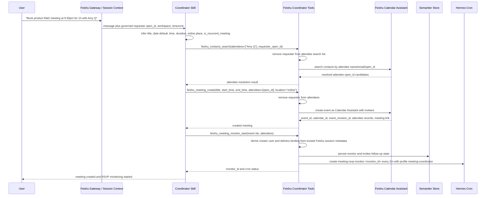
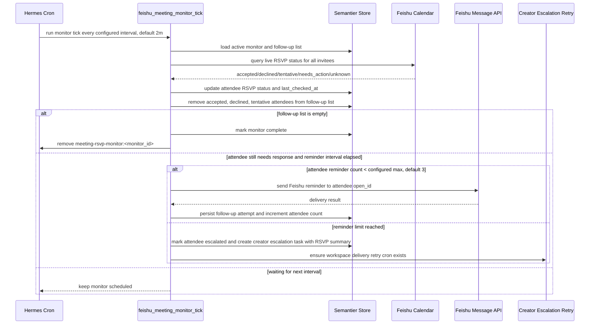

# Feishu Meeting Coordinator Plugin Design

**Status:** Implementation-aligned snapshot  
**Date:** 2026-06-18  
**Owner:** Semantier / Hermes runtime  
**Related work:** bundled `feishu-bot-meeting-coordinator` skill installed through this plugin package  
**Authoring contract:** [Semantier marketplace plugin creation guideline](./semantier-marketplace-plugin-creation-guideline.md)

## Goal

Document the current Feishu meeting coordinator plugin-backed workflow as implemented in `semantier-skills/plugins/feishu_meeting_coordinator/` and the Semantier runtime glue under `src/agents/`.

The plugin creates Hermes cron jobs with the `meeting-coordinator` profile. The RSVP monitor job repeatedly checks Feishu attendee RSVP status until all tracked invitees have responded or all tracked invitees have exhausted the follow-up budget. If an attendee has not responded within 2 minutes, the job sends a follow-up message to the attendee through Feishu `open_id` direct delivery, then continues checking until the attendee responds or reaches the follow-up limit. When all invitees have responded, or all pending invitees have exhausted the follow-up budget, the monitor job removes itself.

Follow-up policy for v0.1 is capped at 3 follow-up rounds per attendee. If all tracked attendees still have not responded after 3 rounds, the plugin escalates once to the event creator through the captured creator delivery binding with a cancel-or-contact suggestion, then stops the monitor. For individual attendees that hit the follow-up limit while other attendees remain in flight, the plugin creates a creator escalation task for that attendee and stops reminding that attendee for the same monitor revision.

When the unresolved set is fully escalated, the RSVP monitor completes and removes its cron job; any creator delivery still in flight continues through the separate delivery task path.

## Non-Goals

- Do not infer attendee identity, attendee authority, or channel addresses from LLM memory.
- Do not replace Feishu Calendar as the source of RSVP truth.
- Do not update meeting time automatically from attendee replies unless a separate confirmed slot-selection flow explicitly authorizes it.
- Do not make cron state depend on unmanaged files when runtime continuity requires durable state.
- Do not put long prompt policy prose inline in runtime code.
- Do not resolve requester identity from untrusted tool arguments when a governed Feishu session is available.

## Why Plugin, Not Skill-Only

The existing skill is good for procedural guidance and CLI examples, but this workflow needs durable orchestration:

- record which created event has an active RSVP watcher
- create, update, and dismiss cron jobs deterministically
- bind Feishu event IDs to workspace/user authority context
- resolve attendee delivery targets safely
- enforce follow-up cadence and stop conditions
- expose operator/debug tooling and Web UI controls

This belongs in one installable Hermes plugin package that bundles a companion skill and thin Semantier integration glue. The plugin package owns tool registration, tool handlers, bundled skill instructions, and Feishu API adapters. The Semantier-side glue owns governed authority checks, durable monitor state, cron bootstrap/repair, captured delivery bindings, and gateway/Web UI routes. The bundled skill owns user-facing behavior: when a meeting is booked, invoke the plugin to register RSVP monitoring.

## Moving Pieces

1. Feishu meeting creation/update tool
2. RSVP status query tool
3. Attendee delivery-target resolver
4. Follow-up message sender
5. Meeting coordination state store
6. Hermes cron job creator/updater/remover in gateway/bootstrap layer
7. Dedicated Hermes profile: `meeting-coordinator`
8. Cron job prompt/runner
9. Stop-condition evaluator
10. Operator/debug CLI and Web UI

## Deployment Model

Canonical v0.1 deployment should be one repo-shipped installable artifact under `semantier-skills/plugins/feishu_meeting_coordinator/`, installed into the active Hermes home through the existing plugin install and content-hash update path. The package should include both the plugin runtime and its user-facing `SKILL.md`, so operators install, diff, and update the Feishu meeting coordinator as one unit with one content hash.

Do not keep a separately installed `semantier-skills/skills/productivity/feishu-bot-meeting-coordinator/` copy after this package is promoted. Existing installs may be migrated by replacing the skill-only install with the bundled plugin package. Do not place the canonical source directly under `hermes-agent/plugins/`; that tree belongs to the upstream Hermes checkout. Future distribution can package the same plugin as a Python package with a Hermes plugin entry point, but v0.1 should pin the checked-in repo artifact as the source of truth.

This package follows the Semantier marketplace plugin contract, not the Codex `.codex-plugin/plugin.json` contract. Discovery and install are driven by `semantier-skills/marketplace/index.json`, where the package appears as a `type: "plugin"` entry inside the top-level `skills` array.

## Package Shape

```text
semantier-skills/plugins/feishu_meeting_coordinator/
  plugin.yaml
  __init__.py        # registers skill, tools, and CLI command
  tools.py           # tool handlers and gateway/runtime adapters
  feishu_calendar.py # Feishu calendar API adapter local to this plugin
  messages.py        # prompt-template renderer; see prompt asset boundary below
  cli.py             # operator/debug CLI
  dashboard/
    plugin_api.py    # executable Python adapter placeholder, not static assets
  SKILL.md            # bundled companion skill, installed with the plugin

src/agents/meeting_coordinator_gateway.py
src/agents/meeting_coordinator_store.py
src/prompts/meeting_coordinator/
  RSVP_MONITOR_JOB.md
  DELIVERY_RETRY_JOB.md
  FOLLOWUP_MESSAGE.md
  CREATOR_ESCALATION.md
  CREATOR_CANCEL_SUGGESTION.md
```

The bundled `SKILL.md` is discoverable through the normal Hermes skill loader after plugin installation via `skills.external_dirs`. The stateful functionality is split between plugin tools and Semantier runtime glue under `src/agents/`; there is no plugin-local `store.py` or `cron.py` in the current implementation.

Prompt asset note: `src/prompts/meeting_coordinator/` is a legacy semantic alias. New Semantier marketplace plugins should use `src/prompts/<plugin_name>/` with the prompt directory matching the plugin folder exactly. A future migration may move these assets to `src/prompts/feishu_meeting_coordinator/`; that migration should include regression coverage for message rendering and cron prompt loading.

## Plugin Manifest

```yaml
name: feishu_meeting_coordinator
version: 0.1.0
description: Feishu meeting RSVP monitoring and follow-up orchestration.
author: Semantier
kind: standalone
platforms:
  - linux
  - macos
  - windows
```

The plugin should register:

- `feishu_contacts_search`
- `feishu_chats_search`
- `feishu_chat_members_get`
- `feishu_meeting_create`
- `feishu_meeting_negotiation_start`
- `feishu_meeting_negotiation_next_round_prompts`
- `feishu_meeting_negotiation_submit_response`
- `feishu_meeting_negotiation_finalize`
- `feishu_meeting_attendee_status_list`
- `feishu_final_invitations_send`
- `feishu_attendee_message_send`
- `feishu_meeting_new_time_propose`
- `feishu_meeting_time_update`
- `feishu_meeting_monitor_start`
- `feishu_meeting_monitor_tick`
- `feishu_meeting_monitor_stop`
- `feishu_meeting_escalation_retry_tick`
- `feishu_meeting_delivery_task_requeue`
- CLI command `feishu-meeting-coordinator`
- workspace-authenticated Web API routes for monitor and delivery-task state

Current implementation note: `dashboard/plugin_api.py` is a placeholder executable Python adapter. The live HTTP surface is implemented in `src/agents/webapi_gateway.py`. The placeholder should either be removed before broad distribution or converted into a thin adapter that delegates to the gateway/runtime API; it should not accumulate independent business logic.

Registration contract:

- `register(ctx)` must register the bundled skill with `Path(__file__).with_name("SKILL.md")`.
- Every `ctx.register_tool(...)` call must pass explicit `toolset="meeting-coordinator"`.
- The tool `schema=` argument uses the Semantier generator-standard function-body shape `{"parameters": ...}`. The current implementation stores parameter schemas in inline `TOOL_SCHEMAS` inside `__init__.py` and wraps them with `_function_schema(name)`.
- Top-level tool `name` and `description` are passed to `ctx.register_tool(...)`; they are not duplicated inside `schema=`.
- New generated plugins should prefer `schemas.py`, but this reference implementation keeps schemas inline as an existing implementation detail.

Marketplace index contract:

```json
{
  "source": "static-index",
  "skills": [
    {
      "id": "chris-han/semantier-skills/plugins/feishu_meeting_coordinator",
      "name": "feishu_meeting_coordinator",
      "type": "plugin",
      "path": "plugins/feishu_meeting_coordinator",
      "description": "Feishu meeting RSVP monitoring and follow-up orchestration",
      "author": "Semantier",
      "category": "Productivity",
      "tags": ["feishu", "calendar", "meetings", "contacts"],
      "source": "custom-marketplace",
      "trust_level": "community",
      "homepage": "https://github.com/chris-han/semantier-skills/tree/main/plugins/feishu_meeting_coordinator",
      "repo": "https://github.com/chris-han/semantier-skills"
    }
  ]
}
```

The marketplace entry lives under the top-level `skills` array even though this package is a plugin. Do not create a separate `plugins` array for this marketplace format.

## Negotiation Tool Scope

The package also registers the `feishu_meeting_negotiation_*` tools listed above. They are available through the same plugin/toolset surface, but the durable RSVP monitor design in this document does not define a persisted negotiation workflow, negotiation state table, or cron lifecycle for them. Treat negotiation as a separate synchronous helper workflow unless a follow-up design adds governed state, replay rules, and tests for negotiation rounds.

This design document remains authoritative for RSVP monitoring, follow-up reminders, creator escalation, delivery retry, and the package/marketplace contract.

## Runtime Flow

### Coordinator Booking Flow Review

The proposed flow is directionally correct for v0.1, with these corrections:

- The requester `open_id` must be resolved from governed Feishu ingress/session context, not from LLM extraction or attendee inference.
- The attendee list is an invitee list and must exclude the requester. If the user says "with Amy Q", the agent should build `attendees=["Amy Q"]`, call `feishu_contacts_search` with that list, and pass the resolved attendee `open_id` values into meeting creation.
- "Default today" is allowed only when the user's wording is unambiguous in the requester/workspace timezone. Persisted and cross-boundary timestamps remain timezone-aware UTC ISO-8601.
- Meeting place defaults to online unless the user names a physical location.
- Recurrent meetings are not part of the v0.1 RSVP monitor contract unless explicit recurrence identifiers, per-occurrence revision IDs, and stop conditions are added. Treat `is_recurrent_meeting=true` as a v0.2 design option, not a silent best-effort mode.
- The requester is represented as an accepted attendee in the Feishu event, but the requester is not inserted into tracked monitor attendees. The booking flow passes invitees only into the helper; the helper adds the requester as accepted when creating the Feishu event.
- The follow-up list tracks invitees whose normalized RSVP state is not terminal. Use `needs_action` and `unknown` as not-responded states; do not depend on raw `null` from Feishu.

Review options:

1. **Recommended v0.1: Single-event online meeting flow.** Support requester resolution, attendee list lookup, event creation, invite delivery through Feishu Calendar, requester-as-accepted monitor state, RSVP polling, three configurable reminders, and creator escalation. Reject or clarify recurrent meeting requests.
2. **v0.1 plus recurrence clarification.** Accept recurrent meeting requests only by asking the requester to confirm recurrence details, then create a normal single event unless recurrence API support is implemented. This avoids pretending a recurring series is monitored correctly.
3. **v0.2 recurrence support.** Add recurrence rule input, Feishu series/occurrence IDs, per-occurrence RSVP monitor revisions, and occurrence-scoped follow-up lists before enabling `is_recurrent_meeting=true`.

### Meeting Created



Calendar event creation is the invite mechanism for v0.1, but the implementation uses the dedicated Feishu attendee-create API after the event is created because Feishu ignores invitees in the initial create-event body. The plugin may send additional direct Feishu reminders only from the RSVP monitor after the configured follow-up interval.

### Cron Tick



RSVP tracking and creator escalation delivery are separate lifecycles. The RSVP monitor may become `complete` and remove its cron job while escalation delivery tasks remain `pending` or `failed_retryable`. Escalation retries should run through a separate delivery retry path, not keep the RSVP monitor active after RSVP truth is terminal.

### Delivery Retry Tick

Creator escalation delivery tasks are driven by a separate recurring delivery retry job, not by the RSVP monitor job after RSVP tracking is terminal. Inline delivery is primary; the retry cron is a best-effort fallback for failures and queued retryable tasks.

Runtime contract:

- The gateway/bootstrap layer creates one workspace-scoped delivery retry cron job for the plugin when the first delivery task is created.
- Job name: `meeting-rsvp-delivery-retry:<workspace_id>`.
- Schedule: `every 2m`.
- Profile: `meeting-coordinator`.
- The retry job calls `feishu_meeting_escalation_retry_tick` with `workspace_id`.
- The retry job may be kept while any `meeting_rsvp_delivery_tasks` row is `pending` or `failed_retryable`.
- If no non-terminal delivery tasks remain, the retry job may remove itself or remain disabled according to operator configuration.
- If non-terminal delivery tasks exist and the workspace retry job is missing, disabled unexpectedly, or failed to create, the gateway/bootstrap layer must attempt to heal it by creating or re-enabling `meeting-rsvp-delivery-retry:<workspace_id>`.
- If delivery retry job healing fails, persist a workspace-visible delivery scheduler error and keep the affected delivery tasks non-terminal so operators can retry from the Web UI.

The delivery retry job must only process persisted delivery tasks. It must not query Feishu RSVP state or mutate RSVP monitor status. This boundary is enforced by separate cron job prompts, separate tool entrypoints, and store-level state transitions, not by a second Hermes profile.

### Meeting Updated

When the creator updates schedule-critical fields (`start_time`, `end_time`, `timezone`, attendee list), the current implementation supports the following pattern:

1. patch the Feishu event
2. call `feishu_meeting_monitor_start` again with a new `event_revision_id`
3. let `start_monitor` mark the prior active revision as `replaced`
4. create a cron job for the new revision and reset tracked invitee state for that revision

The event itself may keep the same Feishu `event_id`; the plugin should track an internal `event_revision_id`.

`feishu_meeting_monitor_start` must be idempotent on `(workspace_id, event_id, event_revision_id)`. Repeated calls for the same tuple should return the existing active monitor and cron job when the stored payload is equivalent. Calls with a new `event_revision_id` should mark the previous active revision as `replaced`, remove its cron job, and create a new monitor.

Current `event_revision_id` origin: Feishu does not provide a separate revision id in the current implementation. The plugin treats `event_revision_id` as a plugin revision key supplied by the meeting-create/update path; when no explicit revision is available, the tool falls back to the Feishu `event_id`. A future update flow that supports multiple revisions for the same `event_id` must generate a new deterministic or UUID-like revision key after the event patch succeeds and pass it to `feishu_meeting_monitor_start`.

## RSVP Semantics

The source of truth is Feishu Calendar attendee status from `calendar_event_attendee.list`.

Normalize response status into ASCII machine values:

- `accepted`
- `declined`
- `tentative`
- `needs_action`
- `unknown`

For the stop condition, "responded" means:

- `accepted`
- `declined`
- `tentative`

`needs_action` and `unknown` are treated as not responded.

Decision: `declined` does not trigger automatic new-time coordination. It is treated as a response for RSVP monitor completion. The current implementation does not create a creator escalation delivery task solely because an attendee declined.

## Attendee Home Channel Resolution

The returned `user_id` / `message_user_id` from RSVP lookup is a Feishu `open_id`. The plugin may use that for Feishu direct-message delivery when the attendee is reachable by Feishu bot.

Codebase finding: beyond Feishu `open_id`, the current repo has authoritative delivery targets for:

- Hermes platform home-channel config, resolved by `config.get_home_channel(platform)` and environment-backed `*_HOME_CHANNEL` values.
- Cron origin and `delivery_binding` metadata, which preserve the originating platform/chat/session for creator-facing delivery.
- A user-scoped Weixin runtime-account path in `weixin_runtime_accounts`, where `home_channel` is stored per governed workspace/account.
- Feishu workspace bot configuration with `home_channel`, but no general per-attendee Feishu-to-cross-platform contact directory.

There is not currently a governed directory that maps arbitrary Feishu attendee `open_id` values to non-Feishu home channels. Therefore v0.1 must not claim it can send to an attendee's "home channel" beyond the Feishu `open_id` returned by RSVP lookup.

Home-channel resolution should be an explicit adapter:

```text
attendee open_id -> governed contact/channel record, if one exists -> preferred home channel -> send target
```

Current implementation:

1. Use Feishu `message_user_id` from RSVP lookup when present, else fall back to `attendee_user_id`.
2. If attendee send fails, record a failed follow-up attempt in `meeting_rsvp_followups`.
3. Do not infer phone/email/chat IDs from display names or prompt memory.
4. Creator escalation is tied to follow-up exhaustion, not to attendee channel-resolution fallback logic.

Arbitrary attendee home-channel routing across platforms requires a governed contact directory that does not exist in v0.1. That capability is a v0.2 dependency. Until then, the plugin must not route attendee follow-ups beyond the Feishu `open_id` supplied by Feishu Calendar.

This keeps Law 1 intact: identity and authority must come from governed sources or platform-provided IDs, not LLM inference.

## Creator Delivery Binding

Creator escalation must be deterministic at cron time. The monitor start path must capture a creator delivery binding from the authenticated request or originating gateway context and persist it with the monitor. A later cron tick must not re-resolve creator delivery from ambient LLM context.

Required binding fields:

```json
{
  "workspace_owner_id": "string",
  "creator_user_id": "string",
  "platform": "feishu|weixin|api_server|...",
  "chat_id": "string",
  "thread_id": "string|null",
  "session_id": "string|null",
  "session_key": "string|null",
  "hermes_home": "string|null",
  "delivery_adapter_key": "string|null",
  "source": "cron_origin|delivery_binding|configured_home_channel",
  "captured_at": "UTC ISO-8601"
}
```

Current implementation:

1. Resolve the creator from trusted Feishu session metadata at monitor-start time.
2. Capture `creator_delivery_binding` from that same session metadata when the caller does not provide one explicitly.
3. Persist that binding on the monitor and on created delivery tasks.
4. Use the persisted binding during inline delivery and retry delivery.
5. If the persisted binding lacks `hermes_home` or `chat_id`, delivery raises a runtime error and the delivery task moves to `failed_retryable`.

Authority rule: public tool callers must not supply `creator_user_id` or `creator_delivery_binding` as authority. The current public `feishu_meeting_monitor_start` tool schema does not expose `creator_user_id`, and normal Feishu chat calls should derive the creator and delivery binding from trusted session metadata. Caller-provided `creator_delivery_binding` is a trusted gateway/runtime compatibility path only. Internal compatibility payloads may still carry creator fields, but they must be treated as derived metadata, not proof of identity. A hardening follow-up should override any caller-supplied `creator_user_id` and untrusted binding fields with the governed requester/session values before persistence.

## Durable State

Use SQLite for active monitor continuity and follow-up history. The current implementation persists state in `state.db` under `SEMANTIER_LOCAL_STATE_DIR` or `.semantier-home/`, through `src/agents/meeting_coordinator_store.py`. It does not use ad hoc JSON files for active monitor state.

Suggested table names are ASCII-stable:

### `meeting_rsvp_monitors`

| Column | Type | Notes |
| --- | --- | --- |
| `monitor_id` | text primary key | deterministic UUID or ULID |
| `workspace_id` | text | authenticated workspace |
| `creator_user_id` | text | governed creator identity |
| `platform` | text | `feishu` |
| `event_id` | text | Feishu event id |
| `event_revision_id` | text | plugin revision id |
| `calendar_id` | text | Feishu calendar id |
| `cron_job_id` | text nullable | Hermes cron job id |
| `creator_delivery_binding_json` | text | persisted authoritative creator escalation target |
| `status` | text | current implementation writes `pending_start`, `active`, `complete`, `replaced`, `cancelled`, `failed`; legacy queries also tolerate `error` |
| `last_start_error` | text nullable | cron creation/recovery error; compatibility location for manual cancellation reason until a dedicated `cancelled_reason` column exists |
| `created_at` | text | UTC ISO-8601 |
| `updated_at` | text | UTC ISO-8601 |
| `completed_at` | text nullable | UTC ISO-8601 |
| `last_checked_at` | text nullable | UTC ISO-8601 |

### `meeting_rsvp_attendees`

| Column | Type | Notes |
| --- | --- | --- |
| `monitor_id` | text | parent monitor |
| `attendee_user_id` | text | Feishu open_id when available |
| `message_user_id` | text nullable | send target from RSVP lookup |
| `display_name` | text nullable | presentation only |
| `response_status` | text | normalized RSVP status |
| `last_response_at` | text nullable | UTC ISO-8601 if known |
| `last_followup_at` | text nullable | UTC ISO-8601 |
| `followup_count` | integer | number of sent reminders |
| `delivery_status` | text | currently `ready`, `escalated` |
| `escalated_at` | text nullable | UTC ISO-8601 |

### `meeting_rsvp_followups`

| Column | Type | Notes |
| --- | --- | --- |
| `followup_id` | text primary key | attempt id |
| `monitor_id` | text | parent monitor |
| `attendee_user_id` | text | attendee |
| `round_number` | integer | one-based follow-up round |
| `status` | text | `sent`, `failed` |
| `message_channel` | text | e.g. `feishu` |
| `message_id` | text nullable | provider message id |
| `error_detail` | text nullable | sanitized error |
| `created_at` | text | UTC ISO-8601 |
| `sent_at` | text nullable | UTC ISO-8601 when sent |

### `meeting_rsvp_delivery_tasks`

| Column | Type | Notes |
| --- | --- | --- |
| `delivery_task_id` | text primary key | task id |
| `monitor_id` | text | parent monitor |
| `task_type` | text | `creator_escalation` |
| `target_user_id` | text | creator user id |
| `delivery_binding_json` | text | authoritative delivery target |
| `payload_json` | text | structured message inputs |
| `status` | text | `pending`, `sent`, `failed_retryable`, `failed_permanent` |
| `attempt_count` | integer | delivery attempts |
| `next_attempt_at` | text nullable | UTC ISO-8601 |
| `created_at` | text | UTC ISO-8601 |
| `updated_at` | text | UTC ISO-8601 |
| `result_detail` | text nullable | latest send or failure detail |

### `meeting_rsvp_escalations`

| Column | Type | Notes |
| --- | --- | --- |
| `escalation_id` | text primary key | attempt id |
| `monitor_id` | text | parent monitor |
| `attendee_user_id` | text | unresolved or non-responsive attendee |
| `creator_user_id` | text | event creator |
| `reason` | text | currently `followup_limit_reached`, `all_attendees_followup_limit_reached` |
| `delivery_task_id` | text nullable | links creator escalation to retry task |
| `status` | text | `pending`, `sent`, `failed` |
| `created_at` | text | UTC ISO-8601 |
| `updated_at` | text | UTC ISO-8601 |

Live monitor rows may be deleted after terminal cleanup only if immutable communication facts have already been retained according to the configured retention policy. At minimum, sent follow-up and escalation facts should survive live cron deletion long enough to be visible in the operator UI. Cancelled events do not produce a completed RSVP audit package, but cancellation handling should still avoid in-place mutation of already-recorded send facts.

All persisted timestamps must be timezone-aware UTC ISO-8601.

### `meeting_rsvp_workspace_state`

| Column | Type | Notes |
| --- | --- | --- |
| `workspace_id` | text primary key | authenticated workspace |
| `delivery_retry_scheduler_status` | text | scheduler health such as `ok`, `unavailable`, or recovery-specific status |
| `delivery_retry_scheduler_detail` | text nullable | latest scheduler repair detail or error |
| `updated_at` | text | UTC ISO-8601 |

Monitor state-machine hardening: manual stop now persists a monitor-level `cancelled` status, and trusted gateway/runtime setup failures may promote unrecoverable scheduler failures to terminal `failed`. Until a dedicated `cancelled_reason` column exists, operator stop reason is stored in `last_start_error` as compatibility technical debt; queries should not treat that as a scheduler creation error.

## Cron Job Shape

The implementation creates Hermes cron jobs through Semantier gateway/runtime glue, using a local cron client wrapper that binds the workspace Hermes home and calls Hermes cron APIs directly:

```json
{
  "name": "meeting-rsvp-monitor:<monitor_id>",
  "schedule": "every 2m",
  "repeat": 0,
  "profile": "meeting-coordinator",
  "deliver": "local",
  "skills": ["feishu_meeting_coordinator"],
  "prompt": "<contents of RSVP_MONITOR_JOB.md formatted with explicit runtime variables>"
}
```

The cron wrapper resolves the bundled skill name to `feishu_meeting_coordinator:feishu-bot-meeting-coordinator` when the plugin-local `SKILL.md` is installed under the workspace plugin directory.

The prompt body should be loaded from `src/prompts/meeting_coordinator/RSVP_MONITOR_JOB.md` and formatted with explicit variables:

- `monitor_id`
- `workspace_id`
- `event_id`
- `calendar_id`

Runtime code should not become the source of truth for the job prompt prose.

`src/prompts/meeting_coordinator/` is intentionally documented here as the current implementation path only. It predates the marketplace guideline's new-plugin rule that prompt directories match plugin folder names. Do not use this alias as precedent for newly generated plugins.

## Meeting Coordinator Profile

Profile name: `meeting-coordinator`

Purpose:

- keep recurring meeting jobs narrow
- enable only the needed Feishu calendar/message tools
- reduce accidental access to broad terminal/browser capabilities
- pin model/provider settings for deterministic recurring behavior

Both recurring jobs use this one profile:

- RSVP monitor jobs named `meeting-rsvp-monitor:<monitor_id>`
- delivery retry jobs named `meeting-rsvp-delivery-retry:<workspace_id>`

The implementation must not create a separate delivery profile such as `meeting-coordinator-delivery`. RSVP tracking and delivery retry remain separate lifecycles through their job names, prompts, tool entrypoints, and persisted state contracts.

Recommended profile constraints:

- enabled toolsets: Feishu meeting coordinator plugin tools and message delivery only if needed
- no cron management in the recurring worker profile; cron creation, deletion, and repair stay in the gateway/bootstrap layer
- no general shell unless required for plugin CLI fallback
- no browser
- no code execution
- low-temperature model settings if supported by profile config

## Follow-Up Message Behavior

The follow-up message is prompt-template-rendered from repo-owned assets, not free-form LLM-composed at cron time.

Inputs:

- attendee display name
- meeting title
- meeting start/end time
- organizer display name
- current RSVP status
- RSVP action request
- optional decline/reschedule note

Default message intent:

```text
Please respond to the meeting invitation so the organizer can confirm attendance.
```

Localized variants come from repo-owned prompt assets such as `FOLLOWUP_MESSAGE.zh.md`; cron execution does not ask an LLM to rewrite the message.

Deployment caveat: `messages.py` discovers prompt assets by walking parent directories until it finds `src/prompts/meeting_coordinator/`. That is valid in the repo development layout where `src/prompts/` is reachable from the plugin source tree. Marketplace or copied installs may instead set `SEMANTIER_MEETING_COORDINATOR_PROMPT_ROOT` to a directory containing the same prompt assets.

Follow-up cadence:

- first follow-up: no earlier than 2 minutes after event creation/update
- repeat follow-ups: no earlier than 2 minutes after the previous follow-up
- maximum 3 follow-up rounds per attendee per event revision
- after 3 unanswered rounds for all remaining tracked attendees, send a creator cancel/contact suggestion through the captured creator delivery binding
- after escalation, do not send further follow-ups to that attendee for the same event revision

Declined RSVP behavior:

- treat `declined` as a response for the all-responded stop condition
- do not automatically create a new-time coordination flow

## Tool Contracts

### `feishu_contacts_search`

Resolves attendee names, emails, or existing Feishu IDs to contact candidates. The caller should pass invitees only; the tool must also defensively remove the requester from `attendees` and `participants`.

Input:

```json
{
  "query": "string",
  "queries": ["string"],
  "attendees": [
    {
      "name": "string",
      "email": "string",
      "open_id": "string"
    }
  ],
  "participants": ["string"],
  "requester_open_id": "string",
  "limit": 10
}
```

Rules:

- accept either `query`, `queries`, `attendees`, or `participants`
- search each unresolved attendee independently
- exclude `requester_open_id` from search terms
- ignore caller-supplied `requester_open_id` when a trusted Feishu session requester is available
- return candidates without treating display-name matches as authority
- require the agent to ask for clarification when multiple candidates remain plausible

Future hardening: `requester_open_id` remains in this public input shape for compatibility, but trusted Feishu session metadata is the authority source whenever available. Once all supported call paths provide governed session identity, `requester_open_id` should be removed from the public schema or treated as trusted-runtime-only metadata.

### Feishu live helper tools

The following tools are registered by the plugin but do not own durable RSVP monitor state:

- `feishu_chats_search`
- `feishu_chat_members_get`
- `feishu_meeting_attendee_status_list`
- `feishu_final_invitations_send`
- `feishu_attendee_message_send`
- `feishu_meeting_new_time_propose`
- `feishu_meeting_time_update`

Contract:

- These tools call `scripts/feishu_bot_api.py` directly through the plugin's tool handlers and return the helper result shape.
- They must use governed bot/session configuration and must not infer requester identity, attendee identity, chat ids, or delivery targets from prompt memory.
- `feishu_meeting_attendee_status_list` is the live RSVP truth source and should be called before answering RSVP-status questions.
- `feishu_attendee_message_send` and `feishu_final_invitations_send` require explicit Feishu `open_id` recipients; display names are not delivery authority.
- `feishu_meeting_time_update` requires explicit Feishu event/calendar identifiers and must not be called as an automatic reaction to a declined RSVP.
- Any durable orchestration, replay, audit, or retry semantics for these helper tools must be added in Semantier runtime code and tests before they are treated as authoritative workflows.

### `feishu_meeting_create`

Creates the Feishu Calendar event through the governed bot/calendar assistant context and returns event identifiers needed to start RSVP monitoring.

Input:

```json
{
  "title": "string",
  "start_time": "timezone-aware ISO-8601 or unambiguous local datetime",
  "end_time": "timezone-aware ISO-8601 or unambiguous local datetime",
  "timezone": "Asia/Shanghai",
  "attendees": ["Feishu open_id"],
  "location": "online",
  "description": "string",
  "requester_open_id": "string",
  "requester_calendar_id": "string"
}
```

Rules:

- derive `requester_open_id` from active Feishu session context when available
- fail closed if the requester cannot be resolved from trusted Feishu session context
- do not infer the requester from attendee names or prompt memory
- remove the requester from `attendees` before calling the helper
- add invitees through the dedicated attendee API after event creation so Feishu sends calendar invitations
- the helper adds the requester as accepted in the Feishu event, and the monitor excludes the requester from follow-up state

### `feishu_meeting_monitor_start`

Creates or returns an RSVP monitor for a meeting revision. Idempotency key: `(workspace_id, event_id, event_revision_id)`.

Input:

```json
{
  "event_id": "string",
  "event_revision_id": "string",
  "calendar_id": "string",
  "workspace_id": "string",
  "creator_delivery_binding": {
    "workspace_owner_id": "string",
    "creator_user_id": "string",
    "platform": "string",
    "chat_id": "string",
    "thread_id": "string|null",
    "session_id": "string|null",
    "session_key": "string|null",
    "hermes_home": "string|null",
    "delivery_adapter_key": "string|null",
    "source": "string",
    "captured_at": "UTC ISO-8601"
  },
  "meeting_title": "string",
  "start_time": "UTC ISO-8601",
  "end_time": "UTC ISO-8601",
  "timezone": "string",
  "attendees": [
    {
      "user_id": "string",
      "message_user_id": "string",
      "display_name": "string"
    }
  ]
}
```

`creator_delivery_binding` is shown for trusted gateway/runtime compatibility callers only. Normal Feishu chat calls should omit it so the tool derives the binding from trusted session metadata.

Output:

```json
{
  "ok": true,
  "monitor": {
    "monitor_id": "string",
    "cron_job_id": "string",
    "status": "active|pending_start"
  }
}
```

Failure output:

```json
{
  "ok": false,
  "error": "requester_open_id must be resolved from a trusted Feishu session"
}
```

The `attendees` field is the invitee set only. The requester is captured from governed session context, added as accepted attendee state during meeting creation, and excluded from RSVP follow-up state.

Authority rules:

- `creator_user_id` is not exposed in the public tool schema and must not be accepted as caller authority.
- `creator_delivery_binding` may be present for trusted gateway/runtime callers, but normal Feishu chat calls should omit it and let the tool derive it from session metadata.
- The monitor-start path resolves the creator from the same trusted Feishu session context used by meeting creation.
- If a trusted Feishu session requester is unavailable, monitor start fails closed.
- `workspace_id` may be supplied by trusted gateway/runtime code, but when session metadata provides workspace identity it remains the authority source.

### `feishu_meeting_monitor_tick`

Runs one monitor cycle. This is what the cron job calls.

Input:

```json
{
  "monitor_id": "string"
}
```

Output:

```json
{
  "ok": true,
  "result": {
    "monitor_id": "string",
    "status": "active|complete",
    "all_responded": false,
    "pending_attendees": ["string"],
    "followups_sent": 1,
    "escalations_sent": 0
  }
}
```

Failure output:

```json
{
  "ok": false,
  "error": "status query or monitor tick failure detail"
}
```

### `feishu_meeting_monitor_stop`

Stops monitoring and removes the cron job.

Input:

```json
{
  "monitor_id": "string"
}
```

Output:

```json
{
  "ok": true,
  "result": {
    "monitor_id": "string",
    "stopped": true,
    "status": "cancelled"
  }
}
```

Current behavior: this removes or disables the cron job, persists `status='cancelled'`, and returns `stopped=true`. Until a dedicated `cancelled_reason` column is added, the operator stop reason is stored in `last_start_error` for compatibility with the existing schema; this is technical debt, not a new semantic meaning for scheduler errors.

### `feishu_meeting_escalation_retry_tick`

Runs one delivery retry cycle for creator escalation tasks. This is what the delivery retry cron job calls.

Input:

```json
{
  "workspace_id": "string",
  "limit": 20
}
```

Output:

```json
{
  "ok": true,
  "result": {
    "workspace_id": "string",
    "processed": 3,
    "sent": 2,
    "failed_retryable": 1,
    "failed_permanent": 0,
    "remaining_non_terminal": 4
  }
}
```

Rules:

- select `pending` and due `failed_retryable` tasks by `next_attempt_at`
- use the persisted `delivery_binding_json`; do not re-resolve from ambient context
- increment `attempt_count` on each send attempt
- mark `sent` on success
- mark delivery exceptions and other retryable send failures as `failed_retryable` with a future `next_attempt_at`
- inline creator delivery is the primary path; the retry job is fallback for failed or due queued tasks

Current implementation note: `failed_permanent` exists in the store schema and requeue rules, and `MeetingCoordinatorStore` has helper methods that can set it when called with `retryable=False`. The retry tick currently treats delivery-client exceptions as retryable only, so `failed_permanent` is reachable only through future classification logic or operator/internal repair paths, not through the current retry tick loop.

### `feishu_meeting_delivery_task_requeue`

Operator repair action for a failed creator escalation task.

Input:

```json
{
  "delivery_task_id": "string",
  "reason": "manual_requeue"
}
```

Output:

```json
{
  "ok": true,
  "delivery_task": {
    "delivery_task_id": "string",
    "status": "pending",
    "attempt_count": 3,
    "next_attempt_at": "UTC ISO-8601"
  }
}
```

Rules:

- only `failed_retryable` and `failed_permanent` tasks may be requeued
- preserve `attempt_count` for operator explainability
- set `status` to `pending`
- set `next_attempt_at` to the current UTC time so the task is immediately eligible
- persist the operator-provided `reason` in task history or result detail
- ensure the workspace delivery retry cron exists after requeue; heal it if missing

`failed_permanent` requeue is intentionally allowed for operator repair. It is not currently produced by the retry tick itself.

## Skill Behavior Changes

When the user asks to book a meeting:

1. create the Feishu event
2. call `feishu_meeting_monitor_start`
3. report the meeting link and RSVP monitor status to the creator

When the user asks to update the meeting schedule:

1. patch the Feishu event
2. if the caller wants a fresh monitor revision, call `feishu_meeting_monitor_start` again with a new `event_revision_id`
3. rely on `start_monitor` replacement semantics to mark the prior revision `replaced`
4. report whether RSVP monitoring restarted

When the user asks for RSVP status:

1. call live RSVP query
2. optionally include monitor state such as last follow-up time and pending attendees

## Error Handling

- If Feishu attendee status query fails, the tick call fails visibly to the caller. The current implementation does not persist a separate monitor `error` state on tick failure.
- If an attendee delivery target cannot be used, do not guess; the current implementation records a failed follow-up attempt.
- If sending follow-up fails, persist the failure and retry on the next cron tick unless the error is permanent.
- Feishu event deletion/cancellation-specific handling is not implemented in the current code.
- Cancelled events do not keep completed RSVP audit packages. Active monitor state may be removed with the cron job after cancellation handling succeeds, but already-recorded follow-up/escalation send facts should not be rewritten or inferred away.
- If cron job creation fails after meeting creation, persist the monitor as `pending_start` with `last_start_error`, return the meeting result plus explicit `monitor_status=pending_start`, and surface a retry action in the UI. Trusted gateway/runtime callers may pass the internal `scheduler_failure_terminal` flag to promote unrecoverable setup failures to `failed`; this flag is not part of the public tool schema.
- If idempotent start finds an equivalent monitor row with no cron job or a missing cron job, it should attempt to heal by creating a replacement cron job and attaching its id. If healing fails, keep the monitor `pending_start` and fail visibly with the stored error.
- If non-terminal delivery tasks exist but the delivery retry cron is missing or disabled unexpectedly, gateway/Web UI reads and delivery-task writes should attempt scheduler healing before reporting the state.
- If delivery retry scheduler healing fails, keep tasks `pending` or `failed_retryable` and surface `delivery_retry_scheduler_unavailable`.

## Security and Governance

- Attendee identity and channel resolution must use governed or platform authority sources.
- The plugin must not use LLM inference for user IDs, organization membership, or channel IDs.
- All machine identifiers must be ASCII.
- All persisted timestamps must be timezone-aware UTC ISO-8601.
- Reminder language should use the persisted user locale from the backend settings store, propagated into session metadata; browser storage is cache only.
- Prompt prose belongs in prompt assets. The current implementation uses the legacy path `src/prompts/meeting_coordinator/`; new plugins should use `src/prompts/<plugin_name>/`.
- Meeting coordinator cron jobs should run with the narrow `meeting-coordinator` profile.
- The recurring worker profile must not have scheduler-management tools; scheduler mutation belongs to the gateway/bootstrap layer.
- Follow-up sends must be inspectable while the monitor is active by monitor id, attendee id, channel, and timestamp.

## Observability

Current plugin CLI:

```bash
hermes feishu-meeting-coordinator monitors
```

Current Web API surface:

- `GET /system/meeting-coordinator/monitors`
- `POST /system/meeting-coordinator/delivery-tasks/retry`
- `POST /system/meeting-coordinator/delivery-tasks/{delivery_task_id}/requeue`

`GET /system/meeting-coordinator/monitors` returns the Web API/frontend wrapper shape:

```json
{
  "monitors": [
    {
      "monitor_id": "string",
      "status": "active|pending_start|complete|cancelled|failed|replaced",
      "event_id": "string",
      "calendar_id": "string",
      "cron_job_id": "string|null",
      "meeting_title": "string|null",
      "last_checked_at": "UTC ISO-8601|null",
      "pending_delivery_tasks": 0
    }
  ],
  "deliveryTasks": [
    {
      "delivery_task_id": "string",
      "task_type": "creator_escalation",
      "status": "pending|sent|failed_retryable|failed_permanent",
      "attempt_count": 0,
      "next_attempt_at": "UTC ISO-8601|null"
    }
  ],
  "scheduler": {
    "delivery_retry_scheduler_status": "ok|unavailable",
    "delivery_retry_scheduler_detail": "string|null",
    "updated_at": "UTC ISO-8601|null"
  }
}
```

Route policy synchronization: these tenant-facing routes are registered as authenticated routes in `src/agents/route_policy.py` and mirrored in `docs/derived/gateway-unified-multitenant-design.md` section 8.1.1. Any route addition, removal, or method/path change for this operator surface must update `src/agents/webapi_gateway.py`, `src/agents/route_policy.py`, and the gateway method/path matrix in the same change.

Web UI:

Add a Meeting Coordinator operator panel to Hermes Workspace under the existing Operations screen:

- screen: `hermes-workspace/src/screens/agents/operations-screen.tsx`
- route: `/operations`

This is the correct operator surface because the existing Operations screen already models persistent agents, Hermes profiles, cron-backed work, recent outputs, and agent settings.

The backend currently supports enough data for a Meeting Coordinator panel to:

- list active RSVP monitors and completed monitors with non-terminal delivery tasks
- include a delivery-task section for pending, retryable, and permanently failed creator escalations
- show event id, title, creator, cron job id, and monitor status
- show attendees grouped by `responded`, `pending`, `declined`, `escalated`, and `delivery_failed`
- show follow-up count per attendee
- show last check/follow-up/escalation/retry timestamps
- allow creator/operator actions that are currently backed by APIs:
  - run delivery retry now
  - requeue failed delivery task

Web UI writes should call plugin/backend APIs, not mutate SQLite directly.

Screen ownership:

- `/operations`: domain-specific operator dashboard extension for live meeting RSVP monitors. This is an explicit Operations extension pattern for long-running, profile-backed subsystems, not a generic dumping ground.
- `/jobs`: low-level cron machinery only; useful for raw cron job pause/resume/run/delete, not the primary Meeting Coordinator UI.
- `/settings/...`: durable configuration and credentials, including Feishu bot credentials/home channel and any future meeting-coordinator policy settings such as max follow-up rounds or profile selection.
- `/skills`: install/update skill or plugin package, not runtime meeting operations.

Useful operator fields:

- event id
- calendar id
- cron job id
- pending attendees
- last check time
- last follow-up time
- follow-up count
- escalation status
- last error

## Test Plan

Reference implementation tests that must stay aligned with this design and the marketplace guideline:

- `tests/test_feishu_meeting_coordinator_package_inventory.py`
- `tests/test_feishu_meeting_coordinator_plugin.py`
- `tests/test_feishu_meeting_coordinator_tools.py`
- `tests/test_feishu_meeting_coordinator_messages.py`

Marketplace/discovery tests that protect package install semantics:

- `tests/test_marketplace_plugin_install.py`
- `tests/test_skills_search_marketplace.py`

Guideline contract invariants for this plugin:

- `semantier-skills/marketplace/index.json` uses top-level `skills`, not `plugins`.
- Every registered tool uses explicit `toolset="meeting-coordinator"`.
- Tool schemas are passed as `{"parameters": ...}` via `_function_schema(...)`, not as full OpenAI function schemas with top-level `name` and `description`.
- The bundled skill path is registered with `Path(__file__).with_name("SKILL.md")`.
- `messages.py` loads prompt templates from repo-owned prompt assets and does not inline long prompt prose.

Unit tests:

- normalize Feishu RSVP statuses
- all-responded stop condition
- 2-minute follow-up eligibility
- no follow-up before 2 minutes
- follow-up repeats after 2 minutes if still pending
- no more than 3 follow-ups are sent per attendee per event revision
- creator escalation is sent after the third unanswered follow-up round
- declined attendee is treated as responded without automatic reschedule
- cron stop when all attendees responded
- failed cron creation persists `pending_start` and can be repaired deterministically
- idempotent start heals missing cron job for equivalent monitor payload
- non-terminal delivery tasks heal a missing delivery retry cron
- delivery retry scheduler healing failure surfaces `delivery_retry_scheduler_unavailable`
- completed cron job is removed
- monitor restart on meeting update
- attendee send failures do not trigger guessed cross-platform routing
- monitor start fails closed when no trusted Feishu session requester is available
- monitor start ignores or overrides caller-supplied creator fields when trusted Feishu session metadata exists
- delivery retry tick sends pending creator escalation tasks
- delivery retry tick moves transient failures to `failed_retryable`
- manual requeue returns a failed delivery task to `pending`

Integration tests with fake Feishu client:

- create meeting starts monitor and cron job
- cron tick queries RSVP and sends follow-up to only pending attendees
- attendee response changes from `needs_action` to `accepted` stops follow-ups
- declined attendee is treated as responded without separate creator escalation
- attendee still pending after 3 rounds escalates to creator
- event update creates new monitor revision
- delivery retry job processes escalation tasks after RSVP monitor completion
- failed_retryable escalation task later succeeds and becomes `sent`
- manual requeue preserves attempt count and makes the task immediately due
- manual requeue heals missing delivery retry cron
- Web UI API lists active monitors, completed monitors with non-terminal delivery tasks, and attendee follow-up state from SQLite

Manual smoke test:

1. book Feishu meeting with two attendees
2. verify monitor job appears in cron list
3. leave one attendee pending for 2 minutes
4. verify follow-up message is sent
5. leave attendee pending through 3 follow-up rounds
6. verify creator escalation is sent
7. accept/decline as attendee
8. verify monitor completes and cron job is removed

## Rollout Status

The core plugin, store, cron wiring, prompt assets, and minimal workspace Web API are already implemented in this repository. Remaining rollout work is mostly UI/operator-surface expansion, broader tests, and any future policy/config toggles.

## Resolved Design Decisions

### Creator escalation channel priority

Use the original booking channel captured in `creator_delivery_binding`.

Rationale: the creator initiated the meeting flow there, so it is the highest-context place to receive escalations. The persisted delivery binding is more specific than a generic home channel and avoids moving coordination to a channel the creator is not watching for meeting-related messages.

The current implementation does not add a second-stage fallback to a configured creator home channel.

### Future governed contact directory

The contact directory should be a general cross-platform mapping, not Feishu-only.

Minimum schema:

| Field | Notes |
| --- | --- |
| `workspace_id` | scoped to authenticated workspace |
| `person_id` | governed contact id |
| `platform` | the platform that owns `external_user_id` |
| `external_user_id` | platform-assigned user id |
| `external_union_id` | nullable; cross-app union id where supported |
| `preferred_channel_platform` | preferred delivery platform |
| `preferred_channel_target` | chat/open/channel id on that platform |
| `source` | how the mapping was established |
| `verified_at` | UTC ISO-8601 |
| `status` | `active`, `unverified`, `revoked` |

Rationale: the same cross-platform identity problem will appear for Teams, Slack, Weixin, email, SMS, and others. A Feishu-only directory would require migration as soon as any other platform is added. Law 1 requires a governed, explicit authority source for cross-platform identity and channel mapping; a general contact directory is the correct boundary.

For v0.1, keep the fallback conservative: Feishu `open_id` direct message for attendees, creator escalation via captured creator binding. The governed contact directory is a v0.2 dependency and must be implemented before the plugin can support arbitrary attendee home-channel routing across platforms.
