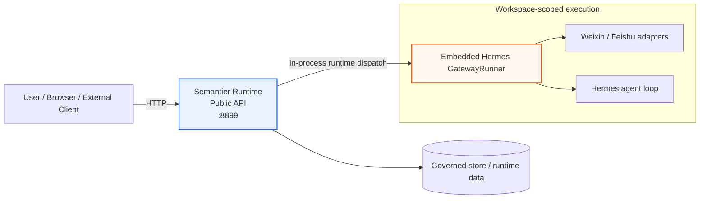
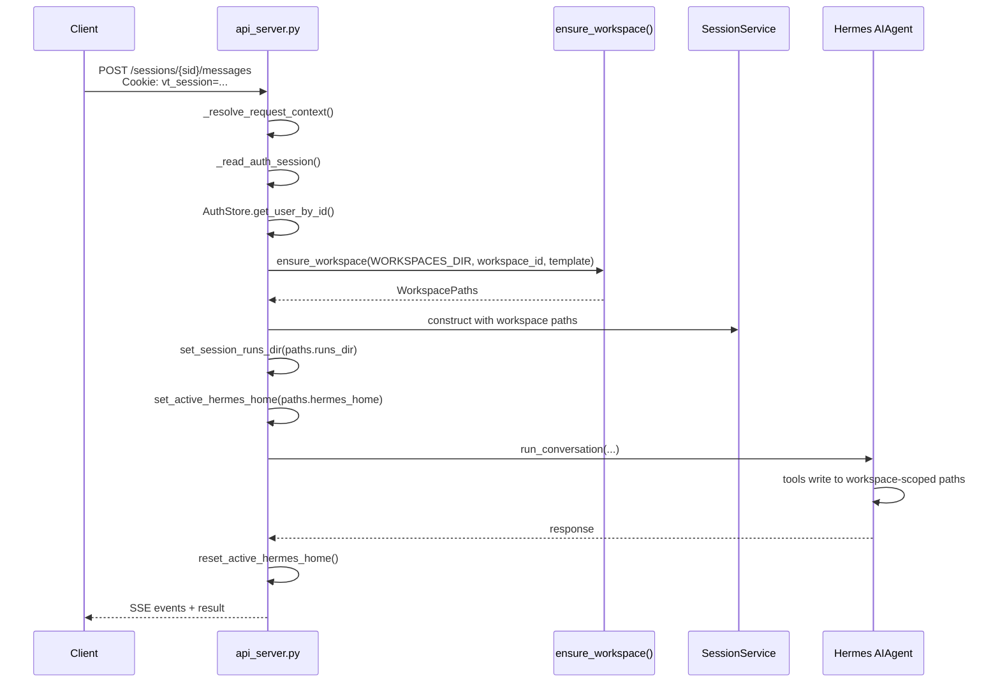
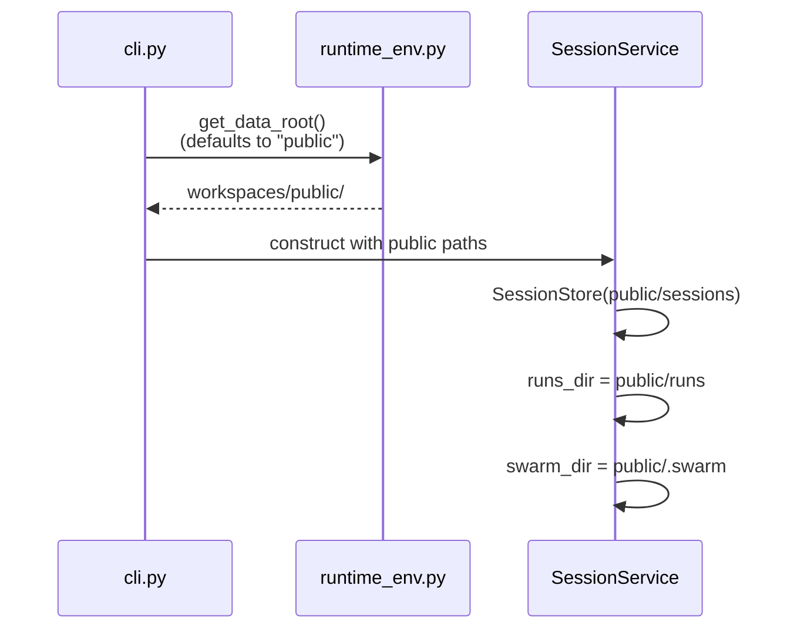
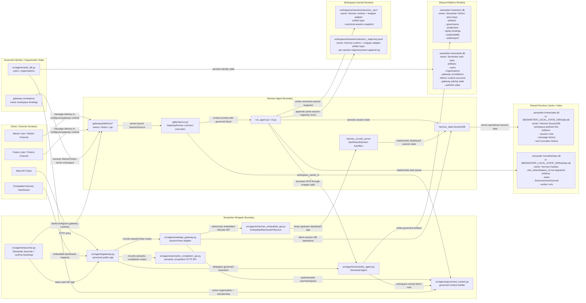
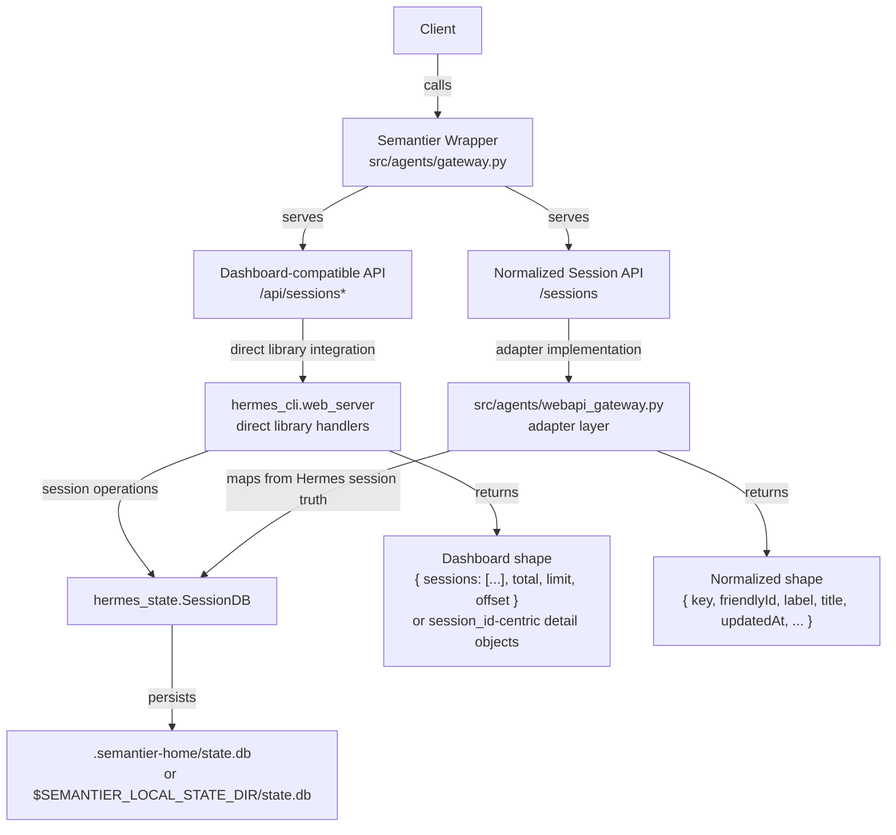
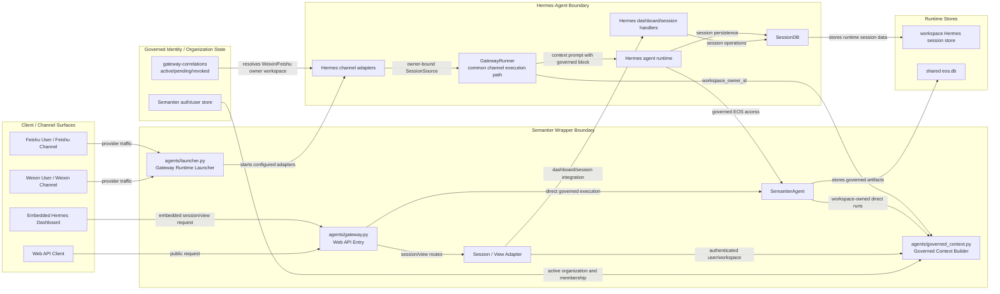
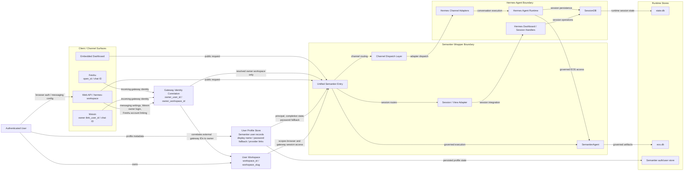
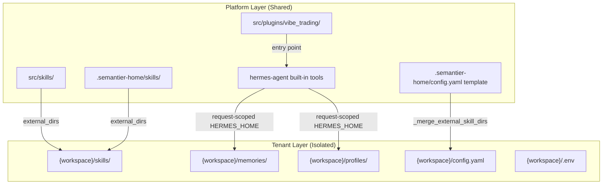
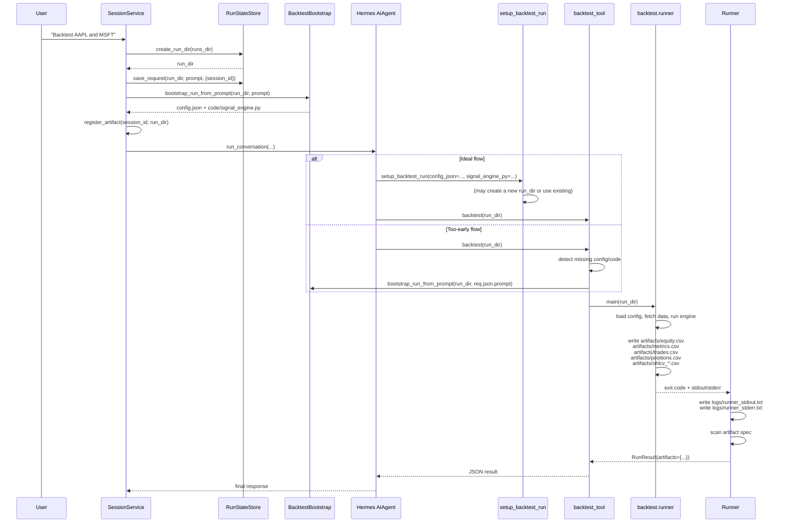

# Gateway Unified Multitenant Design

**Status:** Active derived implementation contract.
**Authority:** Canonical design reference for gateway identity, workspace isolation, and ingress behavior under the repository runtime contract.
**Scope:** Gateway/runtime boundary for identity, workspace, sessions, and route policy.
**Upstream sources:**
- [Document Authority And Versioning](../canonical/document-authority-and-versioning.md)
- [architecture.md](../canonical/architecture.md)

This document is canonical for gateway and multitenant ingress concerns, but it is not the source of truth for global semantic-governance concepts already defined in `architecture.md`.

## Scope

This document defines the unified multitenant gateway architecture for the Semantier
runtime, covering identity, workspace isolation, session management, and ingress
routing. It is the canonical design reference for these concerns.

**What this document covers:**

- User identity, authentication, and principal binding
- Workspace provisioning, scoping, and filesystem isolation
- Unified session view and API contracts across all channels
- Route-level access rules and ingress security
- Gateway identity correlation for Feishu and Weixin
- Platform vs tenant resource separation
- Multi-tenant isolation guarantees

**What this document does not cover:**

- Semantier governance artifact schemas
- Replay, audit, or explainability structures
- RL trajectory schemas
- Final RBAC for every product feature
- Multi-user collaborative workspaces (future)

---

## 1. Design Principles

### 1.1 Architecture alignment

This design follows the canonical runtime contract:

- **Shared platform bootstrap assets** remain launcher-managed and read-only from the tenant perspective.
- **Organization-scoped governance and facts** are shared across all users in the same organization; `workspace_id` is always bound to exactly one `organization_id`.
- **Authenticated Hermes operational state** is workspace-owned and lives under `workspaces/<workspace_id>/`.
- **Gateway identity and auth/link state** live in `.semantier-home/auth.db`.
  `gateway_correlations` records are Semantier-owned identity/routing metadata;
  live provider credentials are stored separately as runtime credential cache rows
  and must not become identity authority by themselves.
- **Per-session Hermes JSON logs** for authenticated workspaces live under the workspace-owned `.hermes/` tree only.
- **`eos.db`** remains the single shared authoritative governed store; organization-scoped derived materializations (lakehouse, projections) are non-authoritative exports (see [architecture.md](../canonical/architecture.md) for materialization contract).
- **Write path exclusivity**: Hermes-agent → wrapper → Python store → `eos.db` is the only write path.
- **No live dependencies in replay/audit**: replay, explainability, audit packaging, and external verification must be deterministic and artifact-pinned.
- **Deterministic behavior**: all runtime decisions must use explicit version/hash pinning, including `TierPrecedencePolicy_v` for multi-tier conflict resolution (see [architecture.md](../canonical/architecture.md) Level 5.5).
- **T5 scope split**: T5 management preferences are scoped as either T5(org) (shared across org) or T5(user) (user-scoped); conflict resolution between them is governed by pinned `TierPrecedencePolicy_v`.

### 1.2 Workspace-ID as physical root key

The filesystem directory name is the canonical `workspace_id` (UUID hex string),
**not** the human-readable `workspace_slug`. `workspace_id` is the stable routing
and storage anchor; `workspace_slug` is derived from the user's display name and
can change.

### 1.3 Idempotent provisioning

`ensure_workspace(base_dir, workspace_id, template_hermes_home)` is idempotent:
safe to call on every request. Missing directories are created; missing config
files are copied from the template Hermes home. Existing user data is never overwritten.

### 1.4 Hermes integration boundary

Semantier-specific authority remains in Semantier core and wrapper code. Hermes
gateway integration points may carry Semantier-resolved workspace ownership and
append Semantier-built governed context, but Hermes adapters must not become the
source of organization authority, governance policy, projection trust, replay, or
audit semantics.

Per-workspace isolation is achieved through workspace-scoped Hermes homes and
owner-bound gateway sources, not by inferring identity from transport metadata or
LLM/session memory.

### 1.5 Request-level isolation

Every HTTP request resolves its workspace via `_resolve_request_context()` before
touching the filesystem. The resolved `WorkspacePaths` object is passed downstream;
no global cwd mutations.

### 1.6 Integrated ingress contract (`8899`)

The active Semantier runtime contract is integrated mode with one public ingress
surface on `8899`.

- `8899` is the only public/default API ingress for Semantier runtime routes.
- Embedded Hermes gateway lifecycle runs in-process under `semantier run`.
- Standalone Hermes API server exposure on `8642` is not part of the active
  Semantier deployment contract.



Operational notes:

- Deployment documentation should expose `8899` as the runtime contract port.
- Do not require or publish `8642` for Semantier integrated deployments.

---

## 2. User Identity & Authentication

### 2.1 As-is identity model

The current repository verifies a lightweight authenticated-workspace contract:

- `vt_session` is the only browser cookie intentionally forwarded from
  `hermes-workspace` to the Semantier backend.
- `hermes-workspace` resolves the active workspace by calling `GET /auth/context`.
- `GET /auth/context` verifies signed `vt_session` and returns auth + workspace
  context in one payload.
- `GET /auth/context` returns `200` for both authenticated and unauthenticated
  states; unauthenticated payloads set `authenticated=false` and `workspace=null`.
- When a stale/invalid `vt_session` cookie is present, `/auth/context` clears the
  cookie (`Set-Cookie` delete) to force clean re-auth.
- `hermes-workspace` rejects unauthenticated workspace access by raising
  `WorkspaceAuthRequiredError`.

Implemented details:

- `vt_session` signing and parsing live in `src/agents/auth_session.py`.
- User, organization, gateway-correlation, Weixin runtime account cache, Weixin login, and Feishu link state
  persistence live behind `src/agents/auth_db.py` and `src/agents/gateway_identity.py`.
- Feishu OAuth/link callback state is persisted with bounded TTL through the auth
  store.
- `/auth/logout` clears the `vt_session` cookie.

Current gap:

- Admin override or cross-workspace visibility remains outside the v1 contract.

### 2.2 Authentication scheme

User identity is established through the configured auth provider and resolved to
a stable Semantier principal identifier. Feishu OAuth/account linking is one
implemented provider path:

1. User opens `hermes-workspace`.
2. If Feishu OAuth is enabled and the user is unauthenticated, frontend redirects
   to `/auth/feishu/login`.
3. Backend completes Feishu OAuth code exchange and profile fetch.
4. Backend resolves or creates one Semantier user record.
5. Backend resolves or creates exactly one personal workspace for that user.
6. Backend sets `vt_session`.
7. Frontend uses `vt_session` for all authenticated workspace-bound requests.

### 2.3 Stable identifiers

| Identifier | Type | Purpose |
|---|---|---|
| `user_id` | UUID | Internal Semantier principal |
| `feishu_open_id` | string | Bound external identity (not the internal principal) |
| `workspace_id` | UUID | Storage and routing anchor for workspace isolation |
| `workspace_slug` | string | Human-facing handle only |

Rules:

- `user_id` is the Semantier principal identifier.
- `feishu_open_id` must be unique across the system.
- One user maps to exactly one personal workspace in v1.
- `workspace_slug` may change for display reasons; `workspace_id` remains stable.

### 2.4 Session cookie contract

```text
vt_session = base64url(payload) + "." + base64url(signature)
```

Payload:

```json
{
  "user_id": "UUID",
  "workspace_id": "UUID",
  "workspace_slug": "string"
}
```

Signature: HMAC-SHA256 over the serialized payload; signing key stored in backend
configuration.

Validation requirements on every authenticated request:

- Verify cookie signature.
- Reject invalid or malformed payloads with `401`.
- Resolve authenticated workspace roots from `workspace_id`.
- Attach an authenticated request context before route logic runs.

Signing-secret requirements:

- The signing secret must be backend-owned and centrally configured.
- Secret rotation behavior must be explicit and tested.
- If v1 rotation invalidates all active sessions, that behavior must be documented.

### 2.5 User record contract

```json
{
  "user_id": "UUID",
  "feishu_open_id": "string",
  "feishu_union_id": "string|null",
  "name": "string",
  "email": "string|null",
  "avatar_url": "string|null",
  "workspace_id": "UUID",
  "workspace_slug": "string",
  "created_at": "ISO-8601",
  "updated_at": "ISO-8601"
}
```

### 2.6 Backend request context

```json
{
  "authenticated": true,
  "user_id": "UUID",
  "workspace_id": "UUID",
  "workspace_slug": "string",
  "workspace_root": "absolute path",
  "hermes_home": "absolute path"
}
```

Rules:

- Request context must be resolved before session, file, terminal, memory, or run
  APIs execute.
- Route handlers should not infer workspace scope from user-supplied path fragments
  or session identifiers alone.
- Authenticated request context must be derived from validated `vt_session`
  workspace identity rather than a caller-supplied workspace path.

---

## 3. Workspace Model & Directory Layout

### 3.1 Workspace entity

```json
{
  "workspace_id": "UUID",
  "workspace_slug": "string",
  "user_id": "UUID",
  "data_root": "absolute path",
  "created_at": "ISO-8601",
  "is_public": false
}
```

Rules:

- One user has one personal workspace in v1.
- Workspaces are tenant boundaries, not collaborative teams.
- Session ownership is implicit through workspace membership.

### 3.2 Canonical directory layout

```text
workspaces/
├── public/                          # Unauthenticated fallback (shared)
│   ├── .hermes/
│   ├── sessions/
│   ├── runs/
│   └── .swarm/
│
└── {workspace_id}/                  # Authenticated user workspace
    │
    ├── .hermes/                     # Workspace-scoped Hermes home
    │   ├── config.yaml              # Launcher-managed template config overlay
    │   ├── .env                     # Workspace-local env (API keys, etc.)
    │   ├── SOUL.md                  # Launcher-managed identity bootstrap asset
    │   ├── auth.json                # Hermes auth state
    │   ├── skills/                  # Workspace-local skills (user-installed)
    │   ├── memories/                # Hermes memory store
    │   ├── logs/                    # Hermes runtime logs
    │   ├── home/                    # Hermes home dir for sandboxed tools
    │   ├── profiles/                # Hermes agent profiles
    │   ├── cron/                    # Scheduled task definitions
    │   ├── sessions/                # Single workspace session log store
    │   │   ├── sessions.json        # Session index / transport-key map
    │   │   ├── session_<id>.json    # Canonical full session snapshot
    │   │   └── <id>.jsonl           # Append-oriented transcript/event log
    │   └── ...
    │
    ├── runs/                        # VT backtest / agent-coding runs
    │   └── {YYYYMMDD_HHMMSS_###_xxxxxx}/
    │       ├── req.json
    │       ├── state.json
    │       ├── config.json
    │       ├── code/
    │       ├── logs/
    │       ├── artifacts/
    │       └── .home/
    │
    ├── uploads/                     # User file uploads
    │
    └── .swarm/                      # Swarm multi-agent runs
        └── runs/
            └── {run_id}/
                ├── run.json
                ├── events.jsonl
                ├── tasks/
                ├── inboxes/
                └── artifacts/
```

Rules:

- Authenticated user login must resolve to a concrete workspace directory under
  `workspaces/<workspace_id>/`.
- If the workspace tree does not yet exist, backend auth/bootstrap flows must create
  it before returning authenticated workspace paths.
- Authenticated requests must not fall back to a repo-global shared Hermes runtime home.
- Workspace bootstrap helpers must reject path traversal and enforce containment
  beneath the canonical workspaces root.
- The directory skeleton under `workspaces/<workspace_id>/` is created eagerly for
  authenticated workspaces.
- Mutable runtime files under the direct workspace runtime home may be created lazily by their owning subsystems.
- Shared platform bootstrap assets remain outside the workspace runtime and are
  read-only from the tenant perspective.
- `config.yaml`, `SOUL.md`, and `SEMANTIER_GOVERNANCE.md` are bootstrap-managed
  recovery files. If missing, workspace bootstrap must recreate them
  deterministically from launcher-owned sources rather than requiring checked-in
  runtime copies.

### 3.3 `WorkspacePaths` data contract

Defined by the active workspace/runtime path helpers in `src/runtime_paths.py`
and the authenticated request context assembly in `src/agents/webapi_gateway.py`.
`WorkspacePaths` here is the design-level contract name for the resolved
workspace path bundle:

| Field | Type | Description |
|---|---|---|
| `workspace_id` | `str` | Directory name (`workspace_id` or `"public"`) |
| `workspace_slug` | `str` | Human-readable label from `AuthStore` |
| `workspace_root` | `Path` | `workspaces/{workspace_id}/` |
| `agent_root` | `Path` | Alias for `workspace_root` |
| `hermes_home` | `Path` | `{agent_root}/` |
| `sessions_dir` | `Path` | `{agent_root}/sessions` |
| `runs_dir` | `Path` | `{agent_root}/runs` |
| `uploads_dir` | `Path` | `{agent_root}/{session_id}/uploads` |
| `swarm_dir` | `Path` | `{agent_root}/.swarm` |

### 3.4 `ensure_workspace()` provisioning gate

```python
def ensure_workspace(
    base_dir: Path,
    workspace_id: str,
    template_hermes_home: Path,
    *,
    workspace_slug: str | None = None,
) -> WorkspacePaths
```

Behavior:

1. Compute `WorkspacePaths` from `base_dir / workspace_id`.
2. Create directories: `agent_root`, `.hermes`, `sessions`, `runs`, `.swarm`.
3. Copy/merge `template_hermes_home/config.yaml` → `.hermes/config.yaml`.
4. Copy `template_hermes_home/.env` → `.hermes/.env` (or touch empty file).
5. Create Hermes subdirectories: `sessions`, `skills`, `memories`, `logs`, `home`, `profiles`, `cron`.
6. Return `WorkspacePaths`.

Idempotency guarantee: steps 2–5 use `mkdir(parents=True, exist_ok=True)` and
existence checks before copy.

### 3.5 Request context resolution flow

```
Request + Cookie (vt_session)
  → _read_auth_session(cookie)
  → AuthStore.get_user_by_id(user_id)
  → ensure_workspace(WORKSPACES_DIR, user.workspace_id, _TEMPLATE_HERMES_HOME,
                      workspace_slug=user.workspace_slug)
  → RequestContext(authenticated=True, user=user, workspace=workspace_paths)
```

Web API behavior: if no valid session, strict-auth routes (for example
`/sessions` or `/api/sessions`) return `401` and must not fall back to `public`
workspace.

CLI/local behavior: runtime helpers may still default to `workspaces/public/`
when no authenticated browser principal is in scope.

### 3.6 Path resolution sequence

#### Authenticated web request



#### Unauthenticated / CLI request



### 3.7 `public` workspace

- **Purpose**: Shared fallback for CLI/local operations without explicit `--user`
  flags and non-authenticated runtime utilities.
- **Location**: `workspaces/public/`
- **Security**: Not a security boundary. Browser-facing strict-auth API routes
  must reject unauthenticated requests before reaching `public` workspace.

---

## 4. Session Management & Unified Ingress

### 4.1 Authority split

This design preserves the architecture-mandated separation:

| Boundary | Owns |
|---|---|
| **Hermes-agent** | Conversation UX, gateway runtime, procedural execution, operational session truth |
| **Semantier core** | Governance, validation, projection, replay, explainability, audit authority |
| **Semantier wrapper** | Web API ingress, gateway runtime launch, session/view adapters, governed execution bridge, governed context construction |

Rules:

- Hermes session persistence remains the operational truth for chat/session history.
- The unified `/sessions` contract is a projection/view, not a second authority store.
- Active organization context is resolved from Semantier governed identity and
  organization state, then injected into web/direct/channel execution paths by one
  shared Semantier builder.
- Weixin and Feishu channel traffic may enter Hermes adapters, but source ownership
  must be resolved to a Semantier workspace before workspace-scoped session mutation.
- Do not introduce a steady-state mirror (e.g., `sessions/<id>/session.json` as a
  second source of truth, or `events.jsonl` as a mandatory duplicated transcript authority).

### 4.2 Component diagram

The diagram below shows the actual components that own or project each stored artifact.



### 4.3 Store ownership matrix

| Artifact | Path / Form | Owning component |
|---|---|---|
| Runtime session rows (authenticated) | `.semantier-home/state.db` or equivalent runtime home `state.db`, isolated by canonical workspace-prefixed session IDs and wrapper auth | Hermes runtime |
| Message history (authenticated) | `.semantier-home/state.db` or equivalent runtime home `state.db`, isolated by canonical workspace-prefixed session IDs and wrapper auth | Hermes runtime |
| Kanban task coordination (authenticated) | `.semantier-home/kanban.db` or `$SEMANTIER_LOCAL_STATE_DIR/kanban.db`, isolated by governed `user_id` / `workspace_id` row segments; not workspace-local `kanban.db` | Hermes Kanban runtime + Semantier identity binding |
| Dashboard `/api/sessions*` responses | In-memory/library projection over workspace Hermes session state | `hermes_cli.web_server` |
| Lightweight `/sessions` responses | In-memory adapter projection | `src/agents/webapi_gateway.py` |
| Auth/users/organization membership | `.semantier-home/auth.db` plus legacy JSON migration inputs | `src/agents/auth_db.py`, `src/agents/gateway_identity.py` |
| Gateway owner correlation records | `gateway_correlations` auth table / migrated `gateway-correlations.json` | `src/agents/gateway_identity.py` |
| Governed runtime context prompt | In-memory prompt block derived from auth/organization state | `src/agents/governed_context.py` |
| Unified workspace session log store | `workspaces/<workspace_id>/sessions/<session_id>/logs/` | Hermes runtime + Semantier wrapper adapter |
| Per-session trajectory log | `workspaces/<workspace_id>/sessions/<session_id>/logs/session_<file_key>.trajectory.jsonl` | Hermes runtime + Semantier wrapper adapter |
| Governance / projection / audit records | `.semantier-home/eos.db` | `src/eos/*`, `src/storage/*` |

### 4.3 Session model layers

#### 4.3.1 Runtime Session Record

Purpose: operational conversation cache/index for transport continuity, runtime
execution, dashboard support, and session listing support.

Primary backing: canonical workspace session artifacts under
`workspaces/<workspace_id>/sessions/`, with Hermes `SessionDB` acting
as a hydratable execution cache/index only. If `SessionDB` disagrees with
canonical artifacts, canonical artifacts win.

Operational rule:
- Compatibility routes must tolerate DB-only workspace sessions that exist in
  shared runtime `state.db` before canonical workspace log hydration.
- `/api/sessions/{session_id}/messages` must return the DB-backed message list
  for the authenticated workspace even if no session log artifact exists yet.
- Session deletion must delete both canonical workspace log artifacts when they
  exist and the shared runtime `SessionDB` row when it exists; absence of one
  backing store must not force a false `404`.
- Regression coverage is pinned by
  `tests/test_hermes_api_compat.py::test_api_session_messages_reads_db_only_session`
  and
  `tests/test_hermes_api_compat.py::test_api_sessions_delete_removes_db_only_session`.

```json
{
  "session_id": "string",
  "title": "string|null",
  "source": "string",
  "model": "string|null",
  "started_at": 0.0,
  "last_active": 0.0,
  "ended_at": 0.0,
  "end_reason": "string|null",
  "message_count": 0,
  "tool_call_count": 0,
  "is_active": true
}
```

#### 4.3.2 Normalized Session View DTO

Purpose: stable Semantier-facing API contract for web UI and channel-neutral clients.

Required base fields:

```json
{
  "key": "string",
  "friendlyId": "string",
  "label": "string",
  "title": "string",
  "derivedTitle": "string",
  "updatedAt": 0,
  "createdAt": 0
}
```

Optional enrichment fields:

```json
{
  "source": "string|null",
  "model": "string|null",
  "isActive": true,
  "messageCount": 0
}
```

#### 4.3.3 Canonical Session Artifact Contract

Purpose: define the single workspace-owned persistence contract that every
gateway surface must share.

Canonical artifact set for one logical session:

```text
workspaces/<workspace_id>/sessions/
  sessions.json
  <session_id>/
    logs/
      session_<file_key>.json
      <file_key>.jsonl
      session_<file_key>.trajectory.jsonl
    artifacts/
    runs/
    uploads/
```

Rules:

- `file_key` is a filesystem-safe encoding of the canonical `session_id`.
- `logs/session_<file_key>.json` is the canonical full-session snapshot.
- `logs/<file_key>.jsonl` is the canonical append-oriented transcript/event log.
- `logs/session_<file_key>.trajectory.jsonl` is the canonical per-session
  trajectory append log for all gateway turns in that same logical session.
- There must not be one trajectory file per gateway for the same logical
  session.
- There must not be one session ID per gateway for the same logical session.
- Session continuation across web, Weixin, and Feishu must resolve to the same
  canonical `session_id` when the conversation is the same logical thread.

#### 4.3.4 Per-Session Trajectory Record

Purpose: capture turn-by-turn trajectory data for the canonical session while
preserving which gateway originated each turn.

One JSON line is appended per completed turn:

```json
{
  "workspace_id": "UUID",
  "session_id": "string",
  "timestamp": "ISO-8601",
  "source_gateway": "web|weixin|feishu|api_server|other",
  "platform_session_key": "string|null",
  "chat_id": "string|null",
  "thread_id": "string|null",
  "origin_user_id": "string|null",
  "model": "string",
  "completed": true,
  "trajectory": []
}
```

Rules:

- `source_gateway` records which gateway produced the turn.
- `timestamp` must be normalized UTC ISO-8601 derived from canonical session
  artifacts when available; it must not be treated as replay authority.
- Metadata persistence uses an explicit allowlist. Default allowed keys are
  `platform_session_key`, `chat_id`, `thread_id`, and `origin_user_id`.
- `platform_session_key`, `chat_id`, `thread_id`, and `origin_user_id` are
  metadata only; they must not redefine canonical session identity.
- Multiple gateways may append records to the same trajectory file as long as
  they resolve to the same canonical `session_id`.
- Trajectory appends must use coordinated multi-writer locking at the file
  boundary; plain unlocked append is not sufficient.
- Trajectory records are derived from the canonical session and are
  session-scoped, not global training-bucket artifacts.

Deterministic mapping rules:

- `key` and `friendlyId` both map to `session_id` in v1.
- `createdAt` maps from `started_at` (convert seconds → epoch ms by flooring toward zero after ×1000).
- `updatedAt` maps from `last_active` when present; otherwise falls back to `started_at`.
- Default ordering: descending by `updatedAt`, then ascending by `session_id`.
- If `title` is empty, `label = title = derivedTitle = session_id`.
- Canonical session resolution precedence is:
  1. `platform_session_key`
  2. `chat_id + thread_id`
  3. `chat_id + origin_user_id`
  4. `chat_id`
  5. `origin_user_id`
- If two gateways race to bind the same logical conversation, first successful
  alias binding wins and later contenders must resolve and reuse that canonical
  `session_id`.

#### 4.3.5 Governed Interaction Linkage Record

Purpose: link conversational sessions to Semantier-governed work without
collapsing the boundary.

```json
{
  "interaction_id": "string",
  "session_id": "string",
  "channel": "web_api|weixin|feishu|cli",
  "governance_refs": ["string"],
  "projection_refs": ["string"],
  "audit_refs": ["string"],
  "deterministic_artifact_hashes": ["string"]
}
```

Rules:

- This record belongs to Semantier-owned storage.
- It may reference a Hermes `session_id`.
- It must not depend on live Hermes retrieval or mutable session view state during
  replay/audit.

### 4.4 API contract families

#### Dashboard-compatible contract

Routes:

- `/api/sessions`
- `/api/sessions/search`
- `/api/sessions/{session_id}`
- `/api/sessions/{session_id}/latest-descendant`
- `/api/sessions/{session_id}/messages`

Source: direct Hermes library integration through `hermes_cli.web_server`,
with `SessionDB` hydrated from canonical workspace artifacts. Preserve upstream
Hermes semantics, but canonical artifacts remain the source of truth.

#### Normalized session contract

Routes:

- `GET /sessions`
- `POST /sessions`
- `PATCH /sessions`
- `DELETE /sessions`

Source: Semantier adapter layer in `src/agents/webapi_gateway.py`, backed by
Hermes session operations and mapped into the unified DTO.

#### API contract diagram

The diagram below shows how the two session API families differ and where each one is sourced from.



### 4.5 Unified ingress architecture

The implemented architecture uses one Semantier-owned governed execution context
boundary across web API, direct `SemantierAgent`, Weixin, and Feishu execution
paths. Public transport ingress is still split operationally: web API traffic enters
the Semantier FastAPI app, while Weixin and Feishu provider traffic enters Hermes
gateway runtimes launched by Semantier.



As-is behavior:

- `agents/gateway.py` is the canonical public FastAPI app for the web API surface.
- `agents/launcher.py` is the wrapper/bootstrap entry for Hermes gateway runtimes
  (Weixin, Feishu).
- Web API traffic enters through `agents/gateway.py`.
- Weixin/Feishu channel traffic enters Hermes gateway runtimes started by
  `agents/launcher.py`.
- Governed runtime context prompt construction is centralized in
  `agents/governed_context.py`.
- Web API, direct `SemantierAgent`, and Hermes `GatewayRunner` execution paths use
  the shared governed context builder instead of transport-specific prompt logic.
- Gateway channel ownership is resolved into `SessionSource.workspace_owner_id`
  before common `GatewayRunner` context injection. Weixin uses owner login
  correlation; Feishu inbound events resolve through active Semantier-owned
  gateway correlation records keyed by raw Feishu `open_id`/`union_id` before
  session routing.
- Hermes runtime reaches governed Semantier state through the wrapper path:
  `SemantierAgent → gateway.execute_with_governance() → Python store layer → eos.db`.
- Public transport ingress is not collapsed into a single FastAPI process. Web API
  and Hermes gateway runtime startup remain separate internal operational paths
  under the Semantier launcher.

Remaining non-unified boundary:

- Public provider-facing Weixin/Feishu transport endpoints still live in Hermes
  adapters rather than one Semantier FastAPI ingress process.
- The governance-critical context and owner-binding semantics are unified at the
  Semantier identity/context boundary and at the common Hermes `GatewayRunner`
  execution boundary.
- Moving provider-facing webhook/websocket endpoints behind a single Semantier
  public process remains a transport-hardening refactor, not a prerequisite for
  active-organization context injection.

#### Operator UX

Implemented operator experience:

```text
semantier run --replace
```

Expected semantics:

- Starts one Semantier-owned runtime.
- Initializes embedded Hermes runtime components in-process.
- Enables configured public surfaces for web API, Weixin, Feishu, and embedded
  dashboard/session surfaces.
- Owns startup, shutdown, replacement, and health lifecycle for the whole runtime.

Operational rule:

- Operators use the Semantier launcher as the owner of web and gateway runtime
  lifecycle. Internally, provider-facing channel handling still runs through
  Hermes gateway components.

Implementation reference:

- [Refactoring Plan 8.6](../../archive_doc/refactoring_plan_8.6.0.md)
- [Refactoring Plan 8.6.8](../refactoring_plan_8.6.8.md)

### 4.6 Transport metadata

When channel metadata is available, expose it under a dedicated transport object:

```json
{
  "transport": {
    "channel": "web_api|weixin|feishu|cli",
    "platform_session_key": "string|null",
    "origin_user_id": "string|null",
    "chat_id": "string|null",
    "chat_name": "string|null"
  }
}
```

Rules:

- `platform_session_key` is transport metadata, not the canonical session identifier.
- `origin_user_id` is transport identity when available, not a Semantier governance
  identifier.
- Cross-gateway continuation must preserve the same canonical `session_id`; a
  gateway-specific token such as `platform_session_key` may help resolve that
  identity but must not replace it.
- Channel metadata should not be required for the base session DTO.
- Transport metadata must not overload `friendlyId`, `key`, or `label` with platform
  identity semantics.

---

## 5. Gateway Identity Binding

### 5.1 Transport vs principal identity

The system keeps these separate:

- **Authenticated principal identity**: who owns the workspace and browser session.
- **Transport identity**: who sent a message through Feishu/Weixin transport.

Transport metadata examples: `origin_user_id`, `platform_session_key`, `chat_id`, `chat_name`.

Rules:

- Transport identity must not be treated as workspace ownership by itself.
- Transport metadata may help route inbound messages only after a configured gateway
  correlation resolves that transport identity to a Semantier `user_id`.
- Transport metadata may help map an inbound turn onto an existing canonical
  session, but it must not cause parallel gateway-specific sessions or
  gateway-specific trajectory files for the same logical conversation.
- Transport metadata does not bypass authenticated workspace boundaries or governed
  write controls.

### 5.2 User/workspace identity diagram



### 5.3 Required gateway-correlation record

For configured Feishu and Weixin gateways, the system maintains a Semantier-owned
correlation record:

```json
{
  "platform": "feishu|weixin",
  "owner_user_id": "UUID",
  "owner_workspace_id": "UUID",
  "linked_external_user_id": "string|null",
  "linked_external_union_id": "string|null",
  "linked_account_id": "string|null",
  "platform_session_key": "string|null",
  "chat_id": "string|null",
  "status": "active|pending_link|revoked",
  "created_at": "ISO-8601",
  "updated_at": "ISO-8601"
}
```

Rules:

- The correlation record is Semantier-owned identity/routing metadata, not a
  governance artifact and not a replacement for Hermes session state.
- Inbound gateway traffic must resolve through this correlation before workspace-scoped
  session lookup, creation, or mutation.
- Unresolved or mismatched external identifiers must fail closed before session routing.
- Linking a new Feishu account or confirming a Weixin owner QR login updates this
  correlation record rather than inferring ownership from transport metadata alone.
- Weixin owner identity is one-to-one in both directions:
  - one owner Weixin `linked_external_user_id` binds to only one `owner_user_id`
  - one `owner_user_id` binds to only one owner Weixin `linked_external_user_id`
- Conflicting owner-identity binds must fail closed rather than silently rebinding.

### 5.3 Messaging settings as configuration boundary

The authenticated user-facing configuration boundary is the messaging settings screen
(`hermes-workspace/src/screens/settings/messaging-settings-screen.tsx`). Its responses
carry `owner_id`, `workspace_slug`, and authenticated `/auth/context` user/workspace
information.

Required correlation rule:

- Every configured gateway account, linked external identity, and inbound gateway
  sender identifier must correlate to one authenticated Semantier principal `user_id`.
- That `user_id` anchors exactly one `workspace_id` in v1.
- Gateway configuration must not create an identity path that bypasses `vt_session`
  or authenticated workspace ownership.

### 5.4 Gateway-side identifiers that must correlate

- Feishu `feishu_open_id`
- Feishu `feishu_union_id` when present
- Weixin account credentials such as `account_id`
- Weixin owner `ilink_user_id` returned from QR-confirmed login
- Provider chat/thread identifiers such as `chat_id` or `platform_session_key`

Rules:

- `owner_id` returned from messaging settings must identify the Semantier principal
  that owns the gateway configuration.
- The owning principal must match the authenticated `user_id` resolved through
  `vt_session` and exposed by `/auth/context`.
- Feishu account-linking flows must persist the correlation from external gateway
  identifier to internal `user_id`.
- Weixin owner login must persist the correlation from QR-confirmed owner identity
  to internal `user_id`.
- One inbound gateway identifier routes to one Semantier principal/workspace at a time.
- Weixin owner QR confirmation is both an identity-binding action and a workspace-scoped
  credential bootstrap action.
- QR-confirmed Weixin credentials must be persisted beneath the owning workspace
  scope as runtime credential cache state. The current store is
  `.semantier-home/auth.db` table `weixin_runtime_accounts`, keyed by `account_id`
  and validated against the active `gateway_correlations` owner/workspace binding
  before use.
- Gateway startup must hydrate Weixin adapter credentials from
  `weixin_runtime_accounts` when a saved account exists.
- Gateway startup must not fall back to `WEIXIN_ACCOUNT_ID` /
  `WEIXIN_TOKEN` environment variables or other legacy credential sources for
  Weixin enablement.

---

## 6. Multi-Tenant Isolation Guarantees

### 6.1 Isolation matrix

| Layer | Isolation Mechanism |
|---|---|
| **Filesystem** | Each workspace has a distinct root directory keyed by `workspace_id`. |
| **Hermes Home** | `set_active_hermes_home(paths.hermes_home)` switches per request; upstream Hermes reads/writes within that subtree only. |
| **Session Store** | The wrapper and Hermes runtime both read/write `paths.hermes_home / "sessions"` as the single workspace session, transcript, and per-session trajectory store. |
| **Run Store** | `RunStateStore` creates run directories under `paths.runs_dir` only. |
| **Swarm Store** | `SwarmStore(base_dir=paths.swarm_dir / "runs")` scopes swarm runs to the workspace `.swarm/runs/` folder. |
| **File Tools** | Wrapper patches block writes to `workspaces/public` from authenticated contexts and reject `.agents/skills` paths. |
| **Terminal CWD** | `TERMINAL_CWD` is synchronized to `get_data_root()` so shell commands execute within the active workspace. |

### 6.2 Session ownership and isolation rules

A session belongs to a workspace. A workspace belongs to one user.

Required guarantees:

- Session list for workspace A never includes sessions from workspace B.
- Session history or event stream for workspace A never yields records from workspace B.
- Run artifact fetches cannot escape the authenticated workspace root.
- Deleted-session tombstones remain workspace-scoped.

Forbidden behavior:

- Direct cross-workspace session reads.
- Path traversal across workspace roots.
- User-controlled workspace selection without authenticated context.

Required response behavior:

- Return `404` for session or artifact lookup outside the authenticated workspace
  instead of `403`, to avoid workspace enumeration leakage.

### 6.3 Context variables for async safety

`src/runtime_paths.py` declares the workspace-scoped `ContextVar` bindings used
by the gateway path boundary:

- `_workspace_hermes_home_ctx` – set by `bind_workspace_env()` for in-process
  workspace `HERMES_HOME` isolation.
- `_workspace_runs_dir_ctx` – set by `bind_workspace_env()` for in-process
  workspace runs-root isolation.

These prevent cross-request directory bleeding when multiple agents run concurrently.

### 6.4 Embedded Hermes sandbox header

Embedded gateway/API forwarding may carry a Semantier-resolved sandbox key for
execution scoping:

- Header: `X-Semantier-Sandbox-Key`
- Forwarders: only Semantier-owned embedded gateway/API and wrapper paths
- Meaning: execution-lane sandbox hint derived from governed workspace context
- Authority: never an auth or tenant-identity source on its own

Transport rules:

```text
1. The gateway resolves workspace/session authority first, then derives the
   sandbox key via src/agents/sandbox_scope.py.

2. The embedded request may forward both X-Semantier-Hermes-Home and
   X-Semantier-Sandbox-Key together so Hermes receives a coherent workspace +
   sandbox execution contract.

3. hermes-agent/gateway/platforms/api_server.py may bind the forwarded sandbox
   key into the local request scope, but it must treat the value strictly as an
   execution hint for sandbox selection/reuse. It must not use the header to
   authorize a workspace, user, or organization.

4. If no Semantier sandbox header is present, Hermes may continue its legacy
   fallback behavior. If the header is present, Hermes must preserve that
   explicit scope and must not collapse it to the shared "default" sandbox.
```

---

## 7. Platform vs Tenant Resource Separation

### 7.1 Design principle: immutable platform, mutable tenant

| Principle | Platform-Level | Tenant-Level |
|---|---|---|
| **Ownership** | Application operator / Hermes framework | Individual authenticated user |
| **Mutability** | Read-only from tenant perspective | Full CRUD within workspace boundary |
| **Scope** | Shared across all workspaces | Isolated to one `workspaces/{workspace_id}/` tree |
| **Enforcement** | Wrapper patches, env flags, entry-point registration | Filesystem permissions, path scoping |

### 7.2 Skills: four-tier hierarchy

| Tier | Physical Location | Source Label | `canEdit` | `canUninstall` |
|---|---|---|---|---|
| **`workspace`** | `{workspace}/skills/` | User | ✅ | ✅ |
| **`application`** | `src/skills/` | Application Shared | ❌ | Admin only |
| **`builtin`** | `.semantier-home/skills/` or hermes-agent built-ins | Hermes Built-in | ❌ | ❌ |
| **`external`** | Any other `external_dirs` path | External Shared | ❌ | ❌ |

Discovery order (first match wins):

1. `{workspace}/skills/` — tenant-local skills
2. `external_dirs` from `config.yaml` — platform shared paths

Template config inheritance:

- If workspace has no `config.yaml` → copy the template verbatim.
- If workspace has its own `config.yaml` → append missing template `external_dirs`
  to the workspace's list.
- Workspace-local `external_dirs` are preserved at the **front**; platform dirs are
  **appended**.

Skill install guards:

- Terminal guard: blocks `skills add/install` via terminal; directs users to the
  Hermes dashboard for workspace-local installs.
- File-tools guard: blocks `write_file` / `patch` targeting `.agents/skills` paths;
  rejects writes to `workspaces/public` from authenticated contexts.

### 7.3 Tools: platform-only registration

Tools are entirely platform-level; tenants cannot register custom tools.

- **Vibe-Trading plugin** (`src/plugins/vibe_trading/`): registered via
  `hermes_agent.plugins` entry point; shared by all tenants.
- **Built-in toolsets**: provided by Hermes upstream; wrapper only enables/disables
  toolsets and patches sandbox boundaries.
- **Workspace plugin discovery disabled**:
  ```python
  os.environ["HERMES_DISABLE_USER_PLUGINS"] = "1"
  os.environ["HERMES_DISABLE_PROJECT_PLUGINS"] = "1"
  ```

### 7.4 Other resources

| Resource | Implementation | Storage | Notes |
|---|---|---|---|
| **Memory** | Hermes built-in `memory` toolset | `{workspace}/memories/` | Code shared; data isolated via `HERMES_HOME` |
| **Cron** | Hermes built-in `cronjob` toolset | `{workspace}/cron/` | Workspace-owned definitions; platform-provided scheduler |
| **Profiles** | Hermes upstream | `{workspace}/profiles/` | Directory tenant-scoped; logic Hermes-provided |
| **Config** | Platform template | `{workspace}/config.yaml` | Merge preserves required shared dirs |
| **Env** | Platform template | `{workspace}/.env` | Copy once; tenant then owns it |

### 7.5 Boundary enforcement summary



---

## 8. Route Auth Matrix & Security Contract

### 8.1 Route family policy

| Route family | Auth required | Mechanism | Notes |
|---|---|---|---|
| `/auth/*` | public or session-dependent | route-specific | login, callback, logout, status |
| `/health*` | public | none | liveness/readiness only |
| `/auth/context` | session-aware | `vt_session` | returns unified auth + workspace context; unauthenticated payload returns `workspace=null` |
| `/messaging/*` | yes | `vt_session` | per-user gateway configuration; owner identity binding |
| `/sessions*` | yes | `vt_session` | normalized Semantier session APIs |
| `/api/sessions*` | yes | `vt_session` | Hermes-compatible session APIs behind wrapper auth |
| `/runs/*` | yes | `vt_session` | workspace-bounded run artifact access |
| `/files*`, `/memory*`, `/terminal*` | yes | `vt_session` | workspace-bounded local operations |
| Channel webhook ingress | yes | signature + anti-replay | provider authenticity before dispatch |
| Internal gateway ingress | yes | internal service auth | must not be anonymous public ingress |

### 8.1.1 Executable method-path policy matrix (P0)

CI parses this table and compares it against `src/agents/route_policy.py`.
Each row must map to a `(method, path) -> policy` entry in
`ROUTE_POLICY_MAP`. Wildcard method is written as `*`.

| Method | Path | Policy |
|---|---|---|
| `*` | `/health` | `public` |
| `*` | `/health/detailed` | `public` |
| `GET` | `/gateway/channels` | `public` |
| `GET` | `/auth/context` | `public` |
| `DELETE` | `/auth/feishu/link` | `authenticated` |
| `POST` | `/upload` | `authenticated` |
| `GET` | `/sessions` | `authenticated` |
| `POST` | `/sessions` | `authenticated` |
| `PATCH` | `/sessions` | `authenticated` |
| `DELETE` | `/sessions` | `authenticated` |
| `GET` | `/sessions/{session_key}/trajectory` | `authenticated` |
| `*` | `/api/sessions` | `authenticated` |
| `GET` | `/api/sessions/search` | `authenticated` |
| `*` | `/api/sessions/{session_id}` | `authenticated` |
| `GET` | `/api/sessions/{session_id}/log` | `authenticated` |
| `GET` | `/api/sessions/{session_id}/latest-descendant` | `authenticated` |
| `GET` | `/api/sessions/{session_id}/messages` | `authenticated` |
| `POST` | `/api/sessions/{session_id}/chat` | `authenticated` |
| `POST` | `/api/sessions/{session_id}/chat/stream` | `authenticated` |
| `POST` | `/api/sessions/send` | `authenticated` |
| `*` | `/api/jobs` | `authenticated` |
| `*` | `/api/jobs/{job_id}` | `authenticated` |
| `GET` | `/api/jobs/{job_id}/{action}` | `authenticated` |
| `POST` | `/api/jobs/{job_id}/{action}` | `authenticated` |
| `GET` | `/api/plugins/kanban/board` | `authenticated` |
| `POST` | `/api/plugins/kanban/tasks` | `authenticated` |
| `GET` | `/api/plugins/kanban/tasks/{task_id}` | `authenticated` |
| `PATCH` | `/api/plugins/kanban/tasks/{task_id}` | `authenticated` |
| `DELETE` | `/api/plugins/kanban/tasks/{task_id}` | `authenticated` |
| `GET` | `/api/plugins/kanban/assignees` | `authenticated` |
| `GET` | `/system/meeting-coordinator/monitors` | `authenticated` |
| `POST` | `/system/meeting-coordinator/delivery-tasks/retry` | `authenticated` |
| `POST` | `/system/meeting-coordinator/delivery-tasks/{delivery_task_id}/requeue` | `authenticated` |
| `POST` | `/company-dataset-imports/upload` | `authenticated` |
| `POST` | `/company-dataset-imports/preview` | `authenticated` |
| `GET` | `/company-data-context/setup-status` | `authenticated` |
| `GET` | `/company-dataset-imports` | `authenticated` |
| `GET` | `/company-dataset-imports/active-dataset` | `authenticated` |
| `GET` | `/company-dataset-imports/{import_id}` | `authenticated` |
| `POST` | `/company-dataset-imports/{import_id}/validate` | `authenticated` |
| `POST` | `/company-dataset-imports/{import_id}/promote` | `authenticated` |

### 8.1.2 Route authorization class matrix (P1)

Routes that are already `authenticated` may carry a finer authorization class
enforced by the centralized `_require_route_authorization()` gate in
`src/agents/webapi_gateway.py`. The executable mapping lives in
`ROUTE_AUTHZ_CLASS_MAP` in `src/agents/route_policy.py`.

Authorization classes:

- **`self-only`** — any authenticated user acting on their own identity/context.
- **`tenant-member`** — any active member of the active organization.
- **`tenant-admin`** — only users whose `member_role` is `owner` or `admin`.
- **`system/operator`** — only user IDs listed in `SEMANTIER_OPERATOR_USER_IDS`.

| Method | Path | Authorization class |
|---|---|---|
| `POST` | `/auth/profile/complete` | `self-only` |
| `POST` | `/organizations/join` | `self-only` |
| `POST` | `/organizations/switch` | `self-only` |
| `GET` | `/organizations/me` | `self-only` |
| `GET` | `/organizations/demo-profiles` | `self-only` |
| `POST` | `/organizations/demo-onboarding` | `self-only` |
| `POST` | `/organizations/real-company` | `self-only` |
| `GET` | `/organizations/materialization-policy` | `tenant-member` |
| `GET` | `/organizations/knowledge-access` | `tenant-member` |
| `POST` | `/organizations/sharing` | `tenant-member` |
| `POST` | `/company-dataset-imports/upload` | `tenant-member` |
| `POST` | `/company-dataset-imports/preview` | `tenant-member` |
| `GET` | `/company-data-context/setup-status` | `tenant-member` |
| `GET` | `/company-dataset-imports` | `tenant-member` |
| `GET` | `/company-dataset-imports/active-dataset` | `tenant-member` |
| `GET` | `/company-dataset-imports/{import_id}` | `tenant-member` |
| `POST` | `/company-dataset-imports/{import_id}/validate` | `tenant-member` |
| `POST` | `/organizations/materialization-policy` | `tenant-admin` |
| `POST` | `/organizations/approve` | `tenant-admin` |
| `POST` | `/organizations/remove` | `tenant-admin` |
| `POST` | `/organizations/member-role` | `tenant-admin` |
| `POST` | `/organizations/invite` | `tenant-admin` |
| `POST` | `/company-dataset-imports/{import_id}/promote` | `tenant-admin` |
| `GET` | `/system/auth/state` | `system/operator` |

**`system/operator` identity exception**: The `system/operator` class checks
membership in `SEMANTIER_OPERATOR_USER_IDS` (a colon-separated environment
variable), not a governed authority record in `auth.db`. This is a deliberate
operational exception — operator access is bootstrapped before a governed
principal record may exist. It diverges from Architecture Law 1 (identity from
governed authority sources only) and must not be extended or used as a pattern
for any other authorization class. Future hardening should migrate operator
identity to a governed principal record.

Contributor change protocol: any add/remove/change to this matrix must update
`ROUTE_AUTHZ_CLASS_MAP` in `src/agents/route_policy.py`, the handler in
`src/agents/webapi_gateway.py`, and this table in the same PR.

### 8.2 Unified ingress security rules

- `/sessions` and other wrapper-owned web API routes must use explicit wrapper
  authentication and authorization policy.
- `/api/sessions*` compatibility routes inherit wrapper auth policy and must not
  become anonymous public routes as a side effect of unification.
- Webhook-style channel ingress routes must validate provider authenticity before
  Hermes adapter dispatch.

### 8.3 Anti-replay rules

- Webhook-style ingress must require provider timestamp metadata where supported.
- Webhook-style ingress must enforce a bounded replay window.
- Webhook-style ingress must reject requests with reused nonce or equivalent replay
  identifiers when the provider exposes them.
- Replay rejection must occur before session mutation or governed-write paths.

### 8.4 Boundary rule

Ingress authentication proves transport legitimacy only. It does not grant Semantier
governance authority or bypass governed write controls.

### 8.5 Unified auth/workspace context surface (implemented)

Current runtime uses a single surface:

- `GET /auth/context`

Response shape:

```json
{
  "authenticated": true,
  "auth_invalid_reason": null,
  "user": {
    "user_id": "UUID",
    "workspace_id": "UUID",
    "workspace_slug": "string",
    "auth_provider": "weixin|feishu|password|null",
    "weixin_user_id": "string|null",
    "feishu_open_id": "string|null"
  },
  "workspace": {
    "id": "UUID",
    "slug": "string",
    "root": "absolute path",
    "hermes_home": "absolute path"
  }
}
```

Rules:

- If unauthenticated, return `200` with `authenticated=false`, `user=null`,
  `workspace=null`, and optional `auth_invalid_reason`.
- If a stale/invalid `vt_session` cookie is present, clear cookie in response.
- `/auth/me` and `/system/paths` are removed in favor of the unified surface.

### 8.6 Auth cache keying

Any workspace/auth cache keyed by browser request state should derive identity
from filtered `vt_session` content, not from the entire raw `Cookie` header.

Reason:

- Unrelated cookies should not affect auth cache identity.
- Invalidation behavior should track the auth token, not arbitrary browser cookie state.
- Cache scope must remain aligned with the authenticated workspace boundary.

---

## 9. Lifecycle & Cleanup

| Operation | Behavior |
|---|---|
| **User creation** | `AuthStore.upsert_feishu_user()` creates the DB row; workspace directory is created lazily on first request via `ensure_workspace()`. |
| **User deletion** | `AuthStore.delete_user()` removes the DB row. Workspace directory on disk is **not** automatically deleted to prevent accidental data loss. |
| **Session deletion** | `SessionStore.delete_session()` recursively removes the session directory and all attempts/events within it. |
| **Run pruning** | Not automated yet. A cron/background job may scan `runs/` and archive runs older than N days based on `mtime`. |
| **Swarm cleanup** | `SwarmStore` does not auto-delete. Failed/completed runs remain for audit. |

### 9.1 User-specific data inventory

The following artifacts are user-scoped and should be treated as user-specific data
for cleanup, export, and privacy operations.

Filesystem (workspace-owned):

- `workspaces/<workspace_id>/`
- `workspaces/<workspace_id>/sessions/<session_id>/logs/` (canonical session snapshots, transcript logs, and per-session trajectory logs)
- `workspaces/<workspace_id>/sessions/<session_id>/artifacts/` (session-scoped code/tool artifacts)
- `workspaces/<workspace_id>/memories/` (Hermes memory files)
- `workspaces/<workspace_id>/skills/` (workspace-installed skills)
- `workspaces/<workspace_id>/profiles/` (workspace profiles)
- `workspaces/<workspace_id>/cron/` (workspace cron definitions)
- `workspaces/<workspace_id>/logs/` (workspace runtime logs)
- `workspaces/<workspace_id>/home/` (workspace sandbox/home)
- `workspaces/<workspace_id>/sessions/<session_id>/runs/` (run artifacts)
- `workspaces/<workspace_id>/sessions/<session_id>/uploads/` (session-scoped user uploads)
- `workspaces/<workspace_id>/.swarm/runs/` (swarm run artifacts)

Workspace-scoped gateway runtime state:

- `workspaces/<workspace_id>/feishu_bot_config.json` (Feishu bot auth role for that workspace)
- Weixin runtime credentials, sync cursors, and context-token cache are not
  workspace files; they are stored only in `.semantier-home/auth.db`.

Shared runtime auth/link metadata and credential cache (user-linked):

- `.semantier-home/auth.db` table `users` (Semantier user records)
- `.semantier-home/auth.db` table `organizations` and `organization_events`
- `.semantier-home/auth.db` table `gateway_correlations` (owner/workspace bindings)
- `.semantier-home/auth.db` table `weixin_runtime_accounts` (Weixin owner credentials/runtime cache)
- `.semantier-home/auth.db` tables `weixin_sync_state` and
  `weixin_context_tokens` (Weixin adapter runtime state)
- `.semantier-home/auth.db` tables `gateway_pairing_pending`,
  `gateway_pairing_approved`, and `gateway_pairing_limits` (gateway pairing and
  rate-limit state)
- `.semantier-home/auth.db` table `weixin_login_states` entries tied to owner user
- `.semantier-home/auth.db` table `feishu_link_states` entries tied to owner user
- Legacy `.semantier-home/auth/*.json` and workspace Weixin account JSON files are
  not read as fallback state in a fresh runtime. If they exist locally, cleanup
  should remove them instead of migrating from them implicitly.

Cookie/session tokens:

- `vt_session` is a stateless signed browser cookie; there is no server-side
  token row to delete per user.
- User cleanup should remove server-side auth/link state artifacts and user data,
  and clients should clear `vt_session` via logout or cookie invalidation.

Shared SQLite stores (user/workspace-linked rows):

- `.semantier-home/eos.db` rows matching user/workspace ownership fields
- `.semantier-home/state.db` rows if shared
- `.semantier-home/kanban.db` rows matching `user_id` / `workspace_id` segment keys
- `.semantier-home/memory/users/<user_id>/workspaces/<workspace_id>/memory_store.db`
  when holographic memory is used by authenticated Semantier runtime requests

Important scope note:

- Holographic memory is stored under the shared runtime root and segmented by
  governed `user_id` and `workspace_id`. Any
  workspace-local `memory_store.db` file is legacy residue or
  standalone Hermes state and must not be used by authenticated Semantier
  gateways.
- Kanban coordination state is not a workspace-local DB. Any
  workspace-local `kanban.db` file is legacy residue or
  standalone Hermes state and must not be used by authenticated Semantier
  gateways.
- Knowledge-governance artifacts in shared `eos.db` are tenant/authority-scoped;
  only rows tied to the target user/workspace/tenant keys should be removed.

---

## 10. Configuration & Environment Variables

| Variable | Default | Effect |
|---|---|---|
| `WORKSPACES_DIR` | `{REPO_ROOT}/workspaces` | Base directory for all workspaces. |
| `HERMES_HOME` | `.semantier-home/` | Template Hermes home and fallback active home. |
| `TERMINAL_CWD` | `get_data_root()` | Injected into tool env for cwd anchoring. |
| `VIBE_TRADING_ROOT` | `{REPO_ROOT}` | Resolved in `config.yaml` for `skills.external_dirs`. |
| `SEMANTIER_LOCAL_STATE_DIR` | `.semantier-home/` | Launcher-managed shared runtime root. |

---

## 11. Migration & Compatibility Notes

1. **Existing single-tenant deployments**: The `public` workspace is the default.
   No migration is required; old `sessions/` and `runs/` under `DATA_ROOT` are
   superseded by `workspaces/public/`.
2. **Hermes dashboard wrapper**: The dashboard runs under
   `RequestScopedHermesHomeMiddleware`, which reads the `X-Hermes-Home` header.
   The frontend must send the authenticated workspace `hermes_home` path so the
   dashboard APIs operate on the correct workspace.
3. **Skill install hierarchy**: Workspace-local skills override nothing from upstream.
   The wrapper blocks terminal-driven installs to `.agents/skills` and redirects to
   `HERMES_HOME/skills`.
4. **Session artifact cleanup**: Authenticated runtime session logs remain
  canonical under `workspaces/<workspace_id>/sessions/`; cleanup and
  migration procedures should preserve this ownership boundary and avoid
  introducing alternate runtime session directories.

### 11.1 Run artifact generation contract

The run-artifact path remains workspace-scoped and deterministic:

- `RunStateStore` creates run directories only under `workspaces/<workspace_id>/sessions/<session_id>/runs/`.
- `req.json` is mandatory and must be written before the first tool call so a
  deterministic bootstrap source exists for recovery and replay-adjacent workflows.
- `SessionService` may pre-bootstrap `config.json` and `code/signal_engine.py`
  before agent execution, but `backtest_tool` must still recover safely when called
  too early by bootstrapping from the persisted `req.json.prompt`.
- Runner stdout/stderr belongs under the run-local `logs/` directory.
- Produced CSVs, charts, reports, and similar outputs belong under the run-local
  `artifacts/` directory.
- Swarm outputs remain under `workspaces/<workspace_id>/.swarm/runs/` and must
  preserve append-only event history.

These rules preserve the architecture requirement that runtime decisions remain
artifact-pinned and deterministic inside the workspace boundary.

---

## 12. Required Tests

Implementations of this design should verify:

- Invalid `vt_session` is rejected with `401`.
- `vt_session` forwarding strips unrelated browser cookies.
- stale invalid cookies are cleared on `/auth/context` responses.
- `/auth/context` returns deterministic unauthenticated payload shape, including
  `auth_invalid_reason` when available.
- `/auth/context` returns internally consistent authenticated workspace identity.
- Auth/workspace caches key on filtered `vt_session` identity rather than the
  raw `Cookie` header.
- Session list/history/status routes are workspace-scoped.
- Cross-workspace session access returns `404`.
- File, memory, and terminal path helpers reject paths outside the workspace root.
- Internal or webhook ingress auth fails closed before session mutation.
- Admin visibility, if added, is explicit and tested separately.
- Workspace provisioning is idempotent and does not overwrite existing user data.
- `req.json` is written before first tool execution for run-artifact flows.
- Gateway identity correlation enforces one-to-one Weixin owner binding.
- Replay, explainability, and audit flows do not call live retrieval or LLM.

---

## 13. File Reference Map

This map reflects the active Semantier surfaces in this repository. Historical
paths from the pre-unification layout such as `src/auth/workspace.py`,
`src/auth/store.py`, `src/runtime_env.py`, `src/api_server.py`,
`src/session/service.py`, `src/session/store.py`, `src/vibe_trading_helper.py`,
`src/hermes_dashboard_wrapper.py`, and `src/swarm/store.py` are not current
implementation surfaces here and must not be treated as the canonical ownership
map.

| File | Responsibility |
|---|---|
| `src/agents/auth_session.py` | Signed `vt_session` validation and auth cookie behavior |
| `src/agents/auth_db.py` | Semantier auth SQLite store, gateway runtime account cache, login/link state |
| `src/agents/gateway_identity.py` | User/org/workspace binding, gateway identity correlation, membership context |
| `src/runtime_paths.py` | Workspace root validation, workspace path derivation, env binding helpers |
| `src/agents/workspace_session_logs.py` | Canonical workspace session aliasing, transcript, and trajectory persistence |
| `src/agents/webapi_gateway.py` | Session/view adapter, normalized DTO |
| `src/agents/gateway.py` | Canonical public FastAPI app |
| `src/agents/hermes_embedded_api.py` | Embedded Hermes API hosting contract |
| `src/agents/hermes_embedded_gateway.py` | Embedded gateway runtime lifecycle and provider adapter runtime behavior |
| `src/agents/route_policy.py` | Executable route-policy and authz-class contract |
| `src/agents/launcher.py` | Wrapper/bootstrap entry for gateway runtimes |
| `hermes-workspace/src/server/workspace-root.ts` | Frontend workspace resolution |
| `hermes-workspace/src/server/semantier-agent-api.ts` | Cookie forwarding helpers |
| `hermes-workspace/src/lib/semantier-auth.ts` | Frontend auth state |

---

## 14. Appendix: Run Artifact Flow


