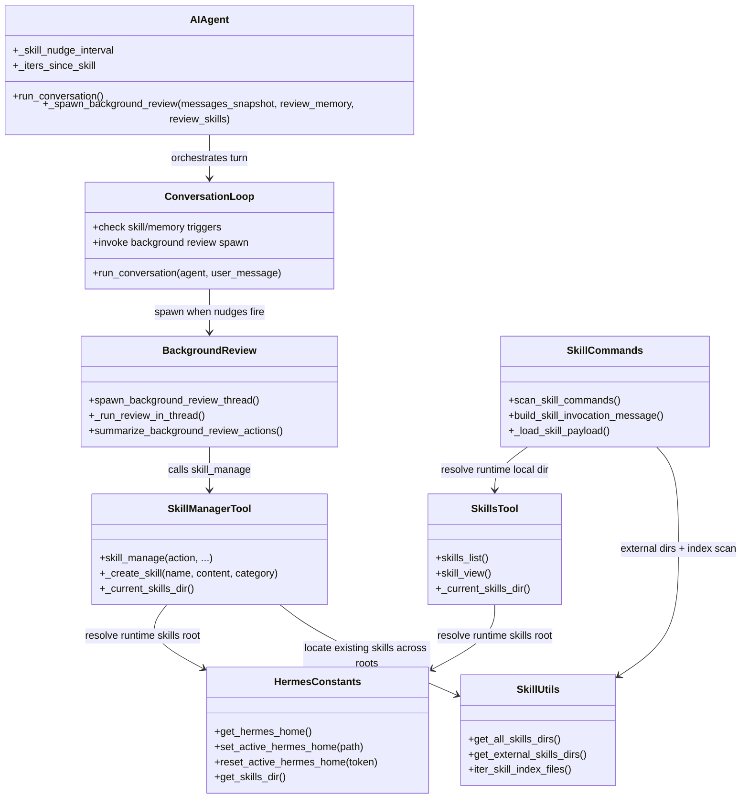
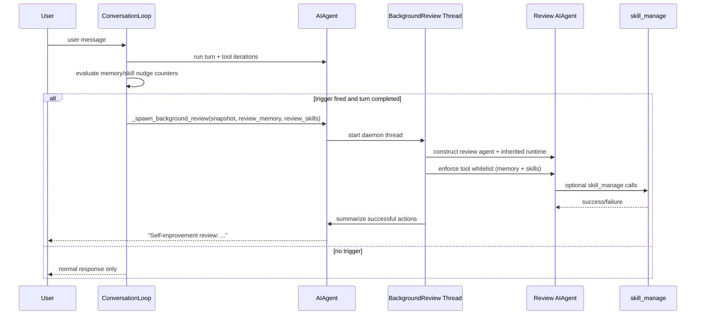
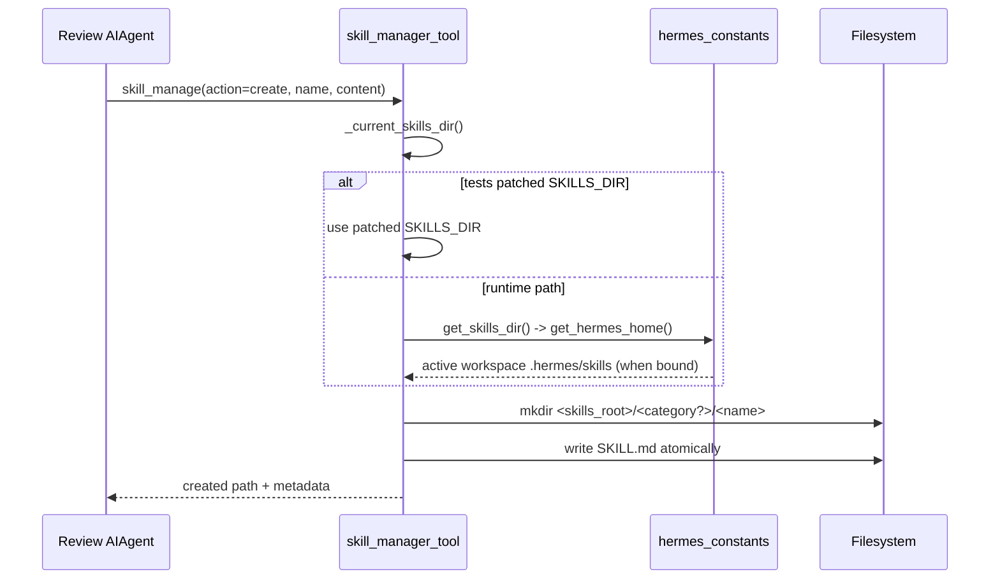

# Hermes-Agent Self-Improvement Design

## Document Status
- Status: Implemented + documented
- Last updated: 2026-06-16
- Audience: Hermes core maintainers, Semantier runtime maintainers, gateway/runtime integrators

## Purpose
This document specifies:
- how the Hermes self-improvement cycle works end-to-end,
- how the cycle is triggered,
- how a skill file is created from the background review fork,
- and how Semantier changed skill path resolution compared to original upstream Hermes behavior.

The focus is the skill side of self-improvement. Memory review is included only where needed to explain trigger and fork orchestration.

## Scope
In scope:
- Triggering logic for background review
- Background review execution model
- Skill creation/mutation path selection
- Skill discovery path selection
- Upstream-vs-Semantier behavior comparison

Out of scope:
- Curator consolidation policy details
- Skill quality rubric content
- Full memory provider internals

## Canonical Components
- `agent/conversation_loop.py`
- `agent/background_review.py`
- `run_agent.py`
- `agent/agent_init.py`
- `tools/skill_manager_tool.py`
- `agent/skill_commands.py`
- `tools/skills_tool.py`
- `agent/skill_utils.py`
- `hermes_constants.py`

## System Overview
Hermes self-improvement is a post-response background cycle:
1. Main turn executes normally.
2. If trigger thresholds are met, Hermes spawns a daemon review thread.
3. The review thread runs a forked `AIAgent` with restricted tool access (memory + skills).
4. The review agent may call `skill_manage` (create/edit/patch/write_file/remove_file/delete).
5. Successful writes are persisted and surfaced back as a compact summary message.

The key safety model is separation:
- foreground conversation remains responsive,
- review runs best-effort,
- tool whitelist limits review blast radius.

## Trigger Model
Default trigger cadence is configured during agent initialization:
- `memory.nudge_interval` -> `agent._memory_nudge_interval` (default 10)
- `skills.creation_nudge_interval` -> `agent._skill_nudge_interval` (default 10)

Skill review trigger in the default runtime path is checked at end of turn based on tool-iteration count:
- requires `agent._iters_since_skill >= agent._skill_nudge_interval`
- requires `skill_manage` to be present in valid tool names

When either memory or skill trigger is true, Hermes calls:
- `agent._spawn_background_review(messages_snapshot, review_memory, review_skills)`

## Background Review Execution
Background review is implemented as a forked `AIAgent` in a daemon thread.

Key execution properties:
- parent runtime is propagated into the review fork,
- if parent uses `codex_app_server`, review fork downgrades to `codex_responses` so Hermes tool dispatch remains available,
- review tool whitelist is constrained to memory + skills,
- review fork has self-nudges disabled (`_memory_nudge_interval = 0`, `_skill_nudge_interval = 0`) to prevent recursive review spawning,
- summary of successful review actions is emitted back to user surfaces.

## Upstream Baseline Design (Before Semantier Change)
Original upstream assumption for agent-created skills:
- write target for `skill_manage(action="create")` is local Hermes home skills root,
- practically expressed as `~/.hermes/skills/` in user-facing docs,
- external skills directories (`skills.external_dirs`) are scanned for discovery but treated as read-only sources for creation.

This baseline is valid in a single-home runtime model.

## Problem in Workspace-Scoped Runtime
Semantier binds Hermes execution to workspace-scoped homes (for example: `workspaces/<workspace_id>`).

The observed issue:
- parts of self-improvement skill handling used import-time `SKILLS_DIR` constants,
- when request/session context switched active Hermes home, those static paths could keep pointing to platform-level home,
- background self-improvement could create skills under platform-level `.semantier-home/skills` instead of workspace `.hermes/skills`.

Impact:
- skill artifacts were persisted outside governed workspace boundary,
- discovery consistency depended on mixed static/dynamic resolution paths,
- ownership/isolation expectations in multi-workspace runtime were violated.

## Semantier Design Change

### Design Goal
Make skill creation and discovery pathing follow active Hermes home at runtime, while preserving test monkeypatch hooks and external-skill scan behavior.

### Implemented Changes

1. `tools/skill_manager_tool.py`
- Added runtime resolver `_current_skills_dir()`.
- Resolver behavior:
  - if test patched `SKILLS_DIR`, respect patched value,
  - otherwise derive from `hermes_constants.get_skills_dir()` at call time.
- Replaced static `SKILLS_DIR` usage in create/mutation helpers with runtime-resolved local skills root.

2. `agent/skill_commands.py`
- Replaced static local root references with runtime local root from `tools.skills_tool._current_skills_dir()`.
- Slash-command scan now explicitly uses:
  - active workspace local skills dir first,
  - then configured external dirs.
- Skill payload loading and relative path normalization now resolve against runtime local root.

3. Regression tests
- Skill creation test verifies active workspace Hermes home receives created skill.
- Discovery test verifies scanner includes both:
  - workspace-local skills,
  - platform/external skill directories.

## Before vs After Comparison

| Area | Upstream baseline | Semantier updated behavior |
|---|---|---|
| Local write root for create | Local Hermes home, commonly `~/.hermes/skills` | Active runtime Hermes home `get_skills_dir()` (workspace-scoped when bound) |
| Path binding time | Some import-time constants | Runtime resolution for creation and command discovery |
| External dirs | Discovery scan source | Same, unchanged |
| Priority | Local then external | Same, unchanged |
| Workspace isolation | Best-effort depending on env setup | Deterministic via context-aware runtime path resolution |

## Class Diagram

## Sequence Diagram: Trigger and Review Cycle

## Sequence Diagram: Skill Creation Path Resolution

## Invariants After Change
- Self-improvement create writes to active runtime local skills root.
- Discovery scan includes runtime local root plus configured external roots.
- External roots remain discovery sources; they are not default create targets.
- Existing test monkeypatches that override `SKILLS_DIR` remain valid.

## Operational Notes
- This design assumes workspace binding is established before turn execution via Hermes home context/env setup.
- If no workspace binding is active, behavior naturally falls back to profile/global local home.

## Validation Evidence
- Focused tests passed for updated modules:
  - `hermes-agent/tests/tools/test_skill_manager_tool.py`
  - `hermes-agent/tests/agent/test_skill_commands.py`
- Added regressions cover:
  - workspace-scoped create target,
  - mixed local + external skill discovery scan.

## Migration and Compatibility
- No schema/data migration required.
- Backward-compatible for single-home upstream usage.
- Multi-workspace runtime now deterministic for self-improvement skill persistence.

## Risks and Follow-ups
Potential follow-up hardening:
- Audit other modules for import-time path constants that should be runtime-resolved.
- Add an integration test that runs full background review fork in workspace-bound gateway context and asserts artifact location.
- Update user/developer-facing docs that still hardcode `~/.hermes/skills/` as universal target in workspace-bound deployments.
