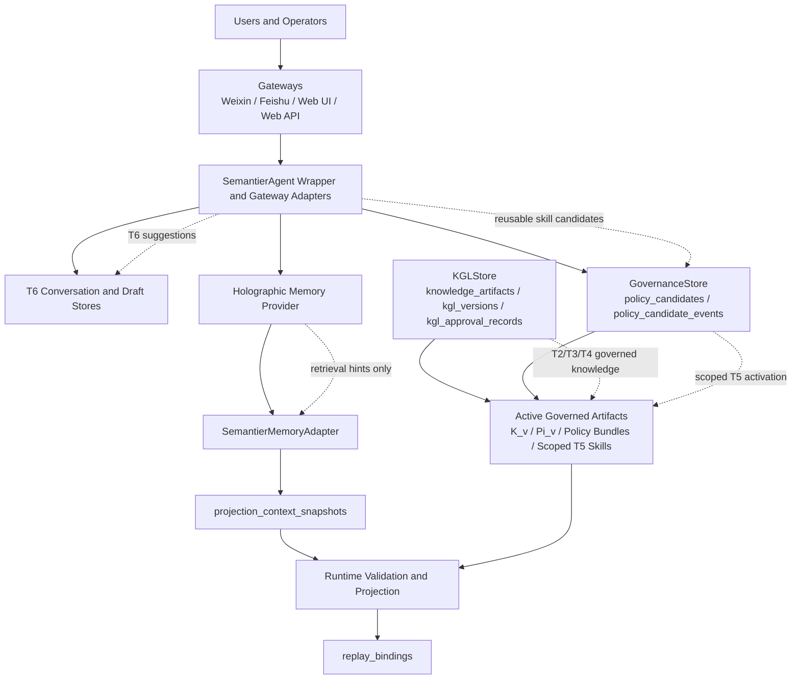
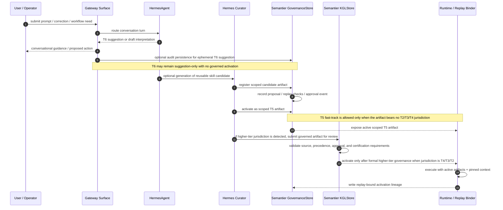
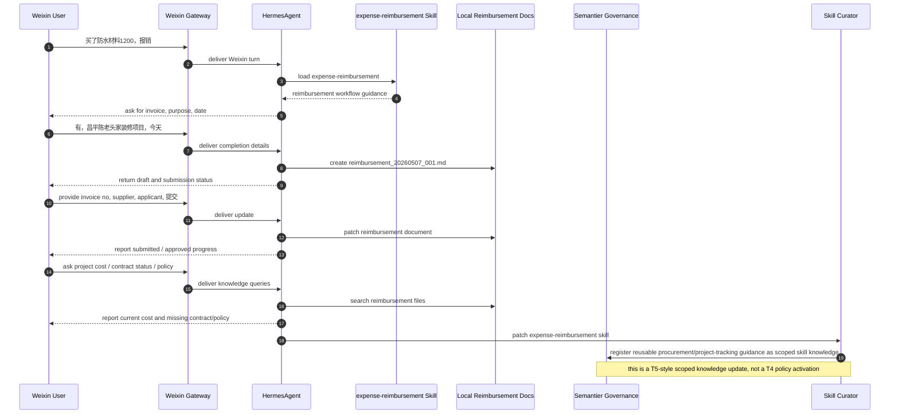
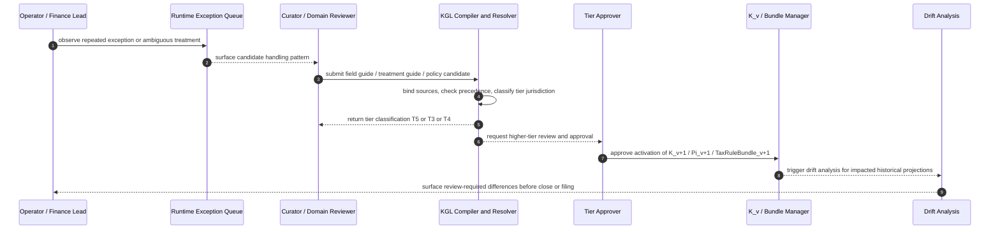
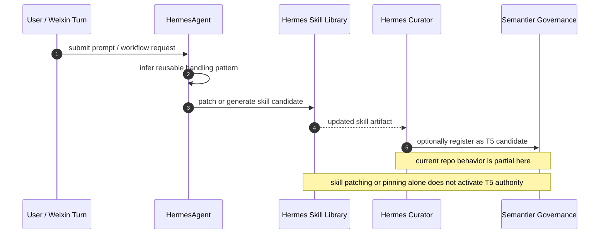
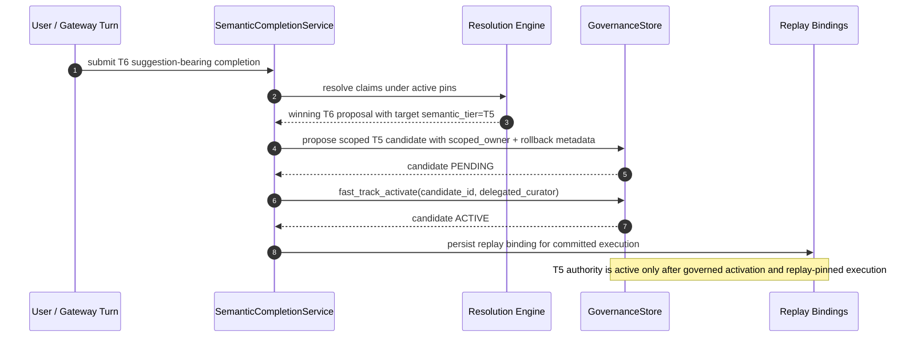

# Knowledge Tier Implementation Spec

Status: Draft derived implementation contract for tier-aware knowledge governance runtime.
Authority: Derived implementation contract. `architecture.md` remains the canonical runtime contract.
Scope: Tier-aware governance workflows, promotion rules, runtime artifact handling, and implementation-facing knowledge-governance mechanics.
Upstream sources:
- [Document Authority And Versioning](../canonical/document-authority-and-versioning.md)
- [architecture.md](../canonical/architecture.md)
- [semantier_eos_v2_1.md](../white-paper/semantier_eos_v2_1.md)
- [semantier-agentic-system-methodology-12345.md](../white-paper/semantier-agentic-system-methodology-12345.md)

Version interpretation:
- doctrinal law: `v2.1`
- repository runtime contract: `v8.x` as realized in `architecture.md`

This document specializes the runtime contract for knowledge-tier governance. It should not redefine global runtime terms where `architecture.md` already acts as source of truth.

Related contract:
- [knowledge-entitlement-contract-schema.md](knowledge-entitlement-contract-schema.md)

## 1. Scope and Intent

This specification defines how each semantic tier T1-T6 is produced, reviewed, promoted, activated, and retired in Semantier-EOS.

This document is implementation-focused and complements:
- Runtime architecture: [architecture.md](../canonical/architecture.md)
- Operational doctrine: [semantier_eos_v2_1.md](../white-paper/semantier_eos_v2_1.md)

Core intent:
- Enforce tier-aware governance rigor (not one uniform approval process).
- Reuse Hermes agentic curation workflows where appropriate.
- Keep runtime authority deterministic, replayable, and hash-pinned.

White-paper principle anchor:
- This spec is an implementation of the canonical three-loop doctrine defined in [semantier_eos_v2_1.md](../white-paper/semantier_eos_v2_1.md), Section 4 (Knowledge Governance Layer):
	- Deduction Loop: Ontology -> Policy -> Action
	- Induction Loop: Data -> Pattern -> Ontology or Rule Proposal
	- Governance Loop: Justification -> Validation -> Approval

## 2. Authority and Tier Principles

Canonical tiers:
- T1: ontology primitives
- T2: law and regulation
- T3: standards and professional doctrine
- T4: organizational policy
- T5: management preference
- T6: agent or user suggestion

### 2.0.1 Dual-Axis Model (Authority Tier + Fact Maturity)

To avoid mixing jurisdiction authority with data volatility, runtime classification should use two axes:

1. **Semantic authority tier axis** (existing): `T0..T6` where higher authority constrains lower authority.
2. **Fact maturity axis** (new): `C0..C3` where higher stage means stronger admission/governance completion.

Recommended maturity stages:

- `C0_CAPTURED`: raw intake, conversation-local or ingestion-local candidate.
- `C1_VALIDATED`: parsed and schema-valid, not yet governance-admitted.
- `C2_APPROVED`: governance-approved with fact admission eligible or completed.
- `C3_MATERIALIZED`: persisted governed outcome with replay/audit lineage complete.
- `REJECTED`: governed rejection terminal state.

Projection/trust failures after fact admission should be modeled as projection status (for example `PROJECTION_EXCEPTION`), not as a separate stored C-axis stage.

Canonical state contract note:

- The normative transition model and retry semantics are defined in [t6_materialization_pipeline_modes.md](t6_materialization_pipeline_modes.md), Section 4.2.

Design rule:

- **Do not overload semantic tier to represent lifecycle volatility.**
- Volatility and admission state belong to the `C*` axis.
- Jurisdiction and conflict precedence belong to the `T*` axis.

Operational implications:

- A claim can be `T0` on authority axis while still only `C1_VALIDATED` on maturity axis if it is not committed yet.
- A `T6` suggestion can move from `C0_CAPTURED` to `C2_APPROVED` during completion/validation without becoming authoritative until governed promotion.
- Promotion logic should evaluate both axes: authority admissibility (`T*`) and lifecycle readiness (`C*`).

### 2.0.2 Axis Mapping for Typical Runtime Artifacts

| Artifact | Authority tier axis | Fact maturity axis | Notes |
|---|---|---|---|
| Raw chat reimbursement text | `T6` | `C0_CAPTURED` | Suggestion/intake only |
| Parsed REA draft candidate | `T6` or proposed `T0` claim | `C1_VALIDATED` | Structured but not committed |
| Evidence-backed REA claim candidate | proposed `T0` claim | `C2_APPROVED` | Approved for fact admission |
| Committed `rea_claims` fact | `T0` | `C3_MATERIALIZED` | Governed fact commit remains C3 |
| Projected ledger artifact (`journal_voucher_projections`, `general_ledger_views`, trial-balance views) | typically `T4` adopted organizational accounting policy execution under `T2/T3` constraints | `C3_MATERIALIZED` when persisted with replay lineage | Projection output is governed derived representation, not ontology primitive |

Projected ledger classification clarification:

- **Authority axis:** projected ledger is not `T0` evidence and not `T6` suggestion; it is runtime execution output governed by active bundle/policy context, typically treated as organizational accounting policy surface (`T4`) constrained by `T2/T3`.
- **Maturity axis:** before persistence it is pre-commit (`C1_VALIDATED/C2_APPROVED` depending on validation and approval stage); once committed with replay/audit bindings it is `C3_MATERIALIZED`. Projection failure after commit is represented in projection/trust status, not by changing C-axis stage.

White-paper jurisdiction anchor:

> "higher tiers define jurisdictional boundaries"  
> "lower tiers operate only within the residual space left by higher tiers"  
> — [semantier_eos_v2_1.md](../white-paper/semantier_eos_v2_1.md)

> "T2 / T3 / T4 carry jurisdictional authority. T5 may optimize only within that jurisdictional envelope. T6 may suggest, but may not define jurisdiction."  
> — [semantier_eos_v2_1.md](../white-paper/semantier_eos_v2_1.md)

Authority rule:
- Promotion rigor must increase with authority impact.
- T6 and T5 support lightweight lifecycle automation.
- T1 and T2 require strict formal governance.
- Tier order is not only rank ordering. It is a top-down jurisdiction chain.
- Lower-tier knowledge may fill gaps, package workflows, and optimize local operation, but it must not weaken or silently redefine higher-tier obligations.
- T5 may move fast because it does not bear T2/T3/T4 jurisdiction.
- T6 may propose, but runtime authority exists only after materialization into a governed artifact.
- Law 1: user identity, organization association, membership, and active authority context are not T6-discoverable facts. They must come from governed authority sources such as authenticated session state, governed organization registry, and explicit membership records.
- Therefore LLM inference, retrieval memory, `USER.md`, workspace-local prompt state, and user self-claim alone must not create, override, or reactivate identity or organization authority context.

## 2.1 Context Influence Sources

The runtime may be influenced by many context sources, but they are not equal.

```mermaid
flowchart TD
    subgraph A["Governed Authority Sources"]
        A1["Authenticated session state<br/>tag: identity_authority<br/>tier: not T6-discoverable"]
        A2["Governed organization registry<br/>tag: org_authority<br/>tier: authority boundary"]
        A3["Explicit membership records<br/>tag: membership_authority<br/>tier: authority boundary"]
        A4["Active governed artifacts in K_v / eos.db<br/>tag: T1/T2/T3/T4/T5(active)"]
        A5["Replay-pinned projection_context_snapshot<br/>tag: admitted_context_record"]
    end

    subgraph B["Operational Runtime Context"]
        B1["Gateway request context<br/>tag: operational_context"]
        B2["Workspace resolution<br/>tag: operational_context"]
        B3["Session-local conversation history<br/>tag: conversational_context / T6"]
        B4["Tool outputs<br/>tag: runtime_observation"]
    end

    subgraph C["Candidate / Advisory Context Only"]
        C1["LLM inference<br/>tag: suggestion / T6"]
        C2["User self-claim<br/>tag: suggestion / T6"]
        C3["Hermes memory retrieval<br/>tag: contextual_memory / T6"]
        C4["USER.md / MEMORY.md<br/>tag: unmanaged_memory / T6"]
        C5["Workspace-local prompt state or local skills<br/>tag: local_operational_state"]
        C6["Session search / prior transcripts<br/>tag: historical_context / T6"]
        C7["SemantierMemoryAdapter input before admission<br/>tag: retrieval_candidate / T6"]
    end

    subgraph D["External Integration Context"]
        D1["Copilot ACP / external model prompt forwarding<br/>tag: external_transport_context"]
        D2["GitHub / CI / exported artifacts<br/>tag: externalized_context"]
    end

    A1 --> R["Runtime decision surface"]
    A2 --> R
    A3 --> R
    A4 --> R
    A5 --> R

    B1 --> R
    B2 --> R
    B3 -. may originate proposal only .-> P["T6 capture / candidate proposal"]
    B4 -. may supply evidence or observation .-> P

    C1 -. never authority by itself .-> P
    C2 -. never authority by itself .-> P
    C3 -. candidate only .-> P
    C4 -. candidate only .-> P
    C5 -. cannot override org authority .-> P
    C6 -. recall only .-> P
    C7 -. must pass admissibility + snapshotting .-> P

    P --> G["Governance / approval / activation"]
    G --> A4

    D1 -. may leak context if not minimized .-> X["External exposure boundary"]
    D2 -. may leak context if exported .-> X
```



Interpretation:
- `A` sources may define identity, organization association, active authority context, and governed runtime meaning.
- `B` sources may influence execution framing, but do not independently create institutional authority.
- `C` sources are `T6` or lower-confidence candidate inputs unless they are materialized, reviewed, approved, and activated into governed artifacts.
- `D` sources are not authority sources at all; they are transport or export boundaries and must be treated as possible leak surfaces.

## 3. Tier-by-Tier Technical Implementation

## 3.1 T6 Agent or User Suggestion

Purpose:
- Capture ephemeral exploratory and adaptive signals produced in conversation or local interaction context.
- T6 is conversational and suggestion-oriented by default, not durable scoped operating knowledge.

Primary producers:
- LLM in-conversation suggestions and draft interpretations
- User prompts, inline corrections, and operator annotations
- Retrieval hints or contextual suggestions surfaced through SemantierMemoryAdapter
- Pre-skill agent proposals before they are accepted as reusable artifacts

Storage artifacts:
- sqlite candidate/governance records for suggestion capture
- conversation-linked rationale snippets, source references, and proposal payloads
- optional refs to downstream Hermes-generated skill candidates derived from the suggestion

Lifecycle mechanism:
- T6 artifacts are ephemeral by default.
- They may remain session-local, expire, or be captured as governed promotion candidates.
- If persisted beyond a session, ttl/expiration behavior should be lightweight and automatic.
- Pinning or conversational acknowledgement may preserve discoverability, but does not itself convert T6 into authoritative runtime knowledge.

Governance and promotion:
- T6 is non-authoritative by default.
- T6 may be promoted directly to T5 when all of the following are true:
  - the suggestion is materialized into reusable user-scoped or organization-scoped knowledge such as a Hermes-generated skill or operating preference,
  - the resulting artifact is scoped as personal, team, or organization knowledge rather than institutional authority,
  - a Semantier governance record captures the promotion and resulting scoped activation.
- T6 must not directly activate T2/T3/T4 institutional authority without stronger formal governance.

Required controls:
- ttl-based expiration for persisted T6 artifacts is recommended.
- conversational acceptance alone does not equal institutional authority activation.
- Hermes curator pin or unpin does not by itself constitute T5 activation or higher-tier promotion.
- all persisted transitions and promotions must emit audit events.

Routing rule:
- Route `T6 -> T5` through the Hermes skill path when the artifact changes execution behavior only, such as prompting order, workflow orchestration, formatting, or reusable procedural handling.
- Route `T6 -> T5` through the Semantier governance path when the artifact changes scoped semantic defaults, approval preferences, categorization behavior, or other governed meaning used at runtime.
- If one proposal contains both procedural behavior and governed semantic meaning, split it into two linked artifacts and govern them separately.

## 3.2 T5 Management Preference

Purpose:
- Support reusable user-scoped or organization-scoped operating knowledge.
- T5 includes management preferences, accepted operating defaults, and Hermes-generated skills that have been accepted for repeated use by a user or organization.

Scope disambiguation:
- **T5(org)**: organization-scoped management preferences and policies shared across all users in an organization.
- **T5(user)**: user-scoped personal preferences that may refine T5(org) defaults within the non-conflicting residual space.
- T5(org) and T5(user) both remain below T4/T3/T2 jurisdiction; neither may weaken higher-tier constraints.
- When T5(org) and T5(user) conflict, precedence is resolved via `TierPrecedencePolicy_v` (see [architecture.md](../canonical/architecture.md) Level 5.5) pinned in replay bindings.
- The precedence policy version used at execution time is recorded in `replay_bindings` for deterministic historical replay.

Primary producers:
- Promoted T6 conversational suggestions
- Management or finance BP preference proposals
- Hermes-agent auto-generated skills accepted by the user or organization
- Curator-assisted conversion of repeated conversational patterns into reusable scoped skills

Storage artifacts:
- sqlite candidate/approval/activation records for scoped reusable knowledge
- managed skill or preference artifacts under governed path
- optional links to Hermes skill IDs, versions, hashes, and scoped ownership metadata
- audit linkage to the originating T6 conversation or proposal where applicable

Lifecycle mechanism:
- T5 artifacts are durable relative to T6, but still lifecycle-managed.
- States may include candidate, approved, active, stale, deprecated, or archived depending on implementation surface.
- Hermes curator actions may affect availability and discoverability of the skill artifact, but runtime semantic authority must still follow Semantier activation records.

Governance and promotion:
- Lightweight activation is allowed because T5 is scoped preference knowledge rather than institutional policy.
- Fast-track activation is appropriate when the resulting artifact does not bear T2/T3/T4 jurisdiction and remains clearly scoped and reversible.
- For Hermes-generated skills, curator may participate in packaging, reviewing, pinning, or surfacing the artifact, but Semantier remains the system of record for T5 activation.
- pin or unpin is allowed for availability control and must produce immutable audit records.
- post-activation audit checks are recommended for reusable skills affecting repeated workflow behavior.

Required controls:
- reversible activation (rollback path)
- no override of T2/T3/T4 in conflict resolution
- scoped ownership must be explicit: personal, team, or organization
- periodic stale, deprecation, or archive transitions should be enforced for unused or superseded skills/preferences

## 3.3 T4 Organizational Policy

Purpose:
- Internal control rules, approval policies, and organizational governance constraints.

Primary producers:
- Policy authoring workflows
- Controlled promotion from T5

Technical stack:
- Rego policy files (policy candidates)
- Semantier embedded policy runtime compatibility checks
- sqlite governance records for approvals and activation
- knowledge files for policy rationale and source traceability
- holographic provider only as context retrieval, never direct authority

Governance and promotion:
- assurance profile HIGH
- staged activation required
- dual-role approval at minimum (policy_owner + control_owner)
- governance_chair co-sign where impact scope is cross-domain

Required controls:
- policy parse and deterministic evaluator compatibility check
- test matrix pass (positive and negative cases)
- replay dry-run and hash pin
- promotion events emitted and linked to activation

## 3.4 T3 Standards and Professional Doctrine

Purpose:
- Governed use of professional doctrine and implementation standards.

Primary producers:
- Field-guide compilers
- Domain controllers
- Controlled promotion from T5 or curated external doctrine sources

Technical stack:
- Knowledge files with source hash, section references, and authority roles
- sqlite KGL records (knowledge_context and artifact linkage)
- optional Rego projection guards where doctrine is executable
- holographic retrieval for source discovery only

Governance and promotion:
- assurance profile HIGH
- domain-owner review required
- staged activation preferred

Required controls:
- source precedence checks against T2
- doctrine cannot override T2 law or regulation
- replay-pin compatibility required for executable outcomes

## 3.5 T2 Law and Regulation

Purpose:
- Binding legal and regulatory constraints.

Primary producers:
- Statutory ingest workflows
- Compliance curation workflows

Technical stack:
- Rego constraints (or equivalent deterministic policy artifacts)
- sqlite governance chain with legal provenance
- source registry with jurisdiction and effective windows
- immutable knowledge files containing legal references and hashes

Governance and promotion:
- assurance profile CRITICAL
- legal_owner + compliance_owner dual-control required
- gated release activation only

Required controls:
- strict source authenticity and effective-date validation
- mandatory certification before activation
- mandatory replay and export verification compatibility
- no fast-track path

## 3.6 T1 Ontology Primitives

Purpose:
- Define primitive semantic structure and invariants.

Primary producers:
- Ontology maintainers and architecture governance workflows

Technical stack:
- Ontology files (versioned schemas and primitive definitions)
- sqlite activation and non-interference records
- compatibility reports against K_v, Pi_v, constraints, and replay contracts

Governance and promotion:
- assurance profile CRITICAL
- ontology_owner + architecture_governor required
- gated release activation only

Required controls:
- primitive non-redefinition checks
- semantic consistency matrix revalidation
- downstream compatibility and non-interference replay verification
- no fast-track path

## 4. Three-Loop Runtime Mapping by Tier

This section is a direct runtime realization of the white-paper three-loop principles in [semantier_eos_v2_1.md](../white-paper/semantier_eos_v2_1.md).

Deduction loop:
- Runtime consumes only ACTIVE artifacts pinned by replay bindings.
- T1-T4 influence deterministic validation and projection contracts.
- T5 influences configurable management behavior within authority bounds.
- T6 influences execution only after materialization and governed activation as T5.

Induction loop:
- T6 and T5 are primary induction lanes.
- projection exceptions, user feedback, and recurrent drift create candidates.
- holographic retrieval assists context discovery through SemantierMemoryAdapter.

Governance loop:
- lifecycle status, approval transitions, and activation records are append-oriented and auditable.
- promotion rigor depends on whether the target artifact bears T2/T3/T4 jurisdiction or remains scoped T5 knowledge.

Canonical equivalence mapping:
- Deduction (white paper): Ontology -> Policy -> Action
	- Runtime equivalent: O_v + K_v + C_v + Pi_v + ACTIVE constraints -> deterministic validation and execution.
- Induction (white paper): Data -> Pattern -> Ontology or Rule Proposal
	- Runtime equivalent: feedback and drift signals -> T6 conversational suggestions, governed candidates, KGL artifacts, or policy candidates (non-authoritative until approved or activated).
- Governance (white paper): Justification -> Validation -> Approval
	- Runtime equivalent: candidate rationale -> validation checks / replay checks / approval transitions -> activated artifact + replay pin.

### 4.1 Loop Traceability Matrix

This matrix binds white-paper principles to concrete implementation surfaces.

| White-paper loop principle | Primary SQLite tables | Mandatory event families | Runtime function anchors |
|---|---|---|---|
| Deduction: Ontology -> Policy -> Action | knowledge_artifacts, kgl_versions, policy_candidates, projection_context_snapshots, replay_bindings | ACTIVATED, APPROVED, REPLAY_BOUND | validate_tiered(), load_embedded_policy(), evaluate_embedded_policy(), run_projection() |
| Induction: Data -> Pattern -> Ontology or Rule Proposal | semantic draft/message stores, policy_candidates, policy_candidate_events, knowledge_artifacts | PROPOSED, REPLAY_RECORDED, REJECTED | SemanticCompletionService, SemantierMemoryAdapter, SemantierAgent wrapper |
| Governance: Justification -> Validation -> Approval | kgl_approval_records, policy_candidates, policy_candidate_events, replay_bindings | APPROVED, ACTIVATED, SUPERSEDED | GovernanceStore, KGLStore, replay binding writers |

Traceability requirements:
- Every active runtime constraint must be traceable to a governed artifact, approval transition, and replay pin.
- Every induction-origin candidate must carry source channel or originating workflow context plus content hash where persisted.
- Every governed transition must emit at least one append-oriented event or approval record.

## 4.2 Knowledge Management Technical Architecture

Semantier knowledge management is implemented as a layered subsystem rather than a single table or single memory surface.



Core components:
- `SemantierAgent` wrapper and gateway adapters: originate conversational suggestions, tool usage, and reusable skill generation requests while bridging into upstream hermes-agent.
- semantic completion and conversation stores: hold in-flight user interaction context, draft payloads, and conversational T6 material before or during governance capture.
- `SemantierMemoryAdapter`: mediates holographic retrieval into admissible projection context snapshots.
- holographic provider boundary: retrieval-only substrate that may supply hints and source context but may not define authority.
- `KGLStore`: governs T2-T6 knowledge artifacts and materialized `K_v` knowledge contexts.
- `GovernanceStore`: governs reusable candidate artifacts and activation history for policy bundles, ontology entries, COA versions, and the nearest current runtime surface for scoped T5 activation.
- projection and validation runtime: consumes only active/pinned artifacts plus immutable context snapshots.
- replay binding writers: bind committed runtime results to the precise semantic versions and hashes used at execution time.

Authority boundaries by component:
- Hermes and gateway surfaces may originate T6 and package T5 candidates, but they do not define final semantic authority.
- `SemantierMemoryAdapter` may admit context for projection, but it does not upgrade retrieval into governed knowledge by itself.
- `KGLStore` and `GovernanceStore` are the persistent governance surfaces where knowledge becomes reviewable, activatable, and auditable.
- projection and validation runtime consume governed outputs; they do not consult live retrieval or live curator state as authority.

Canonical runtime objects:
- `T6 conversation suggestion`: ephemeral, conversation-bound, optionally persisted for audit or later promotion.
- `T5 scoped reusable artifact`: accepted user/team/org skill or operating preference, governed as a scoped reusable artifact.
- `knowledge_artifact`: KGL unit representing governed domain knowledge with source hash, semantic tier, and approval state.
- `K_v`: knowledge context snapshot built from approved/active governed artifacts.
- `projection_context_snapshot`: immutable record of adapter-admitted retrieval context.
- `replay_binding`: immutable execution-time semantic pin set for later replay and audit.

End-to-end flows:

T6 conversational path:
- user or agent interaction occurs through Weixin, Feishu, Web UI, or Web API
- runtime stores draft/message context
- suggestion remains T6 unless materialized into a governed artifact
- optional audit capture records source channel, rationale, and content hash

T6 to T5 scoped skill path:
- conversational pattern or agent output suggests a reusable behavior
- Hermes may generate a candidate skill artifact
- Semantier records it as a governed scoped candidate
- fast-track activation is allowed only if the artifact stays outside T2/T3/T4 jurisdiction
- resulting T5 artifact becomes available for repeated use and remains reversible

T2/T3/T4 governed knowledge path:
- authoritative or interpretive source enters KGL ingestion
- source hash, authority domain, semantic tier, and extracted claims are recorded
- review transitions are written to `kgl_approval_records`
- approved active artifacts are materialized into `K_v`
- executable bundles or policies are activated only after deterministic checks and replay compatibility

Projection-time context path:
- runtime requests context through holographic provider
- `SemantierMemoryAdapter` filters, rejects, and admits only allowed context
- admitted context is frozen in `projection_context_snapshots`
- projection and validation run using pinned versions plus snapshot hash
- final execution writes `replay_bindings`

Cross-gateway architecture rule:
- all channel surfaces must terminate into the same governance stores, memory-adapter boundary, validation runtime, and replay-binding logic
- gateway-specific UX may differ, but knowledge activation semantics must not diverge by channel

Gateway parity contract:
- A governance action submitted through Weixin, Feishu, Web UI, or Web API must emit the same canonical event family sequence for the same semantic outcome, even if conversational transcripts differ.
- At minimum, parity-sensitive actions are:
  - persisted `T6` capture,
  - `T6 -> T5` scoped activation,
  - higher-tier candidate submission,
  - approval,
  - activation,
  - replay binding write.
- Gateway adapters may add channel metadata, but they must not skip mandatory governance writes.
- Every adapter implementation must be testable against a canonical expected event trace.

### 4.2.1 Tier Promotion Sequence



### 4.2.2 KGL Internal Components

KGL remains the semantic authority formation layer inside the broader knowledge-management subsystem.

KGL input classes:

| Input class | Examples | Runtime authority |
|---|---|---|
| Authoritative sources | laws, regulations, tax authority announcements, accounting standards | May define binding constraints after governance |
| Interpretive sources | field guides, implementation notes, professional commentary | Support interpretation; never override higher authority |
| Validation feedback | rejected justifications, exception cases, human overrides, audit adjustments | Produces rule-gap or ontology-gap candidates |
| Induction feedback | recurring REA patterns, drift signals, repeated exceptions | Produces pattern candidates only |
| Current semantic context | `O_v`, `C_v`, `Pi_v`, active `K_v` | Frame for evaluating change |

Source Registry:
- stores immutable, citable source anchors
- records jurisdiction, effective window, authority level, URI, source hash, and source version
- does not make rules executable

Knowledge Compiler:
- transforms authoritative sources, interpretive sources, validation feedback, and induction feedback into structured governed candidates
- candidate output is non-executable until approved and included in active `K_v`, `Pi_v`, validation contracts, or cross-domain policy

Conflict Resolver:
- detects contradiction, overlap, precedence gaps, and scope ambiguity
- applies a white-paper-consistent precedence chain
- escalates to human governance when automatic precedence is insufficient

Induction Engine:
- converts repeated runtime failures, overrides, audit exceptions, and recurring patterns into candidate updates
- maintains the invariant: pattern is not rule; pattern must pass governance before execution

Bundle Manager:
- materializes approved knowledge into active `K_v`, governed bundles, and executable bundle references
- only active governed outputs may be consumed by runtime validation or projection

White-paper-consistent precedence baseline:

```text
law
  > regulation
  > official authority guidance
  > professional standard
  > board-approved policy
  > internal operating policy
  > management preference
  > agent suggestion
```

KGL source-resolution interpretation:
- interpretive sources such as field guides may support candidate construction and justification
- interpretive sources may not override higher-authority binding sources
- empirical induction patterns may suggest updates but may not define authority

Current implementation status:
- Phase-1 KGL source registration, governed admissibility policy, executable gateway parity coverage, and audit chaining are implemented in this repo.
- `KGLStore` persists immutable source registration metadata including jurisdiction, effective window, source version, anchors, extraction method, curator identity, and unresolved ambiguities.
- Higher-tier approvals persist deterministic precedence/conflict review records before activation.
- `SemantierMemoryAdapter` persists policy-versioned admissibility decisions and rejection summaries into `projection_context_snapshots`.
- Main EOS event streams and export bundles now carry deterministic hash-chain and lineage metadata sufficient for Phase-1 verification.
- Remaining follow-on work is future hardening of raw-document compilers and broader conformance coverage, not missing baseline Phase-1 enforcement.

Phase-1 KGL ingestion MVP workflow:
1. Source registration
- curator uploads a PDF or enters a canonical source URL
- curator sets jurisdiction, authority role, semantic tier hint, effective window, and source version label
- system generates `source_ref` and `source_hash`

2. Normalization
- system performs deterministic text extraction
- system detects page boundaries, headings, and anchor candidates
- system emits stable anchors such as `page:section:offset`

3. Candidate extraction
- dates, thresholds, enumerations, and table cells should use deterministic extraction first
- conditional logic and doctrinal summaries may use hybrid extraction or curator-marked spans
- if extraction is too ambiguous, the candidate must be flagged for governance review rather than silently normalized

4. Precedence check
- system surfaces active higher-tier and same-domain artifacts for comparison
- curator records whether conflict exists and, if yes, whether the candidate should be rejected, escalated, or proposed as superseding

5. Governed handoff
- governance record captures `source_ref`, extracted candidate payload, curator identity, extraction method, and timestamp
- the resulting candidate is auditable even if Phase 1 extraction remains partially manual

Phase-1 role expectation:
- the default curator should be a domain-capable operator such as compliance owner, finance domain reviewer, accounting reviewer, or explicitly delegated governance operator
- system administration alone is not sufficient qualification for higher-tier semantic curation

#### 4.2.2.1 KGL Compiler Detailed Spec

The KGL Compiler is the governed ingestion pipeline that converts raw documents and feedback signals into structured candidate artifacts.

It should produce candidate artifacts such as:
- `KnowledgeArtifactCandidate`
- `ConstraintCandidate`
- `ProjectionRuleCandidate`
- `KnowledgeContextDeltaCandidate`

It must not activate any of them directly.

Compiler inputs:
- PDF field guides
- HTML or web-based official guidance
- internal markdown or policy documents
- human annotations and curator notes
- validation failures and replay exceptions
- similar approved historical artifacts

Canonical compiler stages:

1. Source registration
- assign `source_ref`, `source_hash`, source URI, authority role, jurisdiction, effective date window, and version label
- bind source metadata before any semantic extraction begins

2. Raw document normalization
- PDF: extract text, page boundaries, headings, tables, footnotes, and quoted blocks
- HTML: extract DOM sections, headings, tables, lists, and anchor links
- normalize all source types into a common sectioned representation with stable anchors
- if OCR is required, OCR output is treated as probabilistic source text and must remain attributable to page or region coordinates

3. Section and span anchoring
- split normalized text into citable spans
- each span must keep:
  - `source_ref`
  - page, heading, or DOM anchor
  - character or block offsets where available
  - local content hash
- extraction output must cite spans, not only whole documents

4. Semantic candidate retrieval
- retrieve the most relevant normalized spans, existing active `K_v` artifacts, related projection rules, and similar historical cases
- this is where semantic search may be used to narrow extraction context
- retrieval is bounded and advisory only; it does not create authority

5. Structured extraction
- use deterministic parsing where possible for dates, thresholds, enumerations, tables, clause labels, and jurisdiction metadata
- use LLM or hybrid extraction for conditional logic, exceptions, cross-reference resolution, and doctrinal summaries
- every extracted rule candidate must include:
  - conditions
  - outcome
  - domain
  - semantic tier proposal
  - authority-role classification
  - cited source spans
  - extraction confidence

6. Candidate typing
- classify extracted material into:
  - claim
  - constraint
  - projection rule
  - interpretation note
  - exception pattern
- classify whether the candidate is:
  - binding
  - interpretive
  - empirical

7. Schema and ontology validation
- reject malformed candidates before governance review
- validate domain, tier, authority level, condition schema, outcome schema, and source citation completeness
- reject candidates that attempt to redefine ontology primitives or bypass `O_v` or `O_tag_v`

8. Resolver handoff
- emit only candidate artifacts into governed review queues
- no compiler output is executable until the Resolver and governance lifecycle complete

Canonical normalized source object:

```yaml
source_envelope:
  source_ref: string
  source_type: pdf | html | markdown | manual_note | validation_feedback
  authority_role: binding | interpretive | empirical
  semantic_tier_hint: T2 | T3 | T4 | T5 | T6
  jurisdiction: string
  effective_from: date | null
  effective_to: date | null
  content_hash: sha256
  sections:
    - section_id: string
      locator: page:12 | h2:Input VAT | dom:#section-3
      text: string
      local_hash: sha256
```

Canonical extracted candidate:

```yaml
rule_candidate:
  candidate_id: string
  candidate_type: constraint | projection_rule | interpretation_note
  authority_domain: tax | accounting | compliance | internal_control | management
  semantic_tier: T2 | T3 | T4 | T5 | T6
  authority_role: binding | interpretive | empirical
  conditions: object
  outcome: object
  source_spans:
    - source_ref: string
      section_id: string
      locator: string
      quote_hash: sha256
  extracted_by: parser | llm | hybrid | human
  confidence: decimal
  status: proposed
```

Extraction method for PDF or HTML field guides:
- not purely LLM
- not holographic-provider-only
- target architecture is hybrid:
  - deterministic normalization and citation anchoring first
  - bounded semantic retrieval second
  - LLM-assisted rule extraction third
  - deterministic schema and governance checks last

Role of `hermes-agent/plugins/memory/holographic` in compilation:
- it is not the raw PDF or HTML parser
- it is not the source of authority
- it may be used as a retrieval substrate to find relevant spans, approved precedents, org memory, or similar prior interpretations
- any retrieved context remains candidate context only and must pass `SemantierMemoryAdapter` or equivalent compiler-side admissibility checks before use

Compiler invariants:
- no raw PDF, HTML, OCR text, or LLM summary may directly become runtime rule
- every extracted candidate must cite anchored source spans
- interpretive guides may justify but may not outrank higher-tier binding sources
- extraction may be probabilistic; activation must be deterministic and governed

#### 4.2.2.2 Conflict Resolver Detailed Spec

The Conflict Resolver takes compiler output plus existing active knowledge and decides whether a candidate is admissible, superseding, conflicting, or escalation-required.

Resolver checks:
- source precedence
- jurisdiction scope
- effective date overlap
- semantic contradiction
- duplicate or near-duplicate extraction
- ontology compatibility
- cross-domain impact
- required approval depth by tier

Resolver decision order:

1. Source admissibility
- reject candidates with missing source registration, missing citation spans, or invalid authority classification

2. Jurisdiction classification
- determine whether the candidate bears `T2/T3/T4` jurisdiction or remains scoped `T5`
- if a candidate changes org-wide control, compliance obligation, or doctrinal treatment, it must escalate
- mandatory jurisdiction claim metadata must be present before activation:
  - scoped owner: personal | team | organization
  - affected workflow set
  - affected user or team count estimate
  - reversibility expectation and rollback path
  - whether the artifact constrains any workflow already governed by `T2`, `T3`, or `T4`
- minimum escalation heuristics:
  - if the artifact is deployed for operative use across more than one team, treat as at least `T4` review-required unless explicitly justified otherwise
  - if the artifact constrains a compliance, tax, accounting, internal-control, or approval workflow, it must not remain pure `T5`
  - if the artifact is referenced as mandatory language such as "must", "cannot", "required", or "forbidden" for org-wide behavior, it must escalate
  - if rollback cannot be completed within one business day without semantic or operational damage, fast-track `T5` activation is disallowed
  - if classification is uncertain, default to escalation rather than scoped activation

Jurisdiction calibration examples:

```yaml
t5_justified_cross_team_reference:
  artifact: finance_draft_cost_model
  scoped_owner: Finance
  usage_permission: advisory_only
  deployed_into_workflow: false
  binding_language: false
  rationale: shared as reference input; downstream teams may diverge without approval
  expected_outcome: MAY_REMAIN_T5_WITH_REVIEW_NOTE

escalate_to_t4_cross_team_control:
  artifact: no_material_purchase_before_contract_signed
  scoped_owner: Organization
  usage_permission: mandatory
  deployed_into_workflow: true
  binding_language: true
  rationale: constrains spend approval and purchasing workflow across teams
  expected_outcome: ESCALATE_TO_T4
```

3. Precedence resolution
- compare the candidate against active higher-tier and same-tier artifacts
- lower-tier candidates may fill residual space only
- lower-tier candidates must not weaken higher-tier obligations

4. Temporal resolution
- newer sources do not automatically win
- effectivity window, official supersession, and source versioning control temporal precedence

5. Semantic contradiction analysis
- identify contradictions such as:
  - opposite outcomes under equivalent conditions
  - broader rule masking narrower mandatory exception
  - interpretive note attempting to override binding text

6. Outcome classification
- `ALLOW_TO_GOVERNANCE_REVIEW`
- `ALLOW_AS_SUPERSEDING_CANDIDATE`
- `REJECT_CONTRADICTS_HIGHER_TIER`
- `REJECT_ONTOLOGY_OR_SCHEMA_VIOLATION`
- `ESCALATE_HUMAN_REVIEW_REQUIRED`

Human escalation is mandatory when:
- precedence is ambiguous
- multiple binding sources conflict
- field-guide text and authority guidance diverge materially
- the candidate appears to shift from scoped practice into org-wide policy
- extracted wording is too uncertain for deterministic activation

Jurisdiction drift detection:
- The Resolver must also support post-activation drift review for active `T5` artifacts.
- A `T5` artifact must be re-examined when any of the following occur:
  - usage expands from one user or team to multiple teams or org-wide deployment,
  - the artifact becomes a dependency of a workflow touching `T2`, `T3`, or `T4` governed controls,
  - repeated overrides, exceptions, or audit comments indicate the artifact is acting as policy rather than preference,
  - a higher-tier source is activated in the same authority domain,
  - the artifact is cited in training, onboarding, or compliance guidance as if it were mandatory.
- Minimum implementation requirement:
  - every active `T5` artifact must carry `last_jurisdiction_review_at`,
  - the system should run a periodic jurisdiction audit job over active `T5` artifacts,
  - audit output must be one of `NO_CHANGE`, `REVIEW_REQUIRED`, or `ESCALATE_TO_T4_OR_T3`.
- Phase-1 minimum audit cadence:
  - event-based trigger: on activation, on scoped owner change, and on expansion from one team to multiple teams,
  - threshold trigger: when usage exceeds configured `scoped_max_users` or `scoped_max_teams`,
  - time-based trigger: quarterly review of all active `T5` artifacts,
  - manual trigger: governance chair, compliance owner, or domain owner may request immediate re-review.
- Phase-1 execution model:
  - the periodic jurisdiction audit should run as a scheduled governance task on a configurable cadence,
  - event-based triggers should enqueue or invoke the same audit path rather than creating a separate decision mechanism,
  - audit output should be written to governed audit surfaces for later review.
- Phase-1 review consequence:
  - `REVIEW_REQUIRED` should block new scope expansion until re-review completes,
  - `ESCALATE_TO_T4_OR_T3` should route the artifact into formal governance review with explicit approver assignment.
- The drift detector may begin as heuristic and human-reviewed; it must still emit governed audit records.

Canonical resolver output:

```yaml
resolver_result:
  candidate_id: string
  decision: allow_review | allow_supersede | reject | escalate
  decision_reason: string
  winning_sources:
    - source_ref: string
      section_id: string
  blocked_by_sources:
    - source_ref: string
      section_id: string
      reason: higher_precedence | jurisdiction_conflict | temporal_conflict
  required_approver_roles:
    - string
  supersedes_artifact_ids:
    - string
```

Resolver relation to runtime retrieval:
- the Resolver should be able to use semantic retrieval to surface similar active artifacts or precedents
- this retrieval is still advisory only
- final conflict decisions must be recorded as governed resolver outputs, not left inside an LLM conversation state

Current gap:
- the repo has lifecycle stores for `knowledge_artifacts`, `kgl_versions`, and `policy_candidates`, but it does not yet implement this full compiler-resolver ingestion stack for raw field-guide PDFs or HTML documents
- that gap should be treated as an explicit refactoring target, especially for higher-tier source ingestion

#### 4.2.2.3 Ingestion Tooling Comparison and Recommendation

The Semantier document-to-knowledge-to-governance workflow should distinguish three different tool classes that are sometimes conflated:
- compiled markdown knowledge base tools
- retrieval engines over local corpora
- temporal memory graphs

They are complementary, not interchangeable.

`llm-wiki`-style workflow:
- best for compiling messy research into durable markdown pages, cross-links, and human-readable concept summaries
- strong fit for analyst or curator workbench flows
- weak as a direct governance substrate because markdown pages are not yet typed rule artifacts, precedence-checked bundles, or activation records
- recommended Semantier role: pre-KGL curation workspace for human and agent synthesis

`qmd`-style retrieval:
- best for local corpus indexing and search across notes, field guides, transcripts, and docs
- strong fit for lexical lookup, semantic search, reranking, and passage retrieval
- weak as a governance substrate because search results are retrieval outputs, not adjudicated knowledge objects
- recommended Semantier role: compiler-side retrieval layer for source discovery and span narrowing

`Graphiti`-style temporal knowledge graph:
- best for evolving agent memory, entity relationship tracking, temporal fact history, and provenance-aware retrieval over changing operational context
- strong fit for conversation memory, organizational memory, and temporal case linkage
- weak as the sole KGL authority layer because temporal memory facts and graph edges do not by themselves encode Semantier tier jurisdiction, resolver precedence doctrine, or governed activation workflow
- optional Semantier role: memory substrate adjacent to KGL when rich evolving agent memory is required; it is not required for governed lineage

Recommended Semantier architecture:

```text
raw pdf/html/doc sources
  -> normalization + anchoring
  -> qmd/holographic/graph retrieval for relevant passages and related memory
  -> llm/hybrid extraction into typed candidates
  -> KGL Compiler candidate schema validation
  -> KGL Resolver precedence and jurisdiction checks
  -> human governance where required
  -> ACTIVE K_v / ConstraintBundle_v / Pi_v / policy bundle
```

Recommended division of responsibility:
- `llm-wiki`: optional analyst-facing synthesis and curated intermediate knowledge workspace
- `qmd`: local search index over source corpora and curated notes
- `hermes-agent/plugins/memory/holographic`: runtime and compiler retrieval substrate over approved memory and KGL-adjacent context
- `Graphiti`: optional temporal memory graph for evolving entities, relationships, and episode provenance
- `KGL`: only layer allowed to grant governed semantic authority

Design recommendation:
- do not make `llm-wiki`, `qmd`, holographic retrieval, or Graphiti the authority system of record
- use them to improve discovery, compilation quality, provenance richness, and curator productivity
- require all executable rules and higher-tier releases to pass through typed KGL compilation, resolver checks, and tier-aware governance activation

Tier-oriented recommendation:
- `T6`: may be supported by Hermes conversation memory, holographic retrieval, and Graphiti episodic recall
- `T5`: may use Graphiti or wiki-backed memory to accumulate scoped operational know-how, but activation still belongs to Semantier governance
- `T4/T3/T2`: should rely on normalized source anchoring, compiler extraction, resolver precedence, and approval workflows; retrieval tools may assist but must not adjudicate

#### 4.2.2.4 Lineage and Provenance Model

For Semantier, the primary temporal requirement is governed lineage, not mutable agent memory.

White-paper alignment:
- the white paper requires version pins alongside every event, including `knowledge_context_version`, `constraint_bundle_version`, `precedence_graph_version`, `resolution_rules_version`, `projection_version`, and `projection_context_snapshot_hash`
- it further requires replay binding for trusted projections and cross-domain actions
- it also states that committed facts and trusted views should be written into append-only hash-linked histories

Therefore the implementation model should treat historical correctness as a provenance problem:

```text
journal entry / ledger event
  -> replay_binding
  -> projection_context_snapshot
  -> active projection bundle version
  -> active knowledge context version
  -> governing rule or policy artifact version
  -> cited source anchors and source versions
  -> field guide / accounting guide / authority text version
```

The question Semantier must answer is not merely:

```text
What is true now?
```

It must answer:

```text
Under which governed semantic versions was this JE projected at that time,
and under which cited source versions were those governed artifacts justified?
```

Explicit workflow separation:

Deduction loop:

```text
raw docs
  -> Qmd retrieval
  -> LLM-wiki synthesis and curation
  -> KGL Compiler extraction
  -> KGL Resolver
  -> governance approval
  -> ACTIVE artifacts
  -> holographic and SemantierMemoryAdapter for bounded runtime retrieval
```

Validation and replay lineage loop:

```text
JE / ledger event
  -> replay_binding
  -> projection_context_snapshot
  -> active bundle versions
  -> governed artifact version
  -> cited source version
```

Interpretation:
- the deduction loop forms governed semantic authority from raw source material
- for `T1`, `T2`, and `T3`, governed authority must originate from ontology governance or formally registered upstream sources, not from lower-tier runtime observations
- the validation and replay lineage loop proves which governed authority chain was actually used for a committed JE, projection, or trusted view
- the first loop is about producing active semantic assets
- the second loop is about preserving reconstructable historical semantic truth
- the induction loop may create candidates, drift signals, contradiction reports, and ingestion queues across all tiers, but it must not directly activate `T1`, `T2`, or `T3` authority from `T4`/`T5`/`T6` observations
- induction may propose internal authority upward into `T4` or scoped `T5`, subject to the governance rules in this specification

Canonical lineage requirements:
- every projected JE or ledger-derived representation must store a `replay_binding_ref`
- every replay binding must pin:
  - `knowledge_version_id`
  - `projection_bundle_version`
  - `constraint_bundle_version`
  - `resolution_rules_version`
  - `projection_context_snapshot_ref`
  - content hashes for the bound artifacts
- every governed artifact must carry:
  - artifact version identity
  - `source_refs`
  - source version labels
  - source hashes
  - effective interval
  - supersession lineage where applicable
- every source anchor must preserve:
  - document identity
  - section or span locator
  - authority role
  - content hash
  - source version

Canonical lineage queries:
1. Which exact governed bundle projected this JE?
2. Which exact rule or policy artifact was active inside that bundle?
3. Which exact field guide, accounting guide, law, or internal policy version justified that artifact?
4. Was that source binding binding, interpretive, or empirical?
5. What later artifact superseded it, without rewriting the historical answer for this JE?

Append-only doctrine:
- lineage records are never overwritten in place
- supersession creates new governed artifacts and new active bundle versions
- historical replay continues to use the original replay binding and pinned versions
- current knowledge may change, but historical semantic truth for a committed JE must remain reconstructable

Implementation mapping:
- `replay_bindings`: JE-to-version pinning and replay identity
- `projection_context_snapshots`: immutable admitted context used during projection
- `knowledge_artifacts`: governed knowledge units with source hashes and semantic tiers
- `kgl_versions`: active governed knowledge-set snapshots
- `policy_candidates` and activation events: reusable scoped or policy artifact lifecycle
- future `source_registry` / artifact-source join surfaces: fine-grained source-version and span lineage

Non-goal:
- Graphiti or any temporal memory graph is not required to satisfy this lineage model
- if used, it may enrich discovery or case memory, but it is not the source of replay truth

### 4.2.3 Knowledge Context Object `K_v`

`K_v` is the governed knowledge context under which a decision gate, projection, or replay path is evaluated.

Canonical logical fields:

```yaml
knowledge_context:
  context_id: string
  version: string
  jurisdiction: string
  domain: tax | accounting | compliance | internal_control | management
  effective_from: date
  effective_to: date | null
  authority_scope:
    - law
    - regulation
    - authority_guidance
    - professional_standard
    - board_policy
    - internal_policy
    - management_preference
    - empirical_pattern
  source_refs:
    - source_id: string
      section: string | null
      authority_role: binding | interpretive | empirical
  precedence_graph_ref: string
  content_hash: sha256
  governance_state: proposed | validated | approved | active | deprecated
```

Implementation mapping:
- logical `K_v` is currently materialized through `knowledge_artifacts` plus `kgl_versions`
- each `kgl_versions` row should be understood as a governed active knowledge-set snapshot rather than a loose cache
- projection and validation must bind to the exact `K_v` version used at execution time

Decision-gate binding rule:

```text
DecisionGate_t = G(action_t, O_v, C_v, Pi_v, K_v)
```

### 4.2.4 KGL Event and Invariant Model

Canonical KGL event families:
- `SOURCE_REGISTERED`
- `SOURCE_SUPERSEDED`
- `RULE_CANDIDATE_PROPOSED`
- `PATTERN_CANDIDATE_PROPOSED`
- `CONFLICT_DETECTED`
- `CONFLICT_RESOLVED`
- `RULE_APPROVED`
- `RULE_REJECTED`
- `KNOWLEDGE_CONTEXT_CERTIFIED`
- `BUNDLE_ACTIVATED`
- `BUNDLE_DEPRECATED`

Conflict event emission semantics:
- `CONFLICT_DETECTED` is emitted by the Resolver when contradiction analysis, precedence analysis, or jurisdiction analysis finds a material conflict requiring explicit recording.
- `CONFLICT_DETECTED` is emitted alongside the resolver decision, not instead of it.
- `CONFLICT_RESOLVED` is emitted by the governance workflow when a human-reviewed or formally accepted resolution is recorded and a reconciled, superseding, or rejected outcome is finalized.
- Automatic resolver rejection without governance review may emit `CONFLICT_DETECTED` without `CONFLICT_RESOLVED` if no human conflict-resolution workflow was required.

Current implementation mapping:
- `policy_candidate_events` carry proposal, replay, approval, activation, rejection, and supersession history for governed candidates
- `kgl_approval_records` carry lifecycle transitions for governed knowledge artifacts
- `replay_bindings` and `projection_context_snapshots` provide immutable execution-time evidence for downstream audit

Canonical event envelope:

```yaml
kgl_event:
  event_id: uuid
  event_type: string
  occurred_at: timestamp
  actor: human | agent | system
  source_refs: array
  prior_version: string | null
  new_version: string | null
  justification_ref: string | null
  content_hash: sha256
```

Runtime invariants:
- no direct document-to-rule execution
- no direct memory-to-authority execution
- no direct induction-to-execution mutation
- all executable knowledge is versioned and replay-bindable
- all lower-tier activations must remain demonstrably inside higher-tier jurisdictional boundaries
- historical replay must never depend on live memory, current curator state, or latest mutable KGL state

Implementation note:
- this spec is the canonical implementation-facing document for tier-aware knowledge governance runtime behavior

Migration note:
- backward-compatible legacy categories such as `coa_version` may remain during transition
- target naming should converge toward explicit governed artifacts such as `knowledge_context`, `tax_projection_bundle`, and domain-specific projection bundles
- runtime validation should continue migrating from simple policy validation toward full `validate(J_t, O_v, C_v, K_v, Pi_v)` semantics
- pre-existing scoped `T5` skills or preferences that were activated before jurisdiction drift controls existed should be imported into the new activation model with:
  - assigned scoped owner,
  - jurisdiction claim metadata,
  - initial `last_jurisdiction_review_at`,
  - replay or audit lineage where available.
- Legacy `T5` artifacts lacking sufficient metadata should default to `REVIEW_REQUIRED` before further scope expansion.
- Migration should prefer forward-governed supersession over in-place mutation.

Replay patch semantics:
- If a pinned governed artifact version is later found to be semantically wrong, the system must not mutate the historical pinned version in place.
- The corrective path is:
  - issue a new governed artifact or bundle version,
  - record supersession and bug rationale,
  - evaluate whether affected historical projections require governed reprojection, waiver, disclosure, or no action.
- Historical replay of the original event must still be able to reconstruct what the system actually used at the time.

Illustrative tax projection path:

```text
law + authority guidance + field guides + validation feedback + induction patterns
        ↓
KGL
        ↓
K_v + Pi_tax,v
        ↓
REA event → tax reporting record
```

Illustrative candidate:

```yaml
rule_candidate:
  domain: tax
  conditions:
    event_type: purchase
    invoice.valid: true
    use: business
  outcome:
    input_vat_deductible: true
  source_refs:
    - source_id: cn_vat_regulation_2016
      authority_role: binding
    - source_id: kpmg_china_vat_guide_2024
      authority_role: interpretive
  status: proposed
```

### 4.2.5 Case Study: Weixin Session `session_20260507_084208_d8a37d`

Reference artifact:
- `/.semantier-home/sessions/session_20260507_084208_d8a37d.json`

Observed session summary:
- channel: Weixin
- user intent: submit reimbursement for waterproofing materials used in the `昌平陈老头家装修项目`
- loaded skill: `expense-reimbursement`
- generated artifact: reimbursement markdown document under `workspaces/<workspace_id>/runs/reimbursement/` (resolved deterministically by the tool subprocess from `$SEMANTIER_WORKSPACE_RUNS_DIR`, which every gateway sets via `runtime_paths.bind_workspace_env` — see `docs/canonical/architecture.md` §0.4B)
- follow-up queries: project cumulative cost, contract status, and policy for purchasing before contract signing
- post-session learning action: patch `expense-reimbursement` skill and add `references/procurement-policy.md`

Why this session matters for Semantier knowledge management:
- It shows a real `T6` conversational intake surface on Weixin.
- It shows domain skill loading as a reusable behavioral substrate adjacent to `T5`.
- It shows that project and policy questions arise immediately after operational intake, which means knowledge management cannot stop at form generation.
- It shows the difference between current .semantier-home document workflows and the fuller Semantier-governed activation model described in this spec.

Semantier interpretation of the session:

| Session behavior | Current observed implementation | Semantier knowledge-management interpretation |
|---|---|---|
| User says `买了防水材料1200，报销` | Weixin conversation turn enters Hermes session | `T6` conversational suggestion / intake signal |
| Hermes loads `expense-reimbursement` skill | skill-guided procedural response | reusable scoped skill substrate adjacent to `T5` operational knowledge |
| Hermes gathers invoice, purpose, date | multi-turn completion in chat | conversational completion before governed validation |
| Hermes writes reimbursement markdown file | local operational artifact | precursor operational artifact, not yet a full governed semantic activation |
| User asks project cumulative cost | file search across reimbursement docs | demand for project-scoped knowledge aggregation |
| User asks contract status | no contract artifact found | governance gap / missing linked project knowledge |
| User asks procurement policy | no formal policy found; assistant drafts guidance | induction signal for potential `T5` policy guidance or higher-tier governance need |
| Session ends by patching skill library | `expense-reimbursement` skill updated with cost aggregation and procurement reference | candidate `T5` scoped reusable knowledge formation |

Key lessons from the case:
- Weixin chat is a valid origin point for `T6` operational knowledge signals.
- Repeated project-management follow-ups naturally create pressure to promote raw conversational handling into reusable scoped skills.
- A reimbursement artifact alone is not enough for governed project intelligence; it should be linkable to contract, project, and policy knowledge surfaces.
- Missing formal policy should not be silently filled by chat guidance and treated as higher-tier authority. It may be captured as scoped `T5` guidance first, then escalated if it begins to bear `T4` jurisdiction.

Current gap:
- jurisdiction-based escalation gating is not yet fully implemented end-to-end
- the runtime does not yet provide a complete automatic guard that detects when scoped `T5` guidance has started to bear `T4` organizational-policy jurisdiction
- automatic routing from scoped skill or curator updates into formal higher-tier governance remains a refactoring requirement rather than a completed capability

Gap revealed by this session:
- the current .semantier-home reimbursement workflow produces useful operational documents, but it is only partially integrated with Semantier-governed stores such as `knowledge_artifacts`, `kgl_versions`, `projection_context_snapshots`, and `replay_bindings`
- the project-cost query relied on file search rather than governed project knowledge aggregation
- the procurement-policy answer was generated from local skill guidance rather than a governed Semantier policy artifact

Recommended Semantier mapping for this case:
- reimbursement intake remains a `T6` conversational flow until materialized
- accepted repeated reimbursement handling patterns become `T5` scoped skills or operating preferences
- project cost aggregation should eventually consume governed event/project artifacts rather than free-text reimbursement files alone
- procurement guidance about purchasing before contract signing should stay `T5` unless the organization decides to elevate it into `T4` organizational policy

Case-study sequence:



### 4.2.6 Higher-Tier Escalation Cases from User Journeys

The user-journey document already contains concrete triggers for promotion beyond scoped `T5` knowledge. These should be treated as canonical escalation patterns for future refactoring.

Case A: tax field-guide release informs tax treatment candidate promotion

Source journey anchors:
- projection exception governance and advisor escalation in [user_journey_and_user_story.md](/home/chris/repo/semantier-runtime/docs/derived/user_journey_and_user_story.md:365)
- tax filing package requires independent tax projection and pinned tax rule bundle in [user_journey_and_user_story.md](/home/chris/repo/semantier-runtime/docs/derived/user_journey_and_user_story.md:1849)

Pattern:
- a new tax field guide, authority circular summary, or professional interpretation note is ingested
- the material suggests a refined VAT or tax-treatment rule
- the rule is still interpretive, not direct legal authority
- Semantier must treat it as a governed `T3` doctrine candidate, not a direct runtime policy update

Expected governance path:
- source enters `knowledge_artifacts` with `authority_role=interpretive`
- source precedence is checked against `T2` legal and regulatory sources
- candidate tax treatment rule is compiled and reviewed
- if approved, a new `K_tax,v+1` and possibly `TaxRuleBundle_v+1` is activated
- any affected tax filing output must bind to the new pinned versions only for future filings or governed re-projection

Escalation rationale:
- this guidance is above `T5` because it affects repeatable tax treatment and external filing semantics
- it remains below `T2` because field guides and professional doctrine cannot override law or authority guidance

Case B: accounting treatment guide release after projection exception

Source journey anchors:
- projection exception queue and candidate handling options in [user_journey_and_user_story.md](/home/chris/repo/semantier-runtime/docs/derived/user_journey_and_user_story.md:340)
- governed COA / projection version activation in [user_journey_and_user_story.md](/home/chris/repo/semantier-runtime/docs/derived/user_journey_and_user_story.md:416)

Pattern:
- repeated projection exceptions occur for a class of accounting events
- reviewers repeatedly choose the same treatment
- the organization or accounting lead wants to publish a reusable accounting treatment guide

Tier clarification:
- external accounting standards, published field guides, and professional treatment doctrine remain `T3`
- the organization's active runtime `COA_v`, posting mappings, and mandatory internal accounting treatment rules are `T4` governed artifacts
- `COA_v` may be justified by `T2` and `T3` sources, but once adopted for runtime use it must be treated as organizational policy rather than external doctrine

Expected governance path:
- repeated exceptions produce induction signals and candidate proposals
- if the treatment only affects scoped operator convenience, it may stay `T5`
- if the issue is unresolved accounting interpretation against external standards or field guides, it must escalate to governed `T3` accounting doctrine review
- if the result is an adopted organization runtime mapping, posting rule, or `COA_v+1` used for future projections, it must escalate to `T4`
- if it also encodes internal mandatory approval behavior or firm-wide control logic, that remains `T4` and may require broader organizational-policy review

Promotion outputs:
- `COA_v+1` and/or `Pi_v+1` as governed `T4` runtime artifacts
- updated `K_accounting,v+1` carrying the relevant `T3` doctrine and `T4` adopted treatment context
- drift analysis against historical projections before period close

Escalation rationale:
- a reusable accounting treatment guide is not merely preference once it shapes repeatable ledger treatment
- the doctrine question may be `T3`, but the active organization `COA_v` used by runtime is `T4` because it is an adopted internal accounting policy surface constrained by `T2` and `T3`

Case C: organizational procurement rule release triggered by repeated contract-gap incidents

Source journey anchors:
- the Weixin reimbursement case study in this spec
- override/escalation discipline and governance approval expectations in [user_journey_and_user_story.md](/home/chris/repo/semantier-runtime/docs/derived/user_journey_and_user_story.md:1288)

Pattern:
- multiple project sessions reveal the same question: may materials be purchased before contract signing
- initial answers begin as `T5` scoped operational guidance
- once finance/compliance decides this must be mandated organization-wide, the rule bears `T4` jurisdiction

Expected governance path:
- repeated `T5` incidents are aggregated as an induction signal
- governance reviews whether the rule now bears organization-wide control authority
- if yes, it becomes a `T4` organizational policy candidate
- activation requires formal policy approval, not curator-style scoped activation

Escalation rationale:
- the moment the guidance defines a mandatory procurement-control boundary, it is no longer scoped preference
- it becomes organizational policy because it constrains workflow before spending and approval
- cross-domain impact alone is not sufficient for automatic escalation, but cross-domain impact combined with binding workflow effect, approval effect, or control effect is sufficient to require `T4` review at minimum

Case D: higher-tier activation must trigger drift and filing safeguards

Source journey anchors:
- compliance drift detection after `COA_v+1` / `Pi_v+1` activation in [user_journey_and_user_story.md](/home/chris/repo/semantier-runtime/docs/derived/user_journey_and_user_story.md:1302)
- tax filing generation from pinned tax rules in [user_journey_and_user_story.md](/home/chris/repo/semantier-runtime/docs/derived/user_journey_and_user_story.md:1937)

Pattern:
- a `T3` or `T4` knowledge activation changes projection or tax-treatment behavior
- historical events may now dry-run differently under the new bundle

Required post-activation controls:
- dry-run drift analysis before close
- review queue for affected historical events
- explicit governed reprojection or waiver
- no tax filing package generation from unpinned or latest mutable rules

Current gap relevant to these cases:
- jurisdiction-based escalation gating is not yet fully implemented end-to-end
- these cases therefore define target behavior for refactoring rather than a fully automated current runtime path

Case sequence for higher-tier release:



## 4.3 Tier-Aware Information Architecture: Organization Context Case Study

**Core insight:** Organization semantics should be grounded in T1 ontology, not floating as transaction-local operational state. The organization-context-update bug ([data-knowledge-authorization-management-draft.md § 5.3](data-knowledge-authorization-management-draft.md#53)) exposes this gap. This section defines what organization-related information belongs at each tier.

### 4.3.1 T1: Organization as Ontology Primitive

**Definition:** An organization is a foundational semantic entity that binds facts, knowledge, and governance authority within a boundary.

**Canonical T1 organization properties (immutable across tier lifecycle):**

```yaml
T1_organization:
  # Primitive identifier (immutable, used as authority partition key)
  organization_id: string (permanent, never reassigned)
  
  # Definitional invariants
  invariants:
    - is_single_partition_boundary: true
      # All facts within this org partition use consistent ontology O_v
      # All knowledge within this org partition uses consistent tier authority
    - exclusive_workspace_binding: string
      # Each authenticated workspace maps to exactly one organization_id
      # This is an ontological partition rule, not a session preference
    - user_principal_scoping: true
      # Users are principals within org context; user_id alone is insufficient
      # Authority decisions always pair (user_id, organization_id)
    - replay_determinism_requirement: true
      # All events within org partition must replay deterministically
      # using only org-scoped pinned artifact versions
  
  # Ontological role
  semantic_role: |
    Organizations define the data/knowledge authority boundary.
    Within an organization:
      - REA facts are semantically comparable and consolidatable
      - Knowledge artifacts share a governance chain
      - Projections apply shared rules and constraints
      - Replay uses deterministic org-scoped versions
    Across organizations:
      - Data is opaque (no default cross-org fact aggregation)
      - Knowledge is isolated (no default cross-org artifact sharing)
      - Projections are independent (no shared rule inheritance)
      - Authority is independent (approval in Org A does not affect Org B)
```

**T1 invariants that must be enforced in runtime logic (not configuration):**
- An organization is a semantic partition. Two events in different orgs are not directly comparable without explicit cross-org governance.
- A user's membership in an organization is the basis for all authority decisions. Role or capability grants are meaningless without org context.
- Organization boundaries are immutable once established (organization_id never changes).
- Any fact, projection, or approval committed under an org_id must be replayable under the same org_id indefinitely.

### 4.3.2 T2: Organization Legal and Regulatory Tier

**Definition:** Legal entity registration, jurisdiction, and regulatory obligations that bind the organization.

**Canonical T2 organization artifacts:**

```yaml
T2_organization_legal:
  organization_id: string (reference to T1 primitive)
  
  legal_artifacts:
    - legal_entity_registration:
        jurisdiction: string (e.g., 'CN', 'US_CA', 'SG')
        entity_name: string (official legal name, immutable)
        entity_type: string (e.g., 'corporation', 'llc', 'partnership')
        registration_number: string (government registry reference)
        effective_date: date (registration date)
        source_ref: string (reference to government registry or legal document)
        source_hash: sha256 (content hash of source document)
        
    - tax_registration:
        jurisdiction: string
        tax_id: string (VAT, EIN, GST, USCC, etc.)
        registration_date: date
        regulatory_authority: string
        source_hash: sha256
        
    - data_residency_requirements:
        primary_jurisdiction: string
        mandatory_data_location: string | null
        restriction_type: 'resident', 'encrypted', 'anonymized', null
        source_ref: string (regulatory source)
        effective_date: date
        
    - cross_border_restrictions:
        prohibited_jurisdictions: list[string] | null
        restricted_data_categories: list[string] | null
        approval_required_for: list[string] | null
```

**Governance rule:** T2 organization artifacts are activated only after formal governance review and legal certification. Source documents must be immutable and version-pinned.

**Current implementation gap:** Semantier does not yet persist organization legal registration or jurisdiction metadata. This is a Phase 2 requirement for multi-jurisdiction and regulated-entity support.

### 4.3.3 T3: Organization Standards and Governance Doctrine

**Definition:** Professional standards and organizational doctrine defining governance structure, approved org-design practices, and best-practice org-scoped rules.

**Canonical T3 organization artifacts:**

```yaml
T3_organization_governance_doctrine:
  organization_id: string (reference to T1 primitive)
  
  doctrine_sources:
    - field_guide: "Org Structure and Authority Best Practices"
      semantic_tier: T3
      authority_domain: organizational_governance
      tag_authority_level: interpretive
      source_hash: sha256
      
    - professional_standard: "CFO Handbook: Organizational Structure"
      authority_role: professional_commentary
      authority_domain: finance_governance
      
    - internal_field_guide: "Our Org Governance Playbook"
      authority_role: internal_doctrine
      authority_domain: organizational_policy_design
      semantic_tier: T3
      approved_by: governance_chair

  approved_governance_patterns:
    - approval_workflow_multi_tier:
        description: "2-stage approval for major policy changes"
        stage_1: policy_owner_review
        stage_2: governance_chair_sign_off
        source_justification: internal_field_guide
        
    - membership_lifecycle:
        description: "Pending -> Active -> Revoked status flow"
        recommended_by: T3_internal_doctrine
        
    - cross_domain_escalation:
        description: "Finance policy changes must escalate to compliance"
        justification: "Mitigates risk of policy conflict"
        source_ref: CFO_Handbook
```

**Current implementation gaps:**
- Semantier does not yet store approved governance patterns as T3 artifacts.
- There is no explicit reference between active T4 policies and the T3 doctrinal justification they follow.

### 4.3.4 T4: Organization Policy Tier

**Definition:** Activated organizational policies, approval structures, and control rules that bind how the organization operates.

**Canonical T4 organization artifacts:**

```yaml
T4_organization_policy:
  organization_id: string (reference to T1 primitive)
  policy_version: string (e.g., 'org_policy_v1')
  
  organization_metadata:
    # Display name: MUTABLE, NOT AUTHORITY (see bug discussion below)
    organization_name: string
    organization_name_effective_from: date
    organization_name_updated_by: user_id
    organization_name_update_reason: string | null
    organization_name_prior_value: string (append-only history)
    organization_name_prior_hash: sha256
    
    # Identity metadata: quasi-immutable, requires governance change
    organization_slug: string (human-readable identifier, rare to change)
    organization_slug_history: list[{value, effective_from, approved_by}]
    
  governance_structure:
    approval_required_for:
      - policy_activation: true
      - projection_bundle_activation: true
      - knowledge_tier_t4_or_higher: true
      - organization_policy_change: true
    
    approval_chain:
      - role: policy_owner
        required: true
        comment: "Owners of the policy domain"
      - role: governance_chair
        required_when: "cross_domain_impact"
        comment: "Co-sign for org-wide changes"
      - role: compliance_owner
        required_when: "affects_audit_or_regulatory"
        comment: "Certifies regulatory alignment"
  
  membership_policy:
    allowed_statuses: ['pending', 'active', 'revoked']
    member_roles: ['owner', 'admin', 'member']
    self_join_allowed: false
    default_role_on_approval: 'member'
    
  data_sharing_defaults:
    facts_read_default: 'org_internal'  # org members can read facts
    context_read_default: 'org_internal'
    knowledge_read_default: 'org_internal'
    audit_read_default: 'org_internal'
    pii_visibility_guard: true
    
  operational_defaults:
    default_workspace_creation: 'owner_approval_required'
    default_skill_activation: 'curator_pinning'
    default_knowledge_candidate_routing: 'semantic_tier_gated'

  effective_from: date
  superseded_by: string | null (reference to org_policy_v2, if any)
  source_justification:
    - justification_source: T3_governance_doctrine
      explanation: "Follows approval_workflow_multi_tier pattern"
    - justification_source: T2_legal_entity_registration
      explanation: "Org structure aligns with legal entity structure"
  
  governance_approval:
    proposed_by: user_id
    proposed_at: timestamp
    reviewed_by: [user_id, ...] (governance_chair, policy_owner, etc.)
    approved_at: timestamp
    approval_signatures: {user_id: signature_hash}
    activation_blocked_until: timestamp | null
    activation_event_id: string (replay_binding reference)
```

**Important modeling note for Phase-1 and beyond:**

- `owner`, `admin`, and `member` are organization membership labels and operator-facing bundle names.
- They are not, by themselves, the canonical semantic authority model.
- Runtime authorization should be evaluated from effective capability grants scoped by organization, authority domain, workflow, and tier ceiling.
- A membership label may expand into a default bundle of grants, but semantic authority truth remains grant-based.

**Key design rule for T4 organization metadata:**

```text
MUTABLE vs. AUTHORITATIVE in T4:

MUTABLE (Name, Display Preferences):
  - organization_name: CAN change via governance update
  - organization_display_preferences (theme, language)
  - operational_defaults (preferred report format)
  
  Storage pattern:
    - Current value in organization_policy row
    - Prior values in append-only history
    - Each change requires governance approval
    - Change is NOT retroactive (historical events use original name)

QUASI-IMMUTABLE (Identifier, Governance Structure):
  - organization_id: NEVER changes (T1 invariant)
  - organization_slug: Can change, but rare (requires governance escalation)
  - approval_chain: Can be updated, but only by higher governance authority
  
AUTHORITY REFERENCE (Not stored, only linked):
  - Approval for T4 change REQUIRES justification from T3/T2
  - Current active T4 is pinned in every replay_binding
  - Historical changes are NEVER rewritten retroactively
```

**Current implementation bug illustrated:**
The organization-context-update flow treats `organization_name` as session-local and mutable without governance. It should instead be stored and versioned as a T4 authorized artifact, with each change captured as a governed update event.

### 4.3.5 T5: Organization User and Team Preferences

**Definition:** User-scoped or team-scoped preferences for how they interact within their organization. Do not affect other org members or policy.

**Canonical T5 organization artifacts:**

```yaml
T5_organization_preferences:
  organization_id: string
  user_id: string | team_id (scoped to individual or team)
  preference_category: 'personal' | 'team'
  
  personal_preferences:
    preferred_organization_context_name: string | null
      # User's personal display alias for their org
      # Does NOT override org T4 name in official contexts
    preferred_chat_language: string
    preferred_notification_frequency: string
    personal_t5_skill_overrides: list[skill_id]
    
  team_preferences:
    team_name: string
    team_members: list[user_id]
    shared_t5_skills: list[skill_id]
    shared_project_templates: list[template_id]
    team_approval_delegation_rules: list[rule]
    
  activation_date: date
  scoped_owner: user_id | team_id
  is_reversible: true (can be rolled back without org-wide impact)
```

**Key design rule for T5:**
- T5 preferences are reversible and scoped. Changing a user's personal preference does not affect other org members.
- T5 does NOT override T4 organizational policy. Personal preference for "my org name" display alias does not change the official T4 org name.

### 4.3.6 T6: Organization Context Suggestions

**Definition:** Ephemeral user suggestions, draft proposals, and conversational hints about organization preferences or metadata changes.

**Canonical T6 organization artifacts:**

```yaml
T6_organization_suggestion:
  organization_id: string
  user_id: string
  session_id: string
  
  suggestion_type: 'rename_org' | 'invite_member' | 'change_approval_chain' | ...
  
  rename_org_suggestion:
    proposed_name: string
    reason: string (why change?)
    impact_assessment: string | null (user's rationale)
    
  invite_member_suggestion:
    invitee_email: string
    suggested_role: string
    reason: string
    
  change_approval_chain_suggestion:
    affected_approval_step: string
    proposed_change: string
    justification: string
  
  ephemeral_until: timestamp (auto-expire T6 suggestions)
  persisted_for_audit: boolean (if user pins it)
  routing: 'needs_human_review' | 'escalate_to_governance' | 'convert_to_t5'
```

**Key design rule for T6:**
- T6 remains ephemeral and non-authoritative unless explicitly promoted.
- Promotion of organization-affecting T6 must determine target tier (T5 for personal pref, T4 if org-wide).
- T6 organization change suggestions must be routed through governance if they would affect others.

### 4.3.7 Tier Mapping Summary Table

| Aspect | T1 Ontology | T2 Legal | T3 Doctrine | T4 Policy | T5 Preference | T6 Suggestion |
|---|---|---|---|---|---|---|
| **Org Identity** | `organization_id` (permanent) | Legal entity, registration, jurisdiction | Governance patterns from standards | Activated policy, approval chain | User personal display alias | "Let's rename org to X" |
| **Org Name** | (undefined in T1) | Legal entity name (quasi-immutable) | Best practice for org naming | `organization_name` (mutable, versioned, governed) | User's personal nickname for org | Proposed name change |
| **Data Boundaries** | Fact/knowledge partition rule | Legal data residency, cross-border rules | Doctrine on data access patterns | Org data-sharing policy (facts read, context read) | Personal data visibility preferences | User privacy preference |
| **Authority Structure** | Workspace-to-org binding | Legal authority of org entity | Recommended approval patterns | Actual approval chain for T4+ changes | User's personal approval delegation | Suggested workflow change |
| **Membership** | Definition of "member" in org | Legal role if applicable | Best practice for membership lifecycle | Actual membership statuses, roles, approval process | User's team preferences, shared skills | Invite suggestion |
| **Replay Invariant** | Organization partition is immutable | Legal entity never redefines | Doctrine changes don't retroactively alter past orgs | T4 policy changes are pinned to activation point (not retroactive) | T5 change doesn't affect historical T4 | T6 never committed to history |
| **Storage Requirement** | Immutable in O_v | In governance/compliance store, immutable | In KGL as T3 artifact | In organization_policy table, versioned history | In user preferences table | Ephemeral, optionally persisted for audit |
| **Authority to Change** | Ontology governance (never) | Legal review, possibly external authority | Governance chair, doctrine curator | Org policy approval chain (policy_owner + governance_chair) | User themselves (reversible) | User proposes, governance decides routing |

### 4.3.8 Organization Context Update Flow Mapping to Tiers

**Current bug:** The organization-context update flow ([data-knowledge-authorization-management-draft.md § 5.3](data-knowledge-authorization-management-draft.md#53)) treats organization metadata as transaction-local state with no tier governance.

**Corrected flow:**

```text
User edits organization_name in UI
  ↓
T6 suggestion: "rename org to 'New Name'"
  ↓
Governance decision:
  - Is this only user's personal preference? → route to T5(user)
  - Is this official org rename? → route to T4 policy update
  ↓
If T4 policy update required:
  ├─ Validate against T3 doctrine (governance patterns)
  ├─ Validate against T2 (legal entity consistency)
  ├─ Get T4 approval (policy_owner + governance_chair)
  ├─ Create new organization_policy_v2
  ├─ Pin organization_policy_v2 as ACTIVE
  ├─ Write approval_event with lineage to T3/T2
  └─ Store organization_name as T4 governed value
  
If T5 user preference:
  ├─ Store in user_preferences.preferred_organization_name
  ├─ Mark as personal, reversible
  └─ Don't affect T4 official org_name
```

**Implementation implications:**
1. Separate storage for T4 `organization_name` (in organization_policy table) from T5 `user_preferred_name` (in user_preferences table).
2. UI must know to read from T5 first (if set), else fall back to T4 for display.
3. Agent context injection must use T4 official name, not T6 suggestion.
4. Rename operations that affect policy require approval workflow, not just UI button.

### 4.3.9 Phase-1 Entitlement Projection Guidance

For the Phase-1 product slice, Semantier may expose a simplified entitlement UI,
but that surface should remain a projection over backend authority semantics.

Recommended Phase-1 stance:

- canonical backend semantics remain capability-based,
- `owner/admin/member` are displayed as bundle presets or previews,
- UI columns may be simplified to `view`, `propose`, and `review`,
- backend may continue to track richer action semantics such as `activate`, `execute`, and `validate`,
- `allow_with_review` must mean the principal may initiate the path but may not complete it alone.
- fixed field shape should converge to [knowledge-entitlement-contract-schema.md](knowledge-entitlement-contract-schema.md)

Recommended action mapping contract:

| Canonical backend action | Phase-1 UI action | Interpretation |
|---|---|---|
| `view` | `view` | principal may read relevant governed context |
| `propose` | `propose` | principal may initiate candidate or change path |
| `review` | `review` | principal may participate in required governance review |
| `activate` | not directly shown | backend-only semantic for governed activation |
| `execute` | not directly shown | backend-only semantic for risk-bearing workflow execution |
| `validate` | not directly shown | backend-only semantic for validator authority |

Interpretation rule:

- `allow_with_review` means the principal may initiate the path but may not complete it alone.
- It must not be interpreted as direct mutation authority with optional later observation.

Phase-1 non-goals for this surface:

- do not imply that a visible `owner/admin/member` matrix is the full semantic authority model,
- do not collapse governed actions into ambiguous `configure`,
- do not suggest that runtime organization rename governance is already fully implemented merely because seeded/default display values are aligned.

## 5. SQLite Data Model Contract

This section describes the current Semantier implementation surfaces rather than an abstract future-state schema.

Required implemented tables:
- `knowledge_artifacts`
- `kgl_approval_records`
- `kgl_versions`
- `policy_candidates`
- `policy_candidate_events`
- `projection_context_snapshots`
- `replay_bindings`

Supporting runtime stores:
- semantic draft and message tables for multi-turn intake
- governed COA / projection bundle tables used by T3-T5 accounting knowledge activation

Table roles:
- `knowledge_artifacts`: governed KGL artifacts for T2-T6 knowledge units with authority domain, authority level, semantic tier, source hash, and lifecycle status.
- `kgl_approval_records`: append-oriented status transitions for KGL artifacts.
- `kgl_versions`: approved active knowledge-set snapshots used as `K_v`.
- `policy_candidates`: governed candidate store for reusable artifacts such as policy bundles, ontology entries, and COA versions; this is the closest current runtime surface to T5/T4 governed activation.
- `policy_candidate_events`: append-oriented governance event history for candidate proposal, replay recording, approval, activation, rejection, and supersession.
- `projection_context_snapshots`: immutable SemantierMemoryAdapter outputs that record what retrieval context was admitted for downstream projection.
- `replay_bindings`: final execution-time semantic pins joining ontology, knowledge, projection, constraint, precedence, and resolution versions to a committed event.

Phase-1 source registration placement:
- Phase 1 source registration should remain inline with currently implemented governed artifact surfaces rather than requiring a dedicated `source_registry` table immediately.
- The minimum requirement is that `knowledge_artifacts` or directly linked governed artifact payloads carry immutable source-registration fields sufficient for:
  - `source_ref`
  - `source_hash`
  - `authority_role`
  - `jurisdiction`
  - `effective_from`
  - `effective_to`
  - `source_version`
- A dedicated `source_registry` table remains a Phase 2-3 refactoring target if query complexity or reuse pressure justifies extraction.

Minimum key fields:
- `knowledge_artifacts`: `artifact_id`, `authority_domain`, `tag_authority_level`, `semantic_tier`, `source_ref`, `source_hash`, `ingestion_status`, `content_hash`
- `kgl_approval_records`: `record_id`, `artifact_id`, `from_status`, `to_status`, `actor`, `created_at`
- `kgl_versions`: `knowledge_version_id`, `active_artifacts_json`, `source_hashes_json`, `content_hash`
- `policy_candidates`: `candidate_id`, `name`, `category`, `content_hash`, `status`, `replay_result`, `proposed_by`, `approved_by`
- `policy_candidate_events`: `candidate_event_id`, `candidate_id`, `event_type`, `event_json`, `created_at`
- `projection_context_snapshots`: `projection_context_ref`, `projection_context_hash`, `knowledge_version`, `provider_ref`, `adapter_version`, `selected_context_json`
- `replay_bindings`: `event_id`, `knowledge_version`, `projection_bundle_version`, `constraint_bundle_version`, `projection_context_ref`, `projection_context_hash`, `resolution_trace_hash`, `effect_hash`, `event_hash`

Event envelope mapping note:
- `policy_candidate_events.event_json` should conform to the canonical `kgl_event` envelope where the event represents governed lifecycle, approval, activation, rejection, or conflict activity.
- If explicit event-envelope fields are not promoted to top-level columns in Phase 1, they must still be present inside `event_json`, including `content_hash` and version linkage where applicable.

Append-only invariants:
- Immutable snapshots and replay bindings are never rewritten in place.
- Approval and activation history must remain recoverable through event rows or approval-record rows even where status columns are updated on the head record.
- Supersession and deprecation must preserve prior content hashes and prior version pins.

## 6. State Machines

Implemented lifecycle families:

KGL artifact lifecycle:
- `PROPOSED -> VALIDATED -> APPROVED -> ACTIVE -> DEPRECATED`
- `PROPOSED -> REJECTED`
- `VALIDATED -> REJECTED`
- `APPROVED -> REJECTED`

Governance candidate lifecycle:
- `PENDING -> APPROVED -> ACTIVE`
- `PENDING -> ACTIVE` for explicitly allowed scoped `T5` fast-track paths only
- `PENDING -> REJECTED`
- `ACTIVE -> SUPERSEDED` via activation of a newer candidate with the same governed name

Projection-context lifecycle:
- create immutable snapshot at admission time
- bind snapshot into replay record on committed execution
- retain snapshot for historical replay even after later knowledge changes

Tier-oriented interpretation of those lifecycles:
- T6 may remain session-local or be captured as a lightweight candidate/input without institutional activation.
- T5 usually maps to candidate -> approved -> active in the candidate store or equivalent scoped activation surface.
- T3/T4/T2 usually map to KGL or policy artifact lifecycles with stricter review and replay requirements.

Transition guards:
- T5 fast-track is allowed only when the artifact remains outside T2/T3/T4 jurisdiction.
- T5 activation must remain reversible and scoped.
- Any artifact bearing T2/T3/T4 jurisdiction requires formal review and must not piggyback on T5 activation paths.
- Historical replay must continue to use the original `projection_context_snapshots` and `replay_bindings` even after later supersession.

Transition guard contract:

```yaml
kgl_artifact_transition_guards:
  PROPOSED_to_VALIDATED:
    allowed_actors:
      - domain_owner
      - governance_chair
    system_guards:
      - schema_validation_pass
      - source_registration_present

  VALIDATED_to_APPROVED:
    allowed_actors:
      - tier_specific_approver_chain
    system_guards:
      - precedence_check_complete
      - no_unresolved_higher_tier_conflict

  APPROVED_to_ACTIVE:
    allowed_actors:
      - governance_chair
      - tier_specific_final_approver
    system_guards:
      - replay_dry_run_pass
      - non_interference_check_when_required

  any_to_REJECTED:
    allowed_actors:
      - any_approver_in_chain
    system_guards: []

  ACTIVE_to_DEPRECATED:
    allowed_actors:
      - governance_chair
      - domain_owner
    system_guards:
      - supersession_candidate_exists_or_waiver_recorded
```

Tier-specific approver mapping:
- `T5` scoped artifact fast-track:
  - approval may be performed by scoped owner or delegated curator only when jurisdiction checks remain satisfied
  - direct `PROPOSED -> ACTIVE` shortcut is allowed only for scoped `T5` paths explicitly designed for fast-track activation
- `T4` organizational policy:
  - requires at minimum `policy_owner + control_owner`
  - `governance_chair` co-sign is required where impact scope is cross-domain
- `T3` standards and professional doctrine:
  - requires `domain_owner` review and approval
  - staged activation is preferred over direct activation
- `T2` law and regulation:
  - requires `legal_owner + compliance_owner`
  - no fast-track path is allowed
- `T1` ontology primitives:
  - requires `ontology_owner + architecture_governor`
  - no fast-track path is allowed

Implementation rule:
- No higher-tier artifact may bypass `PROPOSED -> VALIDATED -> APPROVED -> ACTIVE`.
- If a service surface exposes a direct activation endpoint, it must reject non-`T5` fast-track use and record an audit failure if attempted.

## 7. Rego, Holographic, and Knowledge File Integration

Rego:
- Use Rego for executable constraints at T2 and T4 (and optionally T3/T5 where deterministic policy is required).
- Runtime enforces only ACTIVE, hash-pinned policy artifacts.

Holographic provider:
- Use for retrieval and suggestion support only.
- Must pass through SemantierMemoryAdapter filtering and admissibility checks.
- Never used as direct authority for runtime execution.

Knowledge files:
- Store rationale, provenance, source excerpts, and non-executable guidance.
- File hashes and references must be linked to sqlite governance artifacts.
- Checked-in YAML seed files for governed `policy_candidates` should live under `bootstrap/`, not under runtime state and not mixed into Hermes skill directories.
- Checked-in `T3` doctrine artifacts may live under `bootstrap/common_knowledge/t3-doctrine/<domain>/*.json` when the repo already uses JSON doctrine payloads for that domain; bootstrap must load those artifacts into `knowledge_artifacts`.
- Phase 1 canonical source layout for governed candidate files is:
  - `bootstrap/common_knowledge/policy_candidates/t5-preference/<domain>/*.yaml`
  - `bootstrap/common_knowledge/policy_candidates/t4-policy/<domain>/*.yaml`
- Those YAML files are repo-owned source artifacts. Loader logic in `src/` and bootstrap entrypoints must deterministically load them into `policy_candidates` in `eos.db`.
- Doctrine JSON files under `bootstrap/common_knowledge/t3-doctrine/` are repo-owned source artifacts. Loader logic in `src/` and bootstrap entrypoints must deterministically load them into `knowledge_artifacts` in `eos.db`.
- Top-level `policies/` remains reserved for executable embedded `.rego` policies. It is not the source-of-truth location for governed `policy_candidates`.
- `.semantier-home` and workspace `.hermes/` remain runtime state only, never the source-of-truth for governed candidate definitions.

SemantierMemoryAdapter boundary:
- Holographic memory is retrieval and context only, never direct authority.
- Adapter-admitted context must pass authority-domain and ontology/tag admissibility checks before entering `projection_context_snapshots`.
- Projection and replay consume stored snapshots, not live retrieval calls.

Canonical admissibility contract:
- The adapter must evaluate each retrieved candidate context item against a deterministic admissibility policy before it can enter `projection_context_snapshots`.
- Minimum required checks:
  - authority-domain match: retrieved item domain must match or be explicitly allowed by the requesting projection domain,
  - tier ceiling: retrieval context may inform projection, but it may not silently introduce authority above the activated governed bundles,
  - ontology/tag compatibility: entity types, event types, project identifiers, and policy tags must map to recognized ontology or governance vocabularies,
  - provenance presence: item must carry source reference, memory reference, or artifact reference sufficient for later audit,
  - freshness and effectivity: if the item has an effective window, the requested event time must not fall outside it without explicit downgrade or rejection,
  - governance-state screen: rejected, deprecated, or superseded artifacts must not be admitted as if current unless explicitly requested for replay or comparison.
- Minimum adapter decision outcomes:
  - `ADMIT`
  - `ADMIT_WITH_DOWNGRADED_AUTHORITY`
  - `REJECT_DOMAIN_MISMATCH`
  - `REJECT_MISSING_PROVENANCE`
  - `REJECT_TAG_OR_ONTOLOGY_MISMATCH`
  - `REJECT_EFFECTIVITY_CONFLICT`
  - `REJECT_GOVERNANCE_STATE`
- Admitted context that is not already governed knowledge must be marked as contextual only and must not be promoted to authority by projection code.

Tier-ceiling example:

```yaml
tier_ceiling_example:
  scenario: tax_projection_requests_context
  current_knowledge_version: K_tax_v5
  current_active_authority_scope:
    - professional_standard
    - internal_policy
  retrieved_item:
    source_ref: cn2024_regulation_memo
    semantic_tier: T2
    governance_state: not_active_in_current_k_v
  decision: ADMIT_WITH_DOWNGRADED_AUTHORITY
  reasoning: retrieved T2 material may inform human interpretation, but it is not executable authority until formally ingested and activated into governed knowledge
  projection_code_contract: runtime may read this item as contextual evidence only; execution must continue to use only active governed bundles and K_v pins
```

Tier-ceiling interpretation:
- `ADMIT_WITH_DOWNGRADED_AUTHORITY` is the default outcome when higher-tier material is relevant contextual evidence but is not part of the currently activated governed bundle.
- `REJECT_GOVERNANCE_STATE` is appropriate when the retrieved item is presented as if currently active authority despite being rejected, superseded, or otherwise inadmissible for the requested purpose.
- `ADMIT` should be reserved for context that is both domain-admissible and governance-admissible under the current request semantics.

Phase-1 downgraded-authority enforcement:
- Any item admitted as `ADMIT_WITH_DOWNGRADED_AUTHORITY` must be written into `projection_context_snapshots` with a deterministic marker such as `context_only=true`.
- Projection code must check this marker before using a context item for rule evaluation or executable policy selection.
- Phase 1 should include a regression fixture proving that `context_only=true` items cannot be evaluated as binding rules.

Admissibility policy storage and maintenance:
- Phase 1 should store admissibility policy in a versioned declarative configuration surface such as YAML or SQLite-backed policy rows; later phases may compile equivalent rules into Rego or another deterministic policy engine.
- Every admissibility rule should define:
  - requesting domain,
  - allowed source domains,
  - allowed governance states,
  - exceptional states allowed only for replay or audit comparison,
  - audit reason,
  - remediation guidance on rejection.
- The requesting projection domain must be explicit in the runtime call contract; the adapter must not infer it only from free-text prompt content.
- Domain owners or governance owners maintain admissibility policy; changes to admissibility policy must themselves be versioned and auditable.

Admissibility policy governance:
- Admissibility rules are governed artifacts, not mutable runtime knobs.
- Phase-1 minimum change control:
  - a rule change proposal must identify requesting domain, affected source domains, rationale, and intended effective date,
  - the requesting domain owner reviews the change,
  - the source domain owner reviews the change when cross-domain access is expanded,
  - governance chair review is required when the rule materially changes cross-domain behavior or audit surface.
- Rule change audit records should include:
  - prior rule version,
  - new rule version,
  - change rationale,
  - effective date,
  - approver identities.
- If domain owners disagree on a cross-domain admissibility rule, the change must not activate until governance escalation resolves it.

Illustrative admissibility policy:

```yaml
adapter_admissibility_policy:
  - rule_id: tax_projection_from_holographic
    requesting_domain: tax
    allowed_source_domains:
      - tax
      - accounting
      - compliance
    allowed_governance_states:
      - active
    rejected_states_allowed_for:
      - historical_replay
      - audit_comparison
    audit_reason: Tax projection may consult accounting and compliance context

  - rule_id: general_rejected_artifact_exception
    requesting_domain: "*"
    allowed_source_domains:
      - "*"
    allowed_governance_states:
      - active
    rejected_states_allowed_for:
      - historical_replay
      - audit_comparison
    audit_reason: Rejected or superseded context is available only for replay or audit comparison
```

Auditability of adapter decisions:
- `projection_context_snapshots` should retain:
  - requesting domain,
  - adapter version,
  - admitted items,
  - rejected items summary,
  - rejection reasons,
  - source refs or memory refs,
  - snapshot hash.
- Rejections should be inspectable for audit and debugging even when the rejected content itself is redacted or minimized.

Fallback rule:
- If no admissible context is available, runtime must continue with governed active artifacts only, or fail closed where the projection depends on context that is mandatory for trust.

Hermes integration boundary:
- Hermes conversation output may originate T6 suggestions.
- Hermes-generated reusable skills may become T5 candidates.
- Hermes curator may package, pin, unpin, or surface artifacts, but curator state alone does not define semantic authority.
- Semantier activation and replay pinning remain the source of truth for runtime authority.

Comparison sequences:

Hermes-agent auto skill generation path:



Semantier-native auto-promotion from resolved `T6` proposal into governed `T5`:



Routing decision table:

```yaml
t6_to_t5_route_selection:
  hermes_skill_candidate:
    choose_when:
      - artifact changes execution behavior only
      - artifact improves prompting, formatting, workflow steps, or reusable interaction handling
      - failure would affect convenience or consistency, not governed semantic meaning
    examples:
      - ask for invoice, purpose, and date in one turn
      - reuse a comment-style formatter for reporting output

  semantier_governed_t5:
    choose_when:
      - artifact changes scoped defaults or semantic interpretation
      - artifact affects categorization, approval preferences, local operating rules, or reusable meaning
      - artifact may later require replay, conflict checks, escalation, or audit evidence
    examples:
      - default reimbursement category for waterproofing materials
      - local approval-threshold preference that may conflict with T4 policy

  split_mixed_artifact:
    choose_when:
      - one proposal contains both procedural behavior and governed semantic meaning
    action:
      - create a Hermes procedural artifact
      - create a Semantier governed artifact
      - link them by source conversation or proposal reference
```

Gateway behavior:
- Weixin and Feishu are gateway channels.
- Web UI and Web API are API surfaces backed by `api_server`.
- All gateways must converge onto the same Semantier validation, governance, and replay logic.
- Channel parity means shared runtime semantics, not identical conversational UX or transport behavior.

Gateway parity verification requirements:
- The repo should maintain a canonical parity fixture for at least one `T6` capture flow and one `T6 -> T5` activation flow.
- Each supported gateway must be tested against:
  - identical governed artifact outcome,
  - identical required event family sequence,
  - identical replay-binding shape where execution commits,
  - gateway-specific metadata only in explicitly allowed fields.
- Post-deployment smoke tests should compare event traces from parallel flows across channels for parity-sensitive actions.

Canonical parity fixture sketch:

```yaml
parity_fixture_t6_capture:
  intent: buy_supplies_1200

  weixin_path:
    - GatewayAdapter.capture_t6(channel=weixin, intent=buy_supplies_1200)
    - GovernanceStore.record_t6_suggestion(...)
    - expected_events:
        - T6_CAPTURE
        - AUDIT_RECORDED

  web_ui_path:
    - GatewayAdapter.capture_t6(channel=web_ui, intent=buy_supplies_1200)
    - GovernanceStore.record_t6_suggestion(...)
    - expected_events:
        - T6_CAPTURE
        - AUDIT_RECORDED

  parity_assertion:
    compare: expected_events
    ignore_fields:
      - channel
      - transport_metadata
      - ui_session_ref
```

Parity fixture expectation:
- Phase 1 should implement at least one parity fixture as executable regression coverage in CI.
- The happy path is mandatory first; edge-case fixtures should be added as governance-sensitive flows expand.
- Phase 2 should expand this into a broader conformance suite covering additional governance-sensitive flows beyond the initial happy-path fixture.

## 8. Audit and Compliance Requirements

Mandatory audit surfaces:
- candidate proposal events
- replay-recorded events for governed candidates where replay checks apply
- approval transition records for KGL artifacts
- activation and supersession events for governed candidates
- immutable projection context hashes
- immutable replay binding hashes and version pins

Audit requirements:
- pin or unpin must be auditable.
- scoped T5 activations must be auditable.
- every active artifact that affects execution must be replay-bindable by hash and version.
- lower-tier artifacts must be auditable in a way that proves they did not claim higher-tier jurisdiction.
- audit evidence must preserve the originating source channel or workflow surface where practical: Weixin, Feishu, Web UI, Web API, or internal governance workflow.

Audit integrity requirements:
- Audit records must be append-oriented and tamper-evident, not merely durable.
- Mandatory integrity controls:
  - each governance and replay event must carry its own content hash,
  - event streams should be linked by prior-event hash, batch commitment, or equivalent append-chain mechanism,
  - exportable audit bundles must include enough hashes and metadata for external verification,
  - missing-event detection must be possible through sequence checks, chain verification, or periodic commitment reconciliation.
- Silent non-activation must be detectable:
  - an approved artifact that never becomes active should be visible as such,
  - a purportedly active artifact without an activation event is an audit failure,
  - a gateway-side action that changes runtime behavior without the required governance write is a parity and audit failure.
- Replay evidence for external audit must be able to answer:
  - which `K_v` and bundle versions were pinned at the time,
  - which source versions justified the governing artifacts,
  - whether the resulting output was trusted, blocked, waived, or reprojection-required.

Phase-1 audit chaining baseline:
- Phase 1 should implement simple deterministic event chaining before stronger cryptographic proof systems are added.
- Minimum Phase-1 mechanism:
  - each append-only event carries `event_id`, `occurred_at`, `content_hash`, and `prior_event_hash`,
  - the hash target is the immediately prior event in the same governed stream or partition,
  - an audit verification job periodically replays the stream and checks chain continuity.
- Phase-1 failure handling:
  - if a hash-chain gap or mismatch is detected, the system must alert operators,
  - the affected stream should be snapshotted for investigation,
  - compliance or governance escalation should be triggered.
- Phase-1 non-goal:
  - external notarization, blockchain anchoring, or proof-of-time cryptographic infrastructure is not required in Phase 1.

Later-phase audit strengthening candidates:
- Merkle-tree or batch-commitment proof at period close, filing submission, or other governance checkpoint.
- Periodic signing of event batches.
- Optional external timestamp or notarization service where jurisdiction or auditor requirements justify it.

Retention and archival policy:
- `T2`, `T3`, and `T4` audit records and replay evidence are retained for the maximum applicable compliance horizon and should default to non-destructive archival rather than deletion.
- `T5` and `T6` audit records may use shorter hot-storage retention, but historical evidence required to explain a committed execution must remain reconstructable.
- Archival must preserve hashes, lineage, and replayability metadata even when payload bodies move to cold storage.

Projection context snapshot retention:
- `projection_context_snapshots` are immutable evidence artifacts, not disposable cache entries, once bound into a committed replay record.
- Unbound transient snapshots may be aged out according to operational retention policy.
- Bound snapshots must remain available or restorable from archival storage for as long as the corresponding replay evidence is retained.
- Deletion of bound snapshots without equivalent verified archive restoration path is prohibited.

Jurisdiction audit requirement:
- Every T5 activation record should be able to answer: why is this still T5 and not T4/T3/T2
- The artifact must carry enough metadata to show scoped ownership, intended domain, and absence of higher-tier jurisdictional claims.

Minimum audit export bundle:
- For any externally reviewable decision, filing, or projection, the system should be able to export:
  - committed event identifier,
  - replay binding,
  - projection context snapshot reference and hash,
  - governed artifact and bundle versions,
  - cited source references and source hashes,
  - approval and activation lineage,
  - trust or waiver status.

Audit export schema:
- Phase 1 export format should default to versioned JSON, optionally accompanied by CSV projections for human review.
- Every audit export bundle must carry:
  - `schema_version`,
  - `exported_at`,
  - `exported_by`,
  - `bundle_hash`,
  - optional `bundle_signature` or external commitment reference when cryptographic signing is available.

Illustrative export envelope:

```yaml
audit_export_bundle:
  metadata:
    schema_version: "1.0"
    exported_at: timestamp
    exported_by: actor
    bundle_hash: sha256
    bundle_signature: string | null

  lineage_chain:
    - event_id: uuid
      event_type: ACTIVATED | REJECTED | REPLAY_BOUND
      occurred_at: timestamp
      artifact_id: string
      version: string
      content_hash: sha256
      prior_hash: sha256 | null

  context:
    - projection_context_ref: string
      projection_context_hash: sha256
      admitted_items: array
      rejected_items: array

  sources:
    - source_ref: string
      source_hash: sha256
      authority_role: binding | interpretive | empirical
      effective_from: date | null
      effective_to: date | null
```

External verification expectation:
- An external auditor should be able to verify that:
  - the bundle hash matches the exported payload,
  - the lineage chain is internally linked,
  - replay binding pins match the cited governed artifact versions,
  - source hashes and effective windows are consistent with the exported decision lineage.

## 9. Implementation Phasing

Phase 1:
- Align T6/T5 activation surfaces with white-paper jurisdiction doctrine.
- Ensure T5 activations carry scoped ownership and non-jurisdiction metadata.
- Make cross-gateway audit provenance explicit for T6 capture and T5 activation.
- Implement minimum viable governed ingestion for `T3` and `T2` sources: source registration, anchoring, deterministic extraction where possible, and human-reviewed candidate entry where not.
- Define and enforce SemantierMemoryAdapter admissibility outcomes and snapshot audit fields.
- Add heuristic jurisdiction drift audit for active `T5` artifacts.
- Import legacy active `T5` artifacts into the reviewed activation model and mark insufficiently described artifacts as `REVIEW_REQUIRED`.
- Implement at least one executable gateway parity fixture in CI for happy-path `T6` capture and, where available, `T6 -> T5` activation.

Phase 1 status:
- Baseline enforcement for the items above is implemented in the current repo.
- Follow-on work should treat these surfaces as established contracts and focus on hardening, scale, and broader coverage rather than introducing parallel enforcement paths.

Phase 2:
- Tighten T4 policy promotion with deterministic test matrix and replay checks.
- Add explicit T3/T2 source-precedence and jurisdiction checks in KGL ingestion and activation.
- Separate T5 skill activation surfaces from T4 policy activation surfaces more clearly in storage and API contracts.
- Expand gateway parity from initial happy-path fixture coverage into a broader cross-channel conformance suite for governance-sensitive flows.
- Add tamper-evident audit chaining and exportable audit bundle generation.

Phase 3:
- Enforce CRITICAL gated release pipeline for T1 and T2.
- Add non-interference replay suite for ontology and regulatory updates.
- Normalize current implemented stores into a first-class knowledge-management subsystem API if needed, without breaking existing replay contracts.
- Mature heuristic jurisdiction drift detection into stronger policy-backed classification and re-review automation.

## 10. Non-Goals

- Not replacing architecture doctrine in [architecture.md](../canonical/architecture.md).
- Not redefining semantic tiers from [semantier_eos_v2_1.md](../white-paper/semantier_eos_v2_1.md).
- Not allowing Hermes pin or unpin to bypass formal authority promotion.
- Not collapsing projection domains into semantic tiers.
- Not treating gateway transport behavior as a substitute for governance semantics.

## 11. White-Paper Compliance Matrix

This appendix binds white-paper principles to concrete runtime surfaces and identifies the remaining enforcement gaps explicitly.

| White-paper principle | Implementation surface in this spec | Required runtime evidence | Current gap status |
|---|---|---|---|
| Higher tiers define jurisdictional boundaries | tier definitions, resolver jurisdiction classification, drift audit | activation metadata, resolver decision, jurisdiction review record | phase-1 baseline implemented; future work may strengthen heuristics |
| Lower tiers operate only within residual space | `T5` fast-track guardrails, precedence checks, escalation rules | scoped activation record, blocked-or-escalated resolver output | phase-1 baseline implemented |
| Deduction Loop: Ontology -> Policy -> Action | `O_v`, `K_v`, `C_v`, `Pi_v`, active bundles, replay bindings | deterministic execution trace and bound versions | aligned in model; depends on full runtime adoption |
| Induction Loop: Data -> Pattern -> Candidate Proposal | T6 capture, induction engine, candidate stores, governed ingestion queues | proposed candidate lineage, source-of-authority classification, and non-authoritative status before approval | aligned in model; `T1`/`T2`/`T3` activation must still come from governed source ingestion rather than lower-tier induction |
| Governance Loop: Justification -> Validation -> Approval | approval records, candidate events, resolver outputs | append-oriented approval and activation evidence | aligned in model |
| Replay binding required for trusted projections and actions | `replay_bindings`, `projection_context_snapshots` | version pins, hashes, snapshot ref | phase-1 baseline implemented |
| Committed facts and trusted views written into append-only hash-linked histories | audit integrity requirements, event model, replay lineage | content hashes, chain or commitment verification | phase-1 baseline implemented |
| Projection domains are not semantic tiers | taxonomy-clean layer model, domain-specific `K_v` and bundles | domain-specific bundle references and validations | aligned in model |
| Interpretive doctrine may support but not override binding authority | source precedence baseline, compiler and resolver rules | source registration, authority role, blocked override evidence | aligned in model; ingestion tooling still maturing |

Compliance interpretation:
- The implementation spec is aligned to the white-paper doctrine at the model and contract level.
- The largest remaining risk is not conceptual misalignment, but future hardening of ingestion compilers and broader cross-channel conformance beyond the current Phase-1 baseline.

White-paper validation follow-up:
- Before implementation lock, Section 4.1 and this appendix should be checked line-by-line against [semantier_eos_v2_1.md](../white-paper/semantier_eos_v2_1.md) and any deviations should be recorded as explicit design notes rather than left implicit.

White-paper validation checkpoint:
- Owner: architecture lead or delegated compliance/governance owner.
- Timing: before Phase 1 kickoff or implementation lock, whichever comes first.
- Required output:
  - annotated validation notes mapping each "aligned in model" claim to specific white-paper passages,
  - explicit listing of any deviations, simplifications, or deferred items,
  - reviewer name and validation date.
