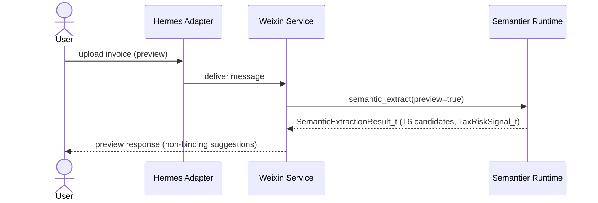
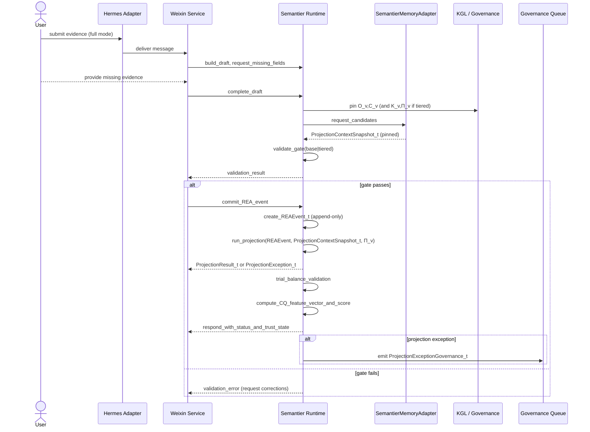
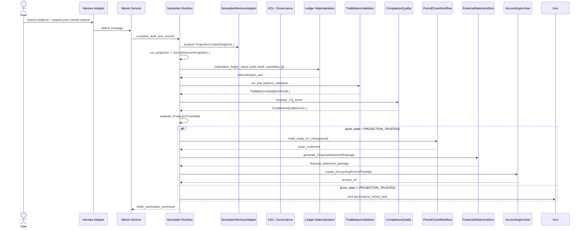

# PRD: Weixin → Semantier Semantic Completion (Multi-turn)

**Status:** Active product/channel PRD.
**Authority:** Derived product specification for the Weixin channel. `architecture.md` remains the canonical runtime contract.
**Scope:** Weixin-specific interaction flows, product behavior, and channel bindings into the shared runtime authority chain.
**Upstream sources:**
- [Document Authority And Versioning](../canonical/document-authority-and-versioning.md)
- [architecture.md](../canonical/architecture.md)
- [knowledge_tier_implementation_spec.md](knowledge_tier_implementation_spec.md)
- [semantier_eos_v2_1.md](../white-paper/semantier_eos_v2_1.md)

**Version interpretation:** doctrinal law is `v2.1`; this PRD binds Weixin behavior onto the repository runtime-contract lineage implemented under `v8.x`.

**Related documents:**
- `docs/canonical/architecture.md` — runtime types and governance chain
- `docs/architecture_v8_cq_v2_appendix.md` — CQ v2, insurance eligibility, reinsurance
- `docs/derived/business_model_design.md` — DSL contracts, responsibility stack, Risk Clearing Layer
- `docs/derived/user_journey_and_user_story.md` — all user stories including Sections 10–19

---

## Objective

Enable users to record financial events via natural language in Weixin, where the system interactively completes missing semantic requirements (e.g., invoice) before governed validation and execution.

The Weixin channel is one of several supported ingestion gateways. The same semantic pipeline — tag extraction, completeness detection, validation, commit, projection, CQ scoring, and trust-state evaluation — is reachable via Weixin, Feishu, Web UI, and Web API. This PRD defines the Weixin-specific interaction surface and its bindings to the shared Semantier runtime authority chain.

---

## Core Principles

> User claims are not evidence. Missing semantic requirements must be completed interactively before validation.

> Runtime authority is deterministic. Completion collects evidence and bindings; governance decides.

> CQ score is a downstream output of the projection chain, not a user-visible input. It gates trust state, close readiness, export readiness, and insurance eligibility. It is not a dashboard metric alone.

> Override in the Weixin channel must be treated identically to override in any other channel: actor liability is triggered, CQ is penalized, insurance eligibility is declined for that entry.

> Preview mode (entry product) produces a non-binding semantic extraction result and tax risk signal without committing a REA fact. No trial balance view or CQ score is produced in preview mode.

---

## User Stories Covered by This PRD

This PRD implements the Weixin surface for the following user stories (defined in `docs/derived/user_journey_and_user_story.md`):

| Section | Story |
|---|---|
| §4 | Core operator user story (Weixin primary channel) |
| §6 / §8 | COA onboarding and projection exception journey |
| §10 | CQ analysis and reporting (post-commit surface) |
| §12 | Liability contract and responsibility allocation (override handling) |
| §17 | Override escalation workflow (Weixin override path) |
| §18 | Low-friction entry product / invoice tax risk check (preview mode) |
| §23 | Policy denial user story (embedded policy runtime — closed-world default-deny) |

---

## Example User Story (Revised)

### Standard completion flow (governed execution)

```
User:   "买了一本书，准备报销"
System: "📎 请上传发票"
User:   [上传发票]
System: "✅ 已入账（REA fact committed, projection scheduled）"
```

### Preview / entry-product flow (no REA fact committed)

```
User:   [上传发票图片，未开通账本]
System: "📋 发票识别结果：¥198 / 图书 / 增值税普通发票
         ⚠️ 税务风险信号：进项抵扣风险 LOW
         💡 建议科目：管理费用-办公费（候选，非权威）
         此结果仅供参考，未创建账务记录。
         如需入账，请联系您的代账服务商开通账本。"
```

### Override flow (actor liability)

```
User:   [修改系统建议的科目分类]
System: "⚠️ 您正在手动修改系统生成的科目分类。
         请说明修改理由（必填）："
User:   "税务顾问建议使用不同科目"
System: "已记录手动修改。此分录的保险覆盖范围已转为不适用，
         责任由操作者承担。修改已进入异常升级队列。"
```

### Policy denial flow (embedded policy runtime — closed-world default-deny)

```
User:   [提交收入/成本明细，资源差额不为零]
System: "❌ 政策校验未通过（Gate 1 — rea.rego）
         原因：借贷不平衡（lhs=1800.00，rhs=0.00）
         此经济事实不符合 REA 收支对称性约束，无法入账。
         政策哈希：a3f8...（可审计）
         请修正金额后重新提交，或联系财务负责人处理。"
```

This flow applies to Gate 1 (REA admission), Gate 2 (projection trust), and Gate 3 (cross-domain trust). At each gate, if the embedded policy evaluates to `allow = false`, the operation is denied deterministically with full evidence: `policy_ref`, `policy_sha256`, `lhs_value`, `rhs_value`.

The denial is not an error. It is the governed default outcome when no explicit `allow { … }` rule is satisfied. See `policies/README.md` and §23 of `docs/derived/user_journey_and_user_story.md` for the full default-deny model and denial scenario catalogue (D1–D5).
```

---

## Full Pipeline Flow

```
Weixin Message (text / image / attachment)
  │
  ├─ [Preview mode: no active tenant workspace]
  │     → SemanticExtractionResult_t (T6 candidate only)
  │     → TaxRiskSignal_t
  │     → Return preview response (no REA fact)
  │
  └─ [Full mode: active tenant workspace]
        → Tag Extraction
        → Semantic Draft (per conversation)
        → Completeness Detection (required fields per workflow type)
        → Ask User for missing fields (iterative)
        → Receive Input / Evidence
        → Update Draft
        → Pin Context (O_v, C_v always; K_v and Π_v for tiered workflows)
        → Build Justification_t (evidence refs, version pins, confidence)
        → Gate Selection:
          Gate 1 (REA admission): validate(J_t, O_v, C_v)
          Gate 2 (domain trust): validate(J_t, O_v, C_v, K_v, Π_v)
        → [Gate passes] Commit REA fact → fact store
        → [Gate fails] Surface validation error; request correction or escalate
        │
        ├─ [Override submitted]
        │     → Require override_reason (≥ 20 characters)
        │     → Record UserFeedbackSignal_t (override = true)
        │     → Apply override_penalty to CQ
        │     → Transition liability to actor
        │     → Decline insurance eligibility for this JE
        │     → Route to OverrideEscalationSummary queue
        │
        └─ [No override]
              → Post-commit Projection under active Π_v
              ├─ [Projection succeeds] → ProjectionResult_t
              ├─ [Projection exception] → ProjectionException_t + governance task
              │
              → Trial Balance Validation (TrialBalanceValidationContract_v)
              → CQ Feature Vector (ComplianceQualityFeatureVector_t)
              → CQ Score (ComplianceQualityScore_t)
              → ProjectionTrustState_t evaluation
              → InsuranceEligibilityResult_t
                → Gate 3 (cross-domain trust):
                  resolve_cross_domain(P_t^D', action_intent, XPolicy_v, TVC_v)
                  → ALLOW | ALLOW_WITH_DISCLOSURE | ALLOW_WITH_LIMITS
                  | ESCALATE | BLOCK_ACTION | BLOCK_EXPORT
              → ComplianceQualityRiskQuote_t (if eligible)
              → Respond to user
```

---

## Governance and Context Model

### Validation modes

| Gate | When used | Types bound |
|---|---|---|
| Base gate | Structural REA checks; simple expense claims with clear evidence | `O_v`, `C_v` |
| Tiered gate | Regulated accounting, tax treatment, ambiguous classification, high-exposure transactions | `O_v`, `C_v`, `K_v`, `Π_v` |
| Cross-domain gate | Action/export/close admissibility across locally trusted domain projections | `P_t^D'`, `XPolicy_v`, `R_cross_v`, `TVC_v` |

### Runtime invariants

- Fact store keeps REA semantics only and never stores COA codes.
- Projection resolves account codes after commit from an active governed `Π_v` bundle.
- Replay must use pinned context and `projection_context_hash`, not live memory lookup.
- CQ score is produced deterministically from recorded validation artifacts only; no live LLM calls in CQ computation.
- Override must be recorded before the modified projection is accepted; no silent override.
- Preview mode produces no `REAEvent_t`; no `TrialBalanceView_t`; no `CQ score`; no `ReplayBinding_t`.

### Context management

- `O_v` and `C_v` are always pinned in justification metadata.
- `K_v` and `Π_v` are required for regulated accounting and tax workflows.
- `projection_context_hash` is persisted for deterministic projection replay.
- `calibration_status` of the active `ComplianceQualityCalibrationModel_v` is preserved in the CQ score; `governance_prior` must not be silently upgraded.

### Liability allocation (per entry)

Every committed JE carries a machine-readable `liability_model` field:

| Scenario | Responsible party | Insurance coverage |
|---|---|---|
| Input data is wrong (invoice fraud, wrong amount) | Partner (B-end / user) | Excluded (input_error) |
| Projection under active Π_v is wrong (rule error) | Platform | Covered under `InsuranceRiskContract_v` |
| Human override of system output | Actor (the user who overrode) | Declined (manual_override) |

---

## Functional Requirements

### FR1 — Message Ingestion
- Receive Weixin text and attachments via Hermes adapter.
- Support text, image (invoice scan), and voice (pre-transcribed) inputs.

### FR2 — Semantic Draft
- Maintain a draft event per conversation session.
- Draft is isolated per `conversation_id` and `tenant_id`.

### FR3 — Completeness Detection
- Identify required but missing fields based on active workflow type.
- Required fields differ between base-gate and tiered-gate workflows.

### FR4 — Interactive Completion
- Ask user for missing data instead of rejecting.
- Maximum 3 completion turns before escalating to human reviewer.

### FR5 — Evidence Binding
- Attach uploaded evidence to draft event as `evidence_refs`.
- Evidence refs are immutable once bound; correction requires a new submission.

### FR6 — Deferred Validation
- Only validate when draft is marked `COMPLETE`.
- Validation result is not cached; it re-runs from pinned artifacts on replay.

### FR7 — Context Pinning
- Persist `O_v` and `C_v` for every completion flow.
- Persist `K_v` and `Π_v` when workflow type requires tiered governance.
- Persist `projection_context_hash` for deterministic replay.

### FR8 — Gate Selection
- Route to Gate 1 for structural REA checks.
- Route to Gate 2 for regulated accounting and tax decisions.
- Gate 1 and Gate 2 selection is deterministic from workflow type metadata; not user-configurable per turn.
- When the embedded policy runtime evaluates a gate, persist `policy_ref`, `policy_sha256`, `lhs_value`, `rhs_value` alongside the `ProjectionException_t` or the REA admission failure record.
- A gate denial (`allow = false`) must surface a human-readable reason to the user with the policy hash for auditability.

### FR8A — Cross-Domain Gate Selection
- For action intents that can change legal/financial/export state (`close`, `report_export`, `tax_package`, `insurance_package`, `lender_package`), Gate 3 is mandatory.
- Gate 3 is evaluated only after local projection trust artifacts are available.
- Gate 3 policy and resolver versions (`XPolicy_v`, `R_cross_v`) must be pinned in the decision record.

### FR9 — Projection Auditability
- Trigger projection only after fact commit.
- Store `ProjectionResult_t` or `ProjectionException_t`.
- Store `projection_status` and `projection_context_hash` for replay and audit.
- Surface projection exception to user with governance queue reference.

### FR10 — CQ Score and Trust State (Post-Commit)
- After projection and trial balance validation artifacts are produced, trigger CQ scoring.
- Store `ComplianceQualityFeatureVector_t` and `ComplianceQualityScore_t`.
- Evaluate `ProjectionTrustState_t` transition.
- Surface trust state to user in the completion response (e.g., PROJECTION_TRUSTED, PROJECTION_WARNING, PROJECTION_REQUIRES_GOVERNANCE).
- Do not surface raw CQ score to end user; surface trust state and actionable guidance only.

### FR11 — Insurance Eligibility Signal (Post-Commit)
- After CQ score, evaluate `InsuranceEligibilityResult_t` against active `InsuranceRiskContract_v`.
- If `eligibility_state = ELIGIBLE` or `ELIGIBLE_WITH_EXCLUSIONS`, store the result silently (no user-visible message required).
- If `eligibility_state = REQUIRES_REVIEW` or `DECLINED`, surface an advisory notice to the finance reviewer (not to the end user in chat).

### FR12 — Override Handling
- If the user attempts to modify a system-generated projection:
  - Require `override_reason` (≥ 20 characters) before accepting.
  - Record `UserFeedbackSignal_t` with `override = true`, `reason`, `actor_id`, and timestamp.
  - Apply `override_penalty` to the CQ feature vector.
  - Transition `liability_model` from `platform` to `actor`.
  - Set `InsuranceEligibilityResult_t.eligibility_state = DECLINED` for that JE.
  - Route to `OverrideEscalationSummary_t` queue.
  - Confirm to user that override is recorded with liability consequence.

### FR13 — Preview / Entry Product Mode
- If the submitter has no active tenant workspace:
  - Run semantic extraction and produce `SemanticExtractionResult_t` (T6 candidate only).
  - Run tax risk signal evaluation and produce `TaxRiskSignal_t`.
  - Return preview response: extracted fields, risk signals, candidate COA suggestion (labeled `CANDIDATE_ONLY`).
  - Do NOT create `REAEvent_t`, `ProjectionResult_t`, `TrialBalanceView_t`, or any CQ artifact.
  - Include a clear notice: non-binding preview; no audit trail created.
  - Provide a CTA to connect with a B-end partner for full onboarding.

### FR14 — Projection Exception Notification
- If projection produces `ProjectionException_t`:
  - Confirm to user that the economic fact was committed (REA event is valid).
  - Notify that ledger classification is pending governance review.
  - Surface governance queue reference (not the raw exception object).
  - Do NOT allow the user to resolve the exception directly in chat; route to the governance UI.

### FR14A — Embedded Policy Gate Enforcement (Default-Deny)

All three gates use the embedded policy runtime (`src/eos/embedded_policy_runtime.py`) to evaluate admission decisions without any external OPA binary dependency.

**Default-deny semantics:** The absence of a satisfied `allow { … }` rule is the denial. There are no explicit deny rules; the closed-world assumption makes `allow = false` the governed default. This is by design to prevent unvalidated economic events from entering the system.

**Four denial paths:**

| Path | Cause | `allow` result |
|---|---|---|
| Rule expression evaluates to false | lhs ≠ rhs or key missing | `false` |
| Required key absent from input | `input.x` KeyError | `false` |
| Policy file not found | Wrong `policy_ref` path | `false` (safe default) |
| Policy file parse error | Malformed `.rego` | `false` (safe default) |

**Policy evidence fields** (persisted on every gate evaluation, pass or deny):

| Field | Description |
|---|---|
| `policy_ref` | Relative path to `.rego` file (e.g., `policies/rea.rego`) |
| `policy_sha256` | SHA-256 of policy file text at load time — the audit pin |
| `lhs_value` | Left-hand side value actually evaluated |
| `rhs_value` | Right-hand side value actually evaluated |
| `allow_expression` | The full `allow { … }` expression string |
| `deterministic` | Always `true`; confirms no LLM call in gate evaluation |

**Supported gateways:** The embedded policy runtime is active in all three supported gateways — `cli` (hermes-cli), `weixin` (hermes-weixin), and `feishu` (hermes-feishu). All gateways share the same module-level bundle cache; identical inputs always produce identical policy outcomes regardless of channel.

**Denial user stories:** D1–D5 denial scenarios are defined in §23 of `docs/derived/user_journey_and_user_story.md` and are backed by bootstrap synthetic data in `bootstrap/industry_simulator/construction_3_year/simulator.py` (`policy_denial_stories()`).

---

## Data Model (Completion Draft)

```json
{
  "conversation_id": "...",
  "tenant_id": "...",
  "org_id": "...",
  "channel": "weixin",
  "mode": "full | preview",
  "tags": ["..."],
  "amount": "...",
  "currency": "...",
  "counterparty": "...",
  "invoice_ref": "...",
  "evidence_refs": ["..."],
  "missing_fields": ["..."],
  "completion_turn_count": 0,
  "pins": {
    "O_v": "...",
    "C_v": "...",
    "K_v": "...",
    "Pi_v": "..."
  },
  "projection_context_hash": "...",
  "action_intent": "close | report_export | tax_package | insurance_package | lender_package | internal_view_only",
  "cross_domain": {
    "XPolicy_v": "...",
    "R_cross_v": "...",
    "xorder_result": "ALLOW | ALLOW_WITH_DISCLOSURE | ALLOW_WITH_LIMITS | ESCALATE | BLOCK_ACTION | BLOCK_EXPORT",
    "cross_domain_order_result_hash": "..."
  },
  "override": {
    "occurred": false,
    "reason": null,
    "actor_id": null,
    "timestamp": null
  },
  "liability_model": {
    "input_error": "partner",
    "projection_error": "platform",
    "manual_override": "actor"
  },
  "status": "INCOMPLETE | PENDING_USER_INPUT | COMPLETE | VALIDATED | COMMITTED | PROJECTION_EXCEPTION | PROJECTION_TRUSTED | PROJECTION_WARNING | PROJECTION_REQUIRES_GOVERNANCE"
}
```

---

## System Behavior Summary

| State | Action |
|---|---|
| `INCOMPLETE` | Ask for the next missing required field |
| `PENDING_USER_INPUT` | Await evidence upload or user response |
| `COMPLETE` | Run gate validation |
| `VALIDATED` | Commit REA fact to fact store |
| `COMMITTED` | Run projection under active `Π_v` |
| `PROJECTION_EXCEPTION` | Confirm REA committed; notify governance queue |
| `PROJECTION_TRUSTED` | Run CQ scoring; evaluate insurance eligibility; respond with success |
| `PROJECTION_WARNING` | Respond with advisory; surface which features are below threshold |
| `POLICY_DENIED` | Gate evaluated `allow = false`; return denial reason + `policy_sha256`; do NOT commit; request correction or escalation |
| `PROJECTION_REQUIRES_GOVERNANCE` | Block close/export; route to governance queue |

---

## Internal Audit Workflow (Post-Close / Console-Based)

### Positioning

Internal audit is not executed through Weixin. It is a separate console-based workflow that operates on artifacts created by this PRD's semantic completion pipeline.

After a period is closed and all PROJECTION_TRUSTED results are finalized, internal auditors access a dedicated audit console to:
1. Sample transactions by methodology (risk-based, random, stratified)
2. Request `AuditEvidencePackage_t` generation for sampled transactions
3. Perform offline verification (replay, hash validation, determinism checks)
4. Produce an audit opinion without invoking the live runtime

### Generated Artifacts

Each sampled transaction produces an `AuditEvidencePackage_t` containing:
- REA event record with `event_hash`
- `ProjectionContextSnapshot_t` with `context_hash` (pinned `O_v`, `C_v`, `K_v`, `Π_v`)
- `ProjectionResult_t` or `ProjectionException_t` with `projection_context_hash`
- `TrialBalanceValidationResult_t` (direction, variance, reconciliation checks)
- `ComplianceQualityFeatureVector_t` + `ComplianceQualityScore_t` (all inputs recorded)
- `ProjectionTrustState_t` (trust state at close time)
- `ReplayBinding_t` (all version pins and hashes for offline verification)

### Verification Process

Auditor performs offline verification for each sampled transaction:

```text
Load AuditEvidencePackage_t
  ↓
Validate schema compliance
  ↓
Verify hashes:
  - Hash(REA event) == event_hash
  - Hash(ProjectionContextSnapshot_t) == context_hash
  - Hash(resolution trace) == resolution_trace_hash
  ↓
Replay projection using pinned Π_v and ProjectionContextSnapshot_t
  ↓
Confirm replayed result == stored ProjectionResult_t
  ↓
Verify CQ score deterministically from recorded feature vector
  ↓
Confirm trust state transition is correct
  ↓
Mark AUDIT_VERIFIED or flag AUDIT_EXCEPTION
```

### Assurances

- No live Semantier-EOS runtime dependency
- No LLM calls during verification
- No OCR or document parsing
- No memory retrieval from Holograph provider
- All artifacts are from recorded/exported data
- All hashes and signatures can be independently validated

### Workflow Diagram

```text
Period Close
  ↓
PROJECTION_TRUSTED results finalized
  ↓
Internal Auditor Console
  ├─ Define sample criteria (risk-based, high-CQ-variability, override-events, etc.)
  ├─ Generate AuditEvidencePackage_t for sample
  │   └─ Includes all pinned versions and hashes
  ├─ Offline verification loop:
  │   ├─ Load package
  │   ├─ Validate schema
  │   ├─ Verify hashes
  │   ├─ Replay projection
  │   ├─ Verify CQ score
  │   └─ Mark VERIFIED or EXCEPTION
  └─ Produce audit summary and opinion
```

### Internal Audit Success Criteria

- All sampled transactions replay correctly under pinned `Π_v`
- All CQ scores match recorded feature vectors
- No transaction produces hash mismatch
- No projection dependencies on live runtime
- Audit opinion is supported by recorded governance decisions and evidence references
- Exception cases (if any) are flagged and explainable

---

## Out of Scope

- OCR (image pre-processing handled upstream by Hermes adapter)
- Multi-agent cross-organization workflows
- Cross-jurisdiction tax filing package generation (full statutory format outputs)
- Direct CQ dashboard access in Weixin chat (CQ detail views are in the finance web UI)
- Reinsurance reporting (handled by platform risk officer role, not Weixin channel)
- Actuarial calibration model management (governance UI only)

---

## Success Criteria

- User completes the standard flow in 2–3 messages.
- No rejection due to missing data; missing fields are requested interactively.
- Override triggers mandatory reason collection and liability acknowledgement.
- Preview mode returns a result without creating any ledger artifact.
- Projection exception creates a governance task, not an error message to the user.
- CQ-gated trust state is surfaced to finance reviewer (not raw score to end user).
- All artifacts are append-only and replayable from pinned versions without live runtime calls.

---

## Non-Functional Requirements

- Response latency (text-only turn): ≤ 2 seconds P95.
- Response latency (evidence upload + extraction turn): ≤ 5 seconds P95.
- Completion draft is durable across Weixin session restarts (stored in conversation store, not in-memory).
- CQ scoring does not block the user response; it runs async and updates the projection record.
- All projection and CQ artifacts must be hash-bound before storage.

---

## Summary

Semantier-EOS evolves from validation system to:

> Interactive semantic completion + governed validation and projection entrypoint + CQ-scored trust state + insurance-eligible outcome + auditable replay chain

The Weixin channel is the front door to this chain. Every message that completes the flow contributes to the partner's `compliance_score`, `automation_rate`, and ultimately their commission settlement and insurance eligibility portfolio.


## Full-Cycle Accounting Support in Weixin Channel

### Positioning

Weixin is not only an entry point for semantic completion. It is the front door to the full accounting lifecycle, but not all lifecycle operations are executable within chat.

```text
Weixin responsibilities:
  - Evidence submission
  - Semantic completion
  - Status visibility
  - Exception notification

Web / Console responsibilities:
  - Governance decisions
  - Period close approval
  - Financial statement approval
  - Tax filing submission
  - Archive certification
```

### Extended Pipeline

```text
Weixin Message
  → Semantic Completion
  → REA Commit
  → Projection
  → Trial Balance Validation
  → Cross-Domain Trust Evaluation (for action intents)
  → Reconciliation Validation
  → Period Close Readiness Signal
  → Financial Statement Generation (async)
  → Tax Filing Preparation (async)
  → Archive Packaging (async)
```

### New User States (Weixin-visible)

```text
ENTRY_CAPTURED
REA_COMMITTED
PROJECTION_TRUSTED
CROSS_DOMAIN_ALLOW
CROSS_DOMAIN_ALLOW_WITH_DISCLOSURE
CROSS_DOMAIN_ALLOW_WITH_LIMITS
CROSS_DOMAIN_ESCALATE
CROSS_DOMAIN_BLOCK_ACTION
CROSS_DOMAIN_BLOCK_EXPORT
REQUIRES_RECONCILIATION
READY_FOR_CLOSE
CLOSED
REPORT_READY
TAX_READY
ARCHIVED
```

### Full-Cycle Functional Requirements (Implementable)

### FR15 — Reconciliation Gate Before Close
- Trigger:
  `ProjectionTrustState_t = PROJECTION_TRUSTED` and period reconciliation workflow is started.
- Required artifacts:
  `ReconciliationValidationResult_t` for bank, receivable, payable, and tax-subledger checks.
- Success path:
  If all mandatory reconciliation checks pass, transition to `READY_FOR_CLOSE`.
- Fallback:
  If any mandatory reconciliation check fails, set state `REQUIRES_RECONCILIATION`, create governance task, and return actionable checklist in Weixin.

### FR16 — Close Readiness Signal
- Trigger:
  `TrialBalanceValidationResult_t = PASS`, `ReconciliationValidationResult_t = PASS`, no blocking `ProjectionException_t` remains open, and Gate 3 result is non-blocking (`ALLOW`, `ALLOW_WITH_DISCLOSURE`, or `ALLOW_WITH_LIMITS`).
- Success path:
  Emit close-readiness signal and notify reviewer via Weixin summary.
- Fallback:
  If one or more blocking items exist (including `ESCALATE`, `BLOCK_ACTION`, or `BLOCK_EXPORT`), do not emit close-ready; include unresolved queue references and blocker counts.

### FR17 — Period Close Submission and Idempotency
- Trigger:
  Reviewer submits close from Web/Console (not Weixin).
- Runtime behavior:
  Period close command must be idempotent by `period_id + tenant_id + close_request_id`.
- Success path:
  Transition state to `CLOSED` and persist close metadata hash.
- Fallback:
  On duplicate submission, return prior close result without side effects.
  On race/conflict, return `CLOSE_CONFLICT` and keep prior consistent state.

### FR18 — Financial Statement Package Generation
- Trigger:
  State = `CLOSED`.
- Required artifacts:
  `FinancialStatementPackage_t` with pinned period boundary, projection context hash, and generation timestamp.
- Success path:
  On successful async generation, transition to `REPORT_READY` and send Weixin notification.
- Fallback:
  On generation failure, keep `CLOSED`, create `FS_GENERATION_FAILED` task, and provide retry token for console operator.

### FR19 — Tax Filing Preparation Package
- Trigger:
  State = `REPORT_READY` and tax calendar for period is open.
- Required artifacts:
  Tax preparation package plus `TaxRiskSignal_t` summary for reviewer.
- Success path:
  Transition to `TAX_READY` and notify reviewer in Weixin.
- Fallback:
  If validation fails (for example missing invoice chain), keep `REPORT_READY`, route to tax governance queue, and surface deficiency list.

### FR20 — Archive Packaging and Certification
- Trigger:
  State = `TAX_READY` and filing preparation is completed or explicitly waived by policy.
- Required artifacts:
  `AccountingArchivePackage_t` including `ReplayBinding_t`, CQ artifacts, and governance decisions.
- Success path:
  Transition to `ARCHIVED` and return archive reference.
- Fallback:
  On hash/signature mismatch, block archive finalization and create `ARCHIVE_INTEGRITY_EXCEPTION` task.

### FR21 — Full-Cycle State Transition Contract
- State order:
  `ENTRY_CAPTURED -> REA_COMMITTED -> PROJECTION_TRUSTED -> CROSS_DOMAIN_ALLOW -> READY_FOR_CLOSE -> CLOSED -> REPORT_READY -> TAX_READY -> ARCHIVED`
- Allowed detours:
  `PROJECTION_TRUSTED -> CROSS_DOMAIN_ALLOW_WITH_DISCLOSURE -> READY_FOR_CLOSE`
  `PROJECTION_TRUSTED -> CROSS_DOMAIN_ALLOW_WITH_LIMITS -> READY_FOR_CLOSE`
  `PROJECTION_TRUSTED -> REQUIRES_RECONCILIATION -> READY_FOR_CLOSE`
- Forbidden transitions:
  `REA_COMMITTED -> CLOSED`, `PROJECTION_EXCEPTION -> REPORT_READY`, `READY_FOR_CLOSE -> ARCHIVED`, `CROSS_DOMAIN_BLOCK_ACTION -> CLOSED`, `CROSS_DOMAIN_BLOCK_EXPORT -> REPORT_READY`.
- Fallback behavior:
  Any forbidden transition attempt must be rejected with a deterministic error code and governance audit log entry.

### Runtime Type Mapping (Full-Cycle)

| Full-cycle stage | Primary runtime types | Producer | Weixin visibility | Failure contract |
|---|---|---|---|---|
| Semantic completion | `Justification_t`, draft state | Weixin Service + Runtime | Missing fields and completion prompts | `VALIDATION_INPUT_INCOMPLETE` |
| REA commit | `REAEvent_t`, `ReplayBinding_t` | Runtime fact pipeline | Show commit success only | `GATE_VALIDATION_FAILED` |
| Projection | `ProjectionResult_t` or `ProjectionException_t` | Projection engine | Show trust state and queue reference, not raw exception payload | `PROJECTION_EXCEPTION_OPEN` |
| Trial balance | `TrialBalanceValidationResult_t` | Trial balance validator | Reviewer advisory only | `TB_VALIDATION_BLOCKING` |
| CQ evaluation | `ComplianceQualityFeatureVector_t`, `ComplianceQualityScore_t`, `ProjectionTrustState_t` | CQ engine | Trust state only, no raw score | `CQ_TRUST_NOT_SUFFICIENT` |
| Insurance eligibility | `InsuranceEligibilityResult_t`, `ComplianceQualityRiskQuote_t` | Insurance evaluator | Reviewer advisory if declined/review | `INSURANCE_DECLINED_OR_REVIEW` |
| Cross-domain trust | `CrossDomainProjectionSet_t`, `CrossDomainOrderResult_t`, `CrossDomainReplayBinding_t` | Cross-domain resolver | Reviewer advisory with disclosure/limits/block status | `CROSS_DOMAIN_ESCALATE` / `CROSS_DOMAIN_BLOCK_ACTION` / `CROSS_DOMAIN_BLOCK_EXPORT` |
| Reconciliation | `ReconciliationValidationResult_t` | Reconciliation workflow | Close readiness summary | `REQUIRES_RECONCILIATION` |
| Period close | Close command result + period-close hash | Close workflow | Close status notification | `CLOSE_CONFLICT` / `CLOSE_BLOCKED` |
| Statement generation | `FinancialStatementPackage_t` | FS generator | Report-ready notification | `FS_GENERATION_FAILED` |
| Tax prep | Tax filing preparation package + `TaxRiskSignal_t` | Tax preparation workflow | Tax-ready reminder | `TAX_PREP_BLOCKED` |
| Archive | `AccountingArchivePackage_t`, archive ref | Archive service | Archived confirmation | `ARCHIVE_INTEGRITY_EXCEPTION` |

### Acceptance Tests (Full-Cycle)

| Test ID | Scenario | Given | When | Then |
|---|---|---|---|---|
| FC-01 | Happy path to archive | Entry is `PROJECTION_TRUSTED` and reconciliation passes | Period close and async jobs run in order | Final state = `ARCHIVED`, with `FinancialStatementPackage_t` and `AccountingArchivePackage_t` persisted |
| FC-02 | Reconciliation blocker | Entry is `PROJECTION_TRUSTED` but reconciliation fails | Close readiness evaluated | State = `REQUIRES_RECONCILIATION`; no close signal; governance task created |
| FC-03 | Projection exception path | REA fact committed but projection throws exception | Runtime processes post-commit pipeline | REA remains committed; state not advanced to `READY_FOR_CLOSE`; queue reference visible in Weixin |
| FC-04 | Override liability path | User overrides projection with valid reason | Entry is committed and CQ pipeline runs | `UserFeedbackSignal_t.override=true`; insurance eligibility declined for JE; escalation summary queued |
| FC-05 | Idempotent close command | Period close already succeeded once | Duplicate close request is submitted with same idempotency key | Runtime returns prior close result with no duplicate side effects |
| FC-06 | Statement generation failure | Period is `CLOSED` | Financial statement async generation fails | State remains `CLOSED`; `FS_GENERATION_FAILED` task created; retry token available |
| FC-07 | Tax prep blocked by evidence gap | Period is `REPORT_READY` but invoice chain incomplete | Tax prep workflow runs | State remains `REPORT_READY`; `TAX_PREP_BLOCKED` raised with missing-evidence list |
| FC-08 | Archive integrity failure | Period is `TAX_READY` | Archive packaging hash check fails | State does not transition to `ARCHIVED`; `ARCHIVE_INTEGRITY_EXCEPTION` task created |

#### Test Execution Notes

- Contract tests must assert deterministic state transitions and forbidden-transition rejection.
- Replay tests must recompute projection under pinned context and match stored `ProjectionResult_t`.
- Full-cycle integration tests should include at least one async failure injection for FS generation and archive integrity checks.

## Sequence Diagrams

Below are sequence diagrams illustrating the main scenarios described in this PRD. Diagrams use Mermaid syntax and show the components and messages for: Preview mode, Full mode (commit + projection), and Full-Cycle Accounting (end-to-end after commit).

### Preview Mode (no REA commit)



### Full Mode (commit → projection → CQ)



### Full-Cycle Accounting (end-to-end)




### Weixin Interaction Extensions

#### Close Readiness Notification

```
System:
  "
   📊 本期账务已完成 92%
   ⚠️ 尚有 2 项对账差异
   📌 1 个分录未完成损益结转
   👉 请在管理后台完成结账审核
  "
```

#### Report Ready Notification

```
System:
  "
   📄 2026-05 财务报表已生成
   - 资产负债表
   - 利润表
   - 现金流量表
   👉 请在后台审核并确认
  "
```

#### Tax Filing Reminder

```
System:
  "
   🧾 本期增值税申报已准备完成
   ⚠️ 存在 1 项税务风险提示
   👉 请在后台完成申报提交
  "
```

### Constraints

```text
Weixin MUST NOT:
  - approve period close
  - modify projection rules
  - finalize financial statements
  - submit tax filings
  - mutate archive packages

Weixin MAY:
  - surface status
  - collect missing evidence
  - trigger workflows
```

---
