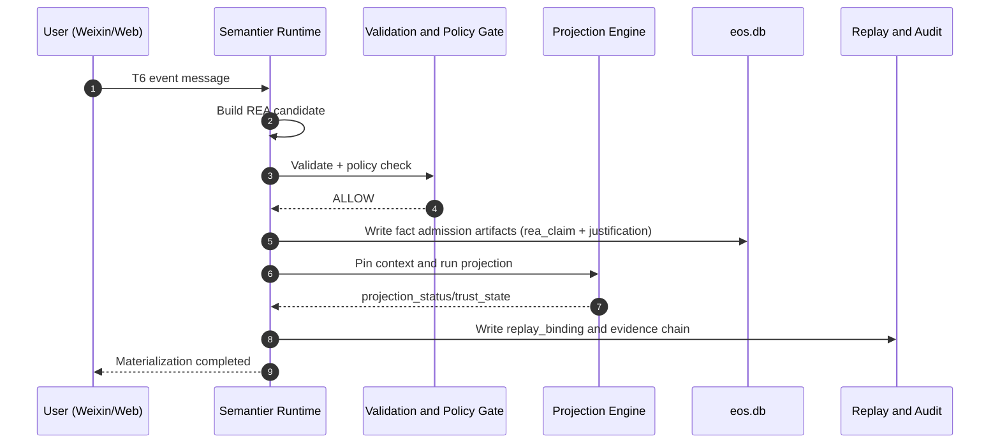
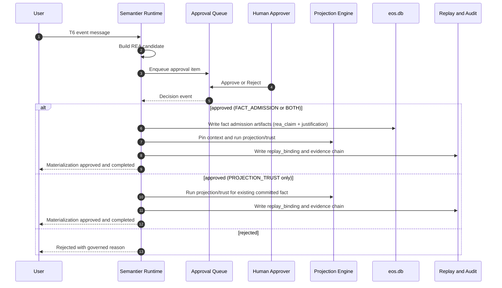

# T6 Materialization Pipeline Modes (Design Suggestions)

**Status:** Active derived implementation contract.
**Authority:** Derived runtime-flow specification for T6 intake and governed materialization. `architecture.md` remains the global runtime contract.
**Scope:** Candidate lifecycle, fact admission, projection/trust outcomes, and replay/audit handling for T6 materialization.
**Upstream sources:**
- [Document Authority And Versioning](../canonical/document-authority-and-versioning.md)
- [architecture.md](../canonical/architecture.md)
- [knowledge_tier_implementation_spec.md](knowledge_tier_implementation_spec.md)

This document specializes T6 materialization behavior. It should not be used to redefine repository-wide trust-state or semantic-tier doctrine outside this flow.

## 1. Purpose

Define two production-ready pipeline modes for converting T6 conversational outputs into governed artifacts while preserving Semantier architecture constraints:

1. Auto materialization mode: automatically complete projection from REA claim candidates into governed artifacts.
2. Approval-gated mode: require explicit human approval before governed materialization.

This document proposes runtime flow, data contracts, control gates, and rollout strategy.

Normative intent: this pipeline produces two distinct artifact classes through one deterministic write path:

1. Fact admission artifacts (authoritative REA fact and justification).
2. Projection/trust artifacts (projection outcome, trust state, replay binding lineage).

## 2. Scope

In scope:

- T6 intake from channels such as Weixin and Web UI.
- Candidate formation, validation, projection, and governed writes.
- Deterministic replay and audit evidence requirements.
- Operational controls for auto vs approval modes.

Out of scope:

- Redesign of the core ontology and policy grammar.
- New external OLAP architecture (DuckDB remains read/query engine).
- Replacing existing EOS write path ownership.

## 3. Non-Negotiable Constraints

Both modes must preserve existing architecture laws:

- Authority law: user identity, membership, and active organization context come only from governed authority sources.
- Prompt boundary law: prompt policy text remains in prompt assets; runtime code performs deterministic selection/composition only.
- Storage law: governed writes are only through Semantier runtime store layer into eos.db.
- Replay law: all materialization outcomes are deterministic and artifact-pinned.
- Time law: persisted timestamps are UTC ISO-8601.

## 4. Shared Pipeline Stages

Both modes share the same deterministic stage order:

1. Intake and normalization
2. Candidate extraction into REA candidate payload
3. Validation and policy checks
4. Materialization decision (AUTO or APPROVAL)
5. Fact admission write (REA claim + justification)
6. Projection execution and trust classification
7. Replay binding and audit lineage write

This ordering is normative: admissible fact admission does not depend on projection success. Projection and trust are a separate gate.

### 4.1 Normative Artifact Targets and Axis Mapping

| Artifact Class | Primary Records | Authority Axis (T) | Maturity Axis (C) | Notes |
| --- | --- | --- | --- | --- |
| Candidate proposal | `t6_materialization_candidates` | T6 | C0-C1 | Non-authoritative candidate layer |
| Approved-for-commit decision | `t6_materialization_decisions` | T6/T5 control | C2 | Governance decision event only |
| Fact admission | `rea_claims`, `justifications` | T0 | C3_MATERIALIZED | Authoritative governed write path; committed `rea_claims` remain C3 |
| Projection/trust outcome | projection outputs + trust/replay refs | T4/T5 managed | C3_MATERIALIZED | Projection/trust progression is tracked by projection status, not by separate C-axis value |

### 4.2 Normative State Machine (C-Axis, Stored Value)

| State | Axis Meaning | Allowed Next States | Terminal | Retryable | Persisted Record Emitted |
| --- | --- | --- | --- | --- | --- |
| C0_CAPTURED | candidate captured | C1_VALIDATED, REJECTED | no | yes | candidate row + transition event |
| C1_VALIDATED | schema/policy validated | C2_APPROVED, REJECTED | no | yes | validation result + transition event |
| C2_APPROVED | governance-approved and ready for governed commit | C3_MATERIALIZED, REJECTED | no | yes | decision row + transition event |
| C3_MATERIALIZED | governed fact committed with canonical lineage | none | yes | no | fact rows + transition event (plus outcome/replay artifacts when projection status is materialized) |
| REJECTED | governed rejection | none | yes | no | rejection decision + transition event |

`C2_PROJECTION_EXCEPTION` is an operational projection status, not a stored `fact_maturity_stage` value.

The legacy status labels `CANDIDATE_CAPTURED`, `CANDIDATE_VALIDATED`, `READY_FOR_MATERIALIZATION`, and `MATERIALIZED/REJECTED` should be treated as aliases for the above canonical stored states.

### 4.2.1 Projection and Trust Status (Separate from C-Axis)

Projection and trust progression is recorded in dedicated status fields:

- `PROJECTION_PENDING`
- `PROJECTION_EXCEPTION`
- `PROJECTION_MATERIALIZED`

### 4.3 Submit, Decision, and Retry Semantics

- Submit dedupe key: `(org_id, source_channel, source_message_id, candidate_hash)`.
- Decision dedupe key: `(candidate_id, decision_scope, actor_id, decision_nonce)`.
- Fact write dedupe key: `(candidate_id, candidate_hash, policy_bundle_hash)`.
- Replay binding dedupe key: `(rea_id, projection_context_hash, projection_version, policy_bundle_hash)`.
- Same `candidate_id` with a newer policy bundle is a re-evaluation event, not an in-place overwrite.

Retry identity rules after projection exception:

- `rea_id` and `justification_id` are stable across projection retries.
- Each retry appends a new projection attempt identity (`projection_result_id`).
- `outcome_id` is append-only per successful materialization event; dedupe-equivalent retries return the prior `outcome_id`.
- `replay_binding_ref` is new only when replay-binding dedupe key components change.

All retries must append transition/decision events and preserve state monotonicity.

## 5. Mode A: Auto Materialization

## 5.1 Goal

Minimize latency from user intent to governed artifact creation when confidence and policy gates are satisfied.

## 5.2 Decision policy

Auto materialization proceeds only if all gates pass:

1. Required semantic fields complete
2. Validation status ALLOW
3. Active policy bundle allows auto materialization for this claim class
4. Approver override is not mandated by risk/escalation policy
5. Idempotency check passes

If any gate fails, candidate is diverted to approval queue (fallback to Mode B path) or rejected with reason.

## 5.3 Flow (Mode A)

## 5.4 Operational characteristics

- Fastest user feedback loop
- Higher need for conservative gate thresholds
- Requires robust exception routing for projection failures

## 6. Mode B: Human Approval Before Materialization

## 6.1 Goal

Introduce explicit human control for financially sensitive or policy-sensitive candidate classes.

## 6.2 Decision policy

Candidates enter approval queue when:

- Organization policy requires review for this claim type, or
- Validation confidence is below configured threshold, or
- Cross-domain or high-risk tags are present, or
- Auto mode is globally disabled for the organization.

Queue semantics:

- `QUEUE_FOR_APPROVAL` is a workflow event that does not advance C-axis state.
- Candidate remains in `C1_VALIDATED` until explicit approval decision (`HUMAN_APPROVE` or policy-equivalent quorum approval) transitions it to `C2_APPROVED`.

Approval scope is explicit and must be recorded per decision:

- `FACT_ADMISSION`
- `PROJECTION_TRUST`
- `BOTH`

Scope-to-gate contract:

- `FACT_ADMISSION`: authorizes the governed fact commit gate.
- `PROJECTION_TRUST`: authorizes projection/trust gate only for an already committed fact (`C3_MATERIALIZED`).
- `BOTH`: authorizes both gates in one decision.

Scope evidence contract:

- Each approval scope decision must persist a `t6_materialization_decisions` row.
- If existing governance primitives are used, their references must be pinned in that decision row.

### 6.2.1 Governed Approver Resolution Contract

Approval authority must be resolved from governed authority sources at decision time:

1. Resolve approver role and org scope from governed membership/role records.
2. Re-validate membership freshness at decision timestamp (stale membership rejects decision).
3. Apply policy-required quorum/dual-control by claim class.
4. Persist authority snapshot hash/reference with the decision record.

## 6.3 Flow (Mode B)

## 6.4 Operational characteristics

- Strong governance and audit posture
- Slower turnaround due to review latency
- Enables role-based risk controls

## 7. Recommended Data Contracts

Add append-only runtime records to support both modes.

### 7.1 t6_materialization_candidates

Suggested fields:

- candidate_id
- org_id
- workspace_id
- source_channel
- source_session_id
- candidate_json
- candidate_hash
- validation_status
- policy_bundle_version
- projection_context_ref
- projection_context_hash
- created_at

### 7.2 t6_materialization_decisions

Suggested fields:

- decision_id
- candidate_id
- decision_type (QUEUED_FOR_APPROVAL, AUTO_ALLOW, HUMAN_APPROVE, HUMAN_REJECT, SYSTEM_REJECT)
- decision_scope (FACT_ADMISSION, PROJECTION_TRUST, BOTH)
- actor_type (system, human)
- actor_id
- approver_authority_snapshot_ref
- quorum_policy_ref
- decision_target_refs_json
- reason_json
- created_at

### 7.3 t6_materialization_outcomes

Normative cardinality contract:

1. Exactly one baseline outcome row is created per successful fact commit for a candidate.
2. That baseline row must initialize `projection_status=PROJECTION_PENDING` and `projection_result_id=null`.
3. Each projection attempt appends a new outcome row with a new `projection_result_id` and `supersedes_outcome_id` pointing to the prior latest outcome row.
4. Dedupe-equivalent retries must return the existing latest outcome row and must not mutate prior rows.

Normative reader and replay-binding contract:

1. Canonical current projection/trust state is the latest outcome row in the `supersedes_outcome_id` chain for a candidate.
2. Latest row resolution must validate chain integrity first (single rooted chain, no cycles, and every `supersedes_outcome_id` points to an existing row for the same candidate).
3. If concurrent writes produce multiple chain heads, select canonical head by deterministic order: greatest `created_at`, then lexicographically greatest `outcome_id` as tie-breaker.
4. Concurrent non-canonical heads remain immutable but must be marked superseded by the next successful canonical append event.
5. Prior outcome rows are immutable snapshots and must not be backfilled.
6. `replay_binding_ref` is written on the outcome row produced by the projection attempt that materializes replay-eligible output.
7. Prior rows with null `replay_binding_ref` remain null permanently.
8. If chain integrity validation fails, runtime must fail closed for projection/trust reads and writes on that candidate, emit a deterministic `CHAIN_INTEGRITY_FAILURE` event, and enqueue governed repair/escalation work.
9. User-facing failure routing is mode-specific:
    - AUTO mode: surface failure to the user who submitted the REA candidate.
    - Human-in-the-loop (H-I-L) mode: surface failure to the role-authorized approver/handler for that candidate scope.

Suggested fields:

- outcome_id
- candidate_id
- rea_id
- justification_id
- fact_commit_status
- projection_result_id
- projection_status
- trust_state
- replay_binding_ref
- supersedes_outcome_id
- content_hash
- created_at

### 7.4 t6_materialization_transitions

Append-only transition ledger for state monotonicity and replay determinism.

Suggested fields:

- transition_id
- candidate_id
- from_state
- to_state
- transition_reason
- actor_type
- actor_id
- prior_event_hash
- event_hash
- created_at

### 7.5 t6_projection_exceptions

Explicit record for "fact committed, projection/trust not yet materialized" outcomes.

Suggested fields:

- exception_id
- candidate_id
- rea_id
- projection_context_hash
- exception_code
- exception_details_json
- projection_result_id
- resolved_by_outcome_id
- retry_after
- created_at

### 7.6 Ownership Boundary

`t6_materialization_*` tables are workflow ledgers that complement existing EOS governed artifact tables.

- System of record for admitted facts and projections remains EOS governed tables.
- Workflow tables provide queue, decision, transition, and exception lineage.
- Runtime must not introduce a parallel governance authority model outside existing EOS/KGL boundaries.

## 8. Policy Configuration Model

Organization-level policy should select default mode and exceptions:

- default_mode: AUTO or APPROVAL
- auto_allowed_claim_classes
- approval_required_claim_classes
- confidence_thresholds
- escalation_rules

All policy references must be pinned by version/hash at decision time.

Policy/version drift handling in approval queue is explicit and policy-driven:

- Default mode: bind original pinned policy bundle used at queue admission.
- Optional strict mode: require re-evaluation under latest policy before approval commit.
- If drift invalidates eligibility, emit governed invalidation event and require resubmission.

## 9. Failure and Recovery Strategy

Failure classes and behavior:

1. Validation failure: reject candidate, keep evidence and reason.
2. Projection failure after fact admission: fact remains committed at `C3_MATERIALIZED`, emit `t6_projection_exceptions`, set `projection_status=PROJECTION_EXCEPTION`, and require deterministic retry/escalation path.
3. Approval timeout: emit timeout event for queued pre-approval items, then either escalate (state remains `C1_VALIDATED`) or reject (state transitions to `REJECTED`) per pinned org policy.
4. Idempotency conflict: return duplicate outcome with prior outcome reference.

Recovery requirements:

- Re-run by candidate_id is deterministic.
- No in-place mutation of approved records.
- Replay must verify pinned context hash and bundle versions.
- Timeout escalation actor must be authority-resolved and quorum-checked under the same governed approver-resolution contract.

## 10. SMB Organization Access Control Model

This section is the normative reference for membership roles, role transition rules, and governance audit in the SMB context.

### 10.1 Roles

| Role | Cardinality per Org | Description |
|---|---|---|
| `owner` | Exactly one active owner at any time | Full governance authority: assign owner, change materialization policy, approve membership. |
| `member` | Unlimited | Standard participant. Can view org context, submit T6 candidates. Cannot change org policy or roles. |

There is no `admin` role in the SMB access control model. The distinction between elevated operator and standard member is captured solely by the `owner` role.

### 10.2 One Owner Per Organization

- An organization must have at most one active owner at any time.
- When a member is set to `owner`, the runtime atomically demotes the previous active owner to `member` in the same write.
- An owner can step down to `member` freely; if no replacement owner is assigned, the org temporarily has no owner.
- Any active member can promote any other active member (or themselves) to `owner` at any time.

### 10.3 Role Transition Rules

| Actor | Allowed Transition | Condition |
|---|---|---|
| Any active member | Any active member → `owner` | Target must have `active` membership. Previous owner auto-demoted. |
| Any active member | `owner` → `member` | Always allowed. |
| Any active member | `member` → `member` | No-op allowed. |
| System | Demote previous owner on new-owner assignment | Atomic with owner promotion write. |

No transition requires an actor to hold the `owner` role. Any active member may initiate role changes.

### 10.4 Audit Trail

All role transitions are logged as append-only events in the organization audit ledger.

Each `membership_role_updated` event records:

| Field | Value |
|---|---|
| `event_type` | `membership_role_updated` |
| `actor_user_id` | User who initiated the change |
| `subject_user_id` | User whose role changed |
| `detail.previous_role` | Role before the change |
| `detail.member_role` | Role after the change |
| `detail.notification_pending` | `true` when the change is a forced demotion (owner displaced by new-owner assignment) |
| `created_at` | UTC ISO-8601 timestamp |

Audit events are append-only and must not be mutated after write.

### 10.5 Owner Displacement Notification

When the previous owner is auto-demoted (because a new owner was assigned), the runtime emits the audit event with `notification_pending: true`. The organization settings payload includes a `pending_notifications` list so the UI can display the notification to the affected user on their next organization context load.

### 10.6 Policy Governance

Only the active `owner` may update the T6 materialization policy for the organization. This control is enforced at the API layer via membership status and role check at request time.

## 11. API and Runtime Surface Suggestions

Suggested runtime endpoints (or internal handlers):

- POST /semantic/materialization/submit
- POST /semantic/materialization/decision
- GET /semantic/materialization/candidates
- GET /semantic/materialization/outcomes/{candidate_id}

Ownership boundary:

- These are runtime service handlers first (inside semantic completion/runtime layers), with optional HTTP wrappers.
- Governed writes, policy resolution, approval authorization checks, and replay binding creation stay in Semantier runtime/EOS boundaries.
- External analytics surfaces remain read-only and must not host governed write logic.

Keep external analytics read-only. No governed artifact writes via analytics tools.

## 11. Rollout Plan

Phase 1:

- Implement shared candidate and decision records.
- Enable AUTO (auto-approve) mode as default, with approval-required claim-class exceptions.

Phase 2:

- Enable AUTO mode for a narrow allowlist of low-risk claim classes.
- Add monitoring for false positives and rollback triggers.

Phase 3:

- Expand AUTO eligibility by policy maturity and observed stability.

## 12. Test Strategy

Required regression coverage:

1. Mode selection by organization policy
2. Auto gate pass and fallback to approval
3. Human approve and reject paths
4. Idempotent re-submission behavior
5. Projection exception behavior under both modes
6. Replay verification for all materialized outcomes
7. Authorization correctness for approver actions
8. Stale approver membership rejection
9. Queue policy-drift behavior (bind-original vs strict-latest)
10. Duplicate submit and duplicate approve race handling

Determinism requirements for tests:

1. Pin clock, UUID, hash, and policy/projection version providers in fixtures.
2. Assert append-only transition lineage and monotonic state progression.
3. Verify replay using only pinned artifacts and hashes.

Minimum executable acceptance suite:

1. Happy-path auto fixture
2. Happy-path approval fixture
3. Fact-commit + projection-failure fixture
4. Duplicate-submit race fixture
5. Stale-approver rejection fixture
6. Replay-verification fixture using pinned artifacts only

### 12.1 Normative Transition Matrix (Executable Contract)

Use this matrix as the implementation and CI contract for deterministic transitions.

| Current State | Event | Guard / Preconditions | Next State | Persisted Records (append-only) | Identity / Idempotency Notes |
| --- | --- | --- | --- | --- | --- |
| none | SUBMIT_CANDIDATE | submit dedupe key does not exist | C0_CAPTURED | candidate row, transition row | duplicate submit returns existing candidate_id |
| C0_CAPTURED | VALIDATE_ALLOW | schema and policy checks pass | C1_VALIDATED | validation result, transition row | re-validate appends event only |
| C0_CAPTURED | VALIDATE_REJECT | validation fails | REJECTED | decision row (SYSTEM_REJECT), transition row | terminal |
| C1_VALIDATED | AUTO_ALLOW | auto policy allow + risk gate pass | C2_APPROVED | decision row (AUTO_ALLOW), transition row | decision dedupe key enforced |
| C1_VALIDATED | QUEUE_FOR_APPROVAL | policy requires human approval | C1_VALIDATED | decision row (`decision_type=QUEUED_FOR_APPROVAL`), transition row | queue admission pins policy bundle |
| C1_VALIDATED | HUMAN_APPROVE | governed approver/quorum approves | C2_APPROVED | decision row (HUMAN_APPROVE), transition row | approval authority/quorum contract enforced |
| C1_VALIDATED | HUMAN_REJECT | governed approver rejects | REJECTED | decision row (HUMAN_REJECT), transition row | terminal |
| C2_APPROVED | FACT_COMMIT_SUCCESS | FACT_ADMISSION or BOTH scope approved | C3_MATERIALIZED | rea_claim row, justification row, baseline outcome row (`fact_commit_status=COMMITTED`, `projection_status=PROJECTION_PENDING`, `projection_result_id=null`), transition row | fact write dedupe key enforced |
| C2_APPROVED | FACT_COMMIT_REJECT | authority/quorum/policy fails at commit gate | REJECTED | decision row (SYSTEM_REJECT), transition row | terminal |
| C3_MATERIALIZED | PROJECTION_RUN_SUCCESS | projection gate allowed | C3_MATERIALIZED | appended outcome row (new projection_result_id, `projection_status=PROJECTION_MATERIALIZED`), replay binding row | stable rea_id/justification_id; new projection_result_id per attempt |
| C3_MATERIALIZED | PROJECTION_RUN_EXCEPTION | projection/trust execution fails | C3_MATERIALIZED | projection_exception row, appended outcome row (`projection_status=PROJECTION_EXCEPTION`) | retry appends new projection attempt lineage |
| C1_VALIDATED | APPROVAL_TIMEOUT_ESCALATE | pending queued approval times out and policy chooses escalation | C1_VALIDATED | timeout event row, escalation decision row | escalation actor must pass governed authority/quorum checks |
| C1_VALIDATED | APPROVAL_TIMEOUT_REJECT | pending queued approval times out and policy chooses reject | REJECTED | timeout event row, decision row (SYSTEM_REJECT), transition row | terminal |

Deterministic replay assertions for this matrix:

1. State transitions are monotonic and append-only.
2. Same dedupe keys return prior identities and do not mutate prior rows.
3. Projection retries preserve rea_id/justification_id and append new projection attempt lineage.
4. Replay binding identity changes only when replay-binding dedupe key components change.

## 13. Recommendation

Adopt a dual-mode design with policy-controlled routing:

- Default to APPROVAL mode for high-governance organizations.
- Allow AUTO mode only for explicitly approved low-risk claim classes.
- Preserve one deterministic write path into eos.db and keep analytics surfaces read-only.

This achieves speed where safe, and explicit human control where required, without breaking Semantier architecture invariants.

## 14. TODO: C-Axis (Fact Maturity) Implementation Milestones

This section tracks concrete work needed to move canonical fact maturity stages (`C0_CAPTURED`, `C1_VALIDATED`, `C2_APPROVED`, `C3_MATERIALIZED`) from spec guidance to runtime enforcement.

### 14.1 Schema and Storage

1. Add `fact_maturity_stage` field (`C0_CAPTURED|C1_VALIDATED|C2_APPROVED|C3_MATERIALIZED`) to candidate and outcome records.
2. Add `projection_status` field (`PROJECTION_PENDING|PROJECTION_EXCEPTION|PROJECTION_MATERIALIZED`) for projection/trust progression.
3. Persist stage transitions as append-only events (no in-place overwrite of transition history).
4. Add indexes for `(org_id, fact_maturity_stage, created_at)` and `(org_id, projection_status, created_at)` to support queue operations.

### 14.2 Transition Guard Enforcement

1. Enforce deterministic transition graph:
    - `C0_CAPTURED -> C1_VALIDATED -> C2_APPROVED -> C3_MATERIALIZED`
    - no direct `C0_CAPTURED -> C3_MATERIALIZED`
    - rejection path allowed from any pre-commit stage.
2. Bind transition guards to existing validation/projection gates:
    - `C1_VALIDATED -> C2_APPROVED` requires schema and evidence checks pass.
    - `C2_APPROVED -> C3_MATERIALIZED` requires materialization decision + governed write success.
    - projection exceptions are recorded as `projection_status=PROJECTION_EXCEPTION`, not as a new C-axis stage.
3. Emit explicit transition-failure reasons for audit and retry orchestration.

### 14.3 Runtime APIs and Handlers

1. Extend submit/decision/outcome handlers to read and update `fact_maturity_stage`.
2. Extend handlers to read and update `projection_status` independently.
3. Add filtered list/read endpoints by maturity stage and projection status for operational dashboards.
4. Ensure idempotent retries preserve stage monotonicity and projection attempt lineage.

### 14.4 Replay and Audit Surfaces

1. Include `fact_maturity_stage` and stage-transition lineage in replay/export bundles.
2. Require stage `C3_MATERIALIZED` for any artifact eligible for trusted replay verification.
3. Add verification checks that reject replay evidence with missing or non-monotonic C-axis lineage.
4. For projection retries, require stable `rea_id` lineage and explicit projection-attempt lineage.

### 14.5 Test Coverage

1. Transition graph tests (valid and invalid hops).
2. Concurrency tests for duplicate submit/approve races.
3. Idempotent retry tests ensuring no stage regression.
4. Replay export tests asserting C-axis lineage presence and consistency.

### 14.6 Rollout Sequence

1. Phase A: write-only C-axis fields (no hard blocking).
2. Phase B: soft enforcement with warnings and metrics.
3. Phase C: hard enforcement in materialization and replay paths.

## 15. Implementation Task Checklist (Test-Gated)

Use this as the execution checklist. A task is complete only when all listed tests pass.

- [x] Task 1: Create schema for `t6_materialization_candidates`, `t6_materialization_decisions`, `t6_materialization_outcomes`, `t6_materialization_transitions`, and `t6_projection_exceptions`.
    Required tests: migration apply/rollback test, schema enum/domain validation test, index presence test.
- [x] Task 2: Implement candidate submit flow (`SUBMIT_CANDIDATE`, dedupe key enforcement).
    Required tests: submit happy path, duplicate submit returns existing `candidate_id`, append-only transition event assertion.
- [x] Task 3: Implement validation transitions (`VALIDATE_ALLOW`, `VALIDATE_REJECT`).
    Required tests: `C0_CAPTURED -> C1_VALIDATED`, reject-to-`REJECTED`, invalid transition rejection test.
- [x] Task 4: Implement auto approval transition (`AUTO_ALLOW -> C2_APPROVED`).
    Required tests: auto policy allow path, auto deny fallback-to-queue path, decision dedupe key enforcement.
- [x] Task 5: Implement queue and human approval flow (`QUEUE_FOR_APPROVAL` stays `C1_VALIDATED`; `HUMAN_APPROVE -> C2_APPROVED`; `HUMAN_REJECT -> REJECTED`).
    Required tests: queue event no-state-advance test, human approve transition test, human reject terminal test, authority/quorum enforcement test.
- [x] Task 6: Implement timeout handling from queued pre-approval (`APPROVAL_TIMEOUT_ESCALATE`, `APPROVAL_TIMEOUT_REJECT`).
    Required tests: timeout escalate stays `C1_VALIDATED`, timeout reject to `REJECTED`, escalation actor authority/quorum check test.
- [x] Task 7: Implement fact commit gate (`FACT_COMMIT_SUCCESS`, `FACT_COMMIT_REJECT`).
    Required tests: `C2_APPROVED -> C3_MATERIALIZED` success test, commit reject terminal test, baseline outcome initialization test (`projection_status=PROJECTION_PENDING`, `projection_result_id=null`).
- [x] Task 8: Implement projection/trust execution from committed state only.
    Required tests: `PROJECTION_RUN_SUCCESS` allowed only from `C3_MATERIALIZED`, `PROJECTION_RUN_EXCEPTION` path with exception record, invalid projection-from-`C2_APPROVED` rejection test.
- [x] Task 9: Implement outcome chain semantics and canonical latest-row resolution.
    Required tests: append-only outcome chain test, `supersedes_outcome_id` chain integrity test, deterministic head selection under multi-head race (`created_at` then `outcome_id`) test.
- [x] Task 10: Implement chain-integrity failure handling (`CHAIN_INTEGRITY_FAILURE`).
    Required tests: fail-closed read/write behavior test, failure event emission test, repair/escalation queue enqueue test.
- [x] Task 11: Implement replay-binding behavior and idempotency rules.
    Required tests: replay binding dedupe test, replay-binding new identity on key change test, stable `rea_id`/`justification_id` across projection retries test.
- [x] Task 12: Implement user-facing failure routing.
    Required tests: AUTO mode failure notification targets REA submitter, Human-in-the-loop (H-I-L) failure notification targets role-authorized handler.
- [x] Task 13: Add end-to-end acceptance fixtures mapped to Section 12.1 transition matrix.
    Required tests: happy-path auto fixture, happy-path approval fixture, fact-commit + projection-failure fixture, duplicate-submit race fixture, stale-approver rejection fixture, replay-verification fixture.
- [x] Task 14: Add regression suite gate to CI for all above transitions and invariants.
    Required tests: full matrix test suite pass in CI, determinism checks with pinned clock/UUID/hash providers, no in-place mutation assertions.
