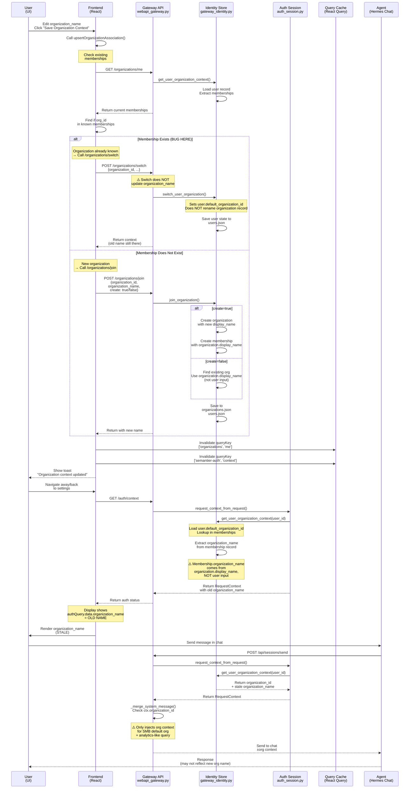

# Data / Knowledge 授权管理系统设计草案

Status: Draft for review

References:
- [docs/canonical/architecture.md](../canonical/architecture.md)
- [docs/derived/gateway-unified-multitenant-design.md](../derived/gateway-unified-multitenant-design.md)
- [docs/derived/knowledge_tier_implementation_spec.md](../derived/knowledge_tier_implementation_spec.md)
- [docs/derived/knowledge-entitlement-contract-schema.md](../derived/knowledge-entitlement-contract-schema.md)

## 1. 目标与边界

本草案为 Semantier 设计一套面向 SMB 和 AI-native runtime 的 `data / knowledge` 授权管理系统。目标不是把传统 ERP 的表级或字段级 ACL 机械搬进来，而是在现有架构约束下定义：

- 什么内容默认共享
- 什么能力必须严格隔离
- 谁可以提出、修改、批准、激活、执行、验证某种语义状态
- 这些动作如何被审计、回放、复核

本草案覆盖：

- 组织内数据与知识的可见性原则
- 语义权限模型与 capability 模型
- 与多租户网关、workspace、organization 边界的对齐
- 与 `T1-T6` knowledge governance 的对齐
- Phase-1 可落地的数据模型与流程约束

本草案不覆盖：

- 最终 UI 交互细节
- 完整 API 字段定义
- 所有产品模块的细粒度页面按钮权限
- 跨组织协作与外部访客模型

说明：

- 本文若定义 Phase-1 `UI projection` 或 entitlement contract，仅属于语义契约与后端投影边界，不属于视觉样式、页面布局或交互动效细节。

Phase-1 positioning:

- Phase-1 应实现为面向生产模型的 slice-based MVP，而不是 demo-only shortcut。
- Phase-1 可以只覆盖少量 capability、少量 UI surface、少量 workflow。
- 但 canonical authorization model 必须从一开始就是 capability + scope + governance condition，而不是 role-string matrix。

## 2. 设计立场

对 SMB 而言，默认策略不是“最大化隔离”，而是：

> 默认共享业务上下文，严格隔离可造成风险的操作权与敏感语义权。

在 Semantier 里，真正危险的不是“谁看到了数据”，而是“谁有权改变会影响现实世界的语义状态”。因此本系统从 `Data Access Control` 转向 `Semantic Capability Control`。

核心原则：

- Law 1：用户身份、组织归属、membership、active authority context 只能来自 governed authority source，不能来自 LLM 推断、prompt memory、workspace 非治理文件或用户自述本身。
- 默认透明：组织内 facts、上下文、审计线索默认高可见。
- 收敛写入：写入、执行、批准、激活必须按 capability 控制。
- 语义优先：权限对象优先是 semantic mutation，不是数据库表。
- 独立验证：validation authority 与 persistence gate 独立，不能混同。
- 全量审计：所有语义变更都必须带 justification、actor、evidence、replay pin。
- 决定性执行：运行时 authority 只能来自 active、governed、hash-pinned artifacts。

## 3. 与现有架构的硬约束对齐

本设计必须遵守以下既有契约：

- 用户身份、组织归属、membership、active authority context 必须由 authenticated session、governed organization registry、explicit membership state 决定。
- 用户自述、LLM 补全、workspace `USER.md`、Hermes memory retrieval、prompt 拼接文本都只能作为 candidate context，不能直接建立或覆盖 identity / organization authority。
- `eos.db` 仍是唯一共享权威 governed store。
- 组织范围内的 governance artifacts 与 facts 在同一 `organization_id` 下共享。
- `workspace_id` 始终只绑定一个 `organization_id`，workspace 是操作态隔离边界，不是 semantic authority 边界。
- replay、explainability、audit packaging、external verification 必须 deterministic 且 artifact-pinned。
- retrieval 只能提供 candidate context，不能直接成为 authority。
- governance 和 semantic authority 决策属于 Semantier core，不属于 Hermes plugin 或 gateway glue。
- append-only 历史记录不能被原地覆盖。

因此，本系统不能设计成：

- 由 gateway 或前端直接决定最终 semantic authority
- 由 memory / retrieval / LLM 输出直接触发 authority activation
- 由 workspace 私有状态绕过 organization-scoped governance
- 由角色字符串直接替代 approval chain 与 replay binding

## 4. 问题重述

传统 RBAC 问的是：

```text
Can user access table X?
```

Semantier 需要回答的是：

```text
Can this actor assert, mutate, approve, execute,
or validate this semantic claim under this governance contract?
```

因此授权对象分为四类：

1. `Read Context`
2. `Propose Semantic Change`
3. `Activate / Approve Semantic Change`
4. `Execute Risk-bearing Action`

其中 2-4 必须强治理，且彼此不可混淆。

## 5. 顶层授权模型

### 5.1 三层边界

#### 租户边界

- `organization_id` 是 data/knowledge authority 的主边界。
- 不同组织之间默认完全隔离。
- cross-org read、write、approval、replay 均默认禁止。

#### 工作区边界

- `workspace_id` 是 authenticated Hermes operational state 的物理隔离边界。
- workspace 拥有 `.hermes/`、sessions、runs、uploads、local skills。
- workspace 不拥有 organization-level semantic authority。

#### 个人边界

- `user_id` 是 actor principal。
- 用户可拥有个人态 `T5(user)` 偏好与个人 procedural assets。
- 用户不得仅凭个人态 artifact 获得组织级语义提交权。

### 5.2 四种权限域

#### Context Read

- 目标：形成组织业务上下文
- 默认：组织内开放
- 例外：PII、薪酬、法务、密级 source 可附加 visibility guard
- 特点：可见不等于可执行，不等于可提交 semantic claim

#### Semantic Mutation

- 目标：修改标签、映射、解释、规则、policy、knowledge activation
- 默认：严格受控
- 特点：这是本系统的核心授权对象

#### Execution

- 目标：触发付款、生成 JE、更新 projection、发布 policy、关闭 period、导出 filing
- 默认：严格受控
- 特点：执行权必须绑定 governed semantic inputs

#### Validation / Approval

- 目标：确认某项 semantic mutation 或 execution outcome 是否可被 trust
- 默认：独立 authority
- 特点：不能与提案人、候选作者、直接执行 agent 混同
### 5.3 组织上下文更新流程 (Organization Context Update Flow)

以下是用户在 Settings 页面修改组织名称并保存时的完整端到端流程：



**关键观察 (Key Observations):**

1. **名称更新丢失点 (Name Update Loss Point)**
   - Frontend 发送用户输入的 `organizationName` 参数
   - Backend `/organizations/switch` 不接受或处理此参数
   - Backend `/organizations/join` for existing org 忽略参数，使用 `organization.display_name`
   - 结果：名称改动未能持久化

2. **缓存失效点 (Cache Invalidation Point)**
   - React Query 缓存被正确失效
   - 但重新加载时获取的仍是存储在 `organization_memberships[].organization_name` 中的旧值
   - 该值来自 `organizations[].display_name`，未被更新

3. **Agent 上下文注入窄化点 (Agent Context Injection Narrowing)**
   - 即使组织上下文正确加载，agent 系统消息注入也很窄
   - 仅在 `organization_id == org_construction_3_year_cn` + default sample analytics query markers 时激发
   - 普通对话中看不到组织感知提示

4. **存储模式问题 (Storage Pattern Issue)**
   - `organization` 表记录 `display_name`（权威值）
   - `user.organization_memberships[].organization_name` 缓存此值
   - UI 读取缓存值而非权威值，导致 cache-aside 问题
   - 修改需要额外的 "rename organization" 端点或合并逻辑
## 6. 默认共享策略

SMB 默认采用：

> Open Read + Restricted Write + Independent Validation + Full Audit

推荐基线如下：

| 能力 | 默认策略 | 原因 |
|---|---|---|
| Facts read | 组织内开放 | 降低信息孤岛，提升协同速度 |
| Context read | 组织内开放 | AI 需要业务全局上下文 |
| T6 suggestion | 广泛允许 | 保持组织感知与归纳速度 |
| T5(user) activation | 受控但较快 | 支持个人效率优化 |
| T5(org) activation | 需 scoped owner | 组织共享偏好会影响他人 |
| T4/T3/T2 activation | 严格审批 | 涉及制度、准则、法规 |
| Risk execution | 强校验 | 直接影响现实世界状态 |
| Audit read | 高透明 | 可追责优先于封闭 |

不建议默认开放的能力：

- 修改 `COA_v`、`Pi_v`、posting mappings
- 修改 `T4` org policy
- 激活 `T3` doctrine
- 激活 `T2` regulatory constraint
- 手工覆盖 validation result
- 改写 replay binding
- 删除或重写 approval history

## 7. 语义能力模型

建议不直接把权限建成 `role -> menu`，而是建成：

```text
principal
  -> capability grant
  -> scoped on organization / team / user / workflow / authority_domain / tier
  -> constrained by governance contract
```

对产品实现的约束：

- `owner/admin/member` 可以存在，但只能作为 default grant bundles 或 UI labels。
- bundle 只是 capability grants 的打包方式，不是 semantic authority 的 source of truth。
- 最终授权判断必须基于 effective capability grants，而不是裸角色名。

### 7.1 Capability 原语

Phase-1 建议定义以下 capability families：

| Capability | 含义 |
|---|---|
| `context.read` | 读取组织内 facts、memory、governed context |
| `source.ingest` | 提交 source 进入 candidate ingestion |
| `knowledge.propose` | 提出知识候选或 semantic claim |
| `knowledge.activate_t5_user` | 激活 `T5(user)` |
| `knowledge.activate_t5_org` | 激活 `T5(org)` |
| `knowledge.approve_t4` | 审批 `T4` policy |
| `knowledge.approve_t3` | 审批 `T3` doctrine |
| `knowledge.approve_t2` | 审批 `T2` regulatory artifacts |
| `mapping.mutate` | 修改 COA / mapping / tagging candidates |
| `execution.run_scoped` | 在指定 workflow 内执行 risk-bearing action |
| `validation.attest` | 对 validation / trust state 出具结论 |
| `audit.export` | 导出审计或 external verification package |
| `governance.override` | 高风险 override，必须极小范围授予 |

### 7.2 Scope 维度

每个 capability grant 必须显式带 scope，而不是全局裸权限：

| Scope | 示例 |
|---|---|
| `organization_id` | `org_acme` |
| `team_id` | `finance`, `sales_ops` |
| `user_id` | 某个人 |
| `authority_domain` | `tax`, `accounting`, `compliance`, `internal_control`, `management` |
| `semantic_tier_ceiling` | 仅到 `T5`，不可触达 `T4+` |
| `workflow_set` | `ap`, `expense`, `close`, `tax_filing` |
| `resource_class` | `fact`, `mapping_candidate`, `policy_candidate`, `replay_package` |

设计规则：

- 没有 scope 的 capability 视为无效。
- scope 必须可进入 replay / audit trace。
- capability 只授予动作资格，不自动代表 approval 已满足。

### 7.3 能力不等于 authority

这是本设计的关键约束：

- `knowledge.propose` 不等于 `knowledge.activate_*`
- `execution.run_scoped` 不等于 `validation.attest`
- `context.read` 不等于 `semantic mutation`
- `gateway authenticated` 不等于 organization semantic authority
- `owner/admin/member` 不等于 canonical authority model

### 7.4 Phase-1 UI Projection Semantics

Phase-1 可以提供面向用户的简化 entitlement UI，但它必须是 backend semantics 的 projection，而不是另一套权限模型。

建议：

- backend canonical actions 保持显式：`view`、`propose`、`review`、`activate`、`execute`、`validate`
- Phase-1 设置页可以只展示 `view`、`propose`、`review`
- 不建议继续使用含义模糊的 `configure`
- 固定字段形状应收敛到 [knowledge-entitlement-contract-schema.md](../derived/knowledge-entitlement-contract-schema.md)

`allow_with_review` 在 Phase-1 中的明确语义应为：

- principal 可以发起该动作路径
- 但 principal 不能单独完成该动作
- 完成该动作还需要额外 governance conditions，例如 approver、validator、replay check、activation gate

不允许把 `allow_with_review` 混用为：

- 已经拥有直接变更权，只是事后有人会看
- 只能查看，不能提案

建议使用单一动作映射表，避免前后端或不同模块各自解释：

| Canonical backend action | Phase-1 UI action | 含义 |
|---|---|---|
| `view` | `view` | 可读取该 tier / object class 的语义上下文 |
| `propose` | `propose` | 可发起候选、建议或变更路径，但不代表可单独完成 |
| `review` | `review` | 可参与 review / governance gate，是否足以批准仍取决于 approver chain |
| `activate` | 不直接暴露 | 后端保留 richer semantics；需 governed activation |
| `execute` | 不直接暴露 | 后端保留 richer semantics；需 execution gate |
| `validate` | 不直接暴露 | 后端保留 richer semantics；需 validator authority |

Phase-1 的 UI 投影规则建议固定为：

- `view = can_read_context`
- `propose = can_initiate_path`
- `review = can_participate_in_required_gate`
- `allow_with_review = can_initiate_path_but_cannot_complete_alone`

## 8. 语义对象分类

建议把授权对象从“表/行/字段”提升为以下 semantic objects：

| Object Class | 示例 | 风险级别 |
|---|---|---|
| `fact_record` | admitted REA fact | 低到中 |
| `contextual_memory` | retrieval candidate, case memory | 低 |
| `interpretation_candidate` | 某笔费用可否 deductible 的建议 | 中 |
| `mapping_candidate` | COA mapping, tax mapping, cost center mapping | 高 |
| `policy_candidate` | org approval rule, procurement rule | 高 |
| `active_knowledge_artifact` | active `T2-T5` artifacts | 高 |
| `execution_intent` | 付款、JE、close、filing、export | 极高 |
| `validation_attestation` | trust state / readiness / exception decision | 极高 |
| `audit_package` | export evidence, replay package | 高 |

权限判断必须至少考虑：

- 对象类别
- authority domain
- semantic tier
- organization/team/user scope
- workflow impact
- 是否 mandatory
- 是否影响 trust state

## 9. 与 Knowledge Tier 的授权映射

### 9.1 Tier 基线

| Tier | 默认读取 | 默认提案 | 默认激活/审批 |
|---|---|---|---|
| `T6` | 组织内可见 | 广泛允许 | 不可直接成为 authority |
| `T5(user)` | 本人 + 审计可见 | 本人可提 | 本人或 delegated curator 可快启 |
| `T5(org)` | 组织内可见 | scoped owner / curator 可提 | scoped owner 审批 |
| `T4` | 组织内可读 | policy authoring flow 提案 | `policy_owner + control_owner`，跨域需 `governance_chair` |
| `T3` | 组织内可读 | domain workflow 提案 | `domain_owner` |
| `T2` | 组织内可读 | legal/compliance ingest 提案 | `legal_owner + compliance_owner` |
| `T1` | 受限维护读 | ontology maintainers 提案 | `ontology_owner + architecture_governor` |

### 9.2 关键授权约束

- `T6` 永远不能直接激活为 authority。
- `T5` 可以快启，但仅限 scoped preference，不得越过 `T4/T3/T2`。
- 一旦某个 `T5` artifact 开始约束跨团队 mandatory workflow，必须触发 jurisdiction drift review。
- `T4/T3/T2/T1` 不允许 direct activation shortcut。
- 任何高 tier activation 都必须进入 `PROPOSED -> VALIDATED -> APPROVED -> ACTIVE`。

## 10. Actor 模型

Phase-1 不建议先定义复杂职位树，建议定义治理相关 actor classes：

| Actor Class | 主要职责 |
|---|---|
| `workspace_user` | 日常读取、提问、T6 建议、个人偏好 |
| `scoped_owner` | 负责某 team / workflow / T5(org) artifact |
| `curator` | 整理候选、打包来源、推动治理流程 |
| `policy_owner` | 发起与维护 `T4` org policy |
| `control_owner` | 对内控与流程约束负责 |
| `domain_owner` | 对某 authority domain 或 doctrine 负责 |
| `legal_owner` | 法律法规来源与解释责任 |
| `compliance_owner` | 合规约束责任 |
| `validator` | 出具 validation / trust attestation |
| `governance_chair` | 跨域或高风险治理共签 |
| `architecture_governor` | `T1` primitive / semantic invariant 维护 |
| `system_agent` | 在 scope 内执行，不自带 authority |

规则：

- actor class 是治理职责，不是 UI 角色菜单。
- 一个用户可同时承担多个 actor class。
- 最终判定基于 capability + scope + workflow context，不基于单一角色名。

## 11. 核心决策矩阵

### 11.1 Read

`context.read` 默认允许，但需要额外 guard 的对象：

- payroll
- legal dispute
- investor-only materials
- M&A materials
- HR discipline records
- sensitive PII

这些对象不改变总体原则，只是增加 `visibility_policy` 过滤，不改变 semantic authority 机制。

### 11.2 Semantic Mutation

以下动作视为高风险 semantic mutation：

- 修改 `COA_v`
- 修改 posting rule / mapping
- 修改 tax mapping
- 修改 customer / vendor classification
- 修改 internal policy wording
- 覆盖 validation exception rationale
- 发布 org-wide treatment guide

判断规则：

- 若只影响个人操作体验，可落在 `T5(user)`
- 若影响团队共享默认，可落在 `T5(org)`
- 若影响 mandatory workflow、会计口径、税务口径、审批约束、内控、跨团队行为，必须升级 `T4+`

### 11.3 Execution

以下动作必须走 execution gate：

- 创建或确认 journal entry
- 标记 payable 为 ready-to-pay
- 发起付款
- period close
- filing export
- trusted financial statement export

execution gate 必须校验：

- actor 是否拥有对应 `execution.run_scoped`
- 所依赖的 `K_v` / `Pi_v` / constraints 是否 active 且 pinned
- 是否存在 required validation result
- 是否存在 required approval chain
- 当前 trust state 是否满足

### 11.4 Validation

validation actor 必须独立于 proposal / execution actor，至少满足：

- candidate author 不能是 final approver
- execution agent 不能单独生成 final trust decision
- override 必须带 justification 和 explicit audit event

## 12. 授权决策流程

建议统一的授权决策函数：

```text
authorize(actor, action, object, context) -> decision
```

最少输入：

- `actor.user_id`
- `actor.capability_grants`
- `actor.organization_id`
- `action`
- `object.class`
- `object.authority_domain`
- `object.semantic_tier`
- `object.scope`
- `context.workflow`
- `context.target_effect`
- `context.required_approval_profile`

决策顺序：

1. principal 是否已认证且绑定到目标 `organization_id`
2. 是否具备匹配 capability 且 scope 覆盖目标对象
3. action 是否超过 `semantic_tier_ceiling`
4. 是否违反 higher-tier precedence
5. 是否要求双签或独立 validator
6. 是否要求 replay-pin / validation result / active bundle
7. 输出 `ALLOW`、`ALLOW_WITH_GOVERNANCE_REVIEW`、`DENY`

建议保留 deny reason codes：

- `DENY_CROSS_ORG`
- `DENY_SCOPE_MISMATCH`
- `DENY_TIER_CEILING`
- `DENY_MISSING_APPROVER`
- `DENY_MISSING_VALIDATION`
- `DENY_HIGHER_TIER_CONFLICT`
- `DENY_REPLAY_PIN_REQUIRED`

## 13. 数据模型建议

Phase-1 不建议大改现有 `eos.db` 核心表，而是在现有 governed store 上补充授权相关 surfaces。

建议新增或扩展以下概念：

### 13.1 Principal / Grant

```yaml
principal_grant:
  grant_id: string
  user_id: string
  organization_id: string
  capability: string
  scope_json:
    team_ids: [string]
    authority_domains: [string]
    workflows: [string]
    semantic_tier_ceiling: T5
    resource_classes: [string]
  granted_by: string
  effective_from: datetime
  effective_to: datetime | null
  status: active | revoked | expired
  content_hash: sha256
```

### 13.2 Authorization Decision Log

```yaml
authorization_decision:
  decision_id: string
  actor_user_id: string
  organization_id: string
  action: string
  object_class: string
  object_ref: string | null
  authority_domain: string | null
  semantic_tier: string | null
  workflow: string | null
  decision: ALLOW | ALLOW_WITH_GOVERNANCE_REVIEW | DENY
  deny_reason: string | null
  replay_context_ref: string | null
  created_at: datetime
```

### 13.3 Sensitive Visibility Policy

对少数需要 read filtering 的对象，可增加：

```yaml
visibility_policy:
  resource_ref: string
  organization_id: string
  visibility_class: default_open | restricted_pii | legal_hold | executive_only
  allowed_scopes_json: object
  created_at: datetime
```

说明：

- 这层只控制 read visibility。
- 不替代 semantic governance。
- 不应成为事实或 knowledge authority 的唯一模型。

### 13.4 Bundle Projection Surface

如果产品需要继续暴露 `owner/admin/member` 这样的操作者标签，建议把它们实现为 bundle projection，而不是授权本体：

```yaml
grant_bundle:
  bundle_id: owner_bundle | admin_bundle | member_bundle
  bundle_label: string
  organization_id: string
  grants:
    - capability: knowledge.propose
      scope_ref: scope_hash_or_inline_scope
    - capability: knowledge.review_t4
      scope_ref: scope_hash_or_inline_scope
  status: active
  content_hash: sha256
```

配套约束：

- bundle 可以展开为 effective grants
- principal 可以同时拥有 bundle grants 与 direct grants
- entitlement resolver 必须支持 bundle + direct grant 的统一决策
- UI preview 可以展示 bundle 差异，但不能替代 live entitlement contract

## 14. 事件与审计要求

所有高风险动作都必须产生 append-only event：

- grant_created
- grant_revoked
- knowledge_proposed
- knowledge_validated
- knowledge_approved
- knowledge_activated
- knowledge_rejected
- execution_requested
- execution_allowed
- execution_denied
- validation_attested
- override_requested
- override_approved
- override_denied

每个事件最少包含：

- actor
- organization_id
- workspace_id
- target object
- capability used
- justification
- evidence refs
- replay/version pins when applicable
- timestamp

审计原则：

- read 可以采样记录，semantic mutation / approval / execution / validation 必须全量记录
- 任何 override 都必须可回放、可解释、可归责
- 历史 grant、approval、activation 不得被覆盖

## 15. 与 Gateway / Workspace 的集成

集成规则：

- gateway 负责认证 principal、解析 `workspace_id`、绑定 `organization_id`
- gateway 可以做 coarse pre-check，但不得做最终 semantic authority 判断
- 最终授权判断应落在 Semantier core 的 governed service 层
- workspace-local artifacts 只能影响本 workspace 的 operational state 或 `T5(user)` / procedural surface
- organization-level activation 必须写入共享 `eos.db`

建议链路：

```text
request
  -> gateway auth context
  -> workspace resolution
  -> coarse route guard
  -> Semantier authorization service
  -> governance / execution / validation service
  -> append-only audit event
```

## 16. 与 Memory / Retrieval 的集成

必须坚持 retrieval-only 原则：

- memory provider 可提供 `candidate context`
- retrieval context 可帮助人或 agent 提案
- retrieval context 不可自动转化为 active authority
- retrieved item 若未进入 governed activation，只能是 contextual 或 advisory

因此建议增加两条授权规则：

- `context.read` 可允许读取 memory candidate
- `knowledge.activate_*` 不可由 memory hit 直接满足，必须经过 source binding、governance review、activation record

## 17. 与 AI Agent 的集成

AI agent 在本模型里不是 authority principal，而是 scoped executor / proposer。

允许 AI：

- 读取组织内上下文
- 生成 `T6` suggestion
- 打包 `T5` candidate
- 在已授权 workflow 中执行确定性动作

禁止 AI：

- 仅凭生成结果激活 `T4/T3/T2`
- 独立完成最终 validation attestation
- 篡改 approval chain
- 把 retrieval 命中当作正式 authority

推荐 agent enforcement：

- agent session 默认获得 `context.read`
- risk-bearing workflow 必须显式注入 scoped execution capability
- 所有 agent-originated semantic mutation 都自动标记 `proposed_by=system_agent` 与 operator sponsor

## 18. Phase-1 落地建议

### 18.1 先做什么

1. 引入 capability grant 模型，但只覆盖少量高风险动作。
2. 把 `owner/admin/member` 降级为 default grant bundles 与 UI preview labels。
3. 把现有 knowledge governance lifecycle 接上 authorization decision logging。
4. 对 execution gate 增加 `actor + capability + pinned bundle + validation` 联合校验。
5. 对 `T5` artifact 增加 jurisdiction drift review 字段与审计任务。
6. 对少数敏感 read surfaces 增加 `visibility_policy`，避免把全系统变成复杂 ACL 树。

### 18.2 首批必须纳入控制的动作

- `mapping.mutate`
- `knowledge.activate_t5_org`
- `knowledge.approve_t4`
- `knowledge.approve_t3`
- `knowledge.approve_t2`
- `execution.run_scoped` on AP / JE / close / filing
- `validation.attest`
- `governance.override`

### 18.3 Phase-1 UI 建议

如果 Phase-1 交付 settings 或 admin 可见性页面，建议：

- 表格展示 `T1..T6 × view/propose/review`
- 展示 live entitlement contract
- 允许切换 bundle preview
- 不在本阶段伪造 `approve/activate/execute/validate` 的 UI 控件

### 18.4 与正式产品模型的关系

Phase-1 完成后，系统仍未完成整个 `data / knowledge governance` 的 access control and promotion workflows。

完整产品 backlog 至少还包括：

- first-class persisted grants
- delegated / temporary / emergency grants
- `T6 -> T5(user)`、`T6 -> T5(org)`、`T5 -> T4` promotion workflows
- full `T4/T3/T2` approval chains
- validator-facing workflows
- authorization lineage in audit/export packages
- formal organization rename governance workflow
- grant administration UI
- governance queue UI
- end-to-end replay and negative-path verification
### 18.5 可以后置的内容

- 细粒度 team hierarchy
- ABAC-style dynamic attributes
- 跨组织协作共享
- delegated temporary approvals
- external auditor delegated portal

## 19. 失败模式与防错

本设计主要防止以下失败模式：

- 把“读权限”误当作“语义提交权”
- 把 workspace 私有状态误当作 organization authority
- 让 `T6` suggestion 直接落成 active rule
- 让 `T5` 在跨团队 mandatory workflow 中长期伪装成 preference
- 让 validation 与 proposal / execution 合并为同一 actor
- 让 audit/export 依赖 live retrieval 或 mutable current state
- 让 AI memory 污染 active semantic chain

默认 fail-closed 场景：

- tier 无法判定
- scope 无法判定
- approval chain 不完整
- validation 缺失
- replay pin 缺失
- object 正在越级触达更高 authority domain

## 20. 开放问题

需要 review 时重点确认：

1. 是否接受“组织内默认开放读”作为产品与治理基线。
2. `T5(org)` 与 `T4` 的分界，是否要在 Phase-1 就加入更强的自动 drift 检测。
3. `validation.attest` 是否单独建 actor class，还是先复用 domain owners。
4. 是否需要把 `visibility_policy` 先限制在 PII / 法务 / 高管三类。
5. capability grant 是直接落 `eos.db`，还是先由 auth store 承载、再投影进 governed store。
6. bundle projection 是先只读静态预置，还是 Phase-1 就允许 direct grant 混合解析。

## 21. 结论

这套系统的核心不是“谁能看哪张表”，而是：

> 谁能在什么组织边界、什么工作流、什么 authority domain、什么 semantic tier 下，提出、批准、激活、执行、验证某种语义状态。

对 SMB 最合适的策略不是低共享，而是：

> 默认透明，收敛写入，独立验证，全量审计。

这与现有 Semantier 架构一致，因为它保留了：

- facts append-only
- meaning governed externally
- retrieval as candidate only
- replay/audit deterministic and pinned
- governance authority in Semantier core
