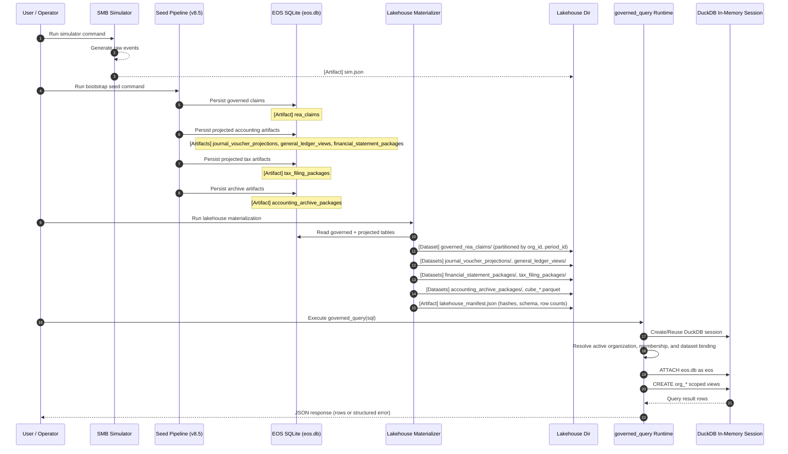

# Design Reflection: Data Processing Pipeline

Related docs:

- [Runtime Architecture](../canonical/architecture.md)
- [White-Paper Coverage Matrix](../derived/white-paper-coverage-matrix.md)

## Direct Answer to the Open Question

From governed claims to projected accounting and tax report views, projected records are currently generated in the bootstrap/seed pipeline and persisted in EOS tables first, then mirrored into Parquet lakehouse datasets.

This is not a query-time projection flow in the current implementation. User-facing query-time behavior in `governed_query` is read-only DuckDB access through organization-scoped governed views over persisted EOS artifacts.

There is no always-on backend cron in the current local workflow by default. Generation is triggered by explicit pipeline commands (for example, bootstrap runs), not by user query execution.

Compatibility note with dual-axis model:

- Current runtime pipeline enforcement is still centered on semantic authority tiers (`T0..T6`).
- Fact maturity (`C0_CAPTURED -> C1_VALIDATED -> C2_APPROVED/C2_PROJECTION_EXCEPTION -> C3_MATERIALIZED`) is currently a spec-level lifecycle axis and should be added as explicit pipeline state over time.
- Detailed rollout milestones are tracked in [T6 Materialization Pipeline Modes](../derived/t6_materialization_pipeline_modes.md), Section 14.

## Current Processing Model (As Implemented)

1. Simulator emits raw business events to `sim.json`.
2. Seed pipeline writes governed facts and projected accounting/tax artifacts into `eos.db`.
3. Lakehouse materializer exports EOS and raw sources into Parquet datasets plus manifest.
4. Runtime query tool (`governed_query`) resolves active authorization context and exposes organization-scoped views for analytics queries.

## End-to-End Sequence Diagram (Artifacts Labeled)

## Where Accounting and Tax Projections Are Actually Produced

Production of accounting and tax projection records happens before Parquet export, in seeded/governed write phases into EOS tables:

- Accounting-oriented projection artifacts:
  - `journal_voucher_projections`
  - `general_ledger_views`
  - `financial_statement_packages`
- Tax projection artifacts:
  - `tax_filing_packages`

Parquet datasets are mirrors for analytics/read performance and deterministic packaged consumption, not the original projection authority.

Organization-scoped data materializations follow the same pattern:
- Org-scoped Parquet lakehouse, projection exports, and replay caches are derived from authoritative EOS tables.
- These organization-tier materializations are non-authoritative and reproducible on demand from pinned EOS artifacts.
- See [architecture.md](../canonical/architecture.md) "Organization-Scoped Materialization Authority and Staleness Contract" for invalidation rules and cache rebuild semantics.

## Runtime Behavior Clarification

At query time:

- No new accounting/tax projection computation is performed by `governed_query`.
- `governed_query` enforces active organization authorization before returning data.
- `governed_query` only reads scoped governed views and does not expose raw EOS or unscoped lakehouse tables.

So the current runtime pattern is: persisted artifacts + read-time virtualization, not on-demand projection generation.

## Design Reflection: Batch vs On-Demand vs Persisted Parquet

Given Semantier architecture constraints (determinism, replayability, audit pinning), persisted artifact generation is the correct default.

Recommended policy:

1. Keep projection generation as governed write-time workflow (event-driven or scheduled job), not query-time.
2. Keep EOS tables as authoritative governed store for projection artifacts.
3. Keep Parquet as immutable read-optimized mirrors with manifest pinning.
4. Allow query-time only for derived analytical aggregates over persisted data, never authoritative projection writes.

## Suggested Operational Topology

1. Trigger: REA/period-close state transitions emit generation jobs.
2. Job A: Generate/update projection artifacts in EOS under governance gates.
3. Job B: Materialize lakehouse Parquet + manifest from EOS snapshots.
4. Runtime: `governed_query` serves reads only through authorization-enforced org-scoped views.

Dual-axis extension guidance:

- Keep T-axis as authority/jurisdiction classification.
- Track C-axis as process state on pipeline artifacts and transitions.
- Gate replay/export trust eligibility on mature C-axis states (for example, require `C3_MATERIALIZED`) once enforcement is implemented.

This preserves the architecture doctrine:

- REA persistence gate independent from projection trust gate.
- Replay/audit paths depend on pinned artifacts, not live recomputation.
- Retrieval/runtime query surfaces are candidate/read layers, not semantic authority writers.

## Feature Work Backlog

Current status:

- The current data process is suitable for the MVP phase: command-triggered generation, governed persistence in EOS, Parquet lakehouse mirrors, and read-only query-time analytics.

Backlog for PostgreSQL migration:

1. Introduce backend job orchestration for projection/materialization (event-driven + scheduled execution) when moving from SQLite to PostgreSQL.
2. Split jobs into at least two deterministic stages:
  - Stage A: generate and persist governed projection artifacts in PostgreSQL.
  - Stage B: materialize lakehouse outputs and manifest from pinned PostgreSQL snapshots.
3. Add job run metadata tables (job_id, input snapshot ref, artifact hashes, version pins, replay status).
4. Add idempotency and exactly-once safeguards for projection and materialization jobs.
5. Keep query runtime read-only; do not perform authoritative projection writes in request paths.
6. Add migration-era compatibility tests asserting parity between SQLite and PostgreSQL outputs for the same replay inputs.
7. Add `fact_maturity_stage` to pipeline artifacts and transition logs (append-only lineage).
8. Add deterministic C-axis transition checks and idempotent retry protections.
9. Extend replay/export verification to require consistent C-axis lineage and eligible maturity stage.
