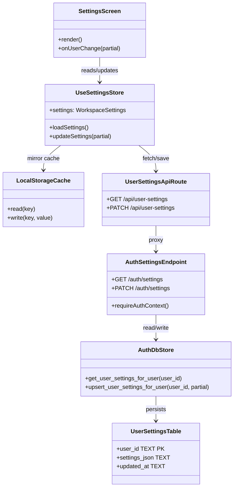
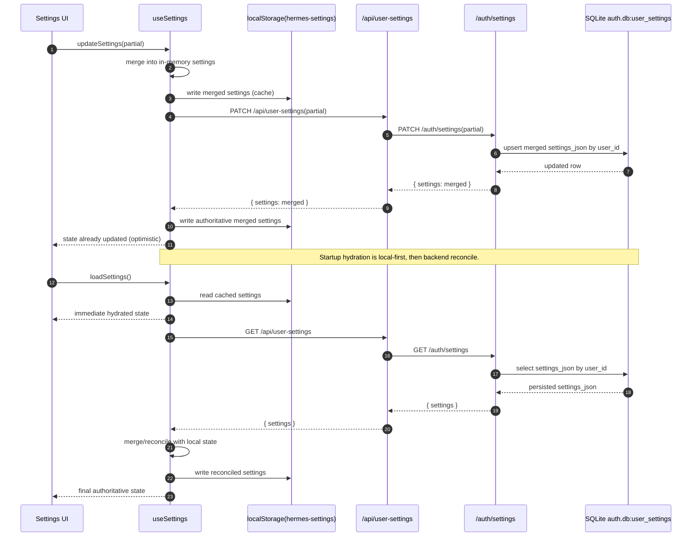

# Settings Persistence Architecture

Date: 2026-06-17

## Purpose

Define the persistence contract for workspace settings across the Hermes frontend and backend. The current codebase is mixed: some preferences are already backend-backed, while many others still live in browser storage. This document defines a consistent target architecture, the current-state inventory, and the migration path.

## Current State

### Backend-backed today

- `hermes-workspace/src/hooks/use-settings.ts` now hydrates settings from `/api/user-settings` and writes back through the same route.
- `hermes-workspace/src/hooks/use-settings.ts` mirrors the hydrated/updated settings to browser `localStorage` (`hermes-settings`) for fast startup and compatibility.
- `hermes-workspace/src/lib/i18n.ts` writes locale changes through `/api/user-settings` while preserving a client-side cache for synchronous reads.
- `hermes-workspace/src/routes/api/user-settings.ts` is now a proxy-only route to backend `/auth/settings`.
- Backend persistence is SQLite-backed in `src/agents/auth_db.py` (`user_settings` table) via `/auth/settings` in `src/agents/webapi_gateway.py`.

### Implementation Status (2026-06-17)

- Done now:
	- User language (`locale`) persists through frontend `/api/user-settings` -> backend `/auth/settings` -> SQLite `auth.db:user_settings`.
	- Core workspace settings from `useSettings` are persisted through the same backend API path.
- Deferred to later phases:
	- `useChatSettings` migration from browser persistence.
	- Other localStorage/sessionStorage slices listed below.
	- Sensitive settings policy decisions (credentials/tokens).

### Still browser-local today

- `hermes-workspace/src/hooks/use-chat-settings.ts` persists chat display preferences in localStorage.
- `hermes-workspace/src/hooks/use-pinned-sessions.ts` persists pinned sessions in localStorage.
- `hermes-workspace/src/stores/workspace-store.ts` persists workspace UI layout in localStorage.
- `hermes-workspace/src/lib/theme.ts` persists the active theme in localStorage.
- `hermes-workspace/src/lib/sounds.ts` persists sound preferences in localStorage.
- `hermes-workspace/src/lib/active-users.ts` and several onboarding / chat / gateway helpers use localStorage or sessionStorage for ephemeral UI state.

## Goals

1. Make user-scoped preferences durable across devices and browser sessions.
2. Keep authoritatively shared settings on the backend, not in browser-only storage.
3. Preserve fast client-side reads by maintaining a hydrated in-memory cache.
4. Keep sensitive or ephemeral UI state out of the durable settings store when it does not need cross-device persistence.
5. Avoid breaking existing screens during migration.

## Non-Goals

- Replacing every browser storage use in the app.
- Moving purely transient UI state into the database.
- Introducing a new global database just for settings.

## Target Model

Use three persistence tiers:

1. Backend per-user settings store for durable preferences tied to the authenticated user.
2. Workspace-scoped app state files for workspace-owned runtime state.
3. Browser storage for local-only or ephemeral UI state.

The backend per-user store is the default home for user-facing settings that should follow the user across sessions and browsers.

## Storage Contract

### Durable per-user settings

Persist in backend SQLite (`auth.db`) keyed by authenticated `user_id`.

Implemented table shape:

- `user_settings(user_id TEXT PRIMARY KEY, settings_json TEXT NOT NULL, updated_at TEXT NOT NULL)`

Contract:

- Reads and writes go through a server route.
- The route resolves the authenticated user from Semantier auth context.
- The store fails closed if no authenticated user is available.
- Locale and other durable preferences are cached client-side for synchronous rendering, but the backend remains the source of truth.

### Workspace-owned runtime state

Keep workspace-scoped state under the workspace app state root when it belongs to the workspace rather than the user.

Examples:

- `local-sessions.json`
- `runs/`
- `knowledge-config.json`
- `access-control.json`

### Browser-local state

Keep browser-local state for preferences that are intentionally device-bound or ephemeral.

Examples:

- session draft state
- transient onboarding completion flags
- tab/session presence state
- temporary UI affordances that should not roam between devices

## Settings Classification

### Should move to backend per-user settings

- Interface language
- Global workspace theme preference
- Accent color preference
- Editor defaults
- Notification toggles
- Usage warning threshold
- Smart suggestion preferences
- Preferred budget / premium model selections
- Any other user-facing preference that should persist across browsers

### Should stay local unless a product requirement changes

- Purely transient UI layout state
- Temporary draft or composition state
- Session-only overlays and affordances
- Browser-specific accessibility or hotkey toggles when they are explicitly device-bound

### Sensitive values require separate review

- Hermes URL and token
- Provider API keys

These should not be moved into the general preference record without an explicit decision on encryption, access control, and rotation behavior.

## API Contract

## Architecture Diagrams

### Class Diagram

### Sequence Diagram: Settings Update And Sync

### `GET /api/user-settings`

- Returns the authenticated user’s persisted settings.
- Returns `401` if auth context is missing.
- Returns a stable payload shape with a `settings` object.

### `PATCH /api/user-settings`

- Accepts partial settings updates.
- Merges updates into the current user record.
- Writes are best-effort client-side but authoritative on the server.
- The endpoint must use the authenticated `user_id`, not a user-supplied identifier.

## Frontend Contract

### Hydration

- Settings consumers must load remote settings once on startup.
- Components should render from hydrated in-memory state, not from direct backend calls inside render paths.
- The frontend may hydrate from localStorage first as an optimization, then reconcile with backend settings.

### Updates

- Updates should apply optimistically to the in-memory store.
- The client should persist changes through the backend route.
- The client should also mirror updates to localStorage cache for startup speed and compatibility.
- Locale changes should still emit the existing `locale-change` event for compatibility.
- Screens that currently reload after locale changes may continue doing so until the app supports hot locale switching cleanly.

### Compatibility

- Existing components that read the settings store should continue working with minimal changes.
- Browser-local consumers should be migrated one slice at a time.

## Backend Contract

### Resolution

- The backend must resolve the active workspace root and authenticated user before reading or writing settings.
- Missing auth context is a hard failure.

### Storage behavior

- The durable per-user settings store lives in backend SQLite (`auth.db` -> `user_settings`).
- Writes should be serialized per user.
- `settings_json` stores a merged JSON object per `user_id`.
- Backend SQLite remains the source of truth; localStorage is a cache layer only.

### Migration behavior

- Existing browser-local settings can be imported on first authenticated load when a server record does not yet exist.
- After migration, the backend value becomes authoritative.
- Legacy browser values should be ignored or used only as an explicit one-time seed.

## Migration Plan

1. Keep the new `user-settings` endpoint authoritative for durable settings.
2. Migrate remaining settings slices from browser storage to the backend one category at a time.
3. Add a compatibility layer only where the UI requires immediate synchronous access.
4. Remove browser-local persistence only after the server-backed slice is stable and covered by tests.

## Test Strategy

- Add unit tests for the per-user settings store.
- Add route tests for auth-gated load and save behavior.
- Add frontend tests that verify hydration and update flow for locale and the main settings store.
- Add migration tests if browser-local import logic is introduced.

## Acceptance Criteria

- Durable user preferences survive browser restarts and different browsers.
- Settings are scoped to the authenticated user, not to a shared browser profile.
- Locale continues to render correctly on startup.
- Browser-local stores remain only for intentionally transient UI state.
- The repository has an explicit inventory of which settings are backend-backed versus browser-local.

## Open Questions

- Should theme and accent color be fully backend-backed or remain partly client-controlled for instant startup?
- Should sensitive connection credentials ever be part of the generic settings record, or should they remain on dedicated backend config endpoints only?
- Do we want an explicit settings version field for future migrations?
