# Soyon Real Dataset Onboarding UAT Plan

**Feature under test:** Switch from bootstrap demo data to a real company dataset and promote the real dataset under the `(organization_id, dataset_version_id)` boundary.

**Real organization ID:** `soyon`

**Real organization display name:** `北京索阳科技开发有限公司-real`

**Dataset source path:** `/home/chris/repo/semantier-runtime/soyon-data`

**Design reference:** `docs/superpowers/plans/2026-06-22-real-company-dataset-onboarding-ux.md`

---

## UAT Goal

Validate that a user can start in a bootstrap demo organization, switch to real work for `soyon`, import Soyon spreadsheet files, promote them into a governed real dataset version, and query only the active real dataset version without any fallback to demo/bootstrap data.

The critical acceptance condition is:

```text
Real-data query boundary = (organization_id, dataset_version_id)
```

For `dataset_type = "REAL"`, if `active_dataset_version_id` is missing, the system must show a no-promoted-real-dataset state and must not query demo data.

## Test Data Inventory

| File | Type | Encoding / Sheet | UAT Purpose |
| --- | --- | --- | --- |
| `/home/chris/repo/semantier-runtime/soyon-data/detail49.xls` | Excel 97-2003 | `Sheet0`, 28 rows, 21 columns | Electronic receipt detail import |
| `/home/chris/repo/semantier-runtime/soyon-data/detail50.xls` | Excel 97-2003 | `Sheet0`, 24 rows, 21 columns | Electronic receipt detail import |
| `/home/chris/repo/semantier-runtime/soyon-data/detail51.xls` | Excel 97-2003 | `Sheet0`, 16 rows, 21 columns | Electronic receipt detail import |
| `/home/chris/repo/semantier-runtime/soyon-data/historydetail439.csv` | CSV | GB18030, CRLF | Bank transaction history |
| `/home/chris/repo/semantier-runtime/soyon-data/historydetail441.csv` | CSV | GB18030, CRLF | Bank transaction history |
| `/home/chris/repo/semantier-runtime/soyon-data/historydetail443.csv` | CSV | GB18030, CRLF | Bank transaction history |

Expected bank-history columns after decoding:

```text
凭证号, 本方账号, 对方账号, 交易时间, 借/贷, 借方发生额, 贷方发生额,
对方行号, 摘要, 用途, 对方单位名称, 余额, 个性化信息
```

Expected receipt-detail columns include:

```text
序号, 电子回单号码, 付方账号, 付方账户名称, 付方开户银行名称,
收方账号, 收方账户名称, 收方开户银行名称
```

## User Test Flow

```mermaid
flowchart TD
    A["Login screen<br/>UI: Auth / Login"] --> B["Chat or shell header<br/>UI: /chat/new<br/>Bootstrap demo org is active"]
    B --> C["Organization Context page<br/>UI: /settings/organization"]
    C --> D["Switch action<br/>UI: /settings/organization<br/>Click Switch to real company"]
    D --> E["Real-company dialog<br/>UI: /settings/organization modal<br/>Create or select real org: soyon"]
    E --> F{"Membership active?<br/>UI: /settings/organization status"}
    F -- "No" --> G["Pending/invite state<br/>UI: /settings/organization<br/>Current org remains active"]
    F -- "Yes" --> H["Active org header<br/>UI: /settings/organization<br/>soyon / REAL"]
    H --> I["Data Connections import panel<br/>UI: /settings/data-connections?import=company-dataset"]
    I --> J["Upload panel<br/>UI: /settings/data-connections?import=company-dataset<br/>Upload Soyon XLS + CSV files"]
    J --> K["Validation controls<br/>UI: /settings/data-connections?import=company-dataset<br/>Validate through automate_excel tool surface"]
    K --> L{"Validation passed?"}
    L -- "No" --> M["Validation result panel<br/>UI: /settings/data-connections?import=company-dataset<br/>validation_failed with remediation"]
    M --> K
    L -- "Yes" --> N["Staged result panel<br/>UI: /settings/data-connections?import=company-dataset<br/>Status staged; still not query authority"]
    N --> O["Promotion panel<br/>UI: /settings/data-connections?import=company-dataset<br/>Promote to governed dataset"]
    O --> P["Promotion progress panel<br/>UI: /settings/data-connections?import=company-dataset<br/>Status promoting; async worker runs"]
    P --> Q{"Promotion complete?<br/>UI: /settings/data-connections?import=company-dataset"}
    Q -- "Failed" --> R["Promotion failure panel<br/>UI: /settings/data-connections?import=company-dataset<br/>promotion_failed with typed error_category"]
    Q -- "Succeeded" --> S["Promotion complete panel<br/>UI: /settings/data-connections?import=company-dataset<br/>Create dataset_version_id and activate for soyon"]
    S --> T["Chat query<br/>UI: /chat/new<br/>Queries require organization_id=soyon and active dataset_version_id"]
    T --> U["Chat answer<br/>UI: /chat/new<br/>No demo fallback; real answers use promoted Soyon data only"]
```



## UI Page / Route Map

| Flow Surface | UI Page / Route | Used By |
| --- | --- | --- |
| Login | Auth/Login screen | Sign-in precondition |
| Chat | `/chat/new` or active chat session | Demo query, real query, no-fallback verification |
| Organization Context | `/settings/organization` | Active company header, demo-to-real switch, membership status, switch back to demo |
| Real-company dialog | `/settings/organization` modal/dialog | Create/select `organization_id = soyon` |
| Data Connections import panel | `/settings/data-connections?import=company-dataset` | Upload, validate, stage, promote, promotion progress, promotion failure |
| Organization member/admin controls | `/settings/organization` member management section | Membership revocation/suspension during promotion |
| Audit/version review | Tenant-admin audit/version API or audit drawer linked from `/settings/data-connections` | Audit events, superseded-version access, rollback evidence |
| Backend metadata checks | API response, network inspector, or exported UAT evidence bundle | Idempotency, SQLite metadata, timestamps, file hashes, authority enum |

## Screens To Capture

Actual screenshots depend on the implemented UI. During UAT, capture these screenshots and attach them to the test run record.

| Screenshot ID | UI Page / Route | Screen | Required Evidence |
| --- | --- | --- | --- |
| `UAT-SOYON-001` | `/chat/new` | Initial chat or settings header | Bootstrap demo organization is active before switching |
| `UAT-SOYON-002` | `/settings/organization` | Organization Context | `Switch to real company` action is visible |
| `UAT-SOYON-003` | `/settings/organization` modal | Real-company dialog | `organization_id = soyon`, display name, industry, fiscal settings |
| `UAT-SOYON-004` | `/settings/organization` | Organization Context after switch | Active company is `soyon`, `dataset_type = REAL`, no active `dataset_version_id` yet |
| `UAT-SOYON-005` | `/settings/data-connections?import=company-dataset` | Data Connections import panel | `No promoted real dataset yet`; analytics readiness disabled |
| `UAT-SOYON-006` | `/settings/data-connections?import=company-dataset` | File upload panel | All six Soyon files listed with file hashes or staged artifact IDs |
| `UAT-SOYON-007` | `/settings/data-connections?import=company-dataset` | Validation result | `staged` status with parser profile, row counts, selected sheets, encoding |
| `UAT-SOYON-008` | `/settings/data-connections?import=company-dataset` | Promotion progress | `promoting` state and idempotency key visible in backend details or audit drawer |
| `UAT-SOYON-009` | `/settings/data-connections?import=company-dataset` | Promotion complete | New `dataset_version_id`, activation time, and `REAL_PROMOTED` authority state |
| `UAT-SOYON-010` | `/chat/new` | Query answer | Answer is scoped to `organization_id = soyon` and active `dataset_version_id` |

## Preconditions

- User can authenticate to the workspace UI.
- Bootstrap demo organization is seeded and active for the test user.
- Real company onboarding UX has been implemented.
- Company dataset import UX has been implemented.
- `automate_excel` plugin is installed/enabled in the active runtime inventory.
- Soyon data files exist at `/home/chris/repo/semantier-runtime/soyon-data`.
- Tester has tenant-admin or equivalent promotion capability for `soyon`.

## UAT Test Cases

### UAT-01: Demo User Starts With Bootstrap Dataset

**Primary UI Page:** `/chat/new` and `/settings/organization`

**Steps**

1. Sign in as the UAT user.
2. On `/chat/new`, confirm the shell/header shows a bootstrap/demo organization.
3. On `/settings/organization`, confirm the active organization is a bootstrap/demo organization.
4. Return to `/chat/new` and ask a demo analytics question.

**Expected Result**

- UI shows `dataset_type = DEMO`.
- Demo query succeeds only while the demo organization is active.
- No `soyon` organization context is present yet.

### UAT-02: Switch To Real Company `soyon`

**Primary UI Page:** `/settings/organization`

**Steps**

1. Open `/settings/organization`.
2. In the Organization Context page, click `Switch to real company`.
3. In the real-company dialog on `/settings/organization`, enter:
   - Organization ID: `soyon`
   - Company name: `北京索阳科技开发有限公司`
   - Dataset type: `REAL`
4. Submit.

**Expected Result**

- User becomes active owner/member of `soyon`, or sees pending/invite state if approval is configured.
- Once active, `/organizations/switch` makes `soyon` the active organization.
- Demo organization remains available as a separate membership.
- No demo organization is mutated into `soyon`.

### UAT-03: Real Org Has No Promoted Dataset Yet

**Primary UI Page:** `/settings/data-connections?import=company-dataset` and `/chat/new`

**Steps**

1. With `soyon` active, open `/settings/data-connections?import=company-dataset`.
2. Confirm the Data Connections import panel state.
3. On `/chat/new`, ask an analytics question before import promotion.

**Expected Result**

- UI shows `dataset_type = REAL`.
- UI shows no active `dataset_version_id`.
- UI shows `No promoted real dataset yet`.
- Analytics response does not use demo/bootstrap data.
- Backend authority state is `REAL_EMPTY` or `REAL_STAGED_ONLY`, depending on whether files have already been staged.

### UAT-04: Upload Soyon Dataset Files

**Primary UI Page:** `/settings/data-connections?import=company-dataset`

**Steps**

1. In `/settings/data-connections?import=company-dataset`, upload all files from `/home/chris/repo/semantier-runtime/soyon-data`.
2. Confirm the UI lists:
   - `detail49.xls`
   - `detail50.xls`
   - `detail51.xls`
   - `historydetail439.csv`
   - `historydetail441.csv`
   - `historydetail443.csv`
3. Confirm upload uses an idempotency key.

**Expected Result**

- Import row is created under `organization_id = soyon`.
- Status becomes `uploaded`.
- Each file has a SHA-256 hash recorded in SQLite-backed import metadata.
- Files are blob artifacts only; ownership/status is not inferred from file paths.
- Re-upload with the same idempotency key returns the existing import state without duplicate mutation.

### UAT-05: Validate Soyon Files

**Primary UI Page:** `/settings/data-connections?import=company-dataset`

**Steps**

1. In the validation controls on `/settings/data-connections?import=company-dataset`, select Excel sheet `Sheet0` for `detail49.xls`, `detail50.xls`, and `detail51.xls`.
2. Select header row `1` for all Excel files.
3. Select CSV encoding `GB18030`.
4. Click `Validate`.

**Expected Result**

- Validation uses registered `automate_excel` tool surface.
- Status moves `uploaded -> validating -> staged` if validation succeeds.
- Validation metadata includes:
  - `parser_profile_schema_version`
  - `parser_profile_hash`
  - selected sheets
  - header rows
  - encoding `GB18030`
  - locale
  - timezone
- Parsed bank-history columns include `交易时间`, `借/贷`, `借方发生额`, `贷方发生额`, `余额`.
- Parsed receipt-detail columns include `电子回单号码`, `付方账号`, `收方账号`.
- Staged rows are not query authority.

### UAT-06: Validation Failure And Retry

**Primary UI Page:** `/settings/data-connections?import=company-dataset`

**Steps**

1. In the validation controls on `/settings/data-connections?import=company-dataset`, repeat validation with an intentionally wrong CSV encoding, such as UTF-8.
2. Observe the validation failure panel on the same page.
3. Correct encoding to `GB18030`.
4. Click `Validate` again.

**Expected Result**

- Wrong encoding causes `validation_failed` or blocking validation errors.
- Failure explains remediation without promoting data.
- Retry uses idempotent validation behavior and reaches `staged` after correction.

### UAT-07: Promote Soyon Dataset

**Primary UI Page:** `/settings/data-connections?import=company-dataset`

**Steps**

1. With status `staged` on `/settings/data-connections?import=company-dataset`, click `Promote to governed dataset`.
2. Confirm the user has tenant-admin promotion capability in the promotion panel.
3. Observe `promoting` status on the promotion progress panel.
4. Poll the import status from the same page until completion.

**Expected Result**

- Promotion POST returns `import_status = promoting`.
- Background worker re-reads membership before:
  - normalized CSV parse
  - projection/materialization writes
  - final dataset-version activation
- Successful promotion creates a `dataset_version_id`.
- Active organization metadata records:
  - `organization_id = soyon`
  - `active_dataset_version_id = <new version>`
  - `activated_at`
  - `activated_by`
- Authority state becomes `REAL_PROMOTED`.

### UAT-08: Query Real Data Boundary

**Primary UI Page:** `/chat/new`; supporting evidence from backend query trace or audit drawer

**Steps**

1. On `/chat/new`, ask a Soyon finance/bank-history question after promotion.
2. Inspect backend query details or audit trace if available.

**Expected Result**

- Query filters by both:
  - `organization_id = soyon`
  - `dataset_version_id = active_dataset_version_id`
- Demo/bootstrap data is not queried.
- If the active dataset version is removed from active metadata in a controlled test, the query returns no-promoted-real-dataset instead of demo results.

### UAT-09: Switch Back To Demo And Back To Soyon

**Primary UI Page:** `/settings/organization` and `/chat/new`

**Steps**

1. On `/settings/organization`, switch active organization back to the bootstrap demo organization.
2. On `/chat/new`, ask a demo analytics question.
3. On `/settings/organization`, switch active organization back to `soyon`.
4. On `/chat/new`, ask the same real-data question from UAT-08.

**Expected Result**

- Demo org queries use only demo scoped data.
- Soyon org queries use only `(soyon, active_dataset_version_id)`.
- Staged/import state from `soyon` is not shown in demo context.
- Demo context never receives Soyon data.

### UAT-10: Membership Revocation During Promotion

**Primary UI Page:** `/settings/data-connections?import=company-dataset`; admin action on `/settings/organization`

**Steps**

1. Start promotion for a staged Soyon import on `/settings/data-connections?import=company-dataset`.
2. Before final activation, revoke or suspend the actor's `soyon` membership using `/settings/organization` member management or a test fixture.
3. Return to `/settings/data-connections?import=company-dataset` and let the promotion worker continue.

**Expected Result**

- Worker re-reads governed membership before each promotion phase.
- Promotion transitions `promoting -> promotion_failed`.
- Error metadata includes `error_category = authorization_revoked`.
- No `dataset_version_id` is activated.
- No real data becomes query-ready.

### UAT-11: Worker Crash Or Stuck Promotion Recovery

**Primary UI Page:** `/settings/data-connections?import=company-dataset`; operator recovery through admin/ops surface

**Steps**

1. Start promotion for a staged Soyon import on `/settings/data-connections?import=company-dataset`.
2. Simulate worker interruption after status becomes `promoting`.
3. On `/settings/data-connections?import=company-dataset`, wait until the UI stale threshold passes.
4. Run operator/retry recovery through the admin/ops surface or recovery API.

**Expected Result**

- UI treats `promoting` as stale after 15 minutes without `updated_at` movement.
- UI shows operator-review guidance.
- Recovery re-queries the SQLite import row.
- If deterministic resume is possible, worker resumes from pinned artifacts and hashes.
- Otherwise status becomes `promotion_failed` with a typed `error_category`.
- No partial dataset activation occurs.

### UAT-12: Superseded Version Access

**Primary UI Page:** `/settings/data-connections?import=company-dataset`; audit/version access through tenant-admin audit/version surface

**Steps**

1. On `/settings/data-connections?import=company-dataset`, promote Soyon dataset version A.
2. On the same page, promote a corrected Soyon dataset version B.
3. On `/chat/new`, attempt normal analytics query against version A.
4. In the tenant-admin audit/version surface, attempt audit/version API access to version A.

**Expected Result**

- Version B becomes active.
- Version A records `superseded_by = <version B>`.
- Normal analytics query path cannot query superseded version A.
- Tenant-admin audit/version API or governed rollback flow can explicitly reference version A.

### UAT-13: Promotion Error Category Taxonomy

**Primary UI Page:** `/settings/data-connections?import=company-dataset`; test-fixture controls through admin/ops surface

**Steps**

1. On `/settings/data-connections?import=company-dataset`, prepare staged Soyon imports.
2. Through admin/ops test-fixture controls, trigger:
   - transient worker failure
   - permanent operator-required failure
   - data-quality mapping failure
   - authorization revocation
   - internal invariant failure
3. Inspect promotion failure metadata on the Data Connections failure panel or backend metadata export.

**Expected Result**

- Every `promotion_failed` state includes one typed `error_category`.
- Valid categories are:
  - `transient_retry_safe`
  - `permanent_operator_action`
  - `data_quality_remap_required`
  - `authorization_revoked`
  - `internal_invariant_violation`
- UI guidance matches the category:
  - retry-safe failure offers retry
  - operator action failure routes to operator review
  - data quality failure routes to mapping/remediation
  - authorization failure blocks promotion
  - invariant failure blocks retry until engineering review

### UAT-14: Cross-Org Import Access Denial

**Primary UI Page:** `/settings/data-connections?import=company-dataset`; second user's workspace session

**Steps**

1. On `/settings/data-connections?import=company-dataset`, create or stage a Soyon import as a `soyon` member.
2. In another browser/session, sign in as a user from another organization with no `soyon` membership.
3. From that second user's Data Connections page or API client, attempt to read, validate, promote, or mutate the Soyon `import_id`.

**Expected Result**

- API returns `403` or `401`.
- No import state changes.
- No file artifact metadata is exposed.
- Audit/security log records the denied cross-org attempt.

### UAT-15: Promotion Idempotency

**Primary UI Page:** `/settings/data-connections?import=company-dataset`; supporting evidence from metadata/audit export

**Steps**

1. On `/settings/data-connections?import=company-dataset`, start with one staged Soyon import.
2. Submit promotion from the promotion panel with `idempotency_key = soyon-promo-uat-001`.
3. Submit the same `import_id` and same `idempotency_key` again from the same page or API replay tool.
4. Inspect dataset versions and audit events.

**Expected Result**

- Duplicate request reads existing SQLite row state and returns the same status-style response envelope.
- Only one `dataset_version_id` is created.
- No duplicate promotion audit event is emitted for the same idempotency key.
- No duplicate projection/materialization writes occur.

### UAT-16: Authority State Enum Verification

**Primary UI Page:** `/settings/organization`, `/settings/data-connections?import=company-dataset`, and `/chat/new`

**Steps**

1. On `/settings/organization`, record authority state while bootstrap demo org is active.
2. On `/settings/organization`, switch to `soyon` before upload.
3. On `/settings/data-connections?import=company-dataset`, upload files.
4. On the same page, validate files.
5. On the same page, start promotion.
6. On the same page, complete promotion.
7. On the same page or test-fixture controls, trigger or simulate promotion failure.

**Expected Result**

- Backend organization/auth metadata returns the expected enum at each stage:
  - Demo active: `DEMO_ACTIVE`
  - Real org without import: `REAL_EMPTY`
  - Uploaded or staged real import: `REAL_STAGED_ONLY`
  - Promotion running: `REAL_PROMOTING`
  - Promotion complete: `REAL_PROMOTED`
  - Promotion failed: `REAL_PROMOTION_FAILED`
- UI badges and prompt routing use this backend enum, not client-side inference.

### UAT-17: UTC Timestamp Validation

**Primary UI Page:** Backend metadata export or tenant-admin audit/version surface

**Steps**

1. From the backend metadata export or tenant-admin audit/version surface, export import metadata.
2. Export validation metadata.
3. Export promotion audit events.
4. Inspect all timestamps.

**Expected Result**

- All persisted and cross-boundary timestamps are timezone-aware UTC ISO-8601.
- Accepted example shape: `2026-06-23T15:45:30Z`.
- No naive timestamps, local-time strings, or timezone-free ISO strings are present.

### UAT-18: Parser Profile Versioning

**Primary UI Page:** `/settings/data-connections?import=company-dataset`; parser test-fixture controls through admin/ops surface

**Steps**

1. On `/settings/data-connections?import=company-dataset`, validate Soyon files with the current parser profile.
2. Record `parser_profile_schema_version` and `parser_profile_hash` from the validation result panel or metadata export.
3. Simulate a parser behavior/default change in a controlled admin/ops test fixture.
4. Validate again from `/settings/data-connections?import=company-dataset`.
5. Inspect historical validation metadata from the metadata export.

**Expected Result**

- New validation uses a bumped `parser_profile_schema_version`.
- Historical imports retain their original parser profile version and hash.
- Replay/audit can distinguish old parser behavior from new parser behavior.

### UAT-19: Blob Reference Audit

**Primary UI Page:** Backend metadata export or tenant-admin audit/version surface

**Steps**

1. From the backend metadata export or tenant-admin audit/version surface, export SQLite import metadata for a Soyon import.
2. Inspect source and normalized file references.
3. Confirm blob files are present on disk.

**Expected Result**

- Import metadata references files by `source_file_hash` and `normalized_file_hash`.
- Status, ownership, and promotion eligibility do not depend on raw file paths.
- Blob artifact IDs or paths are treated as storage hints, not authority.

### UAT-20: Artifact Lifecycle And Retention

**Primary UI Page:** Admin/ops artifact cleanup surface plus backend metadata export

**Steps**

1. On `/settings/data-connections?import=company-dataset`, create an unpromoted Soyon import.
2. In admin/ops test-fixture controls, age the import beyond the configured 30-day retention window.
3. In the admin/ops artifact cleanup surface, run artifact cleanup.
4. Inspect SQLite metadata from the backend metadata export.
5. Repeat with a promoted import.

**Expected Result**

- Non-promoted aged blob files may be removed after retention.
- SQLite hash metadata remains.
- Promoted import metadata remains append-only.
- Cleanup does not change import status, promotion eligibility for promoted rows, or audit history.

### UAT-21: Rollback To Superseded Version

**Primary UI Page:** Tenant-admin audit/version surface and `/chat/new`

**Steps**

1. On `/settings/data-connections?import=company-dataset`, promote Soyon dataset version A.
2. On the same page, promote Soyon dataset version B.
3. In the tenant-admin audit/version surface, use rollback flow to reactivate version A.
4. On `/chat/new`, ask the same real-data query from UAT-08.
5. Inspect audit events in the audit/version surface.

**Expected Result**

- Version B records that version A is superseded before rollback.
- Rollback activates version A through governed state; it does not mutate or delete version B.
- Queries after rollback filter by `(organization_id = soyon, dataset_version_id = version A)`.
- Rollback audit event records actor, timestamp, prior version, activated version, and reason.

### UAT-22: Concurrent Promotion Write Safety

**Primary UI Page:** `/settings/data-connections?import=company-dataset`; concurrency driven by API replay/load tool

**Steps**

1. On `/settings/data-connections?import=company-dataset`, start with one staged Soyon import.
2. Use an API replay/load tool against the promotion endpoint to send two concurrent promotion requests with different idempotency keys.
3. Inspect import status, dataset versions, and audit events.

**Expected Result**

- Compare-and-swap allows only one valid transition into `promoting`.
- State is not corrupted.
- At most one active `dataset_version_id` is created for that import.
- Losing request returns a clear conflict/current-state response.

### UAT-23: Promotion Audit Trail

**Primary UI Page:** `/settings/data-connections?import=company-dataset` and tenant-admin audit/version surface

**Steps**

1. On `/settings/data-connections?import=company-dataset`, promote a staged Soyon import.
2. Query the organization audit log from the tenant-admin audit/version surface.
3. Inspect promotion-related events.

**Expected Result**

- Audit event includes:
  - `import_hash`
  - `dataset_version_id`
  - `idempotency_key`
  - `actor_user_id`
  - `organization_id = soyon`
  - UTC timestamp
  - status transition details
- Audit event is deterministic and replay-safe.

## UAT / Design Task Coverage Matrix

| Design Task | UAT Coverage | Status |
| --- | --- | --- |
| Task 1: Real-company org contract | UAT-02, UAT-03 | Covered |
| Task 2: Route policy and auth | UAT-02, UAT-10, UAT-14 | Covered |
| Task 3: SQLite-backed metadata | UAT-04, UAT-05, UAT-17, UAT-19, UAT-20 | Covered |
| Task 4: Validation and `automate_excel` | UAT-05, UAT-06, UAT-18 | Covered |
| Task 5: Promotion boundary | UAT-07, UAT-10, UAT-11, UAT-13, UAT-15, UAT-21, UAT-22, UAT-23 | Covered |
| Task 6: Organization Settings UX | UAT-02, UAT-03, UAT-09 | Covered |
| Task 7: Data Connections panel | UAT-04, UAT-05, UAT-07, UAT-16 | Covered |
| Task 8: Prompt and chat context | UAT-01, UAT-03, UAT-08, UAT-16 | Covered |
| Task 9: E2E verification | UAT-01 through UAT-23 | Covered |

## Pass / Fail Criteria

UAT passes only if all of the following are true:

- `soyon` is created or selected as a separate `REAL` organization.
- Demo and real organizations remain separate memberships.
- Real-data import state is SQLite-backed and idempotent.
- Soyon files validate with deterministic parser metadata.
- Promotion creates a real `dataset_version_id`.
- Real-data queries require both `organization_id = soyon` and active `dataset_version_id`.
- Real orgs never fall back to demo/bootstrap data.
- Staged rows are not query authority.
- Cross-org `import_id` access is denied without state mutation.
- Duplicate promotion retries with the same `idempotency_key` do not create duplicate dataset versions or audit events.
- All `promotion_failed` rows include typed `error_category` metadata.
- Authority state enum is correct across demo, empty real, staged real, promoting, promoted, and failed states.
- All timestamps are UTC ISO-8601.
- Audit events are emitted for promotion and critical state transitions.
- Revocation, worker crash, validation failure, and superseded-version flows behave as expected.

## UAT Evidence Checklist

- Screenshots `UAT-SOYON-001` through `UAT-SOYON-010`.
- Import metadata export showing `organization_id = soyon`.
- File hash list for all six source files.
- Validation result export with `parser_profile_schema_version` and `parser_profile_hash`.
- Promotion audit event with `dataset_version_id`.
- Query audit trace proving `(organization_id, dataset_version_id)` filtering.
- Negative test evidence proving no demo fallback for `soyon`.
- Negative test evidence proving cross-org `import_id` denial.
- Idempotency evidence proving duplicate promotion retry returns one dataset version and no duplicate audit event.
- Error-category evidence covering all five `promotion_failed` categories.
- UTC timestamp evidence for import, validation, and audit records.
- Artifact retention evidence for aged non-promoted imports.
- Rollback audit evidence for reactivating a superseded version.
