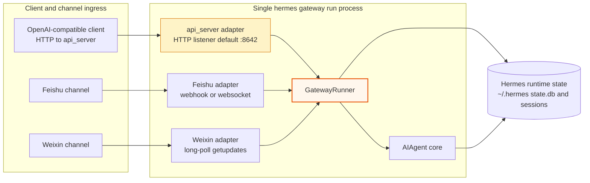
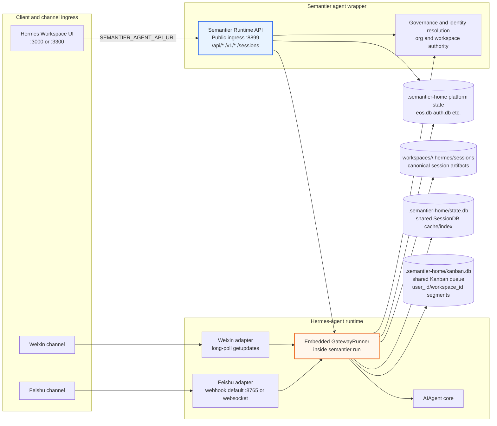
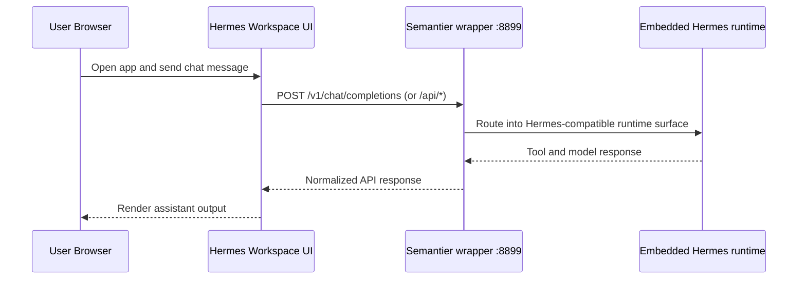
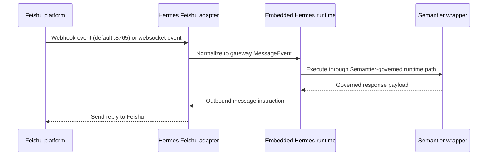
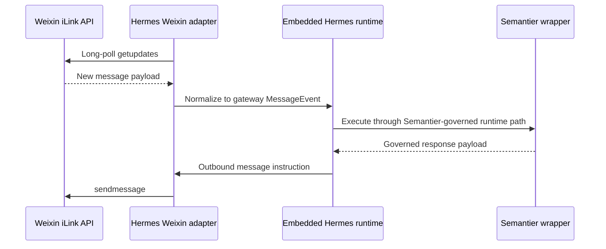

# Unified Runtime Message Flow And Port Mapping

## Scope

This document unifies the runtime architecture view across:

- Hermes Workspace (web UI)
- Weixin channel
- Feishu channel
- Semantier agent wrapper (public ingress)
- Hermes-agent runtime components (embedded under Semantier runtime)

It clarifies end-to-end message flow and exact port responsibilities.

## Deployment mode

This repository's active architecture is integrated Semantier runtime mode:

- Public ingress is Semantier wrapper on `:8899`.
- Hermes gateway runtime is embedded in-process under `semantier run`.
- Embedded startup disables Hermes `api_server` platform listener.
- Standalone Hermes API-server mode is not part of the active Semantier runtime contract.

## Original Unified component flow (upstream Hermes-agent)

## Unified component flow (Semantier integrated)

## Design comparison: upstream api_server adapter vs Semantier Runtime API

This section compares architectural roles, not only HTTP shape.

| Dimension | Upstream Hermes `api_server` adapter | Semantier Runtime API wrapper | Design delta |
|---|---|---|---|
| Primary role | Transport adapter under gateway platforms | Canonical public ingress for integrated runtime | Major |
| Runtime placement | Inside `hermes gateway run` adapter set | Wrapper layer that embeds/controls Hermes gateway lifecycle | Major |
| Endpoint scope | OpenAI-compatible and gateway run/status endpoints | OpenAI-compatible routes plus Semantier web/session/org/auth/messaging/governance surfaces | Major |
| Identity and organization authority | Not the primary authority resolution boundary | First-class authority resolution boundary (org/workspace/user context) | Major |
| Governance responsibility | Downstream execution path | Direct ingress responsibility plus downstream orchestration | Major |
| Store interaction pattern | Primarily Hermes home runtime state | Split between shared platform state (`.semantier-home`) and workspace Hermes state (`workspaces/<workspace_id>/.hermes`) | Moderate to major |
| Port contract in this repository | Adapter default listener model (`:8642`) | Integrated ingress contract on `:8899`; embedded startup disables `api_server` listener | Major |

Overall conclusion for this repository: the difference is substantial (architectural, not cosmetic), so current integrated Semantier runtime mode keeps the wrapper as the system ingress boundary.

## Message flow sequences

### A) Hermes Workspace web request

### B) Feishu inbound event

### C) Weixin inbound polling cycle

## Port mapping

| Surface | Default port | Used in integrated `semantier run` mode | Notes |
|---|---:|---|---|
| Hermes Workspace UI | `3000` (or `3300` in Dokploy workspace container) | Yes | Browser-facing UI server |
| Semantier wrapper ingress | `8899` | Yes (primary public API) | Exposes Semantier and Hermes-compatible web routes |
| Feishu webhook listener | `8765` | Optional (when Feishu webhook mode enabled) | Feishu can also run websocket transport |
| Weixin adapter ingress | N/A (long-poll client) | Yes when enabled | Uses outbound polling to iLink endpoints |

## Current repository contracts

- Dokploy compose path uses `SEMANTIER_AGENT_API_URL=http://backend:8899` and keeps backend internal on `:8899`.
- `semantier run` starts embedded gateway lifecycle on app startup.
- Embedded gateway startup disables Hermes `api_server` adapter listener by default.
- Integrated Semantier deployments do not require publishing `8642`.

## Source anchors

- `deploy/dokploy/docker-compose.yml`
- `hermes-workspace/docker-compose.yml`
- `how-to-run.md`
- `src/agents/gateway.py`
- `src/agents/hermes_embedded_gateway.py`
- `src/agents/launcher.py`
- `hermes-agent/gateway/platforms/api_server.py`
- `hermes-agent/gateway/platforms/feishu.py`
- `hermes-agent/gateway/platforms/weixin.py`
